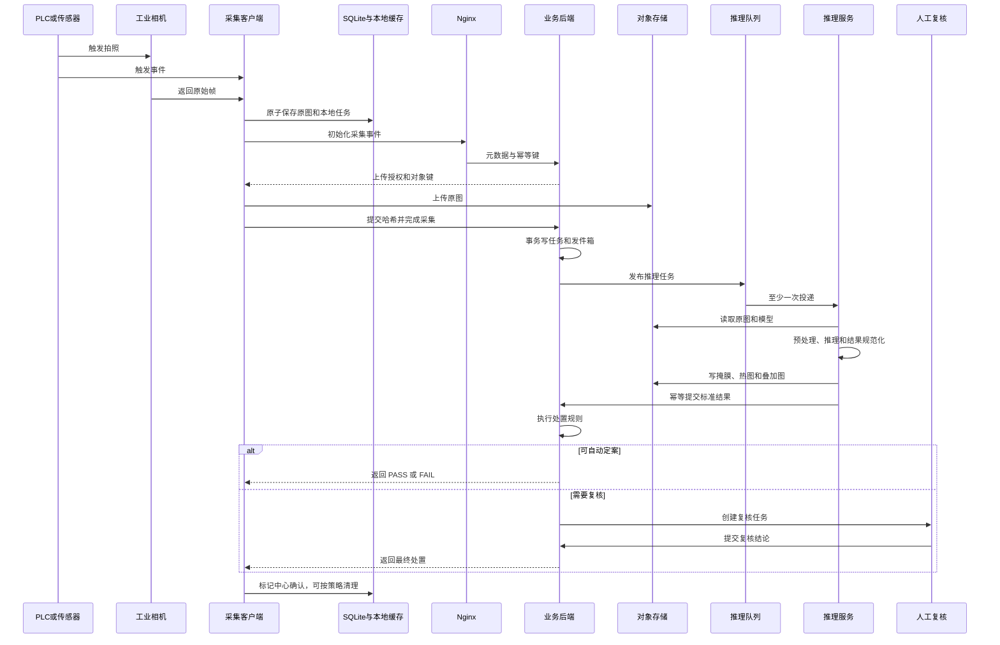
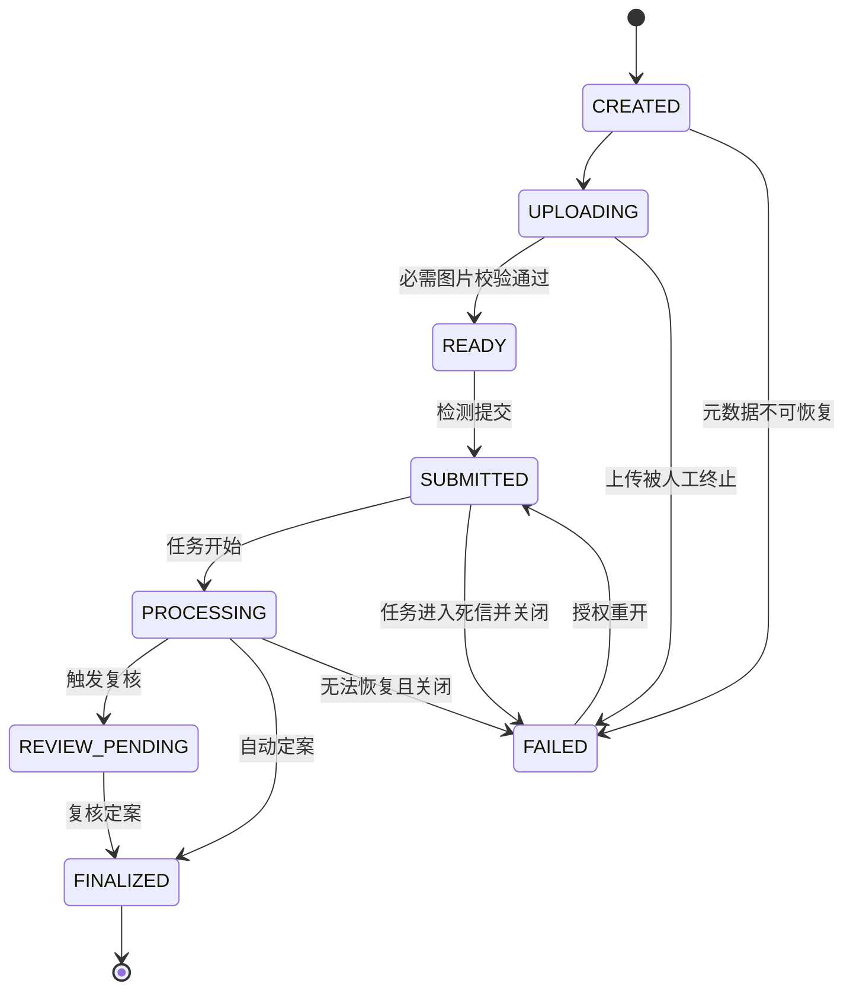

# 完整检测业务流程

## 1. 文档职责

本文是检测业务顺序、中央状态机、算法结论和最终生产处置的唯一来源。数据库和接口文档只实现本文定义的流程，不得重新发明状态。

## 2. 标识和三层状态

### 2.1 不变标识

- `capture_id`：一次 PLC 或传感器触发产生，由采集端生成。
- `detection_task_id`：中心为一次流水线执行创建。
- `attempt_id`：同一检测任务的一次执行尝试。
- `review_task_id`：一次人工复核工作项。

重试只能新增 `attempt_id`，不能更换 `capture_id` 或 `detection_task_id`。

### 2.2 三层状态不得混用

| 层次 | 状态 |
|---|---|
| 执行状态 | `QUEUED`、`RUNNING`、`SUCCEEDED`、`RETRY_WAIT`、`DEAD` |
| 算法结论 | `QUALIFIED`、`UNQUALIFIED`、`INCONCLUSIVE` |
| 业务处置 | `PASS`、`FAIL`、`HOLD` |

`SUCCEEDED` 只说明算法执行完成，不等于合格；`QUALIFIED` 只说明算法结论，不一定允许自动放行；`PASS` 才是生产处置。

## 3. 在线主流程

### 3.1 触发与采集

1. 触发适配器接收 PLC、光电传感器或数字量事件。
2. 采集端执行去抖和序列检查，生成 `capture_id`、本地序号和采集时间。
3. 相机适配器按当前配方采集一张或一组图像。
4. 原始文件先写临时名，完成编码、文件同步和 SHA-256 计算后原子改名。
5. SQLite 在同一本地事务中记录图片元数据和待上传任务。

重复触发事件可记录为重复，但不能覆盖第一次采集。触发序号跳变应形成设备告警。

### 3.2 本地质量门禁

采集端只做不会替代中心算法的快速校验：

- 文件可解码。
- 尺寸、位深和通道符合相机配方。
- 文件大小在允许范围内。
- 可选的曝光、模糊、全黑和全白检查。
- 相机时间与工控机时间偏差在允许范围内。

质量不合格的图片仍应保留并上传，状态标为 `QUALITY_WARNING` 或 `QUALITY_REJECTED`。除非设备无法产生文件，否则不能静默丢弃。

### 3.3 初始化与上传

1. 采集端调用初始化接口，携带 `capture_id`、工位、相机、触发信息和图片清单。
2. 后端以 `station_id + capture_id` 幂等创建中央采集事件，并返回受控对象键和上传授权。
3. 采集端上传原图，上传过程可断点或重试，但对象键不变。
4. 采集端提交文件大小、内容类型和 SHA-256。
5. 后端通过对象头信息或流式校验确认文件存在且哈希一致。

只有全部必需图片通过校验，中央采集状态才可进入 `READY`。

### 3.4 提交检测

采集端或后端规则提交检测后，业务后端在一个数据库事务中：

1. 把采集事件从 `READY` 变为 `SUBMITTED`。
2. 解析该工位当前生效的流水线版本。
3. 创建状态为 `QUEUED` 的检测任务。
4. 写入事务发件箱事件。

后台发布器把发件箱事件送入 RabbitMQ。发布确认后只更新发件箱状态，不改变已经存在的业务任务。

### 3.5 推理执行

推理工作进程采用手动确认：

1. 根据 `detection_task_id` 做幂等检查。
2. 创建新的 `attempt_id` 并锁定流水线版本。
3. 下载并校验原图，加载已登记且哈希匹配的模型包。
4. 执行预处理插件、算法插件和标准结果转换。
5. 把掩膜、热图、叠加图等派生文件写入对象存储。
6. 向业务后端提交标准结果和派生文件校验信息。
7. 后端确认结果入库后，工作进程才确认队列消息。

同一任务的重复消息不得产生两个业务结果。失败重试新增执行尝试并保留前次错误。

### 3.6 处置规则

处置规则由版本化策略控制，顺序固定：

1. **技术完整性**：执行失败、模型或图片校验失败，直接 `HOLD`。
2. **预处理质量**：预处理为 `REJECTED`，直接 `HOLD`；为 `WARNING` 时按策略进入复核。
3. **结果一致性**：
   - `UNQUALIFIED` 但分割掩膜为空，进入复核。
   - `QUALIFIED` 但存在超过阈值的缺陷区域，进入复核。
   - 多算法结论不一致，进入复核。
4. **置信度和灰区**：落入版本化灰区，进入复核。
5. **强制规则**：高风险工件、特定批次或新模型灰度期，进入复核。
6. **抽检规则**：按工位、班次、模型和批次对自动结论随机抽检。
7. **自动定案**：只有前述规则均未触发时，才能把算法结论映射为 `PASS` 或 `FAIL`。

自动处置记录必须保存策略版本、阈值和输入结果摘要。

### 3.7 人工复核

需要复核时：

1. 采集事件的当前业务处置为 `HOLD`。
2. 后端创建 `PENDING` 复核任务并分配优先级。
3. 复核员认领、查看原图和全部算法证据，提交结论与原因。
4. 需要双人复核的任务进入升级队列。
5. 最终复核记录生成新的处置记录，当前处置投影变为 `PASS`、`FAIL` 或继续 `HOLD`。

详细规则见 [04-人工复核系统](04-人工复核系统.md)。

### 3.8 结果回传

采集端以 `capture_id` 查询中央状态，采用递增间隔轮询：

- 未完成时返回当前阶段和建议下次查询间隔。
- 已自动定案时返回最终处置、算法摘要和模型版本。
- 待复核时返回 `HOLD` 和复核状态。
- 最终失败时返回错误码和现场处置提示。

采集端只展示后端给出的最终处置，不自行重新计算阈值。

## 4. 中央采集状态机

约束：

- `FINALIZED` 后不能原位修改。纠错通过新增处置记录并更新“当前处置”投影完成。
- `FAILED` 不自动等于报废或合格，现场处置仍为 `HOLD`。
- 技术重试通常在检测任务状态内完成，不让采集事件反复退回。

## 5. 采集端本地队列状态

本地 SQLite 状态只描述同步过程：

| 状态 | 含义 |
|---|---|
| `PENDING` | 原图已落盘，等待初始化 |
| `UPLOADING` | 正在上传 |
| `UPLOADED` | 文件已上传，等待中心校验 |
| `SUBMITTED` | 中心已创建检测任务 |
| `WAIT_RESULT` | 等待自动或人工结果 |
| `DONE` | 已取得最终结果，可按保留策略清理 |
| `RETRY_WAIT` | 临时失败，等待重试 |
| `LOCAL_DEAD` | 本地数据损坏或人工终止，需要现场处理 |

本地状态不得反向覆盖中央状态。网络恢复后按 `capture_id` 对账。

## 6. 断网与恢复

### 6.1 中心不可达

- 采集端继续落盘和排队。
- 浏览器显示中心离线，但不能删除本地任务。
- 到达磁盘高水位时先告警，再按现场安全策略暂停新触发；不能清理未上传原图。

### 6.2 上传中断

- 对同一对象键重试或重新取得上传授权。
- 完成后重新提交 SHA-256。
- 中心已经确认的文件无需重复上传。

### 6.3 回调丢失

推理服务重复提交同一个 `attempt_id`。后端若已有相同结果哈希，返回成功；若哈希不同，拒绝并产生安全告警。

### 6.4 状态对账

采集端周期性批量提交本地未完成 `capture_id`，中心返回当前状态。对账过程只推进本地状态，不回退中央状态。

## 7. 批量历史导入

现有 180 张研究数据不模拟 PLC 触发，采用独立导入流程：

1. 创建来源为 `HISTORICAL_IMPORT` 的采集事件。
2. 保留原有 `sample_id`、相对路径、标签和掩膜来源。
3. 计算并登记图片 SHA-256，不根据文件名推断最终标签。
4. 导入原始数据集和 172 样本无泄漏数据集为两个不可变版本。
5. 历史标签只用于离线评估，不自动形成生产放行记录。

## 8. 模型发布后的在线切换

1. 发布审批生成目标部署记录。
2. 推理服务下载、验签、加载并预热新模型到独立运行槽。
3. 健康检查通过后，后端更新新任务所解析的流水线版本。
4. 已入队任务继续使用创建时锁定的旧版本。
5. 灰度期按工位或比例分流，并提高人工抽检比例。
6. 回滚时把新任务重新指向上一稳定版本，历史结果保持不变。

模型闭环和门禁见 [08-增量训练闭环](08-增量训练闭环.md)。

## 9. 验收场景

至少覆盖以下端到端用例：

1. 正常合格样本自动 `PASS`。
2. 正常不合格样本自动 `FAIL`，且掩膜可查看。
3. 不合格但空掩膜进入复核。
4. 图片不可解码进入 `HOLD`。
5. 网络中断期间连续采集，恢复后顺序无关地补传且不重复。
6. 队列重复投递不产生重复结果。
7. 推理进程崩溃后任务重试并保留失败尝试。
8. 人工复核并发提交时只有一个版本成功。
9. 模型灰度和回滚不改变已创建任务的版本。
10. 本地磁盘高水位时告警且未上传原图不被清理。
