# 算法与预处理通用接口设计

## 1. 文档职责

本文只定义 Python 推理进程内部的插件协议、模型包格式和标准算法结果。HTTP 与队列报文见 [06-接口设计](06-接口设计.md)。插件不得直接依赖业务数据库、消息队列或前端。

## 2. 设计分层

```mermaid
flowchart LR
    Envelope["网络任务报文"] --> Materializer["文件下载与校验"]
    Materializer --> Decoder["统一解码"]
    Decoder --> Frame["FrameBundle"]
    Frame --> Preprocessor["预处理插件"]
    Preprocessor --> Prepared["PreparedBatch"]
    Prepared --> Algorithm["算法插件"]
    Algorithm --> RawOutput["AlgorithmOutput"]
    RawOutput --> Normalizer["结果规范化与坐标回映"]
    Normalizer --> Standard["StandardDetectionResult"]
```



各层所有权：

- 任务报文和对象引用由传输层负责。
- 文件下载、校验和临时目录由推理编排层负责。
- 插件只接收内存对象和只读运行上下文。
- 派生文件写入对象存储由编排层负责。
- 业务处置由 Spring Boot 后端负责。

## 3. 插件协议版本

插件描述必须包含：

```json
{
  "plugin_id": "tool-defect.multitask-xception",
  "plugin_kind": "algorithm",
  "plugin_version": "1.0.0",
  "api_version": "1.0",
  "supported_tasks": ["classification", "segmentation"],
  "input_contract": "prepared-batch/1.0",
  "output_contract": "algorithm-output/1.0",
  "thread_safe": false
}
```

兼容规则：

1. `api_version` 主版本不同，禁止加载。
2. 主版本相同且插件声明兼容时，可以加载较新的次版本。
3. 插件实现版本、配置哈希和代码签名共同进入流水线版本。
4. 线上运行时只加载注册表批准的精确版本，不使用范围匹配。

## 4. 统一内存对象

### 4.1 原始帧

```python
from dataclasses import dataclass
from typing import Any, Mapping
import numpy as np

@dataclass(frozen=True)
class ImageFrame:
    image_id: str
    pixels: np.ndarray
    color_space: str
    media_type: str
    sha256: str
    original_height: int
    original_width: int
    attributes: Mapping[str, Any]

@dataclass(frozen=True)
class FrameBundle:
    capture_id: str
    frames: tuple[ImageFrame, ...]
    recipe_id: str
```

统一要求：

- 解码后的基础像素采用连续内存的 `uint8 H x W x C`。
- 当前 OpenCV 链以 `BGR` 为基础色彩空间；插件若需要灰度或 RGB，必须显式转换并记录。
- 禁止通过数组形状猜测色彩空间。
- 原始尺寸和 SHA-256 不因后续变换而改变。
- 多相机或多曝光采集放在同一个 `FrameBundle` 中，通过 `attributes.image_role` 区分。

### 4.2 几何变换

每次裁剪、缩放、仿射、极坐标展开都产生可序列化的变换记录：

```json
{
  "transform_type": "affine",
  "source_space": "original",
  "target_space": "rectified",
  "parameters": {
    "matrix": [[1.0, 0.0, 0.0], [0.0, 1.0, 0.0]]
  },
  "invertible": true
}
```

结果规范化层根据变换链把掩膜或区域映射回原图。无法精确逆变换的插件必须声明误差和最终坐标空间，不能假装结果已经位于原图坐标。

### 4.3 预处理结果

```python
@dataclass(frozen=True)
class PreparedBatch:
    tensors: Mapping[str, np.ndarray]
    coordinate_spaces: Mapping[str, Mapping[str, Any]]
    transforms: tuple[Mapping[str, Any], ...]
    artifacts: Mapping[str, np.ndarray]
    quality_status: str
    warnings: tuple[str, ...]
    metadata: Mapping[str, Any]
```

`quality_status` 只允许：

- `OK`：符合流水线输入要求。
- `WARNING`：可以推理，但业务侧应按策略判断是否复核。
- `REJECTED`：不能产生可信推理结果。

`REJECTED` 时算法插件不执行，编排层返回 `INCONCLUSIVE`。

## 5. 预处理插件接口

```python
from typing import Protocol

class PreprocessorPlugin(Protocol):
    descriptor: dict

    def validate_config(self, config: dict) -> None:
        ...

    def prepare(
        self,
        frames: FrameBundle,
        context: "RuntimeContext",
    ) -> PreparedBatch:
        ...

    def health(self) -> dict:
        ...

    def close(self) -> None:
        ...
```

约束：

1. 相同输入、相同插件版本和相同配置必须产生确定性结果。
2. 插件不能访问网络、业务数据库和队列。
3. 插件不能在共享目录写无命名规则的临时文件。
4. 所有阈值、插值方式、输出尺寸和随机种子进入配置哈希。
5. 图像和掩膜的空间变换必须共用几何参数；图像可线性插值，二值掩膜必须最近邻插值。

### 5.1 当前预处理适配器

| 适配器 | 包装现有代码 | 标准输出 |
|---|---|---|
| `BasicGrayResizePreprocessor` | `data/preprocess.py` | 归一化 RGB 张量，尺寸由模型输入读取 |
| `AdaptiveAnnularPreprocessor` | `data/ring_geometry.py` | 校正后的自适应环形区域、变换链和边界信息 |
| `BoundaryNormalizedPreprocessor` | `data/ring_geometry.py` | 径向归一化极坐标图、变换链和边界信息 |
| `PolarDenoisePreprocessor` | `detection/polar_preprocess.py` | 首尾周期连续的保边降噪极坐标图 |

当前 `load_image` 会把灰度图缩放后转换为 RGB 并除以 255；生产适配器应保留这一行为以兼容现有模型。

## 6. 算法插件接口

```python
@dataclass(frozen=True)
class AlgorithmOutput:
    outcome: str
    class_probabilities: Mapping[str, float]
    masks: Mapping[str, np.ndarray]
    regions: tuple[Mapping[str, Any], ...]
    scores: Mapping[str, float]
    warnings: tuple[str, ...]
    metadata: Mapping[str, Any]

class AlgorithmPlugin(Protocol):
    descriptor: dict

    def load(
        self,
        model_package: "ModelPackage",
        context: "RuntimeContext",
    ) -> None:
        ...

    def warmup(self) -> None:
        ...

    def predict(
        self,
        prepared: PreparedBatch,
        context: "RuntimeContext",
    ) -> AlgorithmOutput:
        ...

    def health(self) -> dict:
        ...

    def close(self) -> None:
        ...
```

`outcome` 只能为 `QUALIFIED`、`UNQUALIFIED` 或 `INCONCLUSIVE`。算法插件不得返回 `PASS` 或 `FAIL`。

### 6.1 当前算法适配器

| 适配器 | 包装现有代码 | 注意事项 |
|---|---|---|
| `KerasClassificationAdapter` | `models/loader.py` 与分类输出 | 当前没有已确认可配套的分类权重，上线前阻断 |
| `KerasMultitaskAdapter` | `inference/predict.py` | 输出 `cla_out`、`seg_out`，模型输入为 256 |
| `PolarAnomalyAdapter` | `detection/polar_anomaly.py` | 输出异常分数、阈值、周期数和角度区域；模型需重新标定为版本 2 |

双任务适配器必须保留现有类别映射：

```text
0 = qualified
1 = unqualified
```

类别映射必须同时写入模型包，不能依赖代码中的元组顺序。

## 7. 标准检测结果

网络提交前，编排层把插件输出转换为以下逻辑结构：

```json
{
  "schema_version": "1.0",
  "capture_id": "019f...",
  "detection_task_id": "019f...",
  "attempt_id": "019f...",
  "execution_status": "SUCCEEDED",
  "algorithm_outcome": "UNQUALIFIED",
  "confidence": 0.9821,
  "class_probabilities": {
    "qualified": 0.0179,
    "unqualified": 0.9821
  },
  "preprocess": {
    "plugin_id": "tool-defect.boundary-normalized",
    "plugin_version": "1.0.0",
    "config_hash": "sha256:...",
    "quality_status": "OK",
    "warnings": []
  },
  "algorithm": {
    "plugin_id": "tool-defect.multitask-xception",
    "plugin_version": "1.0.0",
    "model_version": "multitask-boundary-normalized/3",
    "model_sha256": "sha256:..."
  },
  "regions": [
    {
      "region_id": 1,
      "coordinate_space": "original",
      "geometry_type": "mask_ref",
      "geometry": {
        "image_id": "019f..."
      },
      "scores": {
        "peak": 0.97
      },
      "attributes": {}
    }
  ],
  "artifacts": [
    {
      "kind": "DEFECT_MASK",
      "object_key": "derived/...",
      "sha256": "sha256:...",
      "media_type": "image/png"
    }
  ],
  "timings_ms": {
    "download": 20.3,
    "decode": 15.2,
    "preprocess": 84.1,
    "inference": 196.0,
    "postprocess": 31.6,
    "upload": 28.7
  },
  "warnings": []
}
```

规则：

- `confidence` 是最终分类标签的概率；无可比分类概率时为 `null`。
- 掩膜和大数组通过对象引用表达，不内嵌到 JSON。
- 区域必须声明坐标空间。
- 极坐标角度和径向范围放入 `geometry` 或 `attributes`，不强行伪造矩形框。
- 所有浮点分数注明含义和阈值来源，不能只给一个无定义的 `score`。
- 执行失败时不返回伪造概率，使用标准错误对象。

## 8. 模型包

生产模型以不可变目录或归档发布：

```text
model-package/
├── manifest.json
├── model.json
├── weights.h5
├── labels.json
├── preprocessing.json
├── metrics.json
├── environment.lock
├── checksums.sha256
└── signature.sig
```

`manifest.json` 至少包含：

```json
{
  "model_name": "multitask-boundary-normalized",
  "model_version": "3",
  "framework": "tensorflow",
  "framework_version": "2.13.0",
  "keras_version": "2.13.1",
  "python_version": "3.11",
  "input_spec": {
    "shape": [256, 256, 3],
    "dtype": "float32",
    "color_space": "RGB",
    "range": [0.0, 1.0]
  },
  "output_names": ["cla_out", "seg_out"],
  "label_map": {
    "0": "qualified",
    "1": "unqualified"
  },
  "preprocessor": {
    "plugin_id": "tool-defect.basic-gray-resize",
    "plugin_version": "1.0.0",
    "config_hash": "sha256:..."
  },
  "dataset_version": "tool-defect-retrain/1",
  "source_run_id": "..."
}
```

加载顺序：

1. 验证注册表状态和部署授权。
2. 验证包签名和每个文件的 SHA-256。
3. 验证插件接口、框架、输入输出和类别映射。
4. 在隔离运行槽加载模型。
5. 用随包固定样例预热并核对期望形状。
6. 只有全部通过才标记 `READY`。

当前加载器调用了不安全反序列化开关。生产环境只允许加载已签名、哈希已登记且来自只读模型仓库的模型包，并限制自定义对象白名单。

## 9. 缓存设计

预处理缓存键：

```text
SHA256(
  source_sha256
  + preprocessor_id
  + preprocessor_version
  + config_hash
  + code_signature
)
```

当前极坐标缓存已经校验源文件大小、修改时间、必要时的 SHA-256、流水线签名、输出尺寸、角度采样和降噪参数。适配时保留这些规则，并增加：

- 缓存对象的内容哈希。
- 创建运行和插件版本。
- 缓存状态 `STAGING`、`AVAILABLE`、`INVALID`。
- 原子写入和孤儿清理。

模型、预处理或降噪代码变化时必须自动失效，不能人工猜测缓存是否可用。

## 10. 生命周期和并发

插件生命周期：

`发现 -> 配置校验 -> 制品校验 -> 加载 -> 预热 -> READY -> 推理 -> 排空 -> 关闭`

运行约束：

- TensorFlow 2.13 模型默认视为非线程安全，一个模型运行槽串行执行或由进程隔离。
- 每个 GPU 工作进程默认预取 1 个任务，批量推理必须通过显存压测后开启。
- 单进程只加载有限数量模型，避免“所有版本常驻”。
- 新旧模型切换采用双运行槽，先预热后切流。
- 任务超时由编排层控制，插件收到取消信号后尽快释放临时资源。
- 插件崩溃由工作进程隔离，不能拖垮队列消费者管理进程。

## 11. 错误契约

插件抛出的异常必须转换为以下类别之一：

| 类别 | 示例 | 是否可重试 |
|---|---|---|
| `INPUT_INVALID` | 图片不可解码、通道错误 | 否 |
| `PREPROCESS_REJECTED` | 找不到有效刀具环 | 通常否，进入复核 |
| `MODEL_INCOMPATIBLE` | 输入形状、输出名或模型版本不符 | 否，阻断模型 |
| `RESOURCE_EXHAUSTED` | GPU 显存不足、磁盘不足 | 可在释放资源后有限重试 |
| `RUNTIME_TRANSIENT` | 临时文件读写或依赖服务短暂失败 | 是 |
| `PLUGIN_BUG` | 未预期异常、结果协议不合法 | 有限重试后死信 |

插件异常不得直接决定队列重试次数，统一策略由 [10-异常处理](10-异常处理.md) 定义。

## 12. 验证要求

每个插件至少提供：

1. 描述符和配置模式校验。
2. 固定输入的确定性测试。
3. 非法尺寸、通道、空图和损坏图测试。
4. 掩膜与原图坐标回映测试。
5. 缓存命中、失效和损坏重建测试。
6. 进程重启、模型热切换和重复任务测试。
7. 当前 34 张固定测试集上的兼容性评估。
8. 运行时间、峰值内存和显存基线。

网络契约测试不放在插件测试中，由接口层负责。
