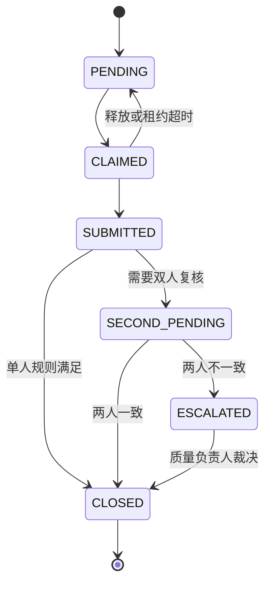

# 人工复核系统

## 1. 文档职责

本文定义人工复核的触发、优先级、分派、操作、冲突处理和质量控制。数据表见 [05-数据库设计](05-数据库设计.md)，接口见 [06-接口设计](06-接口设计.md)，页面布局见 [09-前端功能规划](09-前端功能规划.md)。

## 2. 复核目标

人工复核不是简单修改模型标签，而是完成三件事：

1. 对当前刀具给出可审计的生产处置。
2. 判断算法错误、图片质量问题或工艺争议的原因。
3. 形成经过批准、可进入后续数据集版本的高质量标注。

算法原始结果永久保留；复核结论通过新增记录形成，不覆盖算法概率、掩膜或热图。

## 3. 触发规则

### 3.1 强制复核

- 推理执行失败或算法结论为 `INCONCLUSIVE`。
- 预处理质量为 `REJECTED`。
- 双任务判定 `UNQUALIFIED` 但缺陷掩膜为空。
- 判定 `QUALIFIED` 但存在超过阈值的缺陷区域。
- 多算法或多视角结论互相冲突。
- 图片哈希、模型哈希或结果协议校验失败。
- 处于新模型灰度期且命中强制抽检策略。

### 3.2 条件复核

- 分类概率落入配置化灰区。
- 缺陷区域过小、贴边或只在一个预处理分支出现。
- 采集质量为 `WARNING`。
- 设备、批次或环境漂移告警期间产生。
- 某一工位近期人工推翻率升高。

### 3.3 随机抽检

对自动 `PASS` 和 `FAIL` 分别抽样。抽样必须按工位、班次、模型版本和批次分层，不能只对低置信度样本抽检，否则无法估计真实误差。

抽检比例由质量负责人配置并版本化，前端不得临时改写。

## 4. 优先级

| 优先级 | 典型来源 | 处理原则 |
|---|---|---|
| `P0` | 现场正在等待处置、系统无法给结论 | 立即进入首位，并通知值班质量负责人 |
| `P1` | 疑似漏检、结果矛盾、高风险批次 | 优先于普通复核 |
| `P2` | 置信灰区、图片质量警告 | 正常时限处理 |
| `P3` | 随机抽检、历史数据整理 | 不阻塞现场，但仍需完成 |

优先级不能由普通复核员随意降低。升级和降级都写审计记录。

## 5. 任务分派

### 5.1 任务池

复核任务按组织、产线、工位和专业范围进入任务池。用户只能看到被授权范围。

### 5.2 认领

- 复核员主动认领或由系统按负载分配。
- 认领产生有时限的租约。
- 租约过期、用户离线或主动释放后，任务回到任务池。
- 已提交任务不可再次认领，纠错需创建新修订。

### 5.3 双人复核

以下情况建议启用双人独立复核：

- 疑似漏检导致的人工 `FAIL`。
- 新缺陷类型或边界争议。
- 生产模型发布评估样本。
- 质量负责人配置的高风险批次。

第二复核人不能看到第一人的结论，直到自己提交。两者一致则自动合并，不一致则升级到质量负责人。

## 6. 复核工作台信息

工作台必须同时展示：

- 原图和采集元数据。
- 缩略图与可按需加载的全分辨率图。
- 模型分类概率、模型版本和预处理版本。
- 缺陷掩膜、轮廓、热图、极坐标图和原图回映。
- 采集质量、预处理警告和执行错误。
- 同工件关联视角或同批次上下文，前提是用户有权限。
- 历史复核修订和审计信息。

不得只展示经过算法涂色的结果图。复核员必须能够切换到无叠加原图，避免算法提示造成确认偏差。

## 7. 复核操作

### 7.1 生产结论

复核员提交：

- `PASS`：人工确认可放行。
- `FAIL`：人工确认不合格。
- `HOLD`：图片不足、工艺标准不明确或需上级判断。

提交时必须选择原因码，可以补充说明。

### 7.2 标注

首期支持：

- 接受模型掩膜。
- 拒绝模型掩膜。
- 在原图坐标系中绘制、擦除和修订二值缺陷掩膜。
- 标记“无法从当前图片判断”。

缺陷类型字段采用受控字典。当前算法只具备合格与不合格二分类和二值缺陷区域能力，因此多缺陷类型只作为人工标签，不能自动回填为算法能力。

### 7.3 原因码

建议的一级原因：

- `MODEL_FALSE_POSITIVE`：模型误报。
- `MODEL_FALSE_NEGATIVE`：模型漏检。
- `MASK_INACCURATE`：分类正确但掩膜不准确。
- `IMAGE_QUALITY`：曝光、模糊、遮挡或污染。
- `PREPROCESS_FAILURE`：定位或展开失败。
- `DEVICE_OR_PROCESS`：相机、光照或工艺异常。
- `STANDARD_AMBIGUOUS`：判定标准有争议。
- `CONFIRMED_CORRECT`：抽检确认算法正确。
- `OTHER`：需填写说明。

原因码由质量负责人维护，删除已使用原因码时只停用，不物理删除。

## 8. 并发与修订

- 任务带 `record_version`。
- 提交时使用乐观锁；版本不一致返回冲突，不能后写覆盖先写。
- 每次提交产生不可变的 `review_record`。
- 纠错产生新记录并通过 `supersedes_id` 指向被替代记录。
- 当前有效结论是后端计算的投影，历史修订始终可查。
- 掩膜修订保存为新对象，不覆盖模型掩膜或前一人工掩膜。

## 9. 复核与生产处置

`CLOSED` 只表示本次复核流程结束。若后续发现错误，创建新的修订流程。

## 10. 训练数据准入

复核完成不等于自动进入训练集。样本进入训练候选池前必须满足：

1. 原图、最终标签和掩膜引用完整。
2. 复核状态已关闭。
3. 不存在未解决的判定标准争议。
4. 标注坐标与原图一致，掩膜可解码。
5. 来源、复核人、模型版本和修订链可追溯。
6. 通过重复、冲突、泄漏和数据许可检查。

质量负责人批准后，样本才可加入新的不可变数据集版本。

## 11. 质量控制指标

复核系统应统计：

- 各优先级待办数量和最老任务等待时间。
- 模型结论被推翻率，按模型、工位、班次和批次分层。
- 自动 `PASS` 抽检中的人工不合格率。
- 掩膜接受、修订和拒绝比例。
- 双人复核一致率。
- 复核员之间的一致性和异常偏差。
- 图片质量问题占比及设备来源。
- `HOLD` 原因和积压时间。

这些指标用于发现模型或流程问题，不直接作为员工绩效排名，避免诱导快速但低质量复核。

## 12. 防偏差设计

1. 默认先显示原图，再由复核员主动开启算法叠加。
2. 双人盲审时隐藏前一人的答案。
3. 抽检同时覆盖高、低置信度和不同工位。
4. 训练集构建保留被算法正确识别的普通样本，避免只回流困难样本造成分布偏移。
5. 复核员不得修改模型概率和运行元数据。
6. 算法工程师不能单独把自己选择的复核记录提升为生产标签。

## 13. 验收用例

1. 两名复核员同时提交，只有一个版本成功。
2. 认领租约过期后任务可重新认领。
3. 双人结论不一致时自动升级。
4. 原图、模型掩膜和人工掩膜可分别查看且互不覆盖。
5. 纠错后仍能还原全部历史修订。
6. 无原因码、无权限或缺少必填标注时不能提交。
7. 普通复核员看不到未授权工位数据。
8. 已关闭任务进入数据候选池前仍需质量批准。
