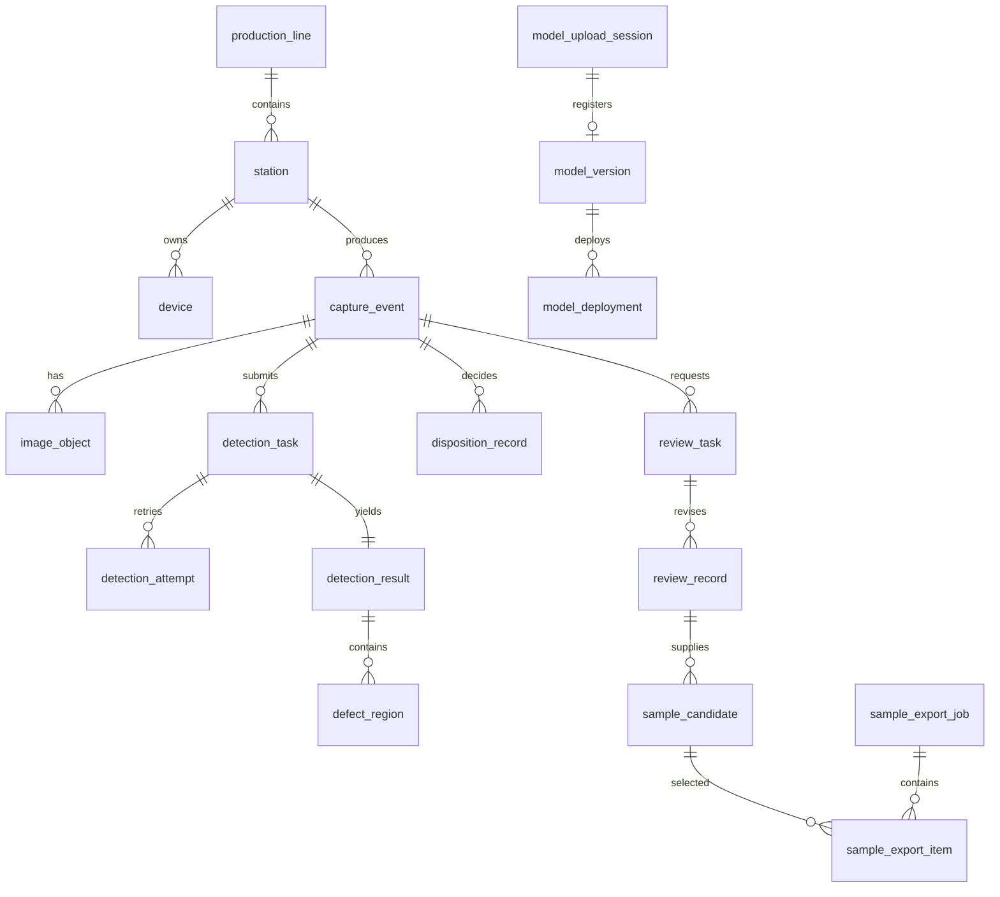

# 数据库设计

## 1. 文档职责

本文定义业务数据的持久化模型、约束、索引、事务和归档。业务状态含义以 [02-完整检测业务流程](02-完整检测业务流程.md) 为准，权限语义以 [12-安全权限与角色](12-安全权限与角色.md) 为准。

## 2. 总体原则

1. 使用 PostgreSQL，所有业务时间使用 `timestamptz` 并以 UTC 保存。
2. 主键使用由应用生成的 UUIDv7；边缘生成的 `capture_id` 原样保留。
3. 图片、样本导出包和模型包不写入数据库，只保存对象引用、版本和哈希。
4. 高频查询字段使用明确列，低频且可扩展的算法细节使用 `jsonb`。
5. 业务事实采用追加记录；“当前状态”是可校验的投影。
6. 所有表包含 `created_at`，可修改投影包含 `updated_at` 和 `record_version`。
7. 表名和字段名使用小写下划线，枚举值使用大写英文常量。

## 3. 逻辑域

## 4. 组织与设备

### 4.1 `production_line`

| 字段 | 类型 | 约束或说明 |
|---|---|---|
| `line_id` | `uuid` | 主键 |
| `line_code` | `varchar(64)` | 唯一、不可复用 |
| `line_name` | `varchar(128)` | 展示名称 |
| `status` | `varchar(24)` | `ACTIVE`、`INACTIVE` |
| `attributes` | `jsonb` | 低频扩展 |

### 4.2 `station`

| 字段 | 类型 | 约束或说明 |
|---|---|---|
| `station_id` | `uuid` | 主键 |
| `line_id` | `uuid` | 外键 |
| `station_code` | `varchar(64)` | 产线内唯一 |
| `station_name` | `varchar(128)` | 展示名称 |
| `timezone` | `varchar(64)` | 展示时区，默认 `Asia/Shanghai` |
| `active_recipe_id` | `uuid` | 当前采集配方投影 |
| `active_pipeline_id` | `uuid` | 当前检测流水线投影 |
| `status` | `varchar(24)` | `ACTIVE`、`MAINTENANCE`、`INACTIVE` |

### 4.3 `device`

保存相机、PLC 接口、工控机和传感器：

| 字段 | 类型 | 说明 |
|---|---|---|
| `device_id` | `uuid` | 主键 |
| `station_id` | `uuid` | 外键 |
| `device_type` | `varchar(32)` | `CAMERA`、`PLC`、`IPC`、`SENSOR` |
| `serial_number` | `varchar(128)` | 可空，存在时唯一 |
| `vendor`、`model` | `varchar(128)` | 厂商和型号 |
| `agent_version` | `varchar(64)` | 最近上报版本 |
| `last_seen_at` | `timestamptz` | 心跳时间 |
| `status` | `varchar(24)` | 当前投影 |
| `config_version` | `varchar(64)` | 生效配置版本 |

设备密钥和证书私钥不存入此表，只保存证书指纹和密钥管理系统引用。

## 5. 采集与图片

### 5.1 `capture_event`

| 字段 | 类型 | 约束或说明 |
|---|---|---|
| `capture_id` | `uuid` | 主键，由边缘生成 |
| `station_id` | `uuid` | 外键 |
| `trigger_id` | `varchar(128)` | 触发源标识 |
| `client_sequence` | `bigint` | 工位本地递增序号 |
| `source_type` | `varchar(32)` | `ONLINE`、`MANUAL`、`HISTORICAL_IMPORT` |
| `captured_at` | `timestamptz` | 相机或工控机采集时间 |
| `received_at` | `timestamptz` | 中心首次收到时间 |
| `recipe_id` | `uuid` | 锁定采集配方 |
| `status` | `varchar(32)` | 本文流程中的中央采集状态 |
| `current_disposition` | `varchar(16)` | `PASS`、`FAIL`、`HOLD` 或空 |
| `current_disposition_id` | `uuid` | 当前处置记录 |
| `quality_status` | `varchar(24)` | 边缘质量门禁摘要 |
| `attributes` | `jsonb` | 批次、工件号等扩展 |
| `record_version` | `bigint` | 乐观锁 |

约束：

- `unique(station_id, client_sequence)`。
- 同一 `capture_id` 的元数据重试必须一致；不一致写安全事件。
- `FINALIZED` 必须有 `current_disposition_id`。

### 5.2 `image_object`

| 字段 | 类型 | 约束或说明 |
|---|---|---|
| `image_id` | `uuid` | 主键 |
| `capture_id` | `uuid` | 原图和检测派生图关联的采集事件 |
| `detection_task_id` | `uuid` | 派生图可关联具体任务 |
| `review_record_id` | `uuid` | 人工掩膜可关联复核记录 |
| `kind` | `varchar(32)` | `RAW`、`THUMBNAIL`、`DEFECT_MASK`、`HEATMAP`、`OVERLAY`、`POLAR`、`REVIEW_MASK` |
| `bucket` | `varchar(128)` | 对象桶 |
| `object_key` | `varchar(1024)` | 对象键 |
| `object_version` | `varchar(256)` | 存储实现支持时保存 |
| `sha256` | `char(64)` | 内容哈希 |
| `size_bytes` | `bigint` | 大于 0 |
| `media_type` | `varchar(128)` | 白名单类型 |
| `width`、`height` | `integer` | 像素尺寸 |
| `state` | `varchar(24)` | `STAGING`、`AVAILABLE`、`QUARANTINED`、`DELETED` |
| `source_image_id` | `uuid` | 派生来源 |
| `metadata` | `jsonb` | 位深、通道和编码信息 |

唯一约束为 `bucket + object_key + object_version`。业务查询只返回 `AVAILABLE` 对象。

## 6. 检测

### 6.1 `pipeline_version`

保存不可变流水线组合：

| 字段 | 类型 | 说明 |
|---|---|---|
| `pipeline_id` | `uuid` | 主键 |
| `pipeline_name` | `varchar(128)` | 逻辑名称 |
| `version` | `varchar(64)` | 名称内唯一 |
| `preprocessor_id`、`preprocessor_version` | `varchar(128)` | 预处理插件 |
| `algorithm_id`、`algorithm_version` | `varchar(128)` | 算法插件 |
| `model_version_id` | `uuid` | 锁定模型 |
| `config` | `jsonb` | 规范化配置 |
| `config_sha256` | `char(64)` | 配置哈希 |
| `status` | `varchar(24)` | `DRAFT`、`APPROVED`、`RETIRED` |

### 6.2 `detection_task`

| 字段 | 类型 | 说明 |
|---|---|---|
| `detection_task_id` | `uuid` | 主键 |
| `capture_id` | `uuid` | 外键 |
| `pipeline_id` | `uuid` | 创建时锁定 |
| `status` | `varchar(24)` | 执行状态 |
| `priority` | `smallint` | 数值越小优先级越高 |
| `attempt_count` | `integer` | 执行尝试数 |
| `next_retry_at` | `timestamptz` | 可空 |
| `queued_at`、`started_at`、`finished_at` | `timestamptz` | 各阶段时间 |
| `last_error_code` | `varchar(64)` | 错误摘要 |
| `record_version` | `bigint` | 乐观锁 |

同一个采集事件可以有多个任务，例如生产流水线、影子模型或授权重跑。每个用途使用独立 `purpose` 字段并建立相应唯一约束。

### 6.3 `detection_attempt`

| 字段 | 类型 | 说明 |
|---|---|---|
| `attempt_id` | `uuid` | 主键 |
| `detection_task_id` | `uuid` | 外键 |
| `attempt_no` | `integer` | 任务内从 1 递增 |
| `worker_id` | `varchar(128)` | 执行进程 |
| `runtime_version` | `varchar(128)` | 容器或构建版本 |
| `model_sha256` | `char(64)` | 实际加载哈希 |
| `trace_id` | `char(32)` | 链路标识 |
| `status` | `varchar(24)` | `RUNNING`、`SUCCEEDED`、`FAILED` |
| `started_at`、`finished_at` | `timestamptz` | 时间 |
| `timings` | `jsonb` | 分阶段耗时 |
| `error_code`、`error_message` | `varchar` | 脱敏错误 |

`unique(detection_task_id, attempt_no)`。

### 6.4 `detection_result`

一项任务最多一个被接受的标准结果：

| 字段 | 类型 | 说明 |
|---|---|---|
| `detection_result_id` | `uuid` | 主键 |
| `detection_task_id` | `uuid` | 唯一外键 |
| `accepted_attempt_id` | `uuid` | 产生结果的尝试 |
| `schema_version` | `varchar(16)` | 标准结果版本 |
| `algorithm_outcome` | `varchar(24)` | 算法结论 |
| `confidence` | `numeric(10,9)` | 可空，范围 0 到 1 |
| `qualified_probability` | `numeric(10,9)` | 可空 |
| `unqualified_probability` | `numeric(10,9)` | 可空 |
| `preprocess_quality` | `varchar(24)` | `OK`、`WARNING`、`REJECTED` |
| `region_count` | `integer` | 非负 |
| `warnings` | `jsonb` | 结构化警告 |
| `standard_result` | `jsonb` | 完整协议快照 |
| `result_sha256` | `char(64)` | 规范化结果哈希 |

概率存在时，两类概率之和需在容差内为 1。数据库约束负责范围，应用负责浮点容差。

### 6.5 `defect_region`

| 字段 | 类型 | 说明 |
|---|---|---|
| `region_id` | `uuid` | 主键 |
| `detection_result_id` | `uuid` | 外键 |
| `region_no` | `integer` | 结果内序号 |
| `coordinate_space` | `varchar(32)` | `ORIGINAL`、`MODEL`、`POLAR` 等 |
| `geometry_type` | `varchar(32)` | `MASK_REF`、`POLYGON`、`BBOX`、`POLAR_INTERVAL` |
| `geometry` | `jsonb` | 几何内容 |
| `peak_score`、`mean_score` | `numeric` | 可空 |
| `attributes` | `jsonb` | 算法特有信息 |

## 7. 处置与复核

### 7.1 `disposition_record`

所有自动和人工生产处置均追加到此表：

| 字段 | 类型 | 说明 |
|---|---|---|
| `disposition_id` | `uuid` | 主键 |
| `capture_id` | `uuid` | 外键 |
| `source` | `varchar(24)` | `AUTO`、`REVIEW`、`SUPERVISOR_OVERRIDE` |
| `disposition` | `varchar(16)` | `PASS`、`FAIL`、`HOLD` |
| `policy_version` | `varchar(64)` | 自动规则版本 |
| `review_record_id` | `uuid` | 人工来源时填写 |
| `reason_code` | `varchar(64)` | 原因 |
| `actor_id` | `uuid` | 人或服务账号 |
| `supersedes_id` | `uuid` | 纠错链 |
| `created_at` | `timestamptz` | 不可修改 |

`capture_event.current_disposition_id` 只是当前投影。

### 7.2 `review_task`

包含 `review_task_id`、`capture_id`、`priority`、`status`、`pool_scope`、`trigger_reasons`、`claimed_by`、`lease_expires_at`、`requires_second_review`、`record_version` 和时间字段。

### 7.3 `review_record`

包含：

- `review_record_id`、`review_task_id`、`reviewer_id`。
- `decision`、`reason_code`、`comment`。
- `annotation_image_id`。
- `defect_type_codes`。
- `review_round` 和 `independent_review_group`。
- `supersedes_id`。
- `submitted_at`。

提交后不可修改。

## 8. 样本导出与模型接入

### 8.1 待整理样本和导出

- `sample_candidate`：来源图片项、来源反馈版本、状态、纳入/排除决定人、决定时间、修订版本和内容哈希；同一来源组合唯一。
- `sample_export_job`：创建人、筛选快照、状态、目标对象引用、清单哈希、对象数、总字节数、失败摘要、下载到期和时间字段。
- `sample_export_item`：导出作业、候选、对象引用、对象哈希、状态和失败原因；`unique(export_job_id, candidate_id)`。

候选状态使用 `PENDING`、`INCLUDED`、`EXCLUDED`、`EXPORTED`。重新筛选时创建新的导出作业，不建立数据集父版本、冻结、批准或版本差异关系。导出成功是在线样本流程终态，不创建数据集版本或训练运行。

### 8.2 模型直接上传与部署

- `model_upload_session`：上传人、版本声明、隔离对象键、声明大小、实际大小、SHA-256、外部提供方、可选外部引用、状态、验证作业引用和到期时间。
- `model_validation_result`：上传会话、包结构、签名、软件物料清单、安全扫描、隔离加载、固定样例、输入输出兼容性、状态、错误码和不可变证据对象。
- `model`：逻辑模型名称和任务类型。
- `model_version`：名称与版本、`source_kind`、已验证制品对象、SHA-256、输入输出、可选第一版数据集/训练关联、可选上传会话、外部来源快照、评估摘要、验证状态和审批状态。
- `model_deployment`：环境、工位范围、流量比例、生效时间、申请人、不同确认人、回滚目标和状态。

模型技术元数据以业务库中的不可变快照和对象存储中的已验证包为事实。第二版外部上传路径不得要求内部 `dataset_version_id` 或 `training_run_id`；模型上传、验证、启用和回退在内部训练组件不存在时仍须可用。

数据库必须使用检查约束强制模型来源互斥且完备：`LEGACY_INTERNAL` 要求第一版数据集和训练关联均非空，且上传会话与外部来源快照为空；`EXTERNAL_UPLOAD` 要求已确认上传会话和不可变外部来源快照均非空，且第一版关联为空。全空、任一来源不完整或两种来源同时存在均拒绝写入。历史来源读取迁移为通用只读快照后，不得据此恢复独立数据集或训练资源接口。

### 8.3 第一版历史兼容

第一版已有 `dataset`、`dataset_version`、`dataset_sample` 和 `training_run` 表及记录时，只读保留用于历史追溯。新迁移不得修改已执行的历史迁移；可以把旧模型关联字段调整为兼容可空，并新增外部来源字段。第二版不得向历史表写入新数据，也不得把这些表作为在线接口、模型上传或部署的前置条件。破坏性删除必须另立决策并完成备份、引用检查和恢复演练。

## 9. 用户、权限和审计

### 9.1 身份表

- `sys_user`：外部身份主体、显示名、状态。
- `sys_role`：角色。
- `sys_permission`：原子权限。
- `sys_user_role`、`sys_role_permission`：映射。
- `sys_scope_binding`：用户或角色对组织、产线、工位的范围。

人员密码仅以带算法标识的 `Argon2id` 哈希保存在独立凭据表中；明文、可逆密码
和浏览器会话原值不得进入数据库、日志或审计详情。

### 9.2 `audit_log`

至少包含：

- `audit_id`、`occurred_at`。
- `actor_type`、`actor_id`、`actor_ip`。
- `action`、`resource_type`、`resource_id`。
- `before_digest`、`after_digest`。
- `reason`、`request_id`、`trace_id`。
- `result` 和 `error_code`。

审计表只追加，并定期导出到防篡改存储。

## 10. 可靠消息

### 10.1 `outbox_event`

| 字段 | 类型 | 说明 |
|---|---|---|
| `event_id` | `uuid` | 主键 |
| `aggregate_type`、`aggregate_id` | `varchar`、`uuid` | 业务聚合 |
| `event_type` | `varchar(128)` | 事件类型和版本 |
| `payload` | `jsonb` | 小型引用报文 |
| `status` | `varchar(24)` | `NEW`、`PUBLISHED`、`FAILED` |
| `attempt_count` | `integer` | 发布次数 |
| `next_attempt_at` | `timestamptz` | 重试时间 |
| `created_at`、`published_at` | `timestamptz` | 时间 |

业务更新和发件箱写入同一事务。发布器使用 `for update skip locked` 批量领取。

### 10.2 `inbox_message`

记录外部回调或事件的 `message_id`、消费者、处理状态和结果哈希，用于幂等消费。过期记录按协议最大重投周期后归档。

## 11. 索引与分区

首期建议索引：

- `capture_event(station_id, captured_at desc)`。
- `capture_event(status, captured_at)`。
- `capture_event(current_disposition, captured_at)`。
- `detection_task(status, priority, queued_at)`。
- `review_task(status, priority, created_at)`。
- `review_task(claimed_by, lease_expires_at)`。
- `image_object(capture_id, kind)`。
- `model_deployment(environment, status, effective_at)`。
- `outbox_event(status, next_attempt_at)`，只对未发布记录建立部分索引。
- JSONB 只为已证明的查询建立 GIN 索引，不能默认给所有 JSONB 建索引。

当采集量达到单表数千万级或维护窗口明显受影响时，再按 `captured_at` 对 `capture_event`、检测和审计表做月分区。分区不是首期上线前置。

## 12. 事务边界

必须原子完成的事务：

1. 采集完成：校验图片投影、更新采集状态、创建检测任务、写发件箱。
2. 接受推理结果：登记派生对象、插入结果、更新任务、执行处置规则、必要时创建复核任务。
3. 复核提交：插入复核记录、推进复核状态、插入处置记录、更新当前处置投影。
4. 模型发布审批：插入部署记录、写发布事件和审计记录。

对象存储不参与数据库事务。使用 `STAGING -> AVAILABLE` 状态、哈希校验和孤儿清理实现最终一致。

## 13. 数据保留和删除

- 业务表先归档，文件再由受控清理任务删除。
- 删除任务检查所有样本导出、模型评估、复核、部署和审计引用；第一版历史表仍在保留期时一并检查其只读引用。
- 原图和最终复核证据的具体保留期由质量和合规部门确认。
- 个人身份信息最小化；审计中的显示名由用户表关联，不复制到每条业务记录。
- 测试环境不得直接复制生产图片，必须走批准和脱敏流程。

## 14. 迁移和变更

- 使用 Flyway 管理模式迁移。
- 每次变更同时提供向前迁移、兼容期说明和回滚或补偿方案。
- 先新增可空字段或新表，完成双写和回填后再收紧约束。
- 禁止生产环境手工改表而不进入迁移记录。
- 大表索引采用在线或并发创建策略，并在变更前验证磁盘空间。

## 15. 备份验证

数据库备份不能只检查任务成功，必须定期执行：

1. 在隔离环境恢复。
2. 校验业务记录与对象引用数量。
3. 随机抽取图片做 SHA-256 对比。
4. 验证当前生产模型、审批链和复核记录可还原。
5. 记录恢复点和实际恢复耗时。
