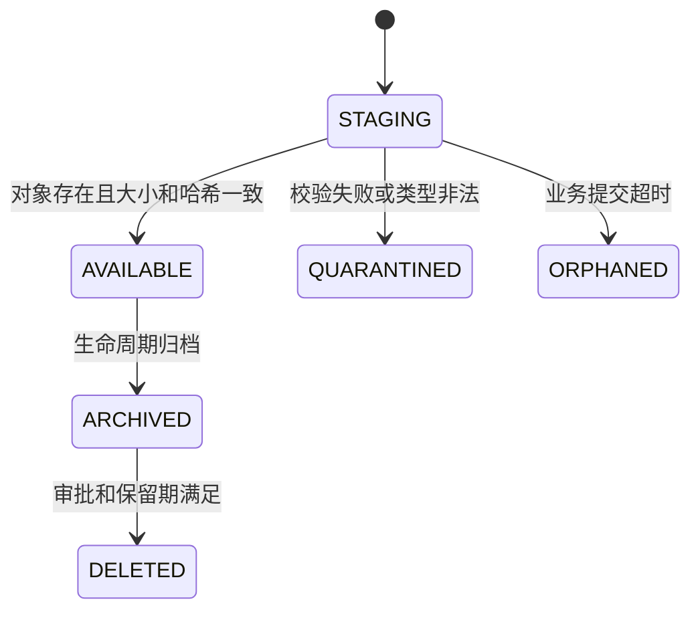

# 图片存储方案

## 1. 文档职责

本文定义工控机本地图片缓存和中心文件存储的对象键、校验、生命周期、备份与一致性。对象存储具体产品见 [14-技术选型](14-技术选型.md)，业务状态见 [02-完整检测业务流程](02-完整检测业务流程.md)。

## 2. 当前容量基线

当前工作区已观察到：

- `data/images` 约 4.4 GB。
- `data/processed` 约 160 MB。
- `outputs` 约 5.6 GB，其中极坐标检测派生图约 4.3 GB。
- `outputs/training` 约 599 MB。
- 仅 180 张原始研究图片就占用约 4.4 GB，说明生产容量不能按普通网页图片估算。

容量规划必须用现场相机真实平均值和峰值重新测量。估算公式：

```text
日原图量 = 每日触发数 x 每次图片数 x 原图平均字节
日派生量 = 每日触发数 x 各类派生图平均字节之和
有效容量 = (日原图量 x 原图保留天数
          + 日派生量 x 派生图保留天数
          + 样本导出包与模型包容量)
          x 副本数
          x 预留系数
```

预留系数建议不低于 1.3，最终由基础设施团队确认。

## 3. 工控机本地缓存

### 3.1 目录

```text
edge-data/
├── staging/
├── pending/
│   └── 2026/07/28/{capture_id}/
│       ├── primary.original-extension
│       └── manifest.json
├── confirmed/
├── quarantine/
└── edge_queue.sqlite3
```

目录中不使用“合格”或“不合格”作为路径，因为采集时尚无最终结论。

### 3.2 原子落盘

1. 写入 `staging/{capture_id}.tmp`。
2. 完成编码并同步文件内容。
3. 解码校验、计算 SHA-256、记录尺寸和类型。
4. 原子改名到 `pending`。
5. 在 SQLite 事务中写入图片记录和上传任务。

若第 5 步失败，启动时扫描 `pending` 并重建缺失任务；若文件校验失败，移入 `quarantine` 并告警。

### 3.3 SQLite 表

本地只保存同步所需最小信息：

- `capture_queue`：`capture_id`、本地序号、状态、重试时间、中心状态和错误码。
- `local_image`：本地路径、SHA-256、大小、尺寸、上传状态和中心 `image_id`。
- `sync_attempt`：请求标识、开始结束时间和结果。
- `agent_state`：数据库模式版本、最近对账时间和配置版本。

启用 WAL、外键、忙等待和定期完整性检查。SQLite 不保存最终业务事实。

### 3.4 清理规则

- `PENDING`、`UPLOADING`、`RETRY_WAIT` 和中心状态不确定的文件永不自动删除。
- 中心确认且取得最终结果后，进入 `confirmed`。
- `confirmed` 默认再保留 7 天作为网络和运维缓冲；具体天数配置化。
- 80% 磁盘使用率发预警，90% 提升告警并加速清理已确认文件，95% 进入严重告警并按现场安全策略暂停新采集。
- 清理按“中心已确认时间”而不是文件修改时间排序。
- 每次清理记录文件哈希、原因和中心回执。

## 4. 中央对象存储

### 4.1 存储抽象

业务代码只依赖 S3 兼容能力：

- 分片或普通上传。
- `HEAD` 元数据查询。
- 服务端加密。
- 对象版本或不可变策略。
- 生命周期规则。
- 短时签名地址。
- 桶策略和服务账号。

具体实现可以是公司已有对象存储、Ceph RGW、受支持的商业产品或经验证的自托管实现。不能把厂商专用路径写入业务表。

### 4.2 桶划分

| 桶 | 内容 | 写入者 |
|---|---|---|
| `td-raw` | 相机原图和历史导入原图 | 采集上传身份 |
| `td-derived` | 缩略图、模型掩膜、热图、叠加图和极坐标图 | 推理服务 |
| `td-review` | 人工修订掩膜和复核附件 | 复核上传身份 |
| `td-sample-exports` | 不可变样本导出清单、来源快照、校验和和失败报告 | 样本导出作业 |
| `td-model-quarantine` | 浏览器直接上传的待验证模型包及来源证据 | 受控浏览器上传身份 |
| `td-models` | 已验证模型包、校验和、签名和评估报告 | 模型验证与发布服务 |

不同环境使用不同账号和桶，不以同一桶前缀代替生产与测试隔离。

### 4.3 对象键

原图：

```text
raw/{yyyy}/{mm}/{dd}/{station_id}/{capture_id}/{image_role}-{sha256前16位}.{ext}
```

派生图：

```text
derived/{yyyy}/{mm}/{dd}/{capture_id}/{detection_task_id}/
{pipeline_version}/{kind}-{sha256前16位}.png
```

人工掩膜：

```text
review/{yyyy}/{mm}/{dd}/{capture_id}/{review_task_id}/
revision-{review_record_id}-{sha256前16位}.png
```

样本导出和模型：

```text
sample-exports/{yyyy}/{mm}/{export_id}/...
quarantine/{upload_id}/{sha256前16位}/...
models/{model_name}/{version}/{sha256前16位}/...
```

对象键约束：

- 全部小写英文、数字、斜杠和短横线。
- 不含用户名、真实姓名、最终标签和业务秘密。
- 不使用客户端原始文件名作为唯一键。
- 对象键一经确认不可复用。

## 5. 文件格式

### 5.1 原图

- 原样保存相机输出，不能为节省空间重新压缩后冒充原图。
- 保存原媒体类型、位深、尺寸、相机配置和 SHA-256。
- 若相机提供专用无损格式，同时生成可解码预览，但专用文件仍是原始事实。

### 5.2 掩膜

- 单通道、无损 PNG。
- 背景为 0，缺陷为 255。
- 人工掩膜必须与原图尺寸一致。
- 模型坐标掩膜若未回映原图，文件元数据必须声明坐标空间。

### 5.3 预览和叠加图

- 缩略图可以使用 JPEG 或 WebP。
- 叠加图和热图属于展示证据，不作为训练标签。
- 全分辨率派生图按需生成，避免像当前极坐标输出一样无控制增长。

## 6. 上传与确认



1. 后端生成只允许指定对象键、大小、类型和校验和的上传授权。
2. 客户端上传后调用确认接口。
3. 后端检查对象头信息，必要时流式重算 SHA-256。
4. 数据库图片记录从 `STAGING` 进入 `AVAILABLE`。
5. 业务事务只能引用 `AVAILABLE` 对象。

上传成功但业务未确认的对象由孤儿扫描器处理。扫描器先查数据库和上传会话，再决定重新挂接、隔离或删除。

## 7. 完整性和去重

- SHA-256 是端到端内容校验，不使用 ETag 代替，因为分片上传的 ETag 不一定是内容哈希。
- 每次采集都是独立业务事实，即使内容相同，也保留独立 `capture_id`。
- 物理层是否去重由存储系统决定，业务层不合并记录。
- 样本整理和导出使用哈希识别重复与冲突，但不删除生产采集事实。
- 每次备份恢复和迁移都抽样重算 SHA-256。

## 8. 访问控制

- 桶默认拒绝公开访问。
- 浏览器只得到短时、单对象、只读签名地址，默认有效期 5 分钟。
- 采集身份只写自己工位已授权的原图键，不具备列桶或读其他工位权限。
- 推理服务可读任务引用的原图、读批准模型、写指定派生前缀。
- 样本导出作业只能读取已纳入候选所引用的对象，不能遍历全部生产原图。
- 模型验证进程只能短时读取一个隔离模型包，不能读取业务原图集合、写生产模型区或访问业务数据库。
- 外部训练环境没有任何生产对象存储凭据，只能接收管理员受控下载的样本导出包。
- 删除、生命周期和跨站复制使用独立运维身份。
- 服务器端加密和传输加密必须启用，密钥由企业密钥系统管理。

## 9. 生命周期

以下为配置基线，不是最终合规结论：

| 对象 | 建议 |
|---|---|
| 原图 | 按质量追溯要求保留；默认建议至少一个完整产品追溯周期 |
| 缩略图 | 与业务记录同周期或可重建后提前清理 |
| 热图、叠加图、极坐标中间图 | 默认 180 天，进入样本导出或争议证据时延长 |
| 模型掩膜 | 与检测记录同周期 |
| 人工掩膜 | 与复核记录和相关样本导出最长保留期一致 |
| 样本导出包 | 按审批用途和合规期限保留；到期后先检查审计与外部交接引用 |
| 隔离模型包 | 验证失败或放弃后保留审计窗口，再按受控策略清理 |
| 生产模型 | 永久保留制品、签名、评估和部署记录 |
| 失败上传和孤儿对象 | 隔离一段审计窗口后清理 |

质量、法务和存储负责人必须为每类对象签字确认具体天数。

## 10. 备份与恢复

1. 原图和模型至少保留两个故障域副本。
2. 数据库备份与对象存储备份使用相同恢复点标识。
3. 模型包、样本导出清单和业务引用同时备份，不能只备份图片。
4. 备份账号只写备份目标，不能删除源数据。
5. 定期执行恢复演练并验证随机对象哈希。
6. 跨站复制延迟、失败数量和最近成功时间进入监控。

建议采用“在线副本 + 独立备份 + 异地或离线副本”的三层保护，具体恢复点和恢复时间目标由业务确认。

## 11. 当前文件迁移

### 11.1 数据

1. 对 `data/images`、`data/masks` 和标注逐文件计算清单与 SHA-256。
2. 以 `HISTORICAL_IMPORT` 来源导入原图。
3. 掩膜和标注进入只读历史研究资产区，不伪装成生产人工复核记录，也不登记为在线数据集版本。
4. 保存当前 180 样本清单和 172 样本无泄漏清单为两个只读历史清单；需要外部使用时通过新的样本导出作业生成独立导出包。
5. 完成数量、大小和哈希对账后，原目录仍先只读保留。

### 11.2 训练权重

`outputs/training` 的历史模型目录视为系统边界外制品，不能直接移动到生产模型区，也不能与 `artifacts` 中不同的 `model.json` 混合。每组先生成标准模型包、外部来源说明、清单、SHA-256 和评估证据，再由管理员通过直接上传入口写入 `td-model-quarantine`；隔离加载和固定样例验证全部通过后，才复制到 `td-models`。原文件在模型注册、备份和回滚验证完成前不删除。

## 12. 验收用例

1. 断点重传后 SHA-256 保持一致。
2. 重复确认同一对象成功，不同内容冲突。
3. 浏览器签名地址过期后无法访问。
4. 采集身份无法读取其他工位对象。
5. 数据库事务回滚后，孤儿对象可被发现和安全处置。
6. 派生图清理不影响原图、人工掩膜和样本导出引用。
7. 恢复演练后业务记录、模型版本和对象哈希可以对账。
8. 外部训练环境无法列举或读取任何生产桶；训练环境不可用不影响在线存储和推理。
