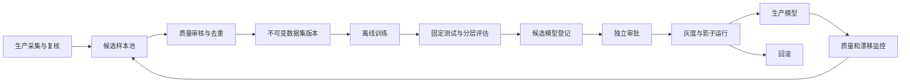

# 增量训练闭环

## 1. 文档职责

本文定义生产样本回流、不可变数据集、离线训练、评估、模型登记、发布、灰度和回滚。在线检测状态不在本文定义。

## 2. 当前训练基线

### 2.1 数据

当前仓库有两套需要分别保存的数据基线：

| 数据集 | 样本数 | 划分 | 用途 |
|---|---:|---|---|
| 原始确定性清单 | 180 | 115 训练、29 验证、36 测试 | 保留历史整理结果 |
| 重训练审计清单 | 172 | 110 训练、28 验证、34 测试 | 排除冲突并避免精确重复泄漏后的比较基线 |

重训练清单明确排除了 `unqualified/2.png` 和 `unqualified/16.png` 这组图像相同但掩膜冲突的样本，并对合格图像精确去重。增量数据集构建必须继承“内容哈希去重、文件名家族不跨划分”的约束。

### 2.2 当前可加载双任务产物

截至 2026-07-28，`outputs/training` 中有三组可加载的双任务模型：

| 目录 | `model.json` SHA-256 | `weights.h5` SHA-256 |
|---|---|---|
| `multitask` | `63870f093b42ae0b51617cf0dd83465c122b49222e7e8e80db4f6c855b77d4b3` | `5613d2eb4dabcc691e114fd921f5bb8f6d9d5a5a561bd8232dd58f1ece248f7a` |
| `multitask_adaptive_annular` | 同上 | `35f64b4a9545afe8564a69e9b9ba8d4dc305729f51977c495ab033f95e96a98e` |
| `multitask_boundary_normalized` | 同上 | `162526a04bc4972faff9fff13f77b37e4a3509884d33aa188303ae5b855ca545` |

三组模型均为 `256 x 256 x 3` 输入，输出 `cla_out` 和 `seg_out`。目录内只有结构和权重，没有训练历史、配置副本和环境记录，因此目录名不能单独证明训练来源。

`artifacts/multitask/model.json` 的 SHA-256 为：

```text
377a1cece0dc45bd15407356ec2b624ac25072a9a91ddebaec5c51a508005f50
```

它与上述三个训练目录中的结构文件不同，严禁拿它与上述权重混配。

### 2.3 其他上线阻断

- 当前未发现可与分类 `model.json` 配套的分类权重。
- 当前极坐标异常模型文件版本为 1，而代码要求版本 2，必须用现有代码重新执行缓存和无标签标定。
- 当前 34 张固定测试图适合项目内配对比较，但不足以覆盖生产批次、相机、光照、污渍和刀具状态变化。

## 3. 闭环总览



禁止生产服务在线更新权重。所有改变都必须生成新数据集版本、新训练运行和新模型版本。

## 4. 候选样本池

### 4.1 来源

- 人工推翻算法结论的样本。
- 模型掩膜被明显修订的样本。
- `INCONCLUSIVE`、预处理失败或多算法冲突样本。
- 各工位、班次、批次和置信度区间的随机样本。
- 新相机、新配方、新材质或新环境样本。
- 漂移监控命中的代表样本。

只收集错误样本会改变训练分布，因此必须同时保留按生产分布抽取的普通样本。

### 4.2 准入

样本进入候选池需要：

- 原图 SHA-256 和采集元数据完整。
- 人工结论已经关闭。
- 掩膜坐标与原图一致。
- 来源权限和数据用途允许训练。
- 不存在未解决的质量标准争议。

候选池是可变工作区，不得被生产模型直接引用。

## 5. 数据清洗和分组

每次构建数据集执行：

1. 图片可解码、尺寸、位深和通道校验。
2. 标签与掩膜一致性校验。
3. 正样本掩膜非空检查。
4. SHA-256 精确重复检测。
5. 感知哈希或特征相似度近重复检测。
6. 同一刀具、同一触发、多视角和文件名家族分组。
7. 冲突标签和冲突掩膜隔离。
8. 训练、验证、测试之间的组级泄漏检查。
9. 类别、工位、批次、时间和缺陷尺寸分布报告。

完全重复不代表可以删除生产记录，只影响数据集样本选择。

## 6. 数据集版本

每个版本包含：

```text
dataset-version/
├── manifest.csv
├── provenance.csv
├── split-audit.json
├── statistics.json
├── label-schema.json
├── preprocessing-policy.json
├── checksums.sha256
└── approval.json
```

要求：

- 清单只引用对象存储中的不可变对象。
- 每行保存样本标识、原图、标签、掩膜、划分、分组键、来源复核记录和 SHA-256。
- 划分一旦发布不修改；新增版本从父版本派生并记录差异。
- 冻结测试集默认不吸收训练过程见过的生产样本。
- 如需更新测试集，建立新的评估世代，旧测试结果仍保留。

## 7. 训练运行

### 7.1 可复现输入

每次运行锁定：

- 代码提交和工作树状态。
- 数据集版本和清单哈希。
- 模型初始化制品及哈希。
- 完整配置和配置哈希。
- Python、TensorFlow、Keras、CUDA、驱动和系统环境。
- 全部随机种子。
- CPU、GPU 和精度策略。
- 训练阶段、批大小、学习率、早停和最佳权重规则。

### 7.2 当前代码接入

现有能力可包装为两类训练任务：

1. `train --task multitask`：从源码构建模型并训练。
2. `retrain-multitask`：从指定可兼容制品开始两阶段重训练。

当前两阶段策略和联合最佳分数应保留为一种实验配置，不写死为系统唯一策略。训练任务把现有的 `model.json`、`weights.h5`、历史、环境和评估输出统一记录到模型注册表。

### 7.3 训练隔离

- 训练不与生产推理共用同一 GPU 资源池。
- 训练服务只读批准的数据集。
- 训练账号不能写生产模型别名。
- 运行失败保留日志和最后检查点，但失败模型不能登记为可发布。

## 8. 评估

### 8.1 基础指标

分类：

- Accuracy。
- 不合格类 Precision、Recall、F1。
- 假阴性数量和漏检率。
- PR 曲线和置信区间。

分割：

- 缺陷 IoU、Dice、Precision、Recall。
- mIoU。
- 按缺陷面积和贴边程度分层。

工程：

- 单张端到端时延和模型推理时延。
- 峰值内存和显存。
- 预处理失败率。
- 图片类型兼容性。
- 运行稳定性。

### 8.2 当前代码门槛

当前 `compare-multitask` 的项目内推广门槛是：

- 缺陷 IoU 至少提高 0.05。
- 缺陷 Recall 至少提高 0.05。
- 分类 Accuracy 下降不超过 0.03。

该门槛只能作为现有研究基线的技术检查，不能直接成为生产发布标准。生产发布还必须满足：

1. 固定盲测集上的不合格 Recall 和漏检上限。
2. 关键工位、批次和缺陷尺寸分层无不可接受退化。
3. 配对置信区间和最小样本量要求。
4. 现场节拍、失败率和资源要求。
5. 灰度期人工抽检结果。
6. 输入、输出、预处理和模型包安全检查。

具体数值由质量负责人、工艺负责人和算法负责人共同签字并版本化。

### 8.3 禁止使用的证据

- 只看训练集或验证集最高值。
- 只看单个随机种子。
- 用不同测试集直接比较两个模型。
- 把学校报告值当作当前同条件复现。
- 用未完成训练、损坏缓存或不兼容模型得出的结果。

## 9. 当前权重迁移流程

不直接移动或覆盖，按以下顺序执行：

1. 把三个 `outputs/training` 目录只读冻结并生成完整清单。
2. 复制一份到模型暂存区，保留原目录。
3. 验证结构与权重哈希、输入输出名和类别映射。
4. 用固定样例完成加载和推理冒烟测试。
5. 根据目录拟定配置映射，但必须用数据路径、评估结果或训练记录复核。
6. 在相同 34 张测试图上分别评估，生成指标、混淆矩阵和逐图结果。
7. 生成 `manifest.json`、环境锁、标签映射、评估报告和签名。
8. 以三个独立候选版本登记，不能覆盖同一个“当前模型”。
9. 审批通过后复制到生产模型桶并设置灰度别名。
10. 注册表、备份和回滚验证完成后，再由用户单独批准是否清理原目录。

## 10. 模型注册

状态：

`DRAFT -> VALIDATING -> VALIDATED -> APPROVED -> CANARY -> PRODUCTION -> RETIRED`

失败分支为 `REJECTED` 或 `QUARANTINED`。

注册表保存：

- 模型包和制品哈希。
- 数据集和训练运行。
- 输入输出签名和类别映射。
- 指标、分层报告和置信区间。
- 代码、环境和许可证信息。
- 审批、别名和部署历史。

`production` 是指向不可变版本的别名，不是一个可覆盖目录。

## 11. 发布和灰度

1. 质量负责人批准指标。
2. 模型发布负责人批准制品和运行兼容性。
3. 推理服务下载、验签、加载和预热。
4. 先影子运行，不影响生产处置。
5. 再按指定工位或小比例灰度。
6. 灰度期间提高人工抽检，并与稳定模型做配对比较。
7. 满足观察窗口和样本量后转生产。

已创建任务锁定原流水线版本，不能因别名切换而改变。

## 12. 回滚

触发条件包括：

- 漏检或人工推翻率显著升高。
- 预处理或推理失败率异常。
- 时延、显存或稳定性不满足要求。
- 模型包校验或安全问题。
- 现场负责人要求紧急止损。

回滚只影响新任务：

1. 把生产流水线指回上一批准版本。
2. 排空或终止新模型运行槽。
3. 保留新模型期间全部结果和复核证据。
4. 创建问题调查和是否重跑任务的独立决策。

禁止用旧权重覆盖新版本文件实现回滚。

## 13. 重训练触发

重训练不是看到新样本就启动。建议同时满足：

- 新增已批准样本达到最小规模。
- 覆盖至少一个明确的性能缺口或分布变化。
- 数据分布、标签质量和划分审计通过。
- 有固定计算预算和比较基线。
- 生产问题无法只通过设备、光照或阈值修复。

定期训练和事件触发训练都创建审批任务，不自动发布。

## 14. 闭环监控

持续比较：

- 生产模型结论分布。
- 人工推翻率和漏检原因。
- 输入质量、工位和批次漂移。
- 新旧模型影子差异。
- 数据集覆盖和重复比例。
- 从样本产生到进入生产模型的周期。

任何只有人工确认样本才能计算的质量指标，必须明确标注样本选择偏差，不能把复核子集结果直接当作全量真值。
