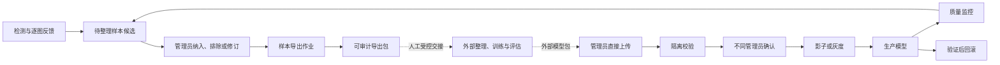

# 样本回流、导出与外部模型包接入

## 1. 文档职责

本文定义在线系统中的待整理样本回流、样本包导出、外部模型包直接上传、隔离校验、启用和回滚。检测状态、人工反馈和最终生产处置分别以检测、复核和契约文档为准。

本文替代原“在线数据集版本—内部训练运行—模型登记”设计。在线系统的闭环终点是可审计样本包导出，模型供应链的起点是管理员直接上传外部模型包，两者彼此独立。

## 2. 范围和系统边界

### 2.1 在线系统负责

- 从生产员工三按钮反馈、管理员反馈和质量异常中形成待整理样本候选。
- 对候选执行筛选、纳入、排除、修订和审计。
- 按候选快照异步生成样本导出包、失败清单和短时下载票据。
- 接收管理员从浏览器直接上传的外部模型包，并写入隔离对象前缀。
- 校验模型包大小、哈希、结构、安全性、输入输出和固定样例结果。
- 管理已验证模型的申请、不同管理员确认、影子或灰度、生产启用和回滚。
- 保持检测记录与实际执行模型版本的不可变关联。

### 2.2 明确取消

在线系统不得提供或变相恢复以下能力：

- 数据集创建、冻结、批准和版本差异。
- 数据集版本页面、菜单、人员权限、写接口和事件。
- 内部训练任务创建、调度、进度、日志、检查点和资源管理。
- 训练运行页面、菜单、人员权限、写接口和事件。
- 内部训练流水线、训练工作节点及其在线业务依赖。

第二版契约不得定义数据集版本或训练运行的写资源，也不得生成对应网络类型、权限或事件。样本导出完成后不得自动创建数据集或训练任务；模型上传、验证、启用和回滚不得要求内部数据集标识或训练运行标识。

### 2.3 外部边界

样本导出包离开系统后的整理、数据集划分、训练、实验跟踪和离线评估属于外部流程，不是在线系统组件。在线系统：

- 不为外部流程签发业务数据库、消息队列、内部对象存储或生产运行时凭据。
- 不调度、不轮询、不回调外部训练，不保存其任务状态、进度或日志。
- 不以外部训练环境的可用性作为检测、复核、样本导出、模型验证或模型切换的前置条件。
- 只允许把外部来源作为模型版本的审计说明和证据附件，不把它映射为内部训练运行。

如未来需要服务间训练集成，必须新建决策记录、主版本契约和安全评审；不得复用样本导出或模型上传接口暗中加入在线训练依赖。

## 3. 当前冻结基线

本节只记录迁移前已经存在的研究资产事实，供哈希核验和外部整理使用。它们不是在线数据集版本或训练运行，前端和第二版接口不得据此恢复已取消功能。

### 3.1 历史数据清单

| 历史清单 | 样本数 | 划分 | 边界说明 |
|---|---:|---|---|
| 原始确定性清单 | 180 | 115 训练、29 验证、36 测试 | 迁移前整理结果，只读保留 |
| 重训练审计清单 | 172 | 110 训练、28 验证、34 测试 | 排除冲突和精确重复后的外部比较基线 |

重训练审计清单排除了 `unqualified/2.png` 和 `unqualified/16.png` 这组图像相同但掩膜冲突的样本，并对合格图像精确去重。“内容哈希去重、同一来源家族不跨比较划分”仍可作为导出清单的质量提示，但在线系统不执行数据集划分或批准。

### 3.2 历史模型产物

截至 2026-07-28，`outputs/training` 中有三组可加载的双任务模型：

| 目录 | `model.json` SHA-256 | `weights.h5` SHA-256 |
|---|---|---|
| `multitask` | `63870f093b42ae0b51617cf0dd83465c122b49222e7e8e80db4f6c855b77d4b3` | `5613d2eb4dabcc691e114fd921f5bb8f6d9d5a5a561bd8232dd58f1ece248f7a` |
| `multitask_adaptive_annular` | 同上 | `35f64b4a9545afe8564a69e9b9ba8d4dc305729f51977c495ab033f95e96a98e` |
| `multitask_boundary_normalized` | 同上 | `162526a04bc4972faff9fff13f77b37e4a3509884d33aa188303ae5b855ca545` |

三组模型均为 `256 x 256 x 3` 输入，输出 `cla_out` 和 `seg_out`。目录内缺少完整来源记录，目录名不能证明训练来源。`artifacts/multitask/model.json` 的 SHA-256 为：

```text
377a1cece0dc45bd15407356ec2b624ac25072a9a91ddebaec5c51a508005f50
```

它与上述三个目录中的结构文件不同，不得混配结构和权重。任何历史产物进入目标系统都必须作为一次外部模型包上传，经隔离校验后形成新模型版本；不得直接复制到生产目录或补造内部训练记录。

### 3.3 已知阻断

- 当前未发现可与分类 `model.json` 配套的分类权重。
- 当前极坐标异常模型文件版本为 1，而现有代码要求版本 2。
- 34 张固定测试图只适合项目内配对检查，不足以覆盖生产批次、相机、光照、污渍和刀具状态变化。

这些事实必须反映在模型验证证据和上线决策中，但其修复发生在在线系统边界外。

## 4. 目标闭环



图中的两条虚线表示系统边界，不是在线任务依赖。导出包可以在没有任何训练环境时正常生成和下载；模型包也可以在没有对应导出作业时上传，只要外部来源说明和验证证据完整。

## 5. 待整理样本库

### 5.1 候选来源

- 生产员工选择“确认存在缺陷”“确认无缺陷”或“无法判断”后，与系统结论形成争议的图片项。
- 管理员标记为误报、漏检、定位不准、图片不可用或暂无法确认的图片项。
- 图片质量检查异常、推理不确定、技术失败或处置为 `HOLD` 的图片项。
- 管理员按工位、批次、使用阶段、模型版本或时间范围主动选取的代表图片项。

候选必须关联原图、派生结果、逐图质量结果、系统结论、生产员工反馈、管理员反馈、检测时间、使用阶段、来源批次和实际模型版本。原始事实和历次反馈只追加，不得被候选决定覆盖。

### 5.2 候选决定

管理员可以对候选执行纳入、排除或修订。每次决定至少保存：

- 候选标识和所依据的反馈版本。
- 决定、原因、操作人和时间。
- 被替代决定标识和并发版本。
- 可选标注对象引用及其哈希。

同一图片项与同一反馈版本重复加入必须幂等。进入待整理样本库不表示成为在线数据集，也不表示允许或触发训练。

### 5.3 数据用途和安全失败

- 来源权限、数据用途或脱敏状态不明确时，候选保持不可导出状态。
- 原图缺失、哈希冲突、标注坐标不兼容或对象状态未知时，必须明确失败或保持待处理，不得默认为可用。
- 技术失败记录可以进入候选库用于排查，但不得伪装成已确认标签。
- 导出不删除候选，不改变检测结果，也不改变生产处置。

## 6. 样本导出

### 6.1 创建和快照

管理员从待整理样本库筛选并批量选择候选，创建异步导出作业。创建时必须冻结筛选条件、候选标识、候选决定版本、模式版本和申请人，后续候选修订不得静默改变已创建作业。

大批量导出需要不同管理员确认。导出作业和下载权限必须遵守数据范围、保留期和最小必要原则。

### 6.2 导出包

成功包至少包含：

```text
sample-export/
├── manifest.jsonl
├── schema.json
├── provenance.json
├── checksums.sha256
├── failures.json
├── images/
└── annotations/
```

清单逐项保存来源图片项、对象相对路径、媒体类型、大小、SHA-256、系统结论、人工结论、管理员标记、质量结果、使用阶段、模型版本和时间。包内不得包含长期访问凭据、数据库标识之外的敏感内部拓扑或任意外部网址。

### 6.3 状态和失败语义

- 作业状态至少区分排队、执行中、部分失败、成功、失败和已过期；具体枚举以契约为准。
- 任一必需对象缺失、哈希不符或复制失败时，不得宣称完整成功。
- 部分失败必须给出逐项失败清单；是否允许下载完整子集由版本化策略决定。
- 成功后只签发短时、只读、范围受限的下载票据，并记录申请、签发、下载和到期审计。
- 作业重试必须幂等，不得生成内容相同但无法追踪的重复包。

### 6.4 导出后的边界

导出完成是在线样本闭环终点。系统不记录外部数据集状态、训练进度、训练日志或检查点，不消费训练事件，也不因为导出成功自动创建任何后续在线资源。外部使用方可以在模型上传时填写来源说明，但该说明不建立在线任务依赖。

## 7. 外部模型包直接上传

### 7.1 上传体验

管理员在模型管理页面选择模型包，填写名称、语义版本、说明、预期输入输出、外部来源和声明哈希，创建上传会话。浏览器使用短期授权把二进制直接写入隔离对象前缀；业务接口不得接收 Base64 模型、把大文件写入数据库或长期缓存完整包。

上传完成后由服务端核对对象存在性、大小、媒体类型和 SHA-256。确认请求必须幂等，超时或状态未知时保持隔离，不得进入可启用状态。

### 7.2 包内容

模型包至少提供：

- 模型制品和逐文件 SHA-256。
- 包模式版本、模型名称和语义版本。
- 输入尺寸、通道、归一化、输出名称和类别映射。
- 框架、运行时和允许插件版本。
- 外部来源说明、许可证和责任人。
- 外部评估摘要及其证据文件。

内部数据集版本和内部训练运行标识不是必需字段，也不得作为上传校验的隐含前置条件。

## 8. 隔离校验

校验在无业务数据库凭据、无生产对象写权限、无任意外网访问的受限环境运行，至少包含：

1. 压缩包路径穿越、符号链接、嵌套包、文件数和解压大小检查。
2. 文件清单、声明哈希和实际哈希核对。
3. 框架、插件、反序列化格式和许可证白名单检查。
4. 输入输出模式、类别映射和预处理兼容性检查。
5. 模型加载、预热、固定安全样例和资源上限检查。
6. 评估证据完整性和外部来源说明审计。

验证失败的包保持隔离并记录脱敏原因，不得写入可启用模型前缀，不得影响当前生产模型。技术失败、状态未知、哈希冲突或版本不兼容必须明确失败或保持待处理，绝不能产生“验证通过”。

验证状态建议采用：

`UPLOADING -> QUARANTINED -> VALIDATING -> VALIDATED`

失败分支为 `REJECTED`，过期未完成上传为 `EXPIRED`。发布状态与验证状态分开保存，避免页面把“已上传”误显示为“可生产”。

## 9. 模型启用、灰度和回滚

### 9.1 不可变模型版本

每个模型版本保存包对象引用、制品哈希、输入输出签名、外部来源说明、验证证据、上传人、验证时间和历史使用范围。生产别名只能指向一个已验证的不可变版本，不能通过覆盖目录更新权重。

历史检测任务锁定实际模型版本。启用新模型不得改写旧检测记录，也不得使运行中的任务切换版本。

### 9.2 启用

1. 管理员针对已验证版本发起启用申请并选择已验证回滚目标。
2. 与申请人不同的管理员核对验证证据和影响范围。
3. 推理服务在非生产槽下载、验签、加载和预热。
4. 先执行影子或限定范围灰度，不让影子结果直接产生最终生产处置。
5. 满足观察窗口和人工抽检条件后原子切换生产别名。
6. 任一步失败时保持原生产版本，并保留完整审计和失败证据。

管理员角色不等于可以自批。启用和正式回滚必须由不同管理员账号留下申请与确认链。

### 9.3 回滚

回滚目标必须是历史已验证版本，并在切换前重新完成可加载和预热检查。回滚只影响新任务；失败时当前生产模型保持不变。新模型期间的检测结果、人工反馈和样本候选全部保留。

触发条件包括漏检或人工推翻率异常、推理失败率上升、时延或资源超限、模型包安全问题以及现场紧急止损。

## 10. 权限和审计

人员业务角色只有生产员工和管理员：

| 能力 | 生产员工 | 管理员 |
|---|---:|---:|
| 提交逐图三按钮反馈 | 按本人或授权范围 | 允许 |
| 查看和管理待整理样本 | 禁止 | 允许 |
| 创建或下载样本导出 | 禁止 | 允许，受审批和审计约束 |
| 直接上传和查看模型验证 | 禁止 | 允许 |
| 申请、确认启用或回滚 | 禁止 | 允许，但禁止同一账号自批 |
| 数据集版本或训练运行管理 | 不存在 | 不存在 |

候选加入、候选决定、导出创建、导出下载、模型上传、验证结果、启用申请、确认、切换和回滚必须进入不可变审计链。审计只记录对象引用和哈希，不记录上传票据、对象存储密钥或模型二进制。

## 11. 保留、删除和供应链安全

- 原图、派生图、候选、导出包、隔离模型、验证证据和生产模型分别配置保留期。
- 页面删除只能创建受审计的清理申请，不能直接物理删除事实记录或对象。
- 被检测记录、审计或生产模型引用的对象不得提前删除。
- 过期上传会话和验证失败对象由受控清理作业处理；清理结果必须可审计。
- 样本导出包和模型包不得提交 Git，也不得放入消息正文或业务数据库大字段。
- 生产推理服务只能读取已验证模型前缀，不能读取上传隔离区。

## 12. 监控和告警

在线监控只覆盖本系统职责：

- 待整理候选新增量、积压量、最老等待时间和决定分布。
- 导出作业排队、耗时、部分失败、失败原因、包大小和下载票据使用情况。
- 模型上传会话、哈希失败、安全拒绝、验证耗时和资源上限命中。
- 启用、灰度、回滚结果以及当前生产模型一致性。
- 按实际模型版本统计的人工推翻率、漏检原因、图片质量和推理失败率。

不得采集或展示内部训练队列、训练进度、训练日志、检查点或训练资源指标。外部训练不可用不触发在线系统可用性告警。

## 13. 兼容和退役

- 第一版已经存在的数据集或训练记录只按迁移要求只读保留，不接受新的创建、冻结、批准、调度或状态写入；写消费者归零后独立返回 `410 / TD-LEGACY-FEATURE-RETIRED`，不等待第一版产线接口下线。
- 第一版相关写接口、事件生产者、事件消费者、后台作业、菜单、路由和权限必须在消费者归零后退役；遥测缺失不得视为消费者为零。
- 第一版详情读取只在归档窗口内供授权审计使用；关闭前把被模型引用的来源转为可验哈希的通用只读快照，并从模型历史或审计响应嵌入返回。第二版没有独立数据集或训练资源路由。
- 第二版不提供同义替代接口，也不把样本导出包装成“数据集发布”，不把模型验证包装成“训练运行”。
- 每个模型必须满足完整第一版内部来源或完整外部上传来源且只能满足一种；历史来源字段缺失时保持未知，不能补造数据集版本或训练运行。
- 退役内部训练服务不得影响检测、复核、样本导出、模型上传、验证、启用或回滚验收。

## 14. 验收标准

1. 管理员可从争议图片形成候选，完成纳入或排除并创建可审计导出包。
2. 导出包清单、对象数量和 SHA-256 一致；单项失败不会被报告为完整成功。
3. 导出成功后未创建数据集版本、训练运行、训练任务或训练事件。
4. 在没有内部训练服务、训练凭据和训练记录的环境中，检测和样本导出仍可独立完成。
5. 管理员可从页面直接上传外部模型包；业务接口不接收模型二进制。
6. 损坏、恶意、哈希不符或模式不兼容的包保持隔离，当前生产模型不受影响。
7. 模型上传和验证不要求内部数据集版本或训练运行；外部来源以不可变审计快照保存；全空、不完整或双重来源不能登记。
8. 不同管理员确认后才允许原子启用；回滚验证失败时保持当前模型。
9. 第二版契约、生成类型、前端路由、菜单和人员权限中不存在数据集版本或训练运行写能力。
10. 外部整理或训练环境完全不可用时，在线检测、复核、样本导出、模型管理和生产运行不降级。
