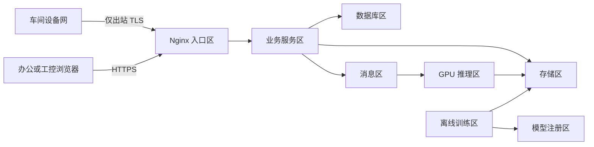

# 安全权限与角色

## 1. 文档职责

本文定义身份、角色、权限、网络边界、数据保护、模型供应链和安全审计。数据库只持久化这些规则，前端只按授权展示。

## 2. 保护目标

系统需要同时保护：

1. 生产处置不被未授权修改。
2. 原图、人工标注和模型不被泄露或篡改。
3. 设备和服务身份不能横向访问其他范围。
4. 恶意或损坏模型不能在生产推理环境执行。
5. 审批、复核、发布和回滚可追责。
6. 单个组件被攻破时影响范围可控。

## 3. 身份类型

### 3.1 人员身份

人员使用业务后端本地账号和数据库会话登录。业务系统仅保存带算法标识的
`Argon2id` 密码哈希，禁止保存明文或可逆密码；会话闲置 30 分钟失效且最长
持续 8 小时，网页和人员接口必须同源。

高权限人员启用多因素认证：

- 质量负责人。
- 模型发布负责人。
- 系统管理员。
- 安全审计和紧急账号。

### 3.2 设备身份

每台工控机或采集代理拥有独立设备证书和客户端标识：

- 证书绑定 `device_id` 和 `station_id`。
- 可单独吊销和轮换。
- 不在多台设备共享一个长期密钥。
- 私钥优先放入操作系统证书库或硬件安全模块。

### 3.3 服务身份

后端、推理、训练、发布、对象清理和监控分别使用独立服务账号。服务间同时使用双向 TLS 和短期令牌，不能使用人的账号启动后台任务。

## 4. 角色

| 角色 | 职责 | 明确禁止 |
|---|---|---|
| 现场操作员 | 查看本工位、确认设备提示、发起授权重采 | 修改质量结论、模型和系统配置 |
| 人工复核员 | 认领并提交授权范围内的复核 | 发布模型、修改其他人的记录 |
| 质量负责人 | 二审、升级裁决、批准标签和质量门槛 | 单人完成模型技术发布 |
| 算法工程师 | 构建数据集草稿、训练、评估和登记候选模型 | 审批自己的生产发布、修改最终处置 |
| 模型发布负责人 | 验证制品、批准灰度、正式发布和回滚 | 修改训练数据真值 |
| 系统管理员 | 用户、设备、配置、部署和故障处理 | 默认提交质量复核或改标签 |
| 安全管理员 | 证书、密钥、策略、漏洞和安全事件 | 日常质量结论 |
| 审计员 | 只读查看业务与安全审计 | 任何业务写操作 |

可按企业组织合并岗位，但职责冲突时必须采用双人审批。

## 5. 权限模型

采用 `RBAC + 数据范围 + 资源状态`：

- RBAC 决定能执行哪类动作。
- 数据范围限制到组织、产线或工位。
- 资源状态决定动作是否允许，例如已发布数据集不可编辑。

原子权限示例：

```text
capture.read
detection.read
image.view
image.download
review.claim
review.submit
review.escalate
quality.override
dataset.create
dataset.approve
training.start
model.register
model.validate
model.deploy.approve
model.deploy.execute
model.rollback
device.configure
user.manage
audit.read
```

“查看”和“下载”分开授权；能看网页预览不代表能下载原始文件。

## 6. 关键操作职责分离

| 操作 | 发起 | 必需审批或执行 |
|---|---|---|
| 数据集发布 | 算法工程师或数据管理员 | 质量负责人批准 |
| 候选模型登记 | 算法工程师 | 自动完整性检查 |
| 生产模型发布 | 算法工程师申请 | 质量负责人和模型发布负责人分别批准 |
| 生产回滚 | 发布负责人或系统管理员 | 紧急时先执行后补审计，正常时双人确认 |
| 最终质量覆盖 | 质量负责人 | 必填原因，高风险可双人 |
| 大批量图片导出 | 授权用户申请 | 数据负责人审批 |
| 证书和密钥轮换 | 安全管理员 | 自动审计和双人复核高权限根密钥 |

同一人员不能同时完成相互制衡的发起和最终批准。

## 7. 网络分区



要求：

- 车间设备不能直连数据库、RabbitMQ 或模型注册表。
- 浏览器不能直连数据库和内部推理接口。
- 推理区不能任意访问互联网。
- 训练区和生产推理区网络、账号和计算资源隔离。
- 管理端点只允许监控或运维网络访问。
- 防火墙采用默认拒绝和最小端口白名单。

## 8. 传输与接口安全

- 外部和内部连接均使用 TLS。
- 采集端使用设备证书，用户使用本地安全会话，服务使用双向 TLS 和服务令牌。
- Nginx 限制请求体、连接数、速率和超时。
- 图片不经 JSON Base64 上传。
- 上传授权绑定对象键、大小、类型、哈希和短有效期。
- 防止服务端请求伪造：对象地址由后端生成，推理服务不接受任意 URL。
- 所有写接口要求幂等键或乐观锁。
- 跨站请求、内容安全策略、点击劫持和安全响应头统一配置。

## 9. 图片和数据安全

- 桶默认私有，禁止匿名列举和读取。
- 原图、人工掩膜、数据集和模型分别使用最小权限账号。
- 浏览器签名地址短时有效且只读。
- 数据库和对象存储启用静态加密。
- 测试环境不直接复制生产数据。
- 导出带申请、范围、到期时间、水印或追踪标识。
- 删除必须经过保留期和引用检查。

当前项目主要是工业图片，仍应按企业敏感生产数据管理。

## 10. 模型供应链安全

### 10.1 当前风险

当前 `load_saved_model` 为兼容历史 Keras JSON 调用了不安全反序列化开关。恶意模型结构可能触发不期望行为，因此：

- 只允许来自内部模型注册表的模型。
- 模型包必须有 SHA-256 清单和数字签名。
- 自定义层和对象采用白名单。
- 模型加载在无业务凭据、无任意网络权限的隔离容器中。
- 不能让浏览器或普通用户上传模型后直接加载。

### 10.2 发布检查

- 来源训练运行和数据集存在。
- 文件哈希、签名和软件物料清单通过。
- 框架和插件版本在允许列表。
- 固定样例和安全扫描通过。
- 模型包不包含脚本、共享库或未声明文件。
- 发布审批和回滚目标完整。

### 10.3 运行时

- 容器非特权运行。
- 根文件系统只读，临时目录限额。
- 限制 CPU、内存、显存和进程。
- 模型桶只读挂载或按对象精确读取。
- 禁止模型运行时下载依赖。

## 11. 密钥和配置

- 密钥、数据库密码、对象存储密钥和证书不提交 Git。
- 使用企业密钥管理、机密管理或容器机密。
- 密钥按服务和环境隔离。
- 设定轮换、吊销和泄露响应流程。
- 日志和错误报文自动脱敏。
- 配置文件只保存密钥引用。
- 默认账号、示例密码和调试后门上线前全部移除。

## 12. 数据库安全

- 后端、迁移、只读报表、备份和审计导出使用不同数据库角色。
- 应用账号无建库、超级用户和任意文件权限。
- 训练和推理服务不直连业务数据库。
- 生产人工查询通过审计的只读入口。
- 高风险表启用额外审计。
- 备份加密，恢复账号与日常应用账号分离。

## 13. 前端安全

- 令牌优先保存在安全 Cookie 或受身份库保护的内存中，不存长期本地存储。
- 不在 URL、日志或错误消息中放令牌和签名地址。
- 所有富文本和文件名转义，防止脚本注入。
- 图片展示验证媒体类型，不直接执行 SVG 或 HTML 上传内容。
- 权限按钮隐藏只是体验优化，不能替代后端鉴权。
- 复核草稿不保存不必要的全分辨率原图。

## 14. 审计事件

必须审计：

- 登录、失败登录、令牌和证书吊销。
- 用户、角色、范围和设备变更。
- 采集配置、处置规则和监控阈值变更。
- 复核提交、升级、覆盖和纠错。
- 数据集批准、训练启动和模型登记。
- 模型灰度、发布、回滚和隔离。
- 图片下载、批量导出和删除。
- 死信回灌、任务重跑和手工状态修复。
- 密钥轮换和紧急账号使用。

审计记录只追加，并定期导出到防篡改存储。

## 15. 紧急账号

紧急账号默认禁用或密封保管：

- 使用时必须多因素认证。
- 权限有明确到期时间。
- 每次使用实时通知安全和业务负责人。
- 所有操作全量审计。
- 事后必须复盘并轮换凭据。

紧急权限不能用于绕过模型质量审批或伪造生产结论。

## 16. 漏洞和依赖

- 依赖锁定并生成软件物料清单。
- 持续扫描 Python、Java、Node、容器和操作系统漏洞。
- 生产镜像使用最小基础镜像并定期重建。
- 安全补丁先在兼容环境验证现有模型。
- 已停止维护或许可证不适合生产的组件不能作为默认基线。
- 第三方相机软件开发包记录版本、许可证和哈希。

## 17. 安全验收

1. 设备证书被吊销后不能上传或查询。
2. 普通操作员不能提交复核或下载原图。
3. 算法工程师不能独自发布生产模型。
4. 推理服务不能访问业务数据库。
5. 篡改模型、图片或结果哈希会被拒绝和报警。
6. 签名地址过期或越权访问失败。
7. 日志中没有令牌、私钥和图片内容。
8. 容器无特权、只读根文件系统和资源上限生效。
9. 紧急账号使用可被实时发现和完整追溯。
10. 从审计记录可还原一次复核、发布和回滚的完整责任链。
