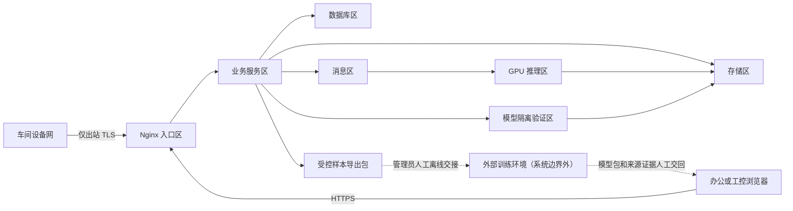

# 安全权限与角色

## 1. 文档职责

本文定义身份、角色、权限、网络边界、数据保护、模型供应链和安全审计。数据库只持久化这些规则，前端只按授权展示。在线系统不提供数据集版本管理和内部训练管理能力，相关菜单、人员权限、服务身份和在线依赖均不在本文授权范围内。

## 2. 保护目标

系统需要同时保护：

1. 生产处置不被未授权修改。
2. 原图、人工反馈、样本导出包和模型不被泄露或篡改。
3. 设备和服务身份不能横向访问其他范围。
4. 恶意或损坏模型不能在生产推理环境执行。
5. 审批、复核、发布和回滚可追责。
6. 单个组件被攻破时影响范围可控。

## 3. 身份类型

### 3.1 人员身份

人员使用业务后端本地账号和数据库会话登录。业务系统仅保存带算法标识的
`Argon2id` 密码哈希，禁止保存明文或可逆密码；会话闲置 30 分钟失效且最长
持续 8 小时，网页和人员接口必须同源。

管理员和紧急账号必须启用多因素认证。管理员执行模型发布、批量导出、用户管理等敏感操作时，还必须满足操作级再认证和双人记录要求。

### 3.2 设备身份

每台工控机或采集代理拥有独立设备证书和客户端标识：

- 证书绑定 `device_id` 和 `station_id`。
- 可单独吊销和轮换。
- 不在多台设备共享一个长期密钥。
- 私钥优先放入操作系统证书库或硬件安全模块。

### 3.3 服务身份

后端、推理、模型隔离验证、发布、对象清理和监控分别使用独立服务账号。服务间同时使用双向 TLS 和短期令牌，不能使用人的账号启动后台任务。

外部训练环境位于在线系统边界之外，不分配业务数据库、生产对象存储、消息队列或内部服务调用凭据，也不是在线检测、样本导出、模型验证和模型发布的运行前置条件。

## 4. 角色

业务人员角色只保留以下两个：

| 角色 | 职责 | 明确禁止 |
|---|---|---|
| 生产员工 | 查看授权产线或工位、创建手工批量检测任务、查看批次与逐图结果、提交逐图三按钮反馈、发起允许的重采或重跑 | 用户和设备管理、样本整理与导出、模型上传与发布、修改安全配置、绕过最终处置规则 |
| 管理员 | 具备生产员工能力，并负责用户、设备、配置、样本整理与导出、外部模型直接上传、隔离验证、发布、回滚、审计和故障处理 | 绕过资源状态、不可篡改、双人审批、来源证据或审计约束 |

双人控制不是第三种角色。需要职责分离时，由两个不同的管理员账号分别发起和批准，系统记录账号、时间、原因和审批链。服务身份不是人员角色，不能登录业务页面。

## 5. 权限模型

采用 `RBAC + 数据范围 + 资源状态`：

- RBAC 决定能执行哪类动作。
- 数据范围限制到组织、产线或工位。
- 资源状态决定动作是否允许，例如已完成的样本导出不可改写、待验证模型不可发布。

原子权限示例：

```text
capture.read
detection.read
image.view
image.download
detection.batch.create
detection.batch.cancel
feedback.submit
sample.curate
sample.export
model.upload
model.validate
model.deploy.request
model.deploy.approve
model.deploy.execute
model.rollback
device.configure
user.manage
audit.read
```

“查看”和“下载”分开授权；能看网页预览不代表能下载原始文件。

第二版契约、后端鉴权和前端路由不得定义 `dataset.*`、`training.*` 或等价的内部数据集版本和训练运行人员权限。

## 6. 关键操作职责分离

| 操作 | 发起 | 必需审批或执行 |
|---|---|---|
| 样本导出 | 管理员申请并冻结导出范围 | 另一管理员确认大批量或敏感导出；导出程序生成不可变清单和哈希 |
| 外部模型包上传 | 管理员直接上传到隔离区 | 自动执行格式、完整性、来源证据和安全检查，不得直接进入生产模型区 |
| 生产模型发布 | 管理员申请 | 另一管理员批准，系统仅发布已通过隔离验证的模型 |
| 生产回滚 | 管理员发起 | 紧急时先执行后补审计，正常时由另一管理员确认 |
| 最终质量覆盖 | 管理员 | 必填原因，高风险操作由另一管理员确认 |
| 大批量原图下载 | 管理员申请 | 另一管理员确认范围和有效期 |
| 证书和密钥轮换 | 管理员 | 自动审计，高权限根密钥由另一管理员复核 |

同一人员不能同时完成相互制衡的发起和最终批准。

## 7. 网络分区



要求：

- 车间设备不能直连数据库、RabbitMQ 或模型注册表。
- 浏览器不能直连数据库和内部推理接口。
- 推理区不能任意访问互联网。
- 外部训练环境不能直连业务数据库、生产对象存储、RabbitMQ、推理服务或模型验证服务；样本和模型只能以受审计文件包人工交接。
- 在线生产运行不得依赖外部训练平台的可用性、回调、账号或任务状态。
- 管理端点只允许监控或运维网络访问。
- 防火墙采用默认拒绝和最小端口白名单。

## 8. 传输与接口安全

- 外部和内部连接均使用 TLS。
- 采集端使用设备证书，用户使用本地安全会话，服务使用双向 TLS 和服务令牌。
- Nginx 限制请求体、连接数、速率和超时。
- 图片不经 JSON Base64 上传。
- 上传授权绑定对象键、大小、类型、哈希和短有效期。
- 防止服务端请求伪造：对象地址由后端生成，推理服务不接受任意 URL。
- 所有写接口要求幂等键或乐观锁。
- 跨站请求、内容安全策略、点击劫持和安全响应头统一配置。

## 9. 图片和数据安全

- 桶默认私有，禁止匿名列举和读取。
- 原图、人工反馈、样本导出包、隔离模型包和已发布模型分别使用最小权限账号。
- 浏览器签名地址短时有效且只读。
- 数据库和对象存储启用静态加密。
- 测试环境不直接复制生产数据。
- 导出带申请、范围、到期时间、水印或追踪标识。
- 删除必须经过保留期和引用检查。
- 外部训练环境不持有生产对象存储凭据，只能接收按审批范围生成的样本导出包。

当前项目主要是工业图片，仍应按企业敏感生产数据管理。

## 10. 模型供应链安全

### 10.1 当前风险

当前 `load_saved_model` 为兼容历史 Keras JSON 调用了不安全反序列化开关。恶意模型结构可能触发不期望行为，因此：

- 仅管理员可通过“直接上传”入口提交外部模型包，上传对象先进入隔离区。
- 模型包必须有 SHA-256 清单；有签名时必须验证签名和证书链。
- 自定义层和对象采用白名单。
- 模型加载在无业务数据库、消息队列、生产写凭据和任意网络权限的隔离容器中。
- 上传完成只表示文件接收成功，不能触发直接加载、发布或切换。

### 10.2 发布检查

- 外部来源证据完整，包括提供方、生成时间、模型版本、适用范围、评估摘要、软件环境和制品哈希；证据缺失时进入 `HOLD`。
- 文件哈希、签名和软件物料清单通过。
- 框架和插件版本在允许列表。
- 固定样例和安全扫描通过。
- 模型包不包含脚本、共享库或未声明文件。
- 发布审批和回滚目标完整。

模型元数据不得要求内部数据集版本或内部训练运行外键。外部报告可以作为不可变附件和审计证据，但不能被解释为系统内训练任务。

### 10.3 运行时

- 容器非特权运行。
- 根文件系统只读，临时目录限额。
- 限制 CPU、内存、显存和进程。
- 模型桶只读挂载或按对象精确读取。
- 禁止模型运行时下载依赖。

## 11. 密钥和配置

- 密钥、数据库密码、对象存储密钥和证书不提交 Git。
- 使用企业密钥管理、机密管理或容器机密。
- 密钥按服务和环境隔离。
- 设定轮换、吊销和泄露响应流程。
- 日志和错误报文自动脱敏。
- 配置文件只保存密钥引用。
- 默认账号、示例密码和调试后门上线前全部移除。

## 12. 数据库安全

- 后端、迁移、只读报表、备份和审计导出使用不同数据库角色。
- 应用账号无建库、超级用户和任意文件权限。
- 推理服务和模型隔离验证服务不直连业务数据库。
- 外部训练环境不发放业务数据库、生产对象存储、RabbitMQ 或内部服务凭据。
- 生产人工查询通过审计的只读入口。
- 高风险表启用额外审计。
- 备份加密，恢复账号与日常应用账号分离。

## 13. 前端安全

- 令牌优先保存在安全 Cookie 或受身份库保护的内存中，不存长期本地存储。
- 不在 URL、日志或错误消息中放令牌和签名地址。
- 所有富文本和文件名转义，防止脚本注入。
- 图片展示验证媒体类型，不直接执行 SVG 或 HTML 上传内容。
- 权限按钮隐藏只是体验优化，不能替代后端鉴权。
- 复核草稿不保存不必要的全分辨率原图。

## 14. 审计事件

必须审计：

- 登录、失败登录、令牌和证书吊销。
- 用户、角色、范围和设备变更。
- 采集配置、处置规则和监控阈值变更。
- 复核提交、升级、覆盖和纠错。
- 样本候选项纳入或排除、样本导出申请和导出完成。
- 模型直接上传、隔离验证、来源证据补录和验证失败。
- 模型灰度、发布、回滚和隔离。
- 图片下载、批量导出和删除。
- 死信回灌、任务重跑和手工状态修复。
- 密钥轮换和紧急账号使用。

审计记录只追加，并定期导出到防篡改存储。

## 15. 紧急账号

紧急账号默认禁用或密封保管：

- 使用时必须多因素认证。
- 权限有明确到期时间。
- 每次使用实时通知安全和业务负责人。
- 所有操作全量审计。
- 事后必须复盘并轮换凭据。

紧急权限不能用于绕过模型质量审批或伪造生产结论。

## 16. 漏洞和依赖

- 依赖锁定并生成软件物料清单。
- 持续扫描 Python、Java、Node、容器和操作系统漏洞。
- 生产镜像使用最小基础镜像并定期重建。
- 安全补丁先在兼容环境验证现有模型。
- 已停止维护或许可证不适合生产的组件不能作为默认基线。
- 第三方相机软件开发包记录版本、许可证和哈希。

## 17. 安全验收

1. 设备证书被吊销后不能上传或查询。
2. 生产员工不能整理或导出样本、上传或发布模型、管理用户和下载未授权原图。
3. 一个管理员账号不能独自完成要求双人控制的模型发布或大批量导出。
4. 权限表、会话、菜单和接口中不存在数据集版本或内部训练运行的人员权限。
5. 推理服务和模型隔离验证服务不能访问业务数据库；外部训练环境没有任何在线生产凭据。
6. 外部训练平台停机时，产线检测、手工批量检测、历史查询、样本整理和既有模型推理仍正常工作。
7. 篡改模型、图片、样本导出清单或结果哈希会被拒绝和报警。
8. 签名地址过期或越权访问失败。
9. 日志中没有令牌、私钥和图片内容。
10. 容器无特权、只读根文件系统和资源上限生效。
11. 紧急账号使用可被实时发现和完整追溯。
12. 从审计记录可还原一次反馈、样本导出、模型发布和回滚的完整责任链。
