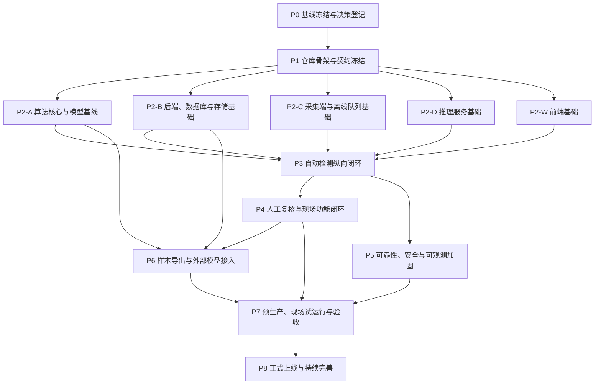

# 系统分阶段构建与智能体任务计划

> **版本替代说明（文档版本 1.1.0，2026-08-02）**
>
> 本版执行 [DOC-16 1.1.0](16-手工批量检测与管理简化需求规格.md) 和 [ADR-0003](decisions/ADR-0003-取消内置数据集与训练管理.md)。旧版 `P6-01` 至 `P6-08` 中的数据集创建、冻结、批准、版本差异、内部训练任务、调度、进度、日志及其页面、权限、写接口、事件和在线流水线语义全部取消，不得继续执行。任务编号仅为追踪兼容而保留，任务内容已整体替换为“历史资产只读清点、待整理样本与导出、外部模型直接上传、隔离验证、发布与回滚”。冲突时以 DOC-16 1.1.0 和 ADR-0003 为准。

## 1. 文档目的

本文把 [README](README.md)、`01` 至 `14` 号设计文档以及 DOC-16 需求规格转化为可由智能体逐项执行的系统建设计划。计划解决四个问题：

1. 明确先做什么、后做什么，以及哪些模块可以并行。
2. 把每项工作限制在清晰的目录和所有权边界内，降低多智能体并行冲突。
3. 为每个任务给出可重复执行的验证方法、通过标准和证据要求。
4. 用阶段门禁保证实现始终符合设计文档，而不是在集成末期才发现状态、接口、权限或数据语义不一致。

本文是实施编排文档，不重新定义业务状态、数据库字段、接口或技术选型。发生冲突时，仍以 [README](README.md) 第 5 节指定的唯一负责文档为准；涉及手工批量检测、样本导出、模型直接上传及取消内置数据集和训练管理的范围，以 DOC-16 1.1.0 和 ADR-0003 为最高优先级。

## 2. 建设范围和边界

### 2.1 首期承诺

首期生产闭环只包含：

1. R8 圆形机夹式刀具的合格与不合格二分类。
2. 二值缺陷区域分割，或无标签异常区域提示。
3. 对不确定、技术失败、结果矛盾和抽检样本进行人工复核。
4. 从现场采集、离线补传、中心推理、最终处置、逐图反馈、待整理样本、样本导出到外部模型直接上传、验证和发布的完整可审计链路。

多缺陷类型可作为人工受控标签保存，但在外部来源证据、固定样例验证和发布证据完整前，不得向用户表述为算法已具备的识别能力。

### 2.2 当前可复用基线

- 当前 `src/tool_defect`、命令行入口、推理、评估和环形预处理能力先保持可用；历史训练工具只能作为系统边界外的只读研究资产，不得被在线服务、页面或部署依赖。
- 180 张原始研究样本和 172 张无泄漏重训练样本分别作为只读历史研究基线，不创建在线数据集版本。
- 34 张固定测试样本作为现阶段模型配对比较基线，不作为车间全场景上线充分证据。
- `outputs/training` 下三组可加载双任务产物需要分别校验、评估并通过“直接上传”进入隔离区；该历史目录不是在线模型事实源。
- 现有极坐标模型版本为 1，代码要求版本 2，重新标定前不得登记为可部署模型。
- 旧 PyQt 界面只作交互参考，不进入生产采集或生产前端。

### 2.3 明确不在首期默认范围

- 不建设边缘离线推理或离线人工复核。
- 不把 Spring Boot 模块拆成多个业务微服务。
- 不因“将来可能扩容”提前引入 Kubernetes。
- 不建设数据集创建、冻结、批准、版本差异页面及对应第二版写接口和事件。
- 不建设内部训练任务创建、调度、进度、日志页面及对应第二版写接口和事件。
- 不提供数据集版本、训练运行相关菜单、人员权限、服务身份或在线业务状态。
- 不部署内部训练流水线；外部训练环境不持有业务数据库、生产对象存储、消息队列或内部服务凭据，生产运行不依赖其可用性。
- 不把图片、模型权重或大数组写入数据库、队列或 Git。
- 不允许采集端、前端或算法插件自行产生最终 `PASS` 或 `FAIL`。
- 不在现场参数未确认时把相机、PLC、节拍、阈值、保留期或高可用方案写死。

## 3. 实施总原则

### 3.1 契约先行

网络字段、状态枚举和事件结构先进入 `contracts/`，再由 Java、Python 和 TypeScript 消费。任何跨进程字段变更先修改源契约、兼容性测试和示例，不能先在某个服务中私自增加另一套定义。

### 3.2 事实不可变

- PostgreSQL 是业务事实源。
- S3 兼容对象存储是图片、样本导出包、隔离模型包和已发布模型文件事实源。
- PostgreSQL 模型元数据与 S3 不可变模型包共同形成在线模型版本事实源。
- RabbitMQ、SQLite、浏览器状态和缓存只保存消息或投影。
- 算法结果、人工结论、最终处置和历史修订只能追加，不能相互覆盖。

### 3.3 安全失败

图片损坏、模型缺失、预处理失败、推理超时、校验冲突和中心状态未知都必须形成 `HOLD`、复核或明确失败，绝不能转换为 `PASS`。

### 3.4 任务级依赖优先于阶段编号

阶段编号表示产品成熟度，不表示所有后续工作都必须等待前一阶段全部结束。某任务的前置依赖全部完成后即可启动。例如历史数据清单和现有模型评估可以在在线业务闭环建设期间并行执行。

### 3.5 一个任务一个主要所有权区

同一时间不得安排两个智能体修改同一契约文件、同一数据库迁移序列或同一模块核心文件。跨模块工作应拆成：

1. 契约变更任务。
2. 各消费方实现任务。
3. 独立集成验证任务。

## 4. 智能体任务执行规范

### 4.1 任务开始前

执行智能体必须：

1. 阅读任务列出的来源文档和前置任务交付物。
2. 确认前置任务已经通过对应门禁，不只检查文件是否存在。
3. 检查工作区已有改动，不覆盖或清理其他任务成果。
4. 列出本任务允许修改的目录；需要越界时先拆出契约任务或请求协调。
5. 记录无法从仓库确认的现场参数，并以配置项或决策记录处理，不自行猜测生产值。

### 4.2 每个任务的完成定义

一个任务只有同时满足以下条件才能标记为完成：

- 代码、迁移、配置模式、测试和必要文档全部提交。
- 新增行为有自动化测试；修复缺陷有失败复现测试。
- 所列验证命令全部返回成功。
- 通过标准逐项有证据，不能用“已实现”“看起来正常”代替。
- 没有把密钥、图片、模型权重、签名地址或大体积生成物提交到 Git。
- 错误路径遵守安全失败原则，技术异常不会产生 `PASS`。
- 日志、指标、审计和权限要求按任务范围落实。
- 生成物可从锁定依赖、配置和源文件重复生成。
- 变更没有破坏现有 `src/tool_defect` 命令行和测试基线，除非任务明确负责兼容迁移。

### 4.3 验证证据

每个任务的交付说明至少记录：

```text
任务编号：
代码提交：
来源文档：
修改目录：
验证环境：
执行命令：
命令结果：
测试报告或制品位置：
已知限制：
后续任务可依赖的稳定接口：
```

持续集成生成的机器可读报告放入构建产物，不把大报告直接提交 Git。涉及数据、模型、图片或备份时，证据必须包含数量、总字节数、SHA-256 和失败清单。

### 4.4 统一验证入口

阶段 `P1` 建立以下稳定入口，后续任务不得各自发明同义命令：

| 命令 | 作用 |
|---|---|
| `make verify-layout` | 校验仓库边界、禁止文件和生成物位置 |
| `make verify-contracts` | 校验 OpenAPI、异步接口、JSON 模式、示例和兼容性 |
| `make test-core` | Python 核心计算、现有命令行和模型兼容测试 |
| `make test-edge` | 采集、SQLite、本地缓存、同步和硬件模拟测试 |
| `make test-inference` | 插件、运行槽、对象校验、队列消费和结果规范化测试 |
| `make test-backend` | Java 领域、接口、数据库迁移、权限和事务测试 |
| `make test-web` | Vue 类型、单元、组件和可访问性测试 |
| `make test-integration` | PostgreSQL、RabbitMQ、对象存储和跨服务集成测试 |
| `make test-e2e` | 从触发到自动或人工最终处置的端到端测试 |
| `make test-faults` | 断网、重复消息、进程崩溃、死信和恢复测试 |
| `make test-security` | 鉴权、越权、签名、哈希、密钥和容器安全测试 |
| `make test-performance` | 节拍、吞吐、资源、容量和稳定性测试 |
| `make verify-data` | 历史冻结研究数据的清单、重复、冲突、泄漏、来源和哈希完整性审计；不代表在线数据集管理或样本导出通过 |
| `make verify-models` | 历史模型制品的签名、输入输出、固定样例和兼容性审计；不代表外部模型供应链通过 |
| `make verify-sample-export` | 样本候选、导出作业、清单、哈希、权限、审计以及缺失对象安全失败验证；由 `P6` 新增 |
| `make verify-model-supply` | 模型直接上传、隔离解包、安全校验、来源互斥、双管理员启用和回退验证；由 `P6` 新增 |
| `make verify-online-without-training` | 在无数据集构建、训练服务、训练凭据和训练网络依赖的拓扑下验证在线检测、样本导出和模型上传；由 `P6` 新增 |
| `make verify-all` | 按持续集成顺序执行当前阶段全部必需验证；不得启动或要求研究训练环境可用 |

这些入口是编排层，底层仍使用 `pytest`、Maven、Vitest、Playwright、Testcontainers 等对应工具。工控机真实硬件测试另提供受控的 Windows 或 Linux 现场脚本，不能用模拟器结果替代。

## 5. 阶段依赖总览



推荐的并行方式：

- `P2-A`、`P2-B`、`P2-C`、`P2-D`、`P2-W` 在契约冻结后并行。
- `P3` 完成后，`P4` 和 `P5` 可以分工作流并行。
- `P6` 的历史资产只读清点、现有模型验证可以在 `P3`、`P4` 建设期间提前启动；生产样本整理与导出必须等待逐图反馈闭环。外部模型直接上传不依赖样本导出完成。
- `P7` 必须等待业务闭环、可靠性门禁和模型闭环共同完成。

## 6. P0：基线冻结与决策登记

### 阶段目标

保护当前可复用资产，确认未知项不会被智能体误写成生产事实，并建立需求追踪基线。

### P0-01 当前代码、数据和模型资产清单

- **前置依赖**：无。
- **主责目录**：现有仓库只读扫描；新增 `tests/fixtures/baseline/` 和基线报告。
- **来源文档**：[README](README.md)、[01](01-核心设计原则.md)、[08](08-增量训练闭环.md)、[13](13-推荐项目代码结构.md)。
- **交付物**：
  - 代码、配置、180 样本、172 样本清单、34 张测试集和三组双任务产物的清单。
  - 文件数量、大小、SHA-256、模型输入输出和环境版本报告。
  - 明确记录分类权重缺失、极坐标版本不兼容和历史模型来源不完整三个阻断项。
  - 冻结当前测试结果，不移动或删除原目录。
- **验证**：
  - 运行当前 `python -m unittest discover -s tests`。
  - 对清单重新计算两次，输出必须一致。
  - 文档列出的三组模型哈希和 180、172、34 三组数量必须一致。
- **通过标准**：所有资产能由相对路径和 SHA-256 唯一定位；差异进入失败清单；没有修改现有数据和模型文件。

### P0-02 现场参数与架构决策登记

- **前置依赖**：无，可与 `P0-01` 并行。
- **主责目录**：`Docs/decisions/`、配置模式示例。
- **来源文档**：[README](README.md) 第 6 节、[07](07-图片存储方案.md)、[11](11-日志与监控.md)、[14](14-技术选型.md)。
- **交付物**：
  - 相机与 PLC、工控机系统、节拍、延迟、离线时长、容量、阈值、复核时限、保留期、恢复目标、身份系统和对象存储的决策登记表。
  - 每一项标明“已确认”“暂定默认值”“上线阻断”或“可后置”。
  - 未确认项映射到配置键、负责人和最迟确认门禁。
- **验证**：配置模式校验通过；仓库扫描确认生产代码中没有散落的未登记硬编码值。
- **通过标准**：所有未知项都有默认安全行为；未知阈值不会导致自动 `PASS`；上线阻断项明确归入 `P7`。

### P0-03 需求到验收追踪矩阵

- **前置依赖**：`P0-01`、`P0-02`。
- **主责目录**：`Docs/traceability/`、测试元数据。
- **来源文档**：`01` 至 `14` 号设计文档、DOC-16 1.1.0 和已接受的架构决策记录。
- **交付物**：
  - 直接采用 DOC-16 的正式需求编号，并为旧设计文档中尚未覆盖的“必须、不得、验收”要求补充分组编号。
  - 映射到本计划任务、自动化测试、人工验收或现场决策。
  - 对只能人工或现场验证的要求说明原因，不能伪造自动化覆盖。
- **验证**：检查所有设计文档均有映射；所有上线前置要求均指向至少一个门禁；所有测试均能反向指向需求。
- **通过标准**：不存在未归属的强制要求，不存在没有来源文档的生产规则。

### G0 阶段门禁

- 当前命令行与测试基线可重复。
- 数据和模型资产有不可变清单。
- 未知现场参数都有状态、配置键和负责人。
- `01` 至 `14`、DOC-16 和已接受的范围裁决决策全部进入需求追踪矩阵。

## 7. P1：仓库骨架与契约冻结

### 阶段目标

在不搬动现有算法核心的前提下建立目标仓库骨架、单一契约源和统一验证入口。

### P1-01 单仓骨架与依赖边界

- **前置依赖**：`G0`。
- **主责目录**：根目录、`contracts/`、`apps/`、`services/`、`packages/`、`jobs/`、`database/`、`deploy/`、`tools/`、`tests/`。
- **来源文档**：[13](13-推荐项目代码结构.md)。
- **交付物**：
  - 按目标结构创建空模块、所有权说明、忽略规则和最小构建文件。
  - 保持 `src/tool_defect`、现有命令行和测试可用。
  - 加入架构边界检查，禁止后端导入 Python 算法、推理直连业务数据库、前端复制处置规则。
- **验证**：`make verify-layout` 和当前 Python 测试通过。
- **通过标准**：各模块可独立构建；Git 不追踪数据、权重、运行输出和密钥；没有一次性移动现有核心代码。

### P1-02 领域词汇、状态和标准结果模式

- **前置依赖**：`P1-01`。
- **主责目录**：`contracts/json-schema/`、`contracts/examples/`。
- **来源文档**：[02](02-完整检测业务流程.md)、[03](03-算法与预处理通用接口设计.md)、[05](05-数据库设计.md)、[10](10-异常处理.md)。
- **交付物**：
  - `capture_id`、`detection_task_id`、`attempt_id`、`review_task_id` 等统一词汇。
  - 中央采集、执行、算法结论、业务处置、复核、对象和模型状态枚举。
  - 标准检测结果、标准错误对象、图片引用和版本字段模式。
  - 合法与非法状态转换测试向量。
- **验证**：模式和全部示例通过校验；非法枚举、概率越界、空版本、掩膜引用缺失和错误状态转换必须失败。
- **通过标准**：三层状态不能混用；插件结果中无法出现 `PASS` 或 `FAIL`；网络结果不包含大数组或本地绝对路径。

### P1-03 HTTP 接口契约

- **前置依赖**：`P1-02`。
- **主责目录**：`contracts/openapi/`、`contracts/examples/http/`。
- **来源文档**：[06](06-接口设计.md)、[12](12-安全权限与角色.md)。
- **交付物**：
  - 采集端、用户业务、内部推理、图片访问、复核、手工批量检测、逐图反馈、样本导出、模型直接上传和模型发布接口的 OpenAPI 3.1 定义。
  - 幂等键、乐观锁、游标分页、短时图片授权、错误码和鉴权要求。
  - 每个写接口至少一个成功、重复、冲突、无权和校验失败示例。
- **验证**：OpenAPI 语法、示例和向后兼容检查通过；生成的客户端可编译。
- **通过标准**：接口字段与状态文档一致；未知请求字段默认拒绝；图片不以 Base64 进入 JSON。

第二版契约不得包含数据集版本或内部训练运行写接口及事件；兼容期第一版遗留能力只能只读或显式退役。

### P1-04 推理事件与消息契约

- **前置依赖**：`P1-02`，可与 `P1-03` 并行。
- **主责目录**：`contracts/asyncapi/`、`contracts/json-schema/`、`contracts/examples/events/`。
- **来源文档**：[05](05-数据库设计.md)、[06](06-接口设计.md)、[10](10-异常处理.md)、[11](11-日志与监控.md)。
- **交付物**：
  - 推理任务事件、发件箱事件和追踪头定义。
  - 消息标识、任务引用、流水线版本、对象引用、哈希和截止时间。
  - 持久投递、手动确认、重复消息和死信语义说明。
- **验证**：事件示例通过模式校验；消息中出现图片二进制、任意网址、缺少哈希或缺少版本时校验失败。
- **通过标准**：消息只传引用；`message_id` 与 `detection_task_id` 都可用于幂等；追踪上下文可跨队列传递。

### P1-05 生成客户端与契约兼容流水线

- **前置依赖**：`P1-03`、`P1-04`。
- **主责目录**：`packages/python-contracts/`、`packages/java-contracts/`、`packages/typescript-contracts/`、`tools/generate-contracts/`。
- **来源文档**：[06](06-接口设计.md)、[13](13-推荐项目代码结构.md)。
- **交付物**：
  - 可重复的 Java、Python 和 TypeScript 类型生成。
  - 生成文件头包含源契约版本，禁止手工修改。
  - 契约兼容、消费者契约和生成物漂移检查。
- **验证**：连续生成两次无差异；三个语言包均能编译；破坏性字段变更测试会阻断。
- **通过标准**：网络类型只有一个源；生成命令不依赖个人机器绝对路径。

### P1-06 统一构建、持续集成和开发测试环境

- **前置依赖**：`P1-01`、`P1-05`。
- **主责目录**：根构建入口、持续集成配置、`deploy/compose/`、`deploy/environments/development/`。
- **来源文档**：[12](12-安全权限与角色.md)、[13](13-推荐项目代码结构.md)、[14](14-技术选型.md)。
- **交付物**：
  - 第 4.4 节全部统一验证入口。
  - Python、Java、Node 和容器依赖锁定。
  - PostgreSQL、RabbitMQ、S3 兼容测试替身和可观测组件的开发环境。
  - 示例配置只含无敏感默认值，密钥通过环境机密注入。
- **验证**：干净环境可执行最小构建；依赖锁和软件物料清单生成成功；密钥扫描无发现。
- **通过标准**：任一智能体都能用文档化命令重建环境；生产镜像不使用可变 `latest` 作为发布依据。

### G1 阶段门禁

- 仓库边界和统一构建入口稳定。
- OpenAPI、异步接口和标准结果模式冻结为目标 `v2`，并通过“无数据集版本和内部训练运行写接口、事件”的负向契约检查。
- Java、Python 和 TypeScript 类型均从契约生成。
- 契约示例、兼容性和密钥扫描进入持续集成。

## 8. P2：五条基础工作流并行建设

### 阶段目标

在冻结契约之上并行完成算法、业务后端、采集端、推理端和前端的可独立测试基础。

### 8.1 P2-A：算法核心与模型基线

#### P2-A01 插件开发包和统一内存对象

- **前置依赖**：`G1`。
- **主责目录**：`services/inference-service/.../plugins/`、`packages/tool-defect-core/` 的新增兼容层。
- **来源文档**：[03](03-算法与预处理通用接口设计.md)、[13](13-推荐项目代码结构.md)。
- **交付物**：插件描述符、版本兼容、`FrameBundle`、`PreparedBatch`、`AlgorithmOutput`、运行上下文、生命周期和错误转换。
- **验证**：描述符、配置、主版本不兼容、确定性、关闭和异常分类单元测试。
- **通过标准**：插件不访问网络、业务数据库或队列；算法输出只能是 `QUALIFIED`、`UNQUALIFIED`、`INCONCLUSIVE`。

#### P2-A02 现有预处理和算法适配器

- **前置依赖**：`P2-A01`。
- **主责目录**：`services/inference-service/.../plugins/preprocessors/`、`.../algorithms/`，现有核心仅做受测试保护的必要改造。
- **来源文档**：[03](03-算法与预处理通用接口设计.md)。
- **交付物**：
  - 基础灰度缩放、自适应环形、边界归一化和极坐标降噪预处理适配器。
  - 双任务和极坐标异常算法适配器。
  - 几何变换链、坐标回映和缓存键。
- **验证**：固定输入确定性、非法图像、图像与掩膜同步变换、原图坐标回映、缓存命中失效和损坏重建测试。
- **通过标准**：保留现有像素和类别映射；`REJECTED` 不执行算法；不合格空掩膜保留结论并产生警告。

#### P2-A03 模型包、校验和隔离加载

- **前置依赖**：`P2-A01`、`P1-06`。
- **主责目录**：`services/inference-service/.../model_runtime/`、`tools/verify-artifacts/`。
- **来源文档**：[03](03-算法与预处理通用接口设计.md)、[08](08-增量训练闭环.md)、[12](12-安全权限与角色.md)。
- **交付物**：模型清单、标签、预处理、环境、校验和、签名、白名单、固定样例预热和隔离加载器。
- **验证**：篡改文件、混配结构与权重、错误输出名、错误类别映射、错误框架版本、未知自定义对象和无签名包全部被拒绝。
- **通过标准**：只加载登记且哈希匹配的可信包；加载进程没有业务凭据和任意网络权限。

#### P2-A04 三组现有双任务模型技术评估

- **前置依赖**：`P0-01`、`P2-A02`、`P2-A03`。
- **主责目录**：`jobs/model-evaluator/`、受控评估输出。
- **来源文档**：[03](03-算法与预处理通用接口设计.md)、[08](08-增量训练闭环.md)。
- **交付物**：三组模型的独立模型包草稿、34 张相同测试集逐图结果、分类与分割指标、置信区间、性能和资源报告。
- **验证**：`make verify-models`；模型结构和权重不能跨目录混配；重复评估在定义容差内一致。
- **通过标准**：每个候选版本可单独追溯；只产生“测试候选”，不因目录名或研究指标直接标记为生产模型。

### 8.2 P2-B：业务后端、数据库和文件基础

#### P2-B01 模块化单体与领域边界

- **前置依赖**：`G1`。
- **主责目录**：`services/business-api/`。
- **来源文档**：[01](01-核心设计原则.md)、[13](13-推荐项目代码结构.md)、[14](14-技术选型.md)。
- **交付物**：采集、检测、复核、存储、样本整理与导出、模型、设备、身份和审计模块骨架及架构边界测试。
- **验证**：`make test-backend`；领域层不得依赖 Spring、数据库或队列；模块不得直接访问其他模块数据访问层。
- **通过标准**：应用能启动并暴露受限健康端点；模块依赖方向符合设计。

#### P2-B02 首批数据库迁移与约束

- **前置依赖**：`P2-B01`、`P1-02`。
- **主责目录**：`services/business-api/src/main/resources/db/migration/`、`database/reference-data/`。
- **来源文档**：[02](02-完整检测业务流程.md)、[05](05-数据库设计.md)。
- **交付物**：组织设备、采集图片、检测、处置复核、样本候选与导出、模型元数据、身份审计、发件箱和收件箱表及索引。
- **验证**：
  - 空库迁移、已有版本向前迁移和隔离环境恢复测试。
  - 唯一键、外键、概率范围、版本锁、追加事实和 `FINALIZED` 约束测试。
- **通过标准**：数据库拒绝重复业务结果和非法投影；图片、样本导出包和模型文件只存引用与哈希；不存在在线数据集版本或内部训练运行写模型。

#### P2-B03 S3 兼容存储适配和上传确认

- **前置依赖**：`P2-B01`、`P2-B02`、`P1-03`。
- **主责目录**：`services/business-api/.../storage/`、`tests/integration/storage/`。
- **来源文档**：[06](06-接口设计.md)、[07](07-图片存储方案.md)、[12](12-安全权限与角色.md)。
- **交付物**：桶与对象键策略、受控上传授权、`STAGING -> AVAILABLE`、大小和 SHA-256 校验、短时只读访问授权。
- **验证**：重复确认同内容成功、不同内容冲突、过期授权失败、越权工位失败、对象缺失和压缩炸弹测试。
- **通过标准**：浏览器无长期存储凭据；对象键不含姓名和最终标签；业务只能引用 `AVAILABLE` 对象。

#### P2-B04 发件箱、收件箱和可靠消息基础

- **前置依赖**：`P2-B01`、`P2-B02`、`P1-04`。
- **主责目录**：`services/business-api/.../shared/`、`.../detection/`、消息集成测试。
- **来源文档**：[05](05-数据库设计.md)、[06](06-接口设计.md)、[10](10-异常处理.md)。
- **交付物**：同事务发件箱、批量领取、发布确认、收件箱幂等、持久队列、手动确认和死信拓扑。
- **验证**：数据库提交后发布失败可补发；重复发布和重复消费不产生重复业务结果；死信不会自动无限回灌。
- **通过标准**：业务事实不依赖队列查询；故障恢复后消息至少一次送达且业务效果至多一次。

### 8.3 P2-C：采集端和离线队列基础

#### P2-C01 SQLite、本地目录和原子落盘

- **前置依赖**：`G1`。
- **主责目录**：`apps/edge-agent/.../local_queue/`、`.../capture/`、`apps/edge-agent/migrations/`。
- **来源文档**：[01](01-核心设计原则.md)、[02](02-完整检测业务流程.md)、[07](07-图片存储方案.md)。
- **交付物**：本地队列表、目录状态、临时写入、同步、原子改名、启动扫描、隔离和清理规则。
- **验证**：进程在写文件和写 SQLite 各阶段被终止后的恢复测试；WAL、外键、忙等待和完整性检查测试。
- **通过标准**：未上传、重试中或中心状态未知的原图永不自动删除；SQLite 不保存最终业务事实。

#### P2-C02 触发、相机适配端口和模拟器

- **前置依赖**：`P2-C01`。
- **主责目录**：`apps/edge-agent/.../adapters/`、`tests/fixtures/devices/`。
- **来源文档**：[02](02-完整检测业务流程.md)、[13](13-推荐项目代码结构.md)、[14](14-技术选型.md)。
- **交付物**：标准 `TriggerAdapter`、`CameraAdapter`、去抖、序列检查、独立图片标识和可重复的 PLC/相机模拟器。
- **验证**：重复触发、序号跳变、相机繁忙、无图、全黑、损坏图和连续单图采集测试。
- **通过标准**：厂商软件开发包不渗透到同步逻辑；质量不合格图片仍保留并标记，不能静默丢弃。

#### P2-C03 同步、退避、对账和心跳客户端

- **前置依赖**：`P2-C01`、`P1-03`、`P1-05`。
- **主责目录**：`apps/edge-agent/.../sync/`、`.../health/`。
- **来源文档**：[02](02-完整检测业务流程.md)、[06](06-接口设计.md)、[10](10-异常处理.md)、[11](11-日志与监控.md)。
- **交付物**：生成客户端封装、幂等键、上传授权续期、退避抖动、批量对账、结果轮询和设备心跳。
- **验证**：模拟断网、超时、`429`、`503`、授权过期、回调丢失、重复响应和中心状态领先本地状态。
- **通过标准**：重试保持原 `capture_id`；对账只推进本地投影；采集端只展示后端的最终业务处置。

### 8.4 P2-D：推理服务基础

#### P2-D01 推理编排、运行槽和服务健康

- **前置依赖**：`P1-04`、`P1-05`、`P2-A01`、`P2-A03`。
- **主责目录**：`services/inference-service/`。
- **来源文档**：[03](03-算法与预处理通用接口设计.md)、[06](06-接口设计.md)、[10](10-异常处理.md)、[11](11-日志与监控.md)。
- **交付物**：消费者外壳、对象物化、插件编排、运行槽、预热、资源限制、内部健康和标准结果回调客户端。
- **验证**：模型未预热时不就绪；主版本不兼容不加载；单槽串行；取消和关闭释放临时资源；CPU 与 GPU 配置可分离。
- **通过标准**：推理服务不直连业务数据库；队列确认只能发生在后端接受结果之后。

### 8.5 P2-W：前端基础

#### P2-W01 前端壳、鉴权、权限和统一请求层

- **前置依赖**：`P1-03`、`P1-05`、`P1-06`。
- **主责目录**：`apps/web-console/`。
- **来源文档**：[09](09-前端功能规划.md)、[12](12-安全权限与角色.md)、[14](14-技术选型.md)。
- **交付物**：Vue 3 与 TypeScript 工程、生成客户端、令牌刷新、请求标识、错误码、路由守卫、权限菜单、服务器发送事件和通用布局。
- **验证**：类型检查、单元测试、未授权路由测试、令牌和签名地址不落长期存储测试。
- **通过标准**：前端不保存业务处置规则；隐藏按钮不能替代后端鉴权；1920×1080 基础布局可用。

### G2 阶段门禁

- 五条工作流均可独立构建和测试。
- 现有命令行仍可用，算法插件已通过确定性与坐标测试。
- 数据库可从空库迁移，存储和消息基础通过集成测试。
- 采集端可在模拟硬件下原子落盘并离线排队。
- 推理服务只加载可信模型包，前端只使用生成契约。

## 9. P3：自动检测纵向闭环

### 阶段目标

打通“模拟触发 -> 本地落盘 -> 中心上传 -> 可靠消息 -> 推理 -> 自动处置 -> 工位显示”的第一条完整生产路径。

### P3-01 采集初始化、图片确认和检测提交

- **前置依赖**：`P2-B02`、`P2-B03`、`P2-B04`。
- **主责目录**：`services/business-api/.../capture/`。
- **来源文档**：[02](02-完整检测业务流程.md)、[05](05-数据库设计.md)、[06](06-接口设计.md)。
- **交付物**：采集创建、图片确认、检测提交、批量对账和心跳接口及中央采集状态机。
- **验证**：相同幂等键同内容返回首个结果，不同内容返回冲突；必需图片未校验不能进入 `READY`；`FINALIZED` 不能原位修改。
- **通过标准**：提交检测在一个事务内更新采集状态、锁定流水线、创建任务和写发件箱。

### P3-02 检测任务、执行尝试和结果接受

- **前置依赖**：`P3-01`、`P2-B04`。
- **主责目录**：`services/business-api/.../detection/`。
- **来源文档**：[02](02-完整检测业务流程.md)、[05](05-数据库设计.md)、[06](06-接口设计.md)。
- **交付物**：任务、尝试、结果、派生对象确认、失败回调和内部接口。
- **验证**：重试只新增 `attempt_id`；同一尝试相同结果哈希重复成功，不同哈希冲突报警；同一任务最多一个接受结果。
- **通过标准**：`SUCCEEDED`、算法结论和业务处置分别保存；失败尝试永久可追溯。

### P3-03 推理完整编排

- **前置依赖**：`P2-D01`、`P2-A02`、`P3-02`。
- **主责目录**：`services/inference-service/.../consumer/`、`.../orchestration/`、`.../storage/`。
- **来源文档**：[02](02-完整检测业务流程.md)、[03](03-算法与预处理通用接口设计.md)、[06](06-接口设计.md)。
- **交付物**：手动确认消费、原图和模型校验、预处理、推理、坐标回映、派生对象上传和幂等结果回调。
- **验证**：重复消息、对象损坏、模型哈希错误、预处理拒绝、插件崩溃、回调暂时失败和结果模式非法测试。
- **通过标准**：后端未接受结果前不确认消息；回调失败只重试回调，不重新推理伪造新结果。

### P3-04 版本化处置规则引擎

- **前置依赖**：`P3-02`。
- **主责目录**：`services/business-api/.../detection/` 的领域规则和策略版本。
- **来源文档**：[01](01-核心设计原则.md)、[02](02-完整检测业务流程.md)、[04](04-人工复核系统.md)。
- **交付物**：技术完整性、预处理质量、一致性、灰区、强制、抽检和自动定案的固定顺序规则。
- **验证**：表驱动覆盖全部分支；技术失败、空掩膜矛盾、高分区域矛盾和多算法冲突均不能自动 `PASS`。
- **通过标准**：只有全部门禁未触发时才映射 `PASS` 或 `FAIL`；每次自动处置记录策略版本、阈值和输入摘要。

### P3-05 采集端在线与断网恢复集成

- **前置依赖**：`P2-C02`、`P2-C03`、`P3-01`。
- **主责目录**：`apps/edge-agent/`。
- **来源文档**：[02](02-完整检测业务流程.md)、[07](07-图片存储方案.md)、[10](10-异常处理.md)。
- **交付物**：模拟设备到中心的完整同步、本地状态推进、结果轮询、磁盘水位和安全暂停。
- **验证**：连续断网采集、乱序补传、重复上传、中心已成功但本地未知、重启恢复和磁盘 80%、90%、95% 水位测试。
- **通过标准**：不丢图、不重复创建中央事实；95% 水位按安全策略暂停新采集，未上传原图仍不删除。

### P3-06 工位页、检测列表和详情

- **前置依赖**：`P2-W01`、`P3-01`、`P3-02`。
- **主责目录**：`apps/web-console/src/features/workstation/`、`.../detections/`、通用图片查看组件。
- **来源文档**：[09](09-前端功能规划.md)。
- **交付物**：工位连接与本地队列状态、当前刀具、最近记录、检测筛选列表、详情、图片分级加载和签名地址刷新。
- **验证**：断线刷新状态不倒退；大图不阻塞页面；签名地址过期可恢复；`PASS`、`FAIL`、`HOLD` 不只靠颜色区分。
- **通过标准**：浏览器关闭不影响采集；前端不重新计算阈值；详细堆栈和长期对象地址不展示。

### P3-07 自动检测端到端与契约回归

- **前置依赖**：`P3-03`、`P3-04`、`P3-05`、`P3-06`。
- **主责目录**：`tests/end-to-end/`、`tests/contract/`。
- **来源文档**：[02](02-完整检测业务流程.md) 第 9 节、[06](06-接口设计.md)、[10](10-异常处理.md)。
- **交付物**：正常合格、正常不合格、空掩膜矛盾、损坏图、断网补传、重复消息、进程崩溃和模型版本锁定场景。
- **验证**：`make verify-contracts test-integration test-e2e`。
- **通过标准**：自动路径在同一 `capture_id` 下可完整追溯；所有技术失败最终均不是 `PASS`。

### G3 阶段门禁

- 自动合格和自动不合格路径端到端通过。
- 不确定和矛盾结果进入 `HOLD` 并生成待复核占位任务。
- 断网、重复消息和回调重试不丢失或重复业务事实。
- 工位页只显示后端最终处置。

## 10. P4：人工复核与现场功能闭环

### 阶段目标

完成 `HOLD` 样本的可审计人工处置，使首期业务从采集到最终结论真正闭环。

### P4-01 复核任务池、认领和租约

- **前置依赖**：`G3`。
- **主责目录**：`services/business-api/.../review/`。
- **来源文档**：[04](04-人工复核系统.md)、[05](05-数据库设计.md)、[06](06-接口设计.md)。
- **交付物**：复核触发、优先级、范围任务池、认领、释放、租约过期和乐观锁。
- **验证**：两人并发认领、租约过期回池、越权工位、优先级非法降低和重复请求测试。
- **通过标准**：只有授权范围可见；租约不改变不可变历史；并发提交不会后写覆盖先写。

### P4-02 复核提交、修订、二审和最终处置

- **前置依赖**：`P4-01`、`P3-04`。
- **主责目录**：`services/business-api/.../review/`、`.../detection/`。
- **来源文档**：[02](02-完整检测业务流程.md)、[04](04-人工复核系统.md)。
- **交付物**：原因码、生产结论、不可变复核记录、修订链、双人盲审、冲突升级和处置投影。
- **验证**：无原因码、停用原因码、同一人二审、双人不一致、纠错修订和 `If-Match` 冲突测试。
- **通过标准**：算法原始结果不被覆盖；关闭任务后仍可恢复全部修订；高风险冲突由管理员处理并记录原因，需要双人控制时由另一管理员确认。

### P4-03 人工掩膜上传与标注完整性

- **前置依赖**：`P2-B03`、`P4-01`。
- **主责目录**：后端复核与存储模块、`td-review` 适配测试。
- **来源文档**：[04](04-人工复核系统.md)、[06](06-接口设计.md)、[07](07-图片存储方案.md)。
- **交付物**：标注上传授权、原图尺寸单通道无损 PNG 校验、暂存确认、新对象修订和孤儿处理挂钩。
- **验证**：尺寸错误、多通道、非法值域、损坏图片、上传成功但提交失败和前一掩膜覆盖尝试测试。
- **通过标准**：模型掩膜、人工掩膜和历史人工掩膜互不覆盖；待整理样本只引用完整可解码标注。

### P4-04 复核任务池和工作台

- **前置依赖**：`P4-01`、`P4-02`、`P4-03`、`P3-06`。
- **主责目录**：`apps/web-console/src/features/reviews/`、`components/image-workbench/`。
- **来源文档**：[04](04-人工复核系统.md)、[09](09-前端功能规划.md)。
- **交付物**：优先级任务池、租约倒计时、原图优先查看、叠加开关、画笔橡皮、撤销重做、草稿、原因和提交冲突界面。
- **验证**：默认关闭模型叠加；双人盲审隐藏前一答案；草稿不形成业务提交；刷新和租约过期可恢复。
- **通过标准**：不能在原图访问失败时提交；标注尺寸和值域在浏览器和后端双重校验。

### P4-05 完整角色、数据范围和审计链

- **前置依赖**：`P2-B01`、`P2-W01`、`P4-02`。
- **主责目录**：后端身份与审计模块、前端权限映射。
- **来源文档**：[05](05-数据库设计.md)、[09](09-前端功能规划.md)、[12](12-安全权限与角色.md)。
- **交付物**：角色、原子权限、组织产线工位范围、资源状态授权和复核、覆盖、下载、配置操作审计。
- **验证**：生产员工和管理员两角色矩阵自动化测试；生产员工的管理禁止项、管理员的双人控制和对象范围逐项验证；确认不存在数据集或训练运行菜单、会话权限和接口权限。
- **通过标准**：生产员工不能执行样本导出、模型上传和模型发布；敏感操作由不同管理员账号完成发起与批准；查看与下载分权；审计日志只追加且可关联请求和追踪。

### P4-06 人工闭环端到端验收

- **前置依赖**：`P4-02`、`P4-04`、`P4-05`。
- **主责目录**：`tests/end-to-end/review/`、可访问性测试。
- **来源文档**：[04](04-人工复核系统.md) 第 13 节、[09](09-前端功能规划.md) 第 17 节、[12](12-安全权限与角色.md)。
- **交付物**：单审、二审一致、二审冲突升级、纠错修订、越权、标注修订和待整理样本纳入前阻断场景。
- **验证**：`make test-backend test-web test-e2e test-security`。
- **通过标准**：所有 `HOLD` 类型都有明确人工路径；最终处置、证据和责任链可完整还原。

### G4 阶段门禁

- 自动与人工路径均能形成最终处置。
- 复核并发、租约、二审、修订和标注符合文档。
- 角色、数据范围和对象级权限同时由后端强制。
- 关闭的复核记录只有满足来源、反馈和标注完整性规则后才能成为待整理样本；纳入不会自动创建数据集或触发训练。

## 11. P5：可靠性、安全与可观测加固

### 阶段目标

把“功能可运行”提升为“故障可恢复、风险可阻断、运行可解释”。

### P5-01 重试、补偿、对账、死信和孤儿处置

- **前置依赖**：`G3`，可与 `P4` 并行。
- **主责目录**：采集、后端、推理和维护任务对应模块。
- **来源文档**：[07](07-图片存储方案.md)、[10](10-异常处理.md)。
- **交付物**：配置化退避、有限推理重试、回调重试、状态对账、死信人工处置、暂存对象和孤儿扫描。
- **验证**：对每类可重试与不可重试错误执行故障注入；确认不存在无限循环或重试风暴。
- **通过标准**：不可恢复错误不自动重试；死信回灌需要权限和原因；补偿不覆盖原始事实。

### P5-02 结构化日志和全链路追踪

- **前置依赖**：`G3`。
- **主责目录**：各应用遥测模块、`deploy/monitoring/`。
- **来源文档**：[11](11-日志与监控.md)。
- **交付物**：统一 JSON 日志、稳定事件名、W3C 追踪、队列链路、下载与推理分段计时、脱敏策略。
- **验证**：从一个 `capture_id` 能查到采集、接口、发件箱、队列、推理、存储和复核链路；秘密与图片内容扫描无发现。
- **通过标准**：日志、指标和审计各司其职；错误链路不采样；前端不接收堆栈和绝对路径。

### P5-03 指标、看板、服务目标和告警

- **前置依赖**：`P5-02`。
- **主责目录**：`deploy/monitoring/`、各服务指标适配。
- **来源文档**：[04](04-人工复核系统.md)、[11](11-日志与监控.md)。
- **交付物**：采集、后端、队列、推理、存储、复核、样本导出和模型供应链指标，五类看板和分级告警。
- **验证**：指标标签基数检查；生产模型无就绪实例、死信、磁盘高水位、数据库不可写和监控失明告警演练。
- **通过标准**：指标不含任务、用户、对象键等高基数标签；质量图表显示样本量、时间范围和真值来源。

### P5-04 身份、网络、密钥和模型供应链安全

- **前置依赖**：`P4-05`、`P2-A03`、`P1-06`。
- **主责目录**：身份配置、网关、容器、部署安全和安全测试。
- **来源文档**：[06](06-接口设计.md)、[12](12-安全权限与角色.md)、[14](14-技术选型.md)。
- **交付物**：人员本地安全会话、设备证书、服务双向 TLS、最小服务身份、网络默认拒绝、密钥注入、镜像和模型签名、非根只读容器。
- **验证**：证书吊销、令牌越权、服务横向访问、服务器端请求伪造、模型篡改、秘密扫描和容器基线测试。
- **通过标准**：推理和模型隔离验证不能访问业务数据库或任意互联网；外部训练环境没有业务数据库、生产对象存储、消息队列或内部服务凭据；浏览器不能列桶或持有长期凭据。

### P5-05 生命周期、容量、备份和恢复

- **前置依赖**：`P2-B02`、`P2-B03`、`P5-01`。
- **主责目录**：存储维护任务、数据库备份、`deploy/`、运行手册。
- **来源文档**：[05](05-数据库设计.md)、[07](07-图片存储方案.md)、[11](11-日志与监控.md)。
- **交付物**：对象保留和引用检查、归档清理、容量计算、数据库与对象统一恢复点、样本导出包和模型备份。
- **验证**：隔离恢复演练；随机图片、样本导出包和模型重算 SHA-256；派生图清理后原图、人工掩膜和样本导出引用仍可用。
- **通过标准**：备份成功不等于恢复成功；恢复后业务记录、对象数量、当前模型、审批和复核链均可对账。

### P5-06 故障、性能和长期稳定性测试

- **前置依赖**：`P5-01`、`P5-03`、`P5-04`、`P5-05`。
- **主责目录**：`tests/performance/`、`tests/security/`、故障注入配置。
- **来源文档**：[02](02-完整检测业务流程.md)、[03](03-算法与预处理通用接口设计.md)、[10](10-异常处理.md)、[11](11-日志与监控.md)。
- **交付物**：容量、队列积压、网络中断、数据库故障、对象故障、GPU 崩溃、进程重启、时钟偏差和稳定运行报告。
- **验证**：`make test-faults test-security test-performance`。
- **通过标准**：恢复后无数据丢失和重复结果；端到端延迟与资源报告使用现场目标或明确标为待签字，不能伪造最终服务目标。

### P5-07 分级运行手册

- **前置依赖**：`P5-01` 至 `P5-06`。
- **主责目录**：`Docs/runbooks/`。
- **来源文档**：[10](10-异常处理.md)、[11](11-日志与监控.md)、[12](12-安全权限与角色.md)。
- **交付物**：磁盘满、断网、死信、数据库、对象存储、模型不就绪、哈希冲突、复核积压、备份恢复和紧急回滚手册。
- **验证**：由未参与编写的执行者在隔离环境按手册演练；记录耗时、遗漏和修订。
- **通过标准**：每份手册包含影响确认、只读检查、恢复步骤、升级路径和恢复验证；危险操作需要权限、原因和审计。

### G5 阶段门禁

- 关键故障均有有限重试、补偿、告警和运行手册。
- 全链路日志、指标、追踪和审计可关联。
- 身份、网络、密钥、对象和模型供应链安全测试通过。
- 至少完成一次数据库、对象、模型和审批链联合恢复演练。

## 12. P6：样本导出、外部模型接入与发布闭环

### 阶段目标

把逐图反馈整理为可审计的样本候选和不可变导出包，把系统边界外产生的模型通过管理员直接上传、隔离验证、审批、影子、灰度和回滚安全接入生产。在线系统以样本导出为终点，不创建数据集版本，不创建、调度或跟踪内部训练运行。

以下 `P6-01` 至 `P6-08` 是本版唯一可执行语义；旧版同编号任务全部作废。

### P6-01 历史样本只读清点

- **前置依赖**：`P0-01`。
- **主责目录**：`tools/baseline/`、`Docs/baseline/`；现有数据、历史训练工具和产物目录只读。
- **来源文档**：[07](07-图片存储方案.md)、[08](08-增量训练闭环.md)、[16](16-手工批量检测与管理简化需求规格.md)。
- **交付物**：180 张原始研究样本、172 张审计样本、34 张固定样例、三组现有模型及历史训练工具的数量、大小、SHA-256、来源和已知限制清单。
- **验证**：`make verify-data verify-models`；清点前后重算数量和哈希；检查工作树确认未写入、移动或删除历史资产。
- **通过标准**：历史资产可唯一定位且保持只读；历史训练工具明确标记为系统边界外研究资产；清点不创建在线数据集、训练运行、写接口或事件。

### P6-02 待整理样本与导出包

- **前置依赖**：`G4`、`P2-B02`、`P2-B03`。
- **主责目录**：`services/business-api/.../samples/`、`jobs/sample-exporter/`、对象存储样本导出前缀。
- **来源文档**：[04](04-人工复核系统.md)、[05](05-数据库设计.md)、[08](08-增量训练闭环.md)、[16](16-手工批量检测与管理简化需求规格.md)。
- **交付物**：逐图三按钮反馈进入待整理样本库的规则、纳入与排除原因、冲突隔离、精确和近似重复提示、导出任务、不可变清单、对象哈希、下载授权和审计事件。
- **验证**：新增并执行 `make verify-sample-export`；来源缺失、反馈未关闭、图片或掩膜不可解码、哈希冲突和无权导出全部阻断；相同幂等键不生成重复导出包；导出清单可逐项验签。
- **通过标准**：待整理样本可修改，已完成导出包不可改写；样本导出是在线状态机终点，不创建在线数据集版本、不触发训练任务，也不发送相关事件。

### P6-03 外部模型包直接上传与隔离暂存

- **前置依赖**：`P2-A03`、`P2-B03`；不依赖 `P6-02` 完成。
- **主责目录**：`services/business-api/.../models/`、对象存储模型隔离前缀、上传接口契约。
- **来源文档**：[06](06-接口设计.md)、[08](08-增量训练闭环.md)、[12](12-安全权限与角色.md)、[14](14-技术选型.md)、[16](16-手工批量检测与管理简化需求规格.md)。
- **交付物**：管理员直接上传会话、文件清单、大小和 SHA-256 确认、外部来源证据、隔离状态、超时清理和只追加上传审计。
- **验证**：生产员工上传、任意对象键、越权续期、哈希或大小冲突、来源证据缺失、压缩炸弹和重复不同内容全部被拒绝或进入 `HOLD`。
- **通过标准**：上传成功只表示隔离区接收完成，不加载、不发布、不切流；模型上传不要求内部数据集版本或训练运行标识。

### P6-04 模型校验与固定样例验证

- **前置依赖**：`P6-03`、`P2-A03`、`P2-A04`。
- **主责目录**：`jobs/model-validator/`、`packages/tool-defect-core/` 的评估复用层、固定样例与受控验证输出。
- **来源文档**：[03](03-算法与预处理通用接口设计.md)、[08](08-增量训练闭环.md)、[12](12-安全权限与角色.md)、[14](14-技术选型.md)。
- **交付物**：隔离加载、格式和依赖白名单、签名与哈希校验、输入输出和标签校验、固定样例逐图结果、分类和分割技术指标、性能与资源报告。
- **验证**：`make verify-model-supply`；混配结构与权重、未知自定义对象、错误输出、旧极坐标版本、篡改包、验证进程越权访问全部失败；旧 `make verify-models` 只保留历史制品完整性职责。
- **通过标准**：验证进程无业务数据库、消息队列、生产写凭据和任意网络权限；技术失败、结果缺失和阈值未知均保持 `HOLD`，固定研究样例不被夸大为生产质量证明。

### P6-05 模型登记、外部来源与审批

- **前置依赖**：`P6-04`、`P4-05`、`P5-04`。
- **主责目录**：后端模型模块、PostgreSQL 模型元数据、`td-models`。
- **来源文档**：[05](05-数据库设计.md)、[08](08-增量训练闭环.md)、[12](12-安全权限与角色.md)、[14](14-技术选型.md)。
- **交付物**：模型状态机、外部提供方和生成时间、适用范围、评估摘要、软件环境、制品清单、软件物料清单、签名、审批链和不可变版本别名。
- **验证**：同一管理员同时发起和最终批准、篡改包、缺失外部来源证据、缺失固定样例结果、缺失回滚目标和状态越级全部被阻断；数据库模式检查强制“完整第一版内部来源”或“完整外部上传来源”互斥且至少一种，全空、不完整和双重来源全部失败。
- **通过标准**：`production` 只指向不可变且验证通过的模型版本；来源证据完整但不被解释为系统内训练任务；任何外部平台都不能绕过业务审批。

### P6-06 影子、灰度、正式发布和回滚

- **前置依赖**：`P6-05`、`P3-03`、`P5-03`。
- **主责目录**：后端模型部署、推理运行槽、部署任务。
- **来源文档**：[02](02-完整检测业务流程.md)、[03](03-算法与预处理通用接口设计.md)、[08](08-增量训练闭环.md)。
- **交付物**：双运行槽、下载验签、预热、影子分流、按工位或比例灰度、提高抽检、正式切换和回滚。
- **验证**：加载失败不切流；已创建任务保持旧版本；回滚只影响新任务；新旧版本结果和反馈证据不被覆盖。
- **通过标准**：灰度指标、观察窗口和最小样本量未满足时不能转生产；回滚目标已预热并可用；外部训练平台不可用不影响发布后模型运行。

### P6-07 样本导出与模型管理页面

- **前置依赖**：`P6-02` 至 `P6-06`、`P5-03`。
- **主责目录**：`apps/web-console/src/features/samples/`、`apps/web-console/src/features/models/`。
- **来源文档**：[09](09-前端功能规划.md)、[12](12-安全权限与角色.md)、[16](16-手工批量检测与管理简化需求规格.md)。
- **交付物**：待整理样本筛选、纳入与排除、导出范围确认、导出进度、清单下载与审计，以及模型直接上传、隔离状态、来源证据、验证结果、审批、灰度和回滚界面。
- **验证**：两角色矩阵、样本量显示、长任务事件更新、危险操作二次确认和双管理员职责分离测试；路由、菜单、会话权限和生成客户端扫描确认不存在数据集版本与内部训练运行页面或操作。
- **通过标准**：前端不能改写已完成导出包、不能直接替换生产模型，也不实现最终处置规则；不存在数据集创建、冻结、批准、版本差异或训练创建、调度、进度、日志页面。

### P6-08 样本与模型供应链端到端验收

- **前置依赖**：`P6-02` 至 `P6-07`。
- **主责目录**：`tests/end-to-end/sample-model-supply/`。
- **来源文档**：[08](08-增量训练闭环.md)、[16](16-手工批量检测与管理简化需求规格.md)、[ADR-0003](decisions/ADR-0003-取消内置数据集与训练管理.md)。
- **交付物**：逐图反馈、待整理样本、纳入与排除、样本导出和验签场景；外部模型直接上传、隔离、固定样例验证、双管理员审批、影子、灰度、生产和回滚场景；取消范围负向场景。
- **验证**：`make verify-sample-export verify-model-supply verify-online-without-training test-integration test-e2e test-security`；不部署数据集构建器和训练服务、不注入相关凭据并阻断网络，扫描接口、事件、菜单、权限、数据库依赖和部署单元。
- **通过标准**：任一生产结果可反查原图、预处理、算法、模型、外部来源证据、验证、审批和部署版本；外部训练环境完全不可用时在线闭环仍通过；系统不存在数据集版本和内部训练运行写能力或在线依赖。

### G6 阶段门禁

- 历史样本和历史训练工具仅以只读边界外资产清点，不进入在线运行依赖。
- 待整理样本、纳入与排除理由、导出包清单和哈希可完整追溯，导出不会创建数据集或触发训练。
- 外部模型可直接上传到隔离区，并以外部来源证据和固定样例完成安全验证。
- 模型发布由不同管理员账号分离发起与批准，制品校验、影子、灰度和回滚有效。
- 第二版契约、数据库写模型、页面、菜单、权限、事件和部署中不存在数据集版本或内部训练运行能力。
- 第一版数据集/训练写消费者归零后已独立停写并稳定返回 `410`，不等待第一版产线接口下线。
- 在线推理不依赖外部训练平台，也不依赖根目录 `outputs` 或 `artifacts` 中的可变“当前模型”；`make verify-online-without-training` 已在无服务、无凭据和阻断网络的环境通过。

## 13. P7：预生产、现场试运行与验收

### 阶段目标

使用真实基础设施、真实设备和已签字参数验证系统，形成可批准上线的客观证据。

### P7-01 生产技术决策锁定

- **前置依赖**：`P0-02`、`G5`、`G6`。
- **主责目录**：`Docs/decisions/`、`deploy/environments/production/`。
- **来源文档**：[07](07-图片存储方案.md)、[11](11-日志与监控.md)、[14](14-技术选型.md)。
- **交付物**：工控机系统、硬件适配方式、对象存储、身份、CPU 或 GPU、高可用、恢复目标和部署平台的批准决策。
- **验证**：每项生产配置能追溯决策记录；许可证、支持周期、精确版本、哈希和软件物料清单完整。
- **通过标准**：所有上线阻断决策关闭；仍未确认项不得隐藏在默认值中。

### P7-02 真实相机和 PLC 适配

- **前置依赖**：`P2-C02`、`P7-01`。
- **主责目录**：`apps/edge-agent/.../adapters/`、硬件验收脚本。
- **来源文档**：[02](02-完整检测业务流程.md)、[13](13-推荐项目代码结构.md)、[14](14-技术选型.md)。
- **交付物**：厂商适配器、驱动版本、触发时序、曝光配方、时间同步和安装包。
- **验证**：真实触发连续运行、重复与跳号、断网、重启、驱动异常、磁盘水位和时钟偏差测试。
- **通过标准**：模拟器和真实硬件使用同一标准端口；浏览器故障不影响后台采集。

### P7-03 数据迁移与生产恢复演练

- **前置依赖**：`P5-05`、`P6-01`、`P7-01`。
- **主责目录**：迁移任务、生产部署和恢复记录。
- **来源文档**：[05](05-数据库设计.md)、[07](07-图片存储方案.md)、[08](08-增量训练闭环.md)。
- **交付物**：历史图片、掩膜、只读资产清单、样本候选与导出记录、模型包、数据库和审批链迁移计划及回退方案；第一版遗留数据集与训练记录如需保留，只能归档只读且不迁入第二版写模型。
- **验证**：源目标数量、总大小和哈希对账；隔离恢复；当前模型和复核证据可用。
- **通过标准**：迁移不删除源；不混配模型；恢复点和实际恢复耗时有记录；历史数据集或训练记录不是生产恢复前置条件。

### P7-04 全量非功能验收

- **前置依赖**：`P7-02`、`P7-03`、`P5-06`。
- **主责目录**：`tests/performance/`、`tests/security/`、验收报告。
- **来源文档**：[07](07-图片存储方案.md)、[10](10-异常处理.md)、[11](11-日志与监控.md)、[12](12-安全权限与角色.md)。
- **交付物**：真实节拍、吞吐、延迟、离线时长、容量、并发复核、安全、备份恢复和长期稳定性报告。
- **验证**：按已签字参数执行 `make test-faults test-security test-performance` 和现场脚本。
- **通过标准**：自动检测端到端 P95 小于允许节拍并保留约定余量；原图确认后丢失数为 0；所有严重告警可触发和恢复。

### P7-05 质量试运行和模型门槛签字

- **前置依赖**：`P6-06`、`P7-02`、`P7-04`。
- **主责目录**：试运行报告、质量审批记录。
- **来源文档**：[04](04-人工复核系统.md)、[08](08-增量训练闭环.md)、[11](11-日志与监控.md)。
- **交付物**：影子与灰度期间分层抽检、漏检、推翻、图片质量、工位漂移、预处理失败和新旧模型配对报告。
- **验证**：覆盖不同工位、班次、批次、置信度和缺陷尺寸；报告显示分母、置信区间和样本选择偏差。
- **通过标准**：现场质量与工艺责任方完成业务签字，系统内由不同管理员账号记录发布申请和批准；34 张研究测试集不能替代本任务。

### P7-06 用户、运维和应急演练

- **前置依赖**：`P5-07`、`P7-04`。
- **主责目录**：操作手册、培训和演练记录。
- **来源文档**：[09](09-前端功能规划.md)、[10](10-异常处理.md)、[12](12-安全权限与角色.md)。
- **交付物**：生产员工和管理员两类角色手册，以及样本导出、外部模型包交接、直接上传、回滚和应急演练材料。
- **验证**：未参与开发的生产员工和管理员完成正常操作、权限拒绝、样本导出、模型直接上传、死信、回滚、证书吊销和紧急账号演练；确认没有数据集或训练运行菜单及人员权限。
- **通过标准**：职责分离可实际执行；所有人工高风险动作有原因、二次确认和审计。

### P7-07 上线就绪评审

- **前置依赖**：`P7-01` 至 `P7-06`。
- **主责目录**：发布清单和上线审批记录。
- **来源文档**：全部设计文档和 `P0-03` 追踪矩阵。
- **交付物**：需求覆盖、未解决风险、回滚目标、值班安排、监控、备份、容量、质量和安全签字。
- **验证**：`make verify-all`；逐项检查追踪矩阵不存在未关闭上线前置要求。
- **通过标准**：没有严重未解决项；每项豁免都有负责人、到期日、补偿控制和批准记录。

### G7 阶段门禁

- 真实硬件、真实网络和真实基础设施验收通过。
- 质量、节拍、容量、恢复、安全和权限参数均已签字。
- 生产模型、上一稳定模型和回滚路径均已预热验证。
- 值班、告警、运行手册、备份和应急权限就绪。

## 14. P8：正式上线与持续完善

### P8-01 分批上线和观察

- **前置依赖**：`G7`。
- **主责目录**：部署记录、运行报告。
- **交付物**：先单工位或小范围上线，再按批准范围扩大；上线期提高人工抽检。
- **验证**：实时检查队列、失败、`HOLD`、漏检、推翻、时延、磁盘、存储和模型就绪状态。
- **通过标准**：观察窗口内门槛持续满足；异常可立即回滚且不改变历史任务版本。

### P8-02 前端效率功能

- **前置依赖**：`P8-01` 稳定。
- **主责目录**：前端极坐标联动、导出、可配置看板、跨批次分析和移动只读告警。
- **来源文档**：[09](09-前端功能规划.md) 的 `P2` 功能。
- **验证**：权限、性能、导出审批、签名到期和大数据量测试。
- **通过标准**：效率功能不改变后端状态机和处置规则；大批量导出可追踪且有到期控制。

### P8-03 持续样本与外部模型循环

- **前置依赖**：`P8-01`。
- **主责目录**：待整理样本、样本导出、模型验证和模型部署任务。
- **来源文档**：[08](08-增量训练闭环.md)。
- **交付物**：按样本规模和明确性能缺口发起待整理样本复核与人工导出建议，以及外部模型直接上传、验证、审批和发布周期。
- **验证**：每一轮重复执行 `P6` 门禁；监控告警只触发调查、提高抽检或提示人工导出，不自动导出样本、不创建训练任务、不自动发布模型。
- **通过标准**：生产服务从不在线更新权重；外部训练平台不可用不影响生产；所有新模型都通过直接上传、隔离验证并可回溯和回滚。

### P8-04 按证据扩展架构

- **前置依赖**：持续运行数据证明存在瓶颈。
- **主责目录**：新的架构决策和对应模块。
- **来源文档**：[01](01-核心设计原则.md)、[05](05-数据库设计.md)、[13](13-推荐项目代码结构.md)、[14](14-技术选型.md)。
- **交付物**：分区、独立扩缩容、业务服务拆分、多中心或 Kubernetes 的量化决策。
- **验证**：提供吞吐、故障域、发布节奏或维护窗口证据，并验证迁移和回滚。
- **通过标准**：没有证据则保持模块化单体与 Compose；扩展不能破坏事实源、幂等、审计和版本锁定。

## 15. 任务并行与文件冲突规则

### 15.1 可以并行

| 工作组合 | 条件 |
|---|---|
| 算法适配与后端骨架 | `G1` 完成，双方只消费冻结契约 |
| 采集模拟器与前端壳 | `G1` 完成，互不修改同一生成客户端 |
| OpenAPI 与异步接口 | 统一领域模式完成，各自修改独立文件 |
| 人工复核与可靠性加固 | `G3` 完成，契约变更先单独合并 |
| 历史资产只读清点与在线检测 | 基线清单和存储接口稳定，清点任务不得写历史资产或创建在线数据版本 |
| 看板建设与模型评估 | 指标命名和评估输出模式已经冻结 |

### 15.2 必须串行

- 数据库迁移编号和已有迁移文件修改。
- `contracts/` 同一版本的字段和状态变更。
- 生成客户端版本升级。
- 生产流水线、模型别名和发布审批状态变更。
- 同一工位生产配置变更。
- 样本导出范围冻结、导出包完成和模型正式发布。

### 15.3 智能体交接

前置任务完成后，后续智能体只依赖以下稳定信息：

1. 契约版本和生成包版本。
2. 数据库迁移版本。
3. 配置模式版本。
4. 模型包或样本导出包与 SHA-256。
5. 验证命令和成功报告位置。
6. 已知限制和未完成现场决策。

不能把聊天记录、个人本地路径或未提交临时文件作为唯一交接信息。

## 16. 阶段门禁汇总

| 门禁 | 可证明的系统能力 | 阻断下一关键里程碑的条件 |
|---|---|---|
| `G0` | 当前资产和需求可追溯 | 哈希、样本数量、未知现场参数或阻断项不清楚 |
| `G1` | 契约和构建基础稳定 | 三种语言仍手写不同网络模型，或契约不兼容 |
| `G2` | 各模块可独立测试 | 插件、数据库、离线队列、可信模型或前端鉴权基础缺失 |
| `G3` | 自动检测闭环 | 断网丢图、重复业务结果、技术失败产生 `PASS` |
| `G4` | 人工复核闭环 | 并发覆盖、越权复核、历史证据被改写 |
| `G5` | 可恢复、可观测、可安全运行 | 无恢复演练、无严重告警、密钥或模型供应链风险 |
| `G6` | 样本导出与外部模型供应链闭环 | 导出包不可追溯、外部模型绕过隔离验证、单人发布、不能回滚或仍依赖内部训练能力 |
| `G7` | 具备上线客观证据 | 真实设备、质量、节拍、容量、安全或恢复未签字 |

## 17. 设计文档覆盖矩阵

| 设计文档 | 主要落实阶段与任务 |
|---|---|
| [01-核心设计原则](01-核心设计原则.md) | 全部门禁，重点为 `P1-02`、`P3-04`、`P5-04`、`P8-04` |
| [02-完整检测业务流程](02-完整检测业务流程.md) | `P1-02`、`P3-01` 至 `P3-07`、`P4-02` |
| [03-算法与预处理通用接口设计](03-算法与预处理通用接口设计.md) | `P2-A01` 至 `P2-A04`、`P2-D01`、`P3-03` |
| [04-人工复核系统](04-人工复核系统.md) | `P3-04`、`P4-01` 至 `P4-06`、`P6-02` |
| [05-数据库设计](05-数据库设计.md) | `P2-B02`、`P3-01`、`P3-02`、`P4`、`P6` |
| [06-接口设计](06-接口设计.md) | `P1-03`、`P1-04`、`P3`、`P4`、`P6` |
| [07-图片存储方案](07-图片存储方案.md) | `P2-B03`、`P2-C01`、`P3-05`、`P4-03`、`P5-05` |
| [08-样本导出与外部模型交接](08-增量训练闭环.md) | `P2-A04`、`P6-01` 至 `P6-08`、`P8-03` |
| [09-前端功能规划](09-前端功能规划.md) | `P2-W01`、`P3-06`、`P4-04`、`P6-07`、`P8-02` |
| [10-异常处理](10-异常处理.md) | `P3-03`、`P3-05`、`P5-01`、`P5-06`、`P5-07` |
| [11-日志与监控](11-日志与监控.md) | `P5-02`、`P5-03`、`P5-06`、`P7-04` |
| [12-安全权限与角色](12-安全权限与角色.md) | `P4-05`、`P5-04`、`P6-05`、`P7-06` |
| [13-推荐项目代码结构](13-推荐项目代码结构.md) | `P1-01`、全部模块所有权、`P8-04` |
| [14-技术选型](14-技术选型.md) | `P0-02`、`P1-06`、`P5-04`、`P7-01`、`P7-02` |
| [16-手工批量检测与管理简化需求规格](16-手工批量检测与管理简化需求规格.md) | 全部阶段的范围裁决，重点为 `P1-03`、`P4-05`、`P6-01` 至 `P6-08` |
| [ADR-0003-取消内置数据集与训练管理](decisions/ADR-0003-取消内置数据集与训练管理.md) | `P1-03`、`P5-04`、`P6-01` 至 `P6-08`、`P7-03`、`P8-03` |

## 18. 最终系统验收清单

系统完整交付时，至少必须同时证明：

1. 正常合格样本自动 `PASS`，正常不合格样本自动 `FAIL` 且可查看掩膜。
2. 空掩膜矛盾、损坏图、预处理失败、模型问题和系统异常均进入 `HOLD` 或明确失败。
3. 网络中断期间持续采集，恢复后不丢图、不重复业务结果。
4. 队列重复投递、推理进程崩溃和回调丢失均可安全恢复。
5. 人工复核的租约、并发、二审、修订、标注和原因码完整有效。
6. 生产员工和管理员两个角色及其数据范围由后端强制，模型发布由不同管理员账号分离发起与批准。
7. 原图、算法结果、人工结论、最终处置、样本导出包和模型版本均不可变且可追溯。
8. 日志不含秘密和图片，指标无高基数标识，链路和审计可还原责任过程。
9. 待整理样本的来源、纳入与排除理由、重复和冲突处理可追溯；导出包清单和哈希可重复验证，导出不会触发训练。
10. 外部模型经过直接上传、隔离暂存、来源证据、固定样例、独立审批、影子、灰度和回滚验证，已创建任务的版本不会被切换改变。
11. 容量、节拍、稳定性、备份恢复、安全和现场硬件验收均使用真实环境证据。
12. `P0-03` 追踪矩阵中的所有上线前置要求均已关闭，或有正式批准且带到期日的风险豁免。
13. 第二版契约、数据库写模型、部署单元、前端页面、菜单、会话和人员权限中均不存在数据集版本或内部训练运行能力，外部训练平台停机不影响在线业务。
