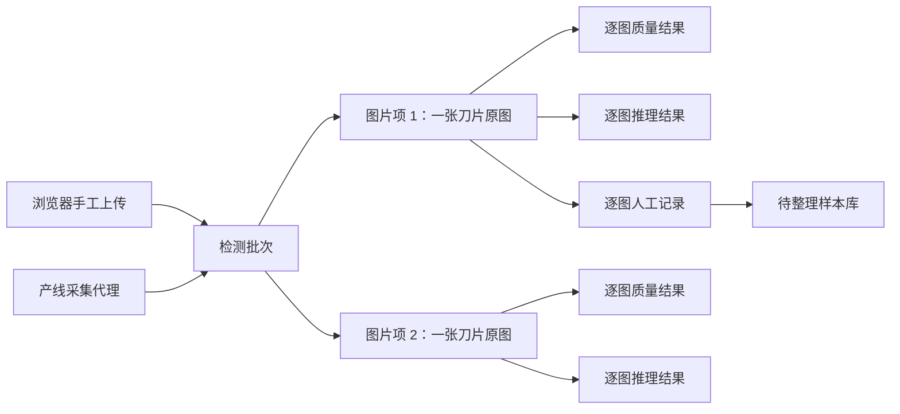

# 手工批量检测与管理简化需求规格

## 1. 文档信息

| 项目 | 内容 |
|---|---|
| 文档编号 | `DOC-16` |
| 文档版本 | `1.1.1` |
| 状态 | 整改目标基线，待分阶段实施 |
| 原始需求来源 | [刀片缺陷识别系统功能文档](刀片缺陷识别系统功能文档.md) |
| 当前网络契约 | `v1 / 1.0.0` |
| 目标网络契约 | `v2 / 2.0.0`，与 `v1` 并行兼容后切换 |
| 实施计划 | [17-手工批量检测整改实施计划](17-手工批量检测整改实施计划.md) |
| 取消范围决策 | [ADR-0003-取消内置数据集与训练管理](decisions/ADR-0003-取消内置数据集与训练管理.md) |

本文把原始功能说明拆成稳定、可验收的正式需求，定义手工批量检测、产线检测共存、单图片项语义、两类人员角色、样本回流和模型直接上传的目标状态。本文不代表相关代码已经实现。

`1.1.0` 取消在线系统的数据集版本管理和内部训练流水线。系统保留待整理样本库与样本包导出，并接收外部训练环境产出的模型包；样本导出和模型上传之间不存在在线业务依赖。

`1.1.1` 不改变业务语义，只补齐 P0 需求到验收场景的可执行追踪关系。

需求编号一经分配不得复用于其他语义。需求文字发生实质变化时增加新编号，并把旧编号标为废止；不得通过改写旧编号让既有测试静默覆盖新行为。

## 2. 规范用语和优先级

- “必须”“不得”“只允许”表示上线阻断要求。
- “应该”表示目标版本应完成的要求；延期必须形成批准记录和补偿措施。
- “可以”表示兼容扩展，不作为默认上线阻断条件。
- `P0`：涉及安全、数据完整性、核心闭环或兼容切换，上线前必须完成。
- `P1`：完整业务闭环要求，可在核心批量检测可用后按阶段完成。
- `P2`：体验或效率增强，不影响事实正确性。

需求类型：

| 前缀 | 含义 |
|---|---|
| `FR-GOV` | 文档治理和兼容规则 |
| `FR-IAM` | 人员身份、角色和权限 |
| `FR-BAT` | 检测批次和图片项 |
| `FR-QUA` | 逐图质量检查 |
| `FR-INF` | 推理和结果展示 |
| `FR-REV` | 三按钮反馈与人工复核 |
| `FR-HIS` | 批次历史与详情 |
| `FR-SMP` | 待整理样本库与导出 |
| `FR-MDL` | 模型直接上传和启用 |
| `NFR` | 非功能要求 |
| `MIG` | 数据和接口迁移要求 |
| `AT` | 验收场景 |

## 3. 建设范围

### 3.1 本次纳入范围

1. 保留工业相机、采集代理和离线补传组成的产线模式。
2. 新增浏览器手工批量上传模式。
3. 两种来源统一进入“检测批次—图片项—执行尝试—结果—人工记录”模型。
4. 删除新写入和新契约中的多视角采集语义；一个图片项只允许一张刀片原图。
5. 人员业务角色简化为“生产员工”和“管理员”。
6. 新增批次历史、逐图三按钮反馈、管理员复核、待整理样本库和样本包导出闭环。
7. 模型管理改为管理员在网页发起直接上传，文件仍通过隔离区和对象存储安全链路传输。
8. 同一组织同一时间只允许一个模型作为生产默认启用模型；影子和验证运行不得产生最终生产处置。

### 3.2 明确不改变的边界

- PostgreSQL 仍是业务状态唯一事实源。
- S3 兼容对象存储仍是图片、样本导出包和模型包唯一事实源。
- 推理服务不得访问业务数据库，业务后端不得导入 Python 算法。
- 前端不得自行计算最终生产处置。
- 技术失败、状态未知、图片或模型哈希冲突必须明确失败或进入 `HOLD`，不得形成 `PASS`。
- 原图、算法结果、人工结论、管理员标记和模型版本必须分别保存，不得相互覆盖。
- 模型直接上传不等于上传后直接加载到生产运行时。

### 3.3 本次不纳入范围

- 不建设浏览器离线检测。
- 不把模型训练放入在线业务进程。
- 不提供数据集创建、冻结、批准、版本差异页面或第二版写接口。
- 不提供内部训练任务创建、调度、进度、日志页面或第二版写接口与事件。
- 不向人员角色分配数据集版本或训练运行权限，也不展示相关菜单。
- 不部署内部训练流水线，不允许在线检测、样本导出、模型上传或模型启用依赖内部训练任务。
- 不允许普通生产员工上传、启用或回退模型。
- 不自动改写历史多视角采集记录。
- 不在本规格中锁定现场吞吐、图片大小和保留期的生产数值；这些值必须配置化并通过现场门禁确认。

## 4. 与现有文档的优先级和兼容规则

### 4.1 总体优先级

按以下顺序解释冲突：

1. `AGENTS.md` 的仓库边界、安全失败和契约生成要求始终最高。
2. [01-核心设计原则](01-核心设计原则.md)中的事实源、不可变证据、安全失败、算法与业务隔离继续生效。
3. 本文只对下表列出的产品范围变化具有增量决策权。
4. `Docs/02—14` 对本文未明确修改的领域继续作为唯一来源。
5. 实施每个阶段前，必须先把已批准变化同步到对应唯一来源文档，再修改契约、生成类型和消费者。
6. [17-手工批量检测整改实施计划](17-手工批量检测整改实施计划.md)只负责任务顺序和门禁，不重新定义业务语义。
7. 网络字段、枚举、错误和事件一旦进入实施阶段，以 `contracts/` 为跨进程唯一来源；本文中的字段表是契约设计输入，不得被消费者手工复制为另一套定义。

### 4.2 对 `Docs/01—14` 的影响

| 文档 | 兼容关系 | 本次明确变化 |
|---|---|---|
| `01` 核心设计原则 | 完全继承 | 手工上传仍走受控对象存储；直接上传模型先进入隔离区；安全失败和不可变证据不得削弱。 |
| `02` 完整检测业务流程 | 增量并局部替代 | 增加手工批次流程；产线和手工统一为批次图片项；“一组多视角图像作为一次推理输入”由“一项一原图”替代。 |
| `03` 算法与预处理接口 | 兼容适配 | 插件仍接收标准对象，但目标契约每次只向在线主推理传入一个图片项的一张原图。 |
| `04` 人工复核系统 | 增量 | 增加生产员工三按钮快速复核入口；不可变记录、修订、二审和 `HOLD` 规则继续有效。 |
| `05` 数据库设计 | 局部替代并扩展 | 增加批次、批次项、逐图质量、快速复核、样本候选、导出作业和模型上传会话；第二版不新增数据集版本和训练运行写模型。 |
| `06` 接口设计 | 主版本升级 | 增加 `v2` 批次、反馈、样本导出和模型上传接口；第二版不提供数据集版本、训练运行写接口或事件；`v1` 仅在兼容期保留。 |
| `07` 图片存储方案 | 局部替代并扩展 | 增加浏览器原图上传前缀、模型隔离区和样本导出包；取消在线数据集桶和内部训练服务访问；仍禁止二进制进入 JSON 或队列。 |
| `08` 增量训练闭环 | 职责收缩 | 改为样本导出与外部训练交接边界；在线系统不创建数据集版本、不调度训练，只接收外部模型包。 |
| `09` 前端功能规划 | 局部替代 | 新增手工检测、批次历史、三按钮反馈、样本库和直接上传模型页面；删除数据集版本和训练运行页面、菜单与权限。 |
| `10` 异常处理 | 完全继承并扩展 | 增加逐图失败隔离、批次聚合、模型隔离验证和导出作业错误；任何失败不得冒充完成。 |
| `11` 日志与监控 | 局部替代并扩展 | 增加批次、图片项、质量检查、样本导出和模型上传指标；移除在线数据集构建与训练运行指标。 |
| `12` 安全权限与角色 | 人员角色局部替代 | 人员业务角色改为两类；删除数据集和训练权限；设备身份和服务身份继续独立；生产模型操作仍需不同管理员账号留下审批链。 |
| `13` 推荐项目结构 | 局部替代 | 在线部署不包含数据集构建和训练流水线；现有训练代码只可作为系统边界外的离线资产保留。 |
| `14` 技术选型 | 局部替代 | 在线系统不部署训练运行或实验跟踪平台；继续使用现有推理技术栈和对象存储协议。 |

### 4.3 兼容期规则

- `v1` 产线接口在 `v2` 上线后至少保留一个经过批准的兼容窗口，具体时长由发布记录确定。
- 具有第二版对应能力的第一版检测、结果和复核写入必须汇聚到同一业务事实模型，不得形成两套无法对账的历史库。已取消的数据集和训练写入不得双写到第二版，消费者归零后必须明确拒绝。
- 新前端只消费生成的 `v2` 类型；旧采集代理在兼容期继续消费生成的 `v1` 类型。
- 第一版数据集和训练写能力必须使用独立开关，在其消费者清零且历史读取仍可用后提前关闭；不得等待第一版产线采集写接口一并下线。
- 第一版数据集和训练详情读取在归档窗口内只供授权历史审计使用；关闭这些读取前，模型历史和审计查询必须能返回通用只读 `LegacyProvenanceSnapshot`。第二版不得提供独立数据集或训练资源列表、详情路由、状态机或写操作。
- 角色切换期间不得自动把旧高权限角色映射为管理员。旧角色必须经过清单审核和明确确认。
- 历史多视角数据保持只读可查询；新推理不得猜测主视角，也不得静默丢弃其他图片。
- 兼容前置条件缺失时必须阻止切换，不得以空实现或跳过测试视为通过。

## 5. 目标领域模型

### 5.1 两种来源、一个核心模型



### 5.2 标识和关系

| 标识 | 语义 |
|---|---|
| `batch_id` | 批次不可变 UUID，是接口和关联的主标识。 |
| `batch_no` | 人类可读编号，格式 `JC-YYYYMMDD-NNNNN`；按组织、业务日期和序号唯一。 |
| `batch_item_id` | 一张刀片原图对应的批次图片项 UUID。 |
| `capture_id` | 仅产线来源使用，和一个 `batch_item_id` 一一对应。 |
| `image_object_id` | 原图对象元数据标识；一个新图片项只允许一个原图对象。 |
| `detection_task_id` | 一个图片项的一次逻辑检测任务标识。 |
| `attempt_id` | 检测任务的一次执行尝试；重试只增加尝试。 |
| `review_record_id` | 一次不可变人工反馈或管理员复核记录。 |
| `sample_candidate_id` | 一项待整理样本候选。 |
| `sample_export_job_id` | 一次异步样本包导出作业。 |
| `model_upload_id` | 一次模型直接上传和隔离验证会话。 |

约束：

- 一个批次至少包含一个图片项，批次提交后不得删除或替换图片项。
- 一个新图片项必须且只能绑定一个原图对象。
- 一个图片项的原图、质量结果、算法结果、人工结果和管理员标记分别追加保存。
- 同一图片项的重复提交、上传确认、反馈和结果回调必须通过幂等键收敛。
- 产线来源的 `capture_id` 不得复用为手工批次标识。

## 6. 枚举和状态

### 6.1 来源和使用阶段

`BatchSource`：

- `MANUAL_UPLOAD`：浏览器手工上传。
- `PRODUCTION_CAPTURE`：工业相机或采集代理。

`UsageStage`：

- `NEW_BLADE`：新刀片。
- `AFTER_ONE_WHEEL`：加工一个轮后。
- `AFTER_TWO_WHEELS`：加工两个轮后。
- `AFTER_THREE_WHEELS`：加工三个轮后。
- `OTHER`：其他。
- `UNSPECIFIED`：未填写；对外请求可以省略，持久化时规范化为该值。

选择 `OTHER` 时必须填写 `usage_stage_note`，长度不得超过 200 个字符。批次提交时把使用阶段快照复制到每个图片项，之后不得通过修改批次覆盖历史图片项。

### 6.2 批次状态

`BatchStatus`：

- `DRAFT`：可增加和删除图片项。
- `UPLOADING`：至少一个图片项正在上传。
- `READY`：全部待提交图片已完成对象校验。
- `PROCESSING`：已提交，仍有图片项未进入终态。
- `COMPLETED`：全部图片项成功完成推理，包括结论为不确定的情况。
- `PARTIALLY_COMPLETED`：至少一个图片项完成推理，且至少一个图片项质量拒绝或技术失败。
- `FAILED`：没有图片项完成推理，且全部图片项均为质量拒绝或技术失败。
- `CANCELLED`：仅提交前允许取消。

批次终态必须由后端根据图片项状态计算，前端、推理服务和采集代理不得直接指定。

### 6.3 图片项状态

`BatchItemStatus`：

- `PENDING_UPLOAD`
- `UPLOADING`
- `READY`
- `QUEUED`
- `PROCESSING`
- `COMPLETED`
- `QUALITY_REJECTED`
- `FAILED`
- `CANCELLED`

`COMPLETED` 表示推理流程成功形成标准结果，不等于生产 `PASS`。`QUALITY_REJECTED` 和 `FAILED` 不得生成“未发现缺陷”。

### 6.4 逐图质量结果

`ImageQualityOverall`：`ACCEPTED`、`WARNING`、`REJECTED`。

`ImageQualityCheckType`：

- `DECODABLE`
- `BLADE_PRESENT`
- `BLADE_COMPLETE`
- `BLUR`
- `EXPOSURE`

`ImageQualityCheckStatus`：`PASS`、`WARNING`、`FAIL`、`NOT_RUN`。

每项检查必须记录检查类型、状态、版本化规则标识、可选测量值、可选阈值、原因码和面向用户的安全提示。任一必要检查为 `FAIL` 时总体状态为 `REJECTED`；后续检查未执行时必须记录 `NOT_RUN`，不得伪造为通过。

### 6.5 检测、反馈和样本枚举

- 算法结论继续使用 `QUALIFIED`、`UNQUALIFIED`、`INCONCLUSIVE`。
- 页面文案分别映射为“未发现明显缺陷”“疑似缺陷”“无法稳定判断”。
- `QuickReviewDecision`：`DEFECT_CONFIRMED`、`NO_DEFECT_CONFIRMED`、`UNABLE_TO_DETERMINE`。
- `AdminFeedbackLabel`：`CORRECT_DETECTION`、`FALSE_POSITIVE`、`FALSE_NEGATIVE`、`LOCALIZATION_INACCURATE`、`IMAGE_UNUSABLE`、`UNCONFIRMED`。
- `SampleCandidateStatus`：`PENDING`、`INCLUDED`、`EXCLUDED`、`EXPORTED`。
- `ExportJobStatus`：`QUEUED`、`RUNNING`、`SUCCEEDED`、`FAILED`、`EXPIRED`。

## 7. 正式功能需求

### 7.1 文档治理和模式兼容

| 编号 | 优先级 | 正式需求 |
|---|---|---|
| `FR-GOV-001` | P0 | 所有新增跨进程字段、枚举、错误和事件必须先进入 `contracts/`，再生成 Java、Python 和 TypeScript 类型。 |
| `FR-GOV-002` | P0 | 系统必须同时支持产线采集和浏览器手工批量上传，两种来源必须落入同一批次事实模型。 |
| `FR-GOV-003` | P0 | 新契约和新写入不得包含多视角、主视角或图片角色语义；一个图片项只允许一张原图。 |
| `FR-GOV-004` | P0 | 历史多视角记录必须只读保留，迁移不确定时保持 `HOLD`，不得猜测主图或删除证据。 |
| `FR-GOV-005` | P0 | `v1` 与 `v2` 兼容期必须有明确开始、结束、使用者清单、回滚点和删除条件。 |
| `FR-GOV-006` | P1 | 需求、任务、自动化测试、人工验收和现场决策必须形成可反向查询的追踪关系。 |
| `FR-GOV-007` | P0 | 第二版契约不得定义数据集版本或训练运行写接口与事件，在线业务不得依赖内部训练流水线。 |
| `FR-GOV-008` | P0 | 样本包导出必须是在线样本闭环终点；外部清洗、数据集构建和训练不属于本系统事务或状态机。 |
| `FR-GOV-009` | P0 | 第二版不得把数据集版本或训练运行定义为可独立查询或写入的一等业务资源；历史来源只允许作为模型历史或审计结果中的通用只读 `LegacyProvenanceSnapshot` 返回。 |
| `FR-GOV-010` | P0 | 第一版已取消写接口必须使用独立开关提前停写；对已认证调用返回 HTTP `410` 和稳定错误码 `TD-LEGACY-FEATURE-RETIRED`，不得无操作成功、永久排队或等待第一版产线接口同时下线。 |

### 7.2 登录、用户和两类角色

| 编号 | 优先级 | 正式需求 |
|---|---|---|
| `FR-IAM-001` | P0 | 人员业务角色必须简化为 `PRODUCTION_EMPLOYEE` 和 `ADMINISTRATOR` 两类。 |
| `FR-IAM-002` | P0 | 设备身份和服务身份必须继续使用独立认证，不得伪装成两类人员角色。 |
| `FR-IAM-003` | P0 | 生产员工必须能够登录、退出、修改本人密码、创建手工检测批次、查看本人批次并对图片提交三按钮反馈。 |
| `FR-IAM-004` | P0 | 管理员必须拥有生产员工功能，并能够管理用户、查看全部批次、进行管理员反馈、管理样本和管理模型。 |
| `FR-IAM-005` | P0 | 后端必须执行角色、数据范围和资源状态校验；隐藏前端菜单不得替代鉴权。 |
| `FR-IAM-006` | P0 | 旧角色不得自动获得管理员权限；切换前必须生成用户映射清单并由授权管理员逐项确认。 |
| `FR-IAM-007` | P1 | 用户管理必须支持创建、编辑显示名称、重置密码、启停和指定两类角色。 |
| `FR-IAM-008` | P0 | 生产模型启用、正式回退和大批量样本导出必须由不同管理员账号留下审批或确认记录。 |
| `FR-IAM-009` | P1 | 登录后的首页必须按角色展示允许进入的模块、最近批次和待处理数量，不得泄露未授权人员或工位的汇总。 |
| `FR-IAM-010` | P0 | 第二版人员会话、菜单和权限不得包含数据集创建、冻结、批准、版本差异、训练任务创建、调度、进度或日志能力。 |

### 7.3 手工批次和产线批次

| 编号 | 优先级 | 正式需求 |
|---|---|---|
| `FR-BAT-001` | P0 | 浏览器必须支持点击和拖拽选择 PNG、JPG、JPEG 图片，并以实际内容检测结果校验格式。 |
| `FR-BAT-002` | P0 | 用户必须能够一次选择多张图片，并在提交前查看缩略图、文件名、数量和删除选错的图片。 |
| `FR-BAT-003` | P0 | 页面必须只有一个主要提交动作“确认上传并检测”；重复点击必须通过幂等键收敛。 |
| `FR-BAT-004` | P0 | 使用阶段为可选批次字段；选择后必须在提交时复制到全部图片项历史快照。 |
| `FR-BAT-005` | P0 | 浏览器必须直接把原图上传到后端签发的短期、单对象授权地址，不得把图片编码进 JSON。 |
| `FR-BAT-006` | P0 | 服务端必须校验图片真实格式、大小、哈希和对象存在性，不能信任扩展名或浏览器声明。 |
| `FR-BAT-007` | P0 | 批次提交后必须为每个图片项建立独立检测任务；一个图片项失败不得阻止其他图片项继续。 |
| `FR-BAT-008` | P0 | 产线采集必须继续支持离线缓存和补传，每个新 `capture_id` 必须映射到一个批次图片项和一张原图。 |
| `FR-BAT-009` | P0 | 批次编号必须由后端生成且可排序；UUID 仍是跨系统唯一标识，不得只依赖展示编号。 |
| `FR-BAT-010` | P1 | 前端必须从能力接口读取允许格式、单文件上限、批次图片上限和当前功能开关，不得写死生产限制。 |
| `FR-BAT-011` | P0 | 批次聚合状态必须按第 6.2 节规则由图片项状态确定，并在并发回调下保持一致。 |

### 7.4 逐图质量和推理

| 编号 | 优先级 | 正式需求 |
|---|---|---|
| `FR-QUA-001` | P0 | 系统必须分别检查每张图片是否可解码、是否存在圆形刀片主体、主体是否完整、是否过度模糊以及是否严重过曝或过暗。 |
| `FR-QUA-002` | P0 | 每张图片必须保存总体质量结论和每个检查项的状态、规则版本及原因码。 |
| `FR-QUA-003` | P0 | 质量拒绝的图片项必须标记为 `QUALITY_REJECTED`，提示重新拍摄或上传，且不得进入正常缺陷推理。 |
| `FR-QUA-004` | P0 | 一张图片质量拒绝不得导致同批其他图片项失败。 |
| `FR-QUA-005` | P0 | 质量检查技术异常必须标为图片项技术失败或 `HOLD`，不得等同于图片质量通过。 |
| `FR-INF-001` | P0 | 提交后必须自动完成读取、质量检查、预处理、推理、结果解析、缺陷区域提取、结果图生成和记录保存。 |
| `FR-INF-002` | P0 | 一个图片项的一次推理输入必须只有一张原图；推理插件不得依据图片角色选择主视角。 |
| `FR-INF-003` | P0 | 推理成功必须保存算法结论、置信度、缺陷区域数量、模型版本、流水线版本、推理耗时和派生结果图引用。 |
| `FR-INF-004` | P0 | 技术失败、输出非法或版本不兼容必须明确失败或 `HOLD`，不得产生“未发现明显缺陷”。 |
| `FR-INF-005` | P1 | 批次结果必须展示总数、疑似缺陷数、未发现明显缺陷数、不确定数和图片质量异常数。 |
| `FR-INF-006` | P1 | 结果排序必须依次优先展示图片质量异常、不确定、疑似缺陷、未发现明显缺陷。 |
| `FR-INF-007` | P1 | 疑似缺陷、不确定和质量异常图片必须突出展示；正常图片默认折叠或使用小缩略图。 |
| `FR-INF-008` | P1 | 检测形成结果后，当前页面必须自动刷新或展开结果区域，不要求用户手工重新查询。 |
| `FR-INF-009` | P0 | 页面可以展示上传进度和总体等待提示，但不得暴露内部处理步骤为需要用户确认的流程节点。 |

### 7.5 三按钮反馈和人工复核

| 编号 | 优先级 | 正式需求 |
|---|---|---|
| `FR-REV-001` | P0 | 每个图片结果必须提供“确认存在缺陷”“确认无缺陷”“无法判断”三个主要反馈按钮。 |
| `FR-REV-002` | P0 | 疑似缺陷、质量边界和不确定结果必须突出显示按钮；正常结果允许主动反馈但不得强制逐张确认。 |
| `FR-REV-003` | P0 | 单次按钮操作必须立即创建不可变人工记录并自动更新页面，不得要求“提交全部结果”。 |
| `FR-REV-004` | P0 | 重复请求必须通过幂等键返回同一记录；修改已提交结论必须新增修订，不得覆盖原记录。 |
| `FR-REV-005` | P0 | “无法判断”必须保持或进入 `HOLD`；其他人工结论是否形成最终处置必须继续服从版本化处置和二审策略。 |
| `FR-REV-006` | P0 | 管理员必须能够标记正确检出、误报、漏检、定位不准、图片不可用和暂无法确认。 |
| `FR-REV-007` | P1 | 管理员必须能够按算法与人工不一致、无法判断、图片质量异常和定位争议筛选图片项。 |

### 7.6 批次历史

| 编号 | 优先级 | 正式需求 |
|---|---|---|
| `FR-HIS-001` | P0 | 一次手工上传必须形成一条批次记录，每张图片形成一条图片项明细。 |
| `FR-HIS-002` | P0 | 批次列表必须展示批次编号、检测时间、图片总数、各结果数量、操作人员、来源和批次状态。 |
| `FR-HIS-003` | P0 | 生产员工只允许查看本人创建的手工批次以及明确授权的产线记录；管理员可以查看全部授权范围内记录。 |
| `FR-HIS-004` | P0 | 图片项详情必须展示原图、结果图、系统结论、缺陷数量、人工结论、质量结果、使用阶段和检测时间。 |
| `FR-HIS-005` | P1 | 管理员详情必须额外展示推理耗时、模型版本、流水线版本、执行尝试和错误历史。 |
| `FR-HIS-006` | P0 | 历史记录必须绑定当时使用的模型和规则版本，切换模型不得改写历史。 |
| `FR-HIS-007` | P1 | 列表和详情查询必须支持稳定分页、时间范围、状态、来源、操作人员和结果筛选。 |

### 7.7 待整理样本库和导出

| 编号 | 优先级 | 正式需求 |
|---|---|---|
| `FR-SMP-001` | P0 | 管理员必须能够把误报、漏检和定位不准的图片项加入待整理样本库，也可以显式加入其他管理员标记。 |
| `FR-SMP-002` | P0 | 同一图片项和同一管理员反馈版本重复加入必须幂等，不得生成重复候选。 |
| `FR-SMP-003` | P0 | 样本候选必须关联原图、结果图、系统结论、生产员工结论、管理员标记、模型版本、检测时间、使用阶段和来源记录。 |
| `FR-SMP-004` | P0 | 候选进入待整理样本库不等于成为在线数据集；纳入、排除和修订必须保留独立记录。 |
| `FR-SMP-005` | P1 | 管理员必须能够筛选、批量选择候选并创建异步导出作业。 |
| `FR-SMP-006` | P0 | 导出包必须包含清单、模式版本、对象哈希和失败清单；单个对象失败时作业不得宣称完整成功。 |
| `FR-SMP-007` | P0 | 导出下载必须使用短期授权并记录申请人、范围、时间、下载和到期事件。 |
| `FR-SMP-008` | P1 | 成功导出的候选必须保留导出作业关联，不得因导出而删除或覆盖。 |
| `FR-SMP-009` | P0 | 导出成功后在线系统不得自动创建数据集版本、训练运行或训练任务；外部使用情况只能作为可选来源说明回传。 |

### 7.8 模型直接上传和启用

| 编号 | 优先级 | 正式需求 |
|---|---|---|
| `FR-MDL-001` | P0 | 管理员必须能够在模型管理页面选择模型包、填写版本和说明并发起直接上传。 |
| `FR-MDL-002` | P0 | 浏览器必须通过受控上传授权把模型包写入隔离对象前缀，业务后端不得把大模型文件缓存在请求内存或写入数据库。 |
| `FR-MDL-003` | P0 | 上传完成后必须由服务端核对大小和 SHA-256，并在无业务凭据、无任意网络权限的隔离环境中验证包结构和模型加载。 |
| `FR-MDL-004` | P0 | 验证必须包含允许的框架和插件版本、文件清单、禁止文件、安全扫描、固定测试图片试运行和输入输出模式检查。 |
| `FR-MDL-005` | P0 | 验证失败的模型必须保持隔离并记录原因，不得登记为可启用版本，也不得影响当前生产模型。 |
| `FR-MDL-006` | P0 | 每个模型版本必须记录名称、版本、上传人、上传时间、对象引用、哈希、说明、验证状态、验证证据和经审计的外部来源说明；不得要求存在内部数据集版本或训练运行。 |
| `FR-MDL-007` | P0 | 同一组织同一时间只允许一个模型版本为生产默认启用状态；数据库和事务必须强制该约束。 |
| `FR-MDL-008` | P0 | 影子、测试和灰度运行可以并存，但不得被页面标为生产启用，也不得自行产生最终生产处置。 |
| `FR-MDL-009` | P0 | 启用新模型前必须通过自动验证、固定测试和不同管理员账号确认；切换必须原子化并保留旧模型。 |
| `FR-MDL-010` | P0 | 回退必须选择已验证的历史版本，验证其可加载和预热成功后原子切换；失败时当前生产模型保持不变。 |
| `FR-MDL-011` | P0 | 所有历史图片项必须继续关联实际执行模型版本，不得改为当前启用版本。 |
| `FR-MDL-012` | P0 | 模型上传、验证、启用和回退必须能在没有内部训练流水线、数据集版本和训练运行记录的情况下独立完成。 |
| `FR-MDL-013` | P0 | 每个模型版本必须且只能满足一种来源约束：历史模型关联完整的第一版数据集与训练记录，或外部模型关联已确认上传会话和不可变外部来源快照；不得形成无来源模型或同时宣称两种来源。 |

## 8. 非功能需求

| 编号 | 优先级 | 正式需求 |
|---|---|---|
| `NFR-SAFE-001` | P0 | 技术失败、未知状态、哈希冲突、契约不兼容和缺失前置条件必须明确失败或进入 `HOLD`。 |
| `NFR-IDEM-001` | P0 | 创建批次、图片确认、批次提交、结果回调、三按钮反馈、样本加入、导出创建和模型上传确认必须支持幂等。 |
| `NFR-CONS-001` | P0 | 批次计数和状态必须在并发回调、重试和服务重启后可由图片项事实重新计算。 |
| `NFR-AUD-001` | P0 | 登录、用户和角色变更、批次提交、人工反馈、管理员标记、样本加入和导出、模型上传、启用及回退必须进入不可变审计链。 |
| `NFR-SEC-001` | P0 | 图片和模型上传授权必须短时、单对象、限大小和限类型；对象键由后端生成。 |
| `NFR-SEC-002` | P0 | 文件名、媒体类型和压缩包内容必须视为不可信输入；不得执行上传包中的脚本、共享库或任意反序列化代码。 |
| `NFR-OBS-001` | P1 | 日志、指标和追踪必须携带 `batch_id`、`batch_item_id`、可选 `capture_id`、`detection_task_id` 和 `trace_id`。 |
| `NFR-PERF-001` | P1 | 系统必须记录逐图上传、质量检查、推理和批次总耗时；现场目标未确认前不得伪造性能通过。 |
| `NFR-ACC-001` | P1 | 上传、结果、三按钮反馈和历史页面必须支持键盘操作、清晰焦点、可读错误和非颜色唯一提示。 |
| `NFR-RET-001` | P0 | 原图、结果、人工记录、样本导出和模型包必须按引用与保留策略清理，不得由页面直接物理删除。 |

## 9. 目标契约设计

### 9.1 版本策略

本次变化同时包含新增资源和破坏性删除，因此采用并行主版本：

1. 保留 `contracts/openapi/tool-defect-api-v1.json`、第一版异步事件、兼容基线和生成包，兼容期内不得原位改变多视角字段语义。
2. 新建第二版开放接口、公共模式、推理任务、异步事件、示例、非法示例、状态转换、消费者清单和兼容基线。
3. 生成器和验证器必须先支持第一版、第二版并存，再允许任何消费者接入第二版。
4. 第二版 Java、Python 和 TypeScript 包必须使用可区分的命名空间或主版本，避免链接时混入第一版类型。
5. 第一版基线不得被第二版覆盖；第二版稳定后建立独立兼容锁。
6. 第二版契约检查必须拒绝数据集版本、训练运行、训练调度、训练进度和训练日志写资源或事件重新进入。

目标文件名和包名由契约阶段最终确定，但必须满足可并行生成、可独立验证和可明确下线。第二版接口统一使用 `/api/v2`；不得在 `/api/v1` 下删除 `images`、`image_role` 或旧角色枚举。

### 9.2 公共模式

第二版至少定义以下模式：

| 模式 | 必需内容 |
|---|---|
| `DetectionBatch` | 批次标识、编号、来源、创建人、使用阶段、状态、计数、时间和版本。 |
| `DetectionBatchItem` | 图片项标识、批次标识、唯一原图引用、状态、质量、结果摘要、人工摘要和时间。 |
| `BatchAggregateCounts` | 总数、完成数、疑似缺陷数、正常数、不确定数、质量拒绝数和技术失败数。 |
| `ImageQualityResult` | 总体状态、检查器版本和逐项检查数组。 |
| `ImageQualityCheck` | 检查类型、状态、原因码、测量值、阈值和提示。 |
| `QuickReviewRecord` | 决定、提交人、提交时间、幂等键、被替代记录和处置结果引用。 |
| `AdminFeedbackRecord` | 管理员标签、说明、可选修订标注和来源人工记录。 |
| `SampleCandidate` | 来源图片项和反馈版本、状态、纳入/排除决定记录和导出关联。 |
| `SampleExportJob` | 筛选快照、候选清单摘要、状态、对象引用、哈希、失败清单和到期时间。 |
| `ModelUploadSession` | 上传会话、隔离对象键、约束、状态、哈希和到期时间。 |
| `ModelValidationResult` | 包检查、安全扫描、加载、预热、固定样例结果、状态、证据引用和外部来源说明。 |
| `LegacyProvenanceSnapshot` | 仅嵌入模型历史或审计响应的来源类型、第一版标识、不可变摘要、归档引用、SHA-256 和保留时间；无独立路由和写状态。 |

所有请求对象必须拒绝未知字段。所有对象引用必须使用受控桶、对象键、大小、媒体类型和 SHA-256，不得接受任意网址。

### 9.3 浏览器批次接口

| 方法和路径 | 作用 | 关键约束 |
|---|---|---|
| `GET /api/v2/capabilities/manual-detection` | 返回格式、大小、数量和功能开关 | 只返回配置，不暴露密钥。 |
| `POST /api/v2/detection-batches` | 创建手工空批次 | 必须带幂等键；来源固定为手工上传。 |
| `POST /api/v2/detection-batches/{batch_id}/items` | 增加图片项并取得上传票据 | 仅 `DRAFT` 或 `UPLOADING`；一项一对象键。 |
| `DELETE /api/v2/detection-batches/{batch_id}/items/{item_id}` | 删除未提交图片项 | 仅提交前；对象按孤儿清理策略处理。 |
| `POST /api/v2/detection-batches/{batch_id}/items/{item_id}/complete` | 确认原图上传 | 校验对象头、大小、类型和哈希；幂等。 |
| `POST /api/v2/detection-batches/{batch_id}/submit` | 原子提交批次 | 锁定图片项和使用阶段；为每项创建任务。 |
| `GET /api/v2/detection-batches` | 查询批次历史 | 按角色和范围过滤；游标分页。 |
| `GET /api/v2/detection-batches/{batch_id}` | 查询批次和图片项摘要 | 返回聚合计数和状态版本。 |
| `GET /api/v2/detection-batches/{batch_id}/items/{item_id}` | 查询图片项详情 | 原图和结果图只返回短时只读票据。 |
| `PUT /api/v2/detection-batches/{batch_id}/items/{item_id}/quick-review` | 保存三按钮反馈 | 幂等；修改时以 `supersedes_record_id` 新增修订。 |

产线采集代理使用第二版产线接口创建来源为 `PRODUCTION_CAPTURE` 的单项批次。产线请求只包含一个 `image` 对象，不得包含 `images` 或 `image_role`。

### 9.4 管理员反馈和样本接口

| 方法和路径 | 作用 |
|---|---|
| `GET /api/v2/admin/detection-items` | 按不一致、无法判断、质量异常、定位争议等条件筛选。 |
| `POST /api/v2/admin/detection-items/{item_id}/feedback` | 创建不可变管理员反馈。 |
| `POST /api/v2/sample-candidates` | 把指定反馈版本加入待整理样本库。 |
| `GET /api/v2/sample-candidates` | 查询和筛选候选。 |
| `POST /api/v2/sample-candidates/{candidate_id}/decision` | 纳入、排除或形成修订。 |
| `POST /api/v2/sample-exports` | 以候选标识和筛选快照创建异步导出。 |
| `GET /api/v2/sample-exports/{export_job_id}` | 查询进度、数量和失败清单。 |
| `POST /api/v2/sample-exports/{export_job_id}/download-ticket` | 为成功作业签发短时下载票据。 |

样本导出事件只携带标识、对象引用和哈希，不得在队列中传递图片内容或整个压缩包。

### 9.5 模型直接上传接口

| 方法和路径 | 作用 | 关键约束 |
|---|---|---|
| `POST /api/v2/model-upload-sessions` | 创建隔离上传会话 | 管理员；声明包大小、哈希、版本和说明。 |
| `POST /api/v2/model-upload-sessions/{upload_id}/complete` | 确认上传并触发验证 | 对象校验成功后才能排队；幂等。 |
| `GET /api/v2/model-upload-sessions/{upload_id}` | 查询上传和验证状态 | 失败原因必须可读且脱敏。 |
| `GET /api/v2/model-versions` | 查询模型版本 | 显示验证、启用和历史使用状态。 |
| `POST /api/v2/model-versions/{model_version_id}/activation-requests` | 申请生产启用 | 只能选择验证通过版本和已验证回退目标。 |
| `POST /api/v2/model-activation-requests/{request_id}/approve` | 不同管理员确认并触发切换 | 禁止自己批准自己的申请。 |
| `POST /api/v2/model-versions/{model_version_id}/rollback-requests` | 申请回退 | 目标必须已验证并重新预热。 |

“直接上传”是用户在模型管理页面发起、浏览器使用短期票据把文件直接上传到隔离对象前缀。业务接口不得接收模型二进制，生产推理服务不得直接读取未验证前缀。

### 9.6 第二版事件

至少增加以下事件；具体载荷以第二版 JSON 模式为准：

| 事件 | 生产者 | 消费者 | 主要引用 |
|---|---|---|---|
| `tool_defect.inference.item.requested.v2` | 业务后端 | 推理服务 | 图片项、检测任务、单个原图、流水线和追踪引用。 |
| `tool_defect.inference.item.completed.v2` | 推理服务 | 业务后端 | 图片项、尝试、质量、结果和派生对象引用。 |
| `tool_defect.inference.item.failed.v2` | 推理服务 | 业务后端 | 图片项、尝试、错误分类和重试属性。 |
| `tool_defect.sample.export.requested.v2` | 业务后端 | 样本导出作业 | 导出作业、候选快照和目标对象引用。 |
| `tool_defect.sample.export.completed.v2` | 样本导出作业 | 业务后端 | 清单、哈希、计数和失败项引用。 |
| `tool_defect.model.validation.requested.v2` | 业务后端 | 模型验证作业 | 上传会话、隔离对象和验证配置。 |
| `tool_defect.model.validation.completed.v2` | 模型验证作业 | 业务后端 | 验证状态、证据和错误引用。 |

每个事件必须支持至少一次投递和消费者幂等。事件不得把批次显示计数当作事实载荷；业务后端必须从图片项事实聚合。

### 9.7 标准错误

第二版至少提供以下稳定错误码族：

- `TD-BATCH-*`：批次状态、数量、所有权和并发冲突。
- `TD-ITEM-*`：图片项状态、重复、对象校验和删除冲突。
- `TD-QUALITY-*`：质量拒绝、检查器失败和规则不兼容。
- `TD-REVIEW-*`：反馈冲突、非法修订和处置限制。
- `TD-SAMPLE-*`：候选重复、导出不完整和下载票据错误。
- `TD-MODEL-UPLOAD-*`：上传会话、包校验、隔离验证和压缩包安全错误。
- `TD-ROLE-MIGRATION-*`：未完成角色映射、会话失效和权限拒绝。
- `TD-LEGACY-FEATURE-RETIRED`：第一版已取消写能力明确退役；已认证调用使用 HTTP `410`，不得重试为成功。

每个新增写接口必须提供成功、幂等重复、乐观锁冲突、未授权和输入校验失败示例。

### 9.8 明确取消的第二版契约

第二版不得定义或生成下列资源：

- 数据集创建、冻结、批准和版本差异写接口。
- 训练运行创建、取消、调度、恢复写接口。
- 训练进度、训练日志或检查点业务接口。
- 数据集构建、数据集发布、训练开始、训练进度和训练完成事件。
- 要求在线 `dataset_version_id` 或 `training_run_id` 才能登记模型的字段约束。

`R1-08` 的负向门禁至少覆盖下列稳定标识及大小写、分隔符等同义形式：

```text
DatasetVersion
DatasetApproval
DatasetDiff
TrainingRun
TrainingJob
TrainingLog
dataset.create
dataset.approve
training.start
/datasets
/training-runs
```

允许出现这些字符串的范围仅限第一版冻结契约、历史兼容说明、退役测试和负向测试样例；第二版开放接口、事件模式、生成类型、页面路由、人员权限和部署配置不得命中。

第二版可以定义通用只读 `LegacyProvenanceSnapshot`，只包含来源类型、第一版标识、不可变摘要、归档引用、SHA-256 和保留时间。它只能嵌入模型历史或审计响应，不得提供独立集合、详情路由、状态转换或写接口，也不得被页面包装成数据集或训练管理。

第一版已有同类接口只作为兼容期遗留能力登记，不得被第二版页面或新消费者调用。写消费者归零后按 `MIG-011` 提前停写；历史读取按 `MIG-012` 完成通用快照替代后退役。

## 10. 目标持久化模型

数据库字段和索引的最终唯一来源仍是修订后的 [05-数据库设计](05-数据库设计.md)。实施时至少需要以下表或等价实体：

| 实体 | 关键字段和约束 |
|---|---|
| `detection_batch` | `batch_id`、`batch_no`、`source`、`created_by`、使用阶段、聚合状态、计数投影、状态版本和时间；编号唯一。 |
| `detection_batch_item` | `batch_item_id`、`batch_id`、可选 `capture_id`、唯一原图、状态、使用阶段快照、检测任务和时间；新记录一项一原图。 |
| `image_quality_result` | 图片项、总体状态、检查器版本、创建时间；每次重新处理新增版本。 |
| `image_quality_check` | 质量结果、类型、状态、原因码、测量值、阈值和提示。 |
| `quick_review_record` | 图片项、决定、操作者、被替代记录、幂等键、处置引用和时间；只追加。 |
| `admin_feedback_record` | 图片项、管理员标签、说明、来源人工记录和时间；只追加。 |
| `sample_candidate` | 图片项、反馈版本、状态、决定人和版本；来源组合唯一。 |
| `sample_export_job` | 创建人、筛选快照、状态、对象引用、清单哈希、计数、失败摘要和到期时间。 |
| `sample_export_item` | 导出作业、候选、导出状态、对象哈希和错误。 |
| `model_upload_session` | 上传人、隔离对象、约束、状态、哈希、验证作业、外部来源说明和到期时间。 |
| `model_version` | `source_kind`、可选第一版数据集/训练关联、可选上传会话、不可变外部来源快照、制品哈希、验证状态和版本；来源互斥且至少一种完整。 |
| `model_activation_request` | 目标版本、回退版本、申请人、批准人、状态、运行证据和版本。 |

生产活动模型必须通过数据库事务和唯一约束保证“一组织一个生产默认活动版本”。不能用前端单选或先查后写代替数据库约束。

`model_version` 的来源检查必须由数据库和领域层共同强制：

```text
LEGACY_INTERNAL => dataset_version_id 与 training_run_id 均非空，model_upload_id 与 external_source_snapshot 为空
EXTERNAL_UPLOAD => model_upload_id 与 external_source_snapshot 均非空，dataset_version_id 与 training_run_id 为空
```

未知、两边都空或两边同时有值均拒绝写入或保持 `HOLD`，不得通过应用默认值补造来源。

迁移必须采用“扩展—回填—双写—影子读—切换—收紧”：

1. 先增加可空字段和新表，不删除旧列。
2. 将可无歧义转换的旧采集记录回填为来源明确的旧版单项批次。
3. 缺失创建人和使用阶段时分别保持为空或 `UNSPECIFIED`，不得伪造人员和阶段。
4. 旧记录存在多张图片时标记为 `LEGACY_MULTIVIEW` 只读记录，不自动选择主图。
5. 新旧写入口在兼容期双写或通过同一应用服务写入新核心模型。
6. 对账通过后切换读路径，最后停止旧写入。
7. 删除旧列和旧表必须另行批准，并有备份、引用检查和恢复演练。

当前工作区存在尚未收口的数据库迁移文件，后续迁移序号必须等其所有者完成后串行分配；本文不预占具体迁移编号。

## 11. 目标页面和交互

### 11.1 生产员工

| 页面 | 必需能力 |
|---|---|
| 首页 | 进入手工检测、查看本人最近批次和待反馈数量。 |
| 刀片缺陷检测 | 点击/拖拽、多图预览、删除、数量、使用阶段、单一提交按钮、上传进度和自动结果区域。 |
| 批次结果 | 汇总计数、优先排序、异常突出、正常折叠、原图/结果图和逐图三按钮。 |
| 历史记录 | 本人批次列表、筛选、批次详情、图片项详情和未完成反馈入口。 |
| 个人设置 | 修改密码和退出登录。 |

### 11.2 管理员

管理员包含生产员工全部页面，并增加：

| 页面 | 必需能力 |
|---|---|
| 用户管理 | 创建、编辑、重置密码、启停和指定两类角色。 |
| 全部检测记录 | 按来源、人员、状态、时间和结果查询；查看版本和耗时。 |
| 检测反馈 | 筛选争议图片、管理员标记、查看修订和加入样本。 |
| 待整理样本库 | 筛选、纳入/排除、批量选择、创建导出、查看失败项和短时下载。 |
| 模型版本管理 | 直接上传、验证进度、试运行证据、申请启用、确认、回退和历史关联。 |

所有页面只展示后端状态。上传进度可以展示，但图片质量、推理和聚合状态不得由浏览器推断。

第二版前端不得注册数据集版本和训练运行路由，不得显示数据集创建、冻结、批准、版本差异、训练创建、调度、进度或日志页面。质量页面可以展示检测和人工反馈指标，但不能重新包装成训练管理入口。

## 12. 权限矩阵

两类人员角色是用户可见的业务角色，内部仍使用原子权限、数据范围和资源状态。设备和服务账号不进入下表。

| 能力 | 生产员工 | 管理员 |
|---|---:|---:|
| 登录、退出、修改本人密码 | 允许 | 允许 |
| 创建手工批次并上传图片 | 允许 | 允许 |
| 查看本人手工批次 | 允许 | 允许 |
| 查看授权产线记录 | 按范围 | 按范围 |
| 三按钮快速反馈 | 按本人/授权范围 | 允许 |
| 查看全部人员批次 | 禁止 | 允许 |
| 管理用户和角色 | 禁止 | 允许 |
| 管理员反馈和样本候选 | 禁止 | 允许 |
| 创建和下载样本导出 | 禁止 | 允许，受审批和审计约束 |
| 上传、验证模型 | 禁止 | 允许 |
| 申请、批准启用或回退 | 禁止 | 允许，但同一账号不得自批 |
| 查看审计 | 禁止 | 按授权范围允许 |

旧细分人员权限可以在兼容期保留为内部授权数据，但第二版人员会话只返回两类业务角色。切换后前端不得继续出现旧角色选择项。

两类角色均不得拥有第二版数据集版本或训练运行权限。管理员的样本导出权限和模型上传权限是两个独立能力，中间不存在“创建训练任务”权限。

## 13. 迁移和下线要求

| 编号 | 优先级 | 正式迁移要求 |
|---|---|---|
| `MIG-001` | P0 | 契约生成器、验证器、消费者清单和生成包必须先支持两代契约并存。 |
| `MIG-002` | P0 | 数据库必须先扩展和回填，再切换读写；不得通过破坏性迁移直接替换采集、检测和复核事实。 |
| `MIG-003` | P0 | 每条旧记录必须产生可审计的迁移结果；无法无歧义映射的多视角记录必须进入旧版只读集合。 |
| `MIG-004` | P0 | 第二版产线写入必须在全部目标采集代理升级并通过对账后才能停止第一版写入。 |
| `MIG-005` | P0 | 角色迁移必须先生成影响预览；未确认的旧高权限账号必须禁用第二版管理权限。 |
| `MIG-006` | P0 | 角色切换时必须撤销旧人员会话，避免旧权限缓存继续生效。 |
| `MIG-007` | P0 | 当前生产模型必须先回填为唯一生产默认活动版本；存在多个候选时必须人工决策，不得按时间猜测。 |
| `MIG-008` | P0 | 模型直传上线前必须完成隔离桶、扫描作业、配额、超时和孤儿对象清理验证。 |
| `MIG-009` | P0 | 旧多视角运行代码只能在第一版消费者归零、历史查询验证和回滚窗口结束后删除。 |
| `MIG-010` | P0 | 每次切换必须有可执行回滚方案；数据库已写入的新事实不得依靠回滚应用版本删除。 |
| `MIG-011` | P0 | 第一版数据集和训练写接口、页面、菜单、人员权限及在线调度依赖必须在消费者清零后退役；历史记录只读保留，不迁入第二版业务状态机。 |
| `MIG-012` | P0 | 第一版数据集和训练读取接口只能在授权归档窗口内保留；完全下线前必须把被模型或审计引用的历史来源转换为可验哈希的通用只读快照，并验证模型历史无需独立数据集/训练接口仍可追溯。 |
| `MIG-013` | P0 | “消费者归零”必须由机器可读清单、调用指标和经批准的连续观察窗口共同证明；清单必须含消费者标识、所有者、版本、操作/事件、迁移状态和最后调用证据，缺失遥测不得解释为零调用。 |

## 14. 验收场景

| 编号 | 对应需求 | 场景与预期 |
|---|---|---|
| `AT-GOV-001` | `FR-GOV-001`—`003`、`005` | 第二版字段先进入契约并确定性生成三语言类型；产线与手工来源进入统一批次模型且新路径一项一原图；第一版与第二版兼容窗口、消费者、回滚点和删除条件均可查询。 |
| `AT-BAT-001` | `FR-BAT-001`—`011` | 手工选择 10 张图片，其中 9 张可用、1 张质量拒绝；9 张继续推理，批次为部分完成，计数准确。 |
| `AT-BAT-002` | `FR-BAT-011`、`NFR-CONS-001` | 全部图片项完成推理时批次为全部完成；存在 `INCONCLUSIVE` 仍属于执行完成但结果计入不确定；并发、重试和重启后计数可由图片项事实重建。 |
| `AT-BAT-003` | `FR-BAT-011`、`NFR-SAFE-001` | 所有图片均质量拒绝或技术失败时批次为失败，且没有正常结论。 |
| `AT-BAT-004` | `NFR-IDEM-001` | 重复创建、上传确认、批次提交和结果回调不增加图片项、任务、结果或计数。 |
| `AT-PROD-001` | `FR-BAT-008`、`FR-INF-002` | 新产线触发形成单项批次和单原图推理消息，断网后按原标识补传且不重复。 |
| `AT-LEG-001` | `FR-GOV-004`、`MIG-003` | 历史多视角记录仍可查看全部证据，但不能由第二版自动重跑或猜测主图。 |
| `AT-QUA-001` | `FR-QUA-001`—`005` | 损坏、无刀片、不完整、模糊、过曝和过暗样例分别形成逐项原因；检查器异常不显示为通过。 |
| `AT-INF-001` | `FR-INF-001`、`003`、`004`、`009` | 单项自动完成质量、预处理、推理、解析和结果图生成并保存版本与耗时；非法输出或不兼容明确失败或 `HOLD`；页面只显示进度，不要求用户确认内部步骤。 |
| `AT-REV-001` | `FR-REV-001`—`005` | 点击任一按钮即保存；网络重试不重复；改变决定产生修订；无法判断保持 `HOLD`。 |
| `AT-HIS-001` | `FR-HIS-001`—`007` | 生产员工无法读取他人手工批次，管理员可按权限读取；列表与图片项详情字段完整。 |
| `AT-SMP-001` | `FR-REV-006`、`FR-SMP-001`—`008` | 管理员标记正确检出、误报、漏检、定位不准、图片不可用或暂无法确认，把争议图片加入候选并导出；包清单、文件数和哈希一致，下载有审计。 |
| `AT-SMP-002` | `NFR-SAFE-001` | 导出中任一对象缺失时作业为失败或明确部分失败，不生成“完整成功”票据。 |
| `AT-IAM-001` | `FR-IAM-001`—`008` | 第二版页面只出现两类角色；旧高权限用户未确认前不能获得管理员权限；旧会话失效。 |
| `AT-MDL-001` | `FR-MDL-001`—`006`、`013` | 管理员直接上传损坏或恶意模型包，隔离验证失败；来源为空、双重来源或不完整时登记失败；当前生产模型和历史检测不受影响。 |
| `AT-MDL-002` | `FR-MDL-007`—`011` | 验证通过后经不同管理员确认原子启用；旧模型保留；回退验证失败时不切换。 |
| `AT-SEC-001` | `NFR-SEC-001`—`002` | 过期、越权、超大小、哈希不符、路径穿越、符号链接和压缩炸弹模型包均被拒绝并审计。 |
| `AT-AUD-001` | `NFR-AUD-001` | 登录、角色变更、批次提交、两级反馈、样本加入与导出、模型上传、启用和回退均产生可按主体、资源和追踪标识查询的不可变审计记录。 |
| `AT-RET-001` | `NFR-RET-001` | 原图、结果、人工记录、样本导出和模型包按引用与保留策略执行清理；存在有效引用时拒绝物理删除，页面不能绕过清理作业。 |
| `AT-COMP-001` | `MIG-001`—`013` | 兼容期第一版采集和第二版手工批次并行写入同一事实模型，影子读对账无差异后才允许切换。 |
| `AT-COMP-002` | `FR-GOV-009`、`MIG-012` | 第一版数据集/训练读取关闭后，授权管理员仍可从模型历史或审计查询核对旧标识、摘要、归档引用和哈希；不存在独立数据集/训练路由或页面。 |
| `AT-COMP-003` | `FR-GOV-010`、`MIG-011`、`013` | 取消写接口消费者清单完整且在批准观察窗内调用为零；停写后已认证调用稳定返回 `410 / TD-LEGACY-FEATURE-RETIRED`，未创建任务或事件。 |
| `AT-SCOPE-001` | `FR-GOV-007`—`010`、`FR-IAM-010`、`FR-SMP-009`、`FR-MDL-012`、`MIG-011` | 第二版契约、生成类型、菜单、权限和事件扫描中不存在数据集版本或训练运行一等资源、写能力及对应事件；样本导出和模型上传可在无内部训练服务时独立运行，导出不创建训练任务。 |

## 15. 需求追踪规则

本文表格中的 `FR-*`、`NFR-*` 和 `MIG-*` 是产品可读的正式需求编号，`AT-*` 是验收场景编号。整改阶段必须扩展现有追踪工具，使第二版矩阵同时保存：

- 产品需求编号；
- 来源文档、章节和文本哈希生成的稳定追踪编号；
- [17-手工批量检测整改实施计划](17-手工批量检测整改实施计划.md)中的任务编号；
- 自动化测试、人工验收和现场决策引用；
- 当前实现状态和验证证据。

在追踪工具完成扩展前，现有 `01—14` 锁文件继续保持原义，不得手工修改生成矩阵或把本文误报为已覆盖。实施阶段关闭条件是：本文所有 P0 需求有任务和验收引用，所有失败路径有验证，P1 延期项有明确批准记录。

## 16. 配置和待确认参数

下列值必须配置化，并在对应阶段形成决策记录：

1. 手工批次最大图片数和单图片最大字节数；系统至少必须完成 10 张批次的验收场景。
2. 图片质量检查算法、测量单位、阈值、规则版本和边界样本集。
3. 批次编号的组织范围、业务日期时区和每日序号容量。
4. 原图、派生图、样本导出、隔离模型和验证失败对象的保留期。
5. 样本导出最大规模、审批阈值、下载有效期和失败处理方式。
6. 模型包允许格式、最大解压后大小、文件数量、压缩比、框架和自定义对象白名单。
7. 模型固定试运行图片集、指标门槛、预热时限和生产切换观察窗口。
8. 第一版接口兼容窗口、取消写能力零调用观察窗口、消费者遥测来源、采集代理升级清单、角色切换时间和回滚窗口。

这些参数未确认不阻塞契约和代码骨架，但会阻塞对应生产门禁。缺失参数必须采用安全默认值或显式禁用功能，不得推测后判定通过。

## 17. 原始需求拆分映射

| 原始功能说明 | 正式需求组 | 主要验收场景 | 实施阶段 |
|---|---|---|---|
| 用户登录、退出、修改密码、启停用户 | `FR-IAM-003`、`004`、`007` | `AT-IAM-001` | `R6` |
| 生产员工和管理员首页 | `FR-IAM-009` | `AT-IAM-001` | `R5`、`R6` |
| 管理员和生产员工两类角色 | `FR-IAM-001`—`008` | `AT-IAM-001` | `R6` |
| 点击、拖拽、多图、预览、删除和数量 | `FR-BAT-001`、`002`、`010` | `AT-BAT-001` | `R3`、`R5` |
| 使用阶段 | `FR-BAT-004`、第 6.1 节 | `AT-BAT-001`、`AT-HIS-001` | `R1`—`R5` |
| 确认上传并自动检测 | `FR-BAT-003`、`005`—`007`、`FR-INF-001` | `AT-BAT-004` | `R3`—`R5` |
| 逐图质量检查 | `FR-QUA-001`—`005` | `AT-QUA-001` | `R4` |
| 全部完成、部分完成、失败 | `FR-BAT-011`、第 6.2 节 | `AT-BAT-001`—`003` | `R2`—`R4` |
| 自动推理、结果图和优先展示 | `FR-INF-001`—`009` | `AT-BAT-001`—`003` | `R4`、`R5` |
| 逐图三个复核按钮并自动保存 | `FR-REV-001`—`005` | `AT-REV-001` | `R5` |
| 一批次多图片项历史记录 | `FR-HIS-001`—`007` | `AT-HIS-001` | `R2`、`R3`、`R5` |
| 管理员反馈和争议筛选 | `FR-REV-006`、`007` | `AT-SMP-001` | `R7` |
| 加入待整理样本库并导出 | `FR-SMP-001`—`009` | `AT-SMP-001`、`002` | `R7` |
| 取消在线数据集和内部训练 | `FR-GOV-007`—`010`、`FR-IAM-010`、`FR-SMP-009`、`FR-MDL-012`、`013`、`MIG-011`—`013` | `AT-SCOPE-001`、`AT-COMP-002`、`003` | `R0`、`R1`、`R2`、`R6`—`R9` |
| 模型上传、验证、启用和回退 | `FR-MDL-001`—`011` | `AT-MDL-001`、`002` | `R8` |
| 保留产线模式 | `FR-GOV-002`、`FR-BAT-008` | `AT-PROD-001` | `R2`、`R4` |
| 删除多视角语义 | `FR-GOV-003`、`004`、`FR-INF-002` | `AT-LEG-001`、`AT-COMP-001` | `R1`、`R4`、`R9` |

原始功能说明中的每一项已经进入上述需求组。后续新增需求必须直接进入本规格或对应唯一来源文档，不再只修改原始说明。
