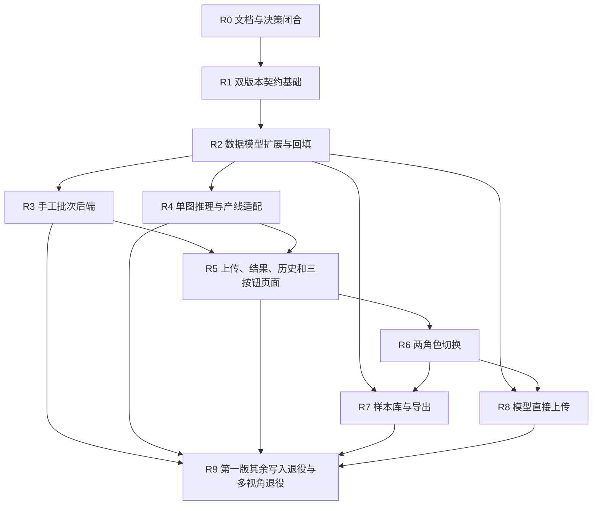

# 手工批量检测整改实施计划

## 1. 文档信息

| 项目 | 内容 |
|---|---|
| 文档编号 | `DOC-17` |
| 文档版本 | `1.1.1` |
| 状态 | 可执行整改计划，尚未开始代码实施 |
| 需求基线 | [16-手工批量检测与管理简化需求规格](16-手工批量检测与管理简化需求规格.md) `1.1.1` |
| 当前契约 | `v1 / 1.0.0` |
| 目标契约 | `v2 / 2.0.0`，兼容期与 `v1` 并存 |
| 取消范围决策 | [ADR-0003-取消内置数据集与训练管理](decisions/ADR-0003-取消内置数据集与训练管理.md) |

本文把目标整改拆为 `R0—R9` 十个可独立验收的阶段。阶段编号表示依赖顺序，不表示必须由同一人员连续完成。任何阶段只有在入口条件满足、自动化门禁真实执行、人工验收有证据且已知限制被记录后才能关闭。

本文只负责任务、依赖、所有权、验证和切换顺序。业务语义以 `DOC-16` 和同步后的领域文档为准，跨进程字段以 `contracts/` 为准。

`1.1.0` 取消在线数据集版本管理、训练运行管理和内部训练流水线。`R7` 的终点调整为可审计样本包导出，`R8` 从外部模型包直接上传开始，两阶段之间没有在线任务依赖。

`1.1.1` 同步 `DOC-16 1.1.1` 的验收追踪补丁，不改变阶段顺序、契约目标或业务边界。

## 2. 改造目标和完成定义

最终完成必须同时满足：

1. 产线模式继续可用，并已迁移为一项一原图的第二版路径。
2. 浏览器可以创建手工批次、上传多张图片并获得逐图结果和批次汇总。
3. 单张质量拒绝或技术失败不会阻断同批其他图片。
4. 第二版运行路径不存在多视角、主视角和 `image_role` 选择语义。
5. 人员页面和人员会话只暴露管理员、生产员工两类业务角色。
6. 批次历史、三按钮反馈、管理员反馈、待整理样本和导出形成闭环。
7. 管理员可以从网页直接上传模型包，经隔离验证、试运行和独立确认后启用或回退。
8. 同一组织只有一个生产默认活动模型，影子和验证运行不能形成最终生产处置。
9. 第一版消费者清零并停止写入，历史第一版和多视角证据仍可只读查询。
10. 全阶段门禁通过，真实设备和外部依赖验收没有被模拟测试冒充。
11. 第二版页面、菜单、人员权限、接口和事件中不存在数据集版本或训练运行一等资源与写能力，在线服务不依赖内部训练流水线。
12. 第一版取消写能力已独立返回 `410`；遗留读取关闭后，模型历史仍可通过通用只读来源快照验证旧标识和哈希。

## 3. 实施原则

### 3.1 契约先行

任何网络字段、枚举、错误或事件变更按以下顺序串行完成：

1. 修订对应领域文档。
2. 修改 `contracts/` 和兼容基线。
3. 运行契约校验并生成三种语言类型。
4. 提交生成物。
5. 修改后端、推理、边缘端和前端消费者。

禁止消费者提前手写第二套网络类型。

### 3.2 扩展后收紧

- 数据库先新增、回填、双写和影子读，最后才删除旧写路径。
- 接口先支持两代契约并行，最后才停止第一版消费者。
- 角色先建立目标映射和会话兼容，最后才删除旧角色选择项和旧授权。
- 推理先实现单图第二版路径和双轨验证，最后才删除多视角运行代码。

### 3.3 安全失败

未知迁移结果、哈希冲突、对象缺失、契约版本不兼容、模型验证失败和前置门禁缺失必须进入 `HOLD`、失败或阶段阻断。不得为通过阶段而使用空实现、静默跳过、假数据成功或默认 `PASS`。

### 3.4 变更所有权

- 同一时刻只允许一个任务修改契约主版本、契约生成器或兼容基线。
- 数据库迁移序列必须由 `services/business-api/` 所有者串行分配。
- 当前迁移序列已包含 `V15__dataset_build_worker_lease.sql`；新迁移必须从其后由业务后端所有者串行分配，取消范围不允许新增在线数据集构建租约依赖。
- 其他智能体或开发者的未提交改动不得被覆盖、重置或顺手格式化。
- 图片、样本导出包、模型权重、运行输出和密钥不得提交 Git。

## 4. 阶段依赖



允许并行：

- `R3` 与 `R4` 在 `R2` 新核心模型稳定后可以分模块并行。
- `R7` 和 `R8` 可以在 `R2` 后提前开发，但面向用户启用必须等待 `R6`。
- 每阶段的前端组件测试、后端领域测试和文档准备可以并行，契约和迁移写入仍须串行。

## 5. 阶段和门禁总览

| 阶段 | 目标 | 核心产物 | 阶段门禁 |
|---|---|---|---|
| `R0` | 正式需求、冲突和决策闭合 | 修订文档、追踪工具、决策记录 | `RG0` |
| `R1` | 第一版和第二版契约可并存 | 第二版契约、生成包和消费者清单 | `RG1` |
| `R2` | 新数据模型可安全承载双轨业务 | 扩展迁移、回填、双写和影子读 | `RG2` |
| `R3` | 手工批次后端和对象直传可用 | 批次、图片项、聚合和历史接口 | `RG3` |
| `R4` | 逐项单图推理和产线单项适配可用 | 第二版事件、质量检查、边缘适配 | `RG4` |
| `R5` | 手工检测核心用户流程可用 | 上传、结果、历史、三按钮页面 | `RG5` |
| `R6` | 人员角色安全收敛为两类 | 角色迁移、菜单、会话和权限回归 | `RG6` |
| `R7` | 反馈到样本导出闭环 | 管理员反馈、候选、样本包导出与外部交接 | `RG7` |
| `R8` | 模型网页直传和安全启用闭环 | 隔离上传、验证、启用和回退 | `RG8` |
| `R9` | 停止旧写路径并完成全量验收 | 第一版消费者归零、退役和上线记录 | `RG9` |

## 6. R0：文档、追踪和架构决策闭合

### 6.1 阶段目标

让每项整改有唯一语义、稳定编号、所有权和验收入口。在 `R0` 关闭前不得开始第二版消费者实现。

### 6.2 任务

| 任务编号 | 主责目录 | 交付物 | 验证 |
|---|---|---|---|
| `R0-01` | `Docs/` | 把原始功能说明标为需求来源；在索引登记 `DOC-16`、`DOC-17` 和优先级。 | 链接、编号和职责人工检查。 |
| `R0-02` | `Docs/01—14` | 按各自唯一所有权同步手工批次、单项质量、三按钮、两角色、样本和模型直传目标。 | 文档冲突清单归零。 |
| `R0-03` | `Docs/decisions/` | 建立决策记录：统一批次模型、多视角退役范围、两角色映射、模型直接上传安全边界，以及 `ADR-0003` 取消内置数据集与训练管理。 | 每份包含决策、替代方案、后果和回滚条件。 |
| `R0-04` | `tools/traceability/`、`Docs/traceability/` | 追踪工具支持 `DOC-16` 的产品编号与稳定追踪编号，映射到 `R*` 任务和测试。 | 确定性生成、唯一编号和锁文件验证。 |
| `R0-05` | `contracts/consumers/`、`Docs/baseline/` | 冻结第一版消费者、采集代理、角色用户、活动部署和历史多视角数量；消费者清单记录标识、所有者、版本、操作/事件、迁移状态、最后调用证据和遥测来源。 | 两次扫描结果一致并保存哈希摘要；缺失遥测明确阻断，不计为零调用。 |
| `R0-06` | 全仓只读扫描、`Docs/decisions/` | 冻结并批准取消清单：数据集/训练页面、菜单、权限、第二版接口事件和在线训练依赖。 | 每项有现有消费者、历史保留和退役任务。 |

### 6.3 必须关闭的冲突

1. 确认“删除多视角”只删除第二版新写和运行语义，历史证据不删除。
2. 确认“两个角色”只针对人员业务角色，设备、服务身份和内部原子权限仍保留。
3. 确认“直接上传模型”是浏览器直传隔离区，不是上传后直接加载。
4. 确认“一个启用模型”指每个组织一个生产默认活动模型；影子和验证版本不是生产启用模型。
5. 确认样本导出是在线闭环终点，模型直接上传是独立入口，二者不通过内部数据集或训练任务连接。

### 6.4 `RG0` 通过标准

- `DOC-16` 中所有 P0 需求映射到至少一个 `R*` 任务和一个验收场景。
- `Docs/README.md` 不再把无编号原始功能说明视为规范来源。
- `Docs/01—14` 与 `DOC-16` 的已知冲突均有修订或决策记录。
- 取消清单中的第二版页面、权限、接口、事件和内部训练依赖均有明确退役任务，未被换名保留。
- 追踪矩阵重复运行结果一致，锁文件验证通过。
- 当前第一版实现和历史数据基线已冻结，没有修改图片、样本导出包或模型文件。

建议命令：

```text
python tools/traceability/build_matrix.py --summary
python tools/traceability/build_matrix.py --verify-lock Docs/traceability/matrix-lock.json
make verify-layout
```

### 6.5 已识别的第一版退役对象

下列对象是 `R0-06` 的首批冻结基线，实施者必须重新扫描并记录哈希和消费者，不能只按本表删除：

| 范围 | 当前对象 | 目标任务 |
|---|---|---|
| 第一版契约 | `contracts/openapi/tool-defect-api-v1.json` 及示例、兼容基线、消费者清单中的数据集和训练操作 | `R1-06` 冻结；第二版不继承；`R2-08` 在消费者归零后停写并固定返回 `410`，`R9-01` 只删除已停写兼容代码。 |
| 模型登记硬依赖 | `ModelController`、`ModelWorkflowService`、`LifecycleEligibilityReader`、`JdbcLifecycleEligibilityReader`、`JdbcModelRepository` 和 `model_version` 的旧数据集/训练关联 | `R2-07` 扩展迁移，`R8-04`、`R8-08` 建立独立外部来源路径。 |
| 旧业务模块 | `DatasetController`、`TrainingController`、`TrainingInternalController`、`TrainingWorkflowService` 及其领域模块 | `R2-08` 先停写并返回 `410`；`R9-01`、`R9-07` 物理删除已停写兼容代码和在线消费者；历史读取按通用快照迁移。 |
| 前端 | 数据集、训练页面、路由、服务和模型页中的冻结数据集/成功训练选择器 | `R6-05` 删除入口，`R8-06` 重建直接上传页面，`R9-04` 清理兼容代码。 |
| 权限和配置 | 旧角色授权、`dataset:*`、`training:*`、内部训练回调权限、训练锁配置和训练指标 | `R6-07` 撤权，`R9-07` 清理配置、监控和回调。 |
| 在线启动链 | `jobs/dataset-builder/worker.py` 和 `tools/dev/start-all.sh` 中的数据集构建执行端启动逻辑 | `R9-07` 从部署与开发联调入口移除；历史离线校验命令不得冒充在线能力。 |

已执行数据库迁移不得回写。尤其是现有 `V15__dataset_build_worker_lease.sql` 只作为历史兼容事实保留，不允许第二版继续创建或续租在线数据集构建任务。

## 7. R1：双版本契约和生成基础

### 7.1 入口条件

- `RG0` 通过。
- 只有一个契约所有者修改生成器、基线和主契约。
- 第二版字段和状态已经由对应领域文档批准。

### 7.2 任务

| 任务编号 | 主责目录 | 交付物 | 关键验证 |
|---|---|---|---|
| `R1-01` | `tools/generate-contracts/`、`tools/verify-contracts/` | 生成器和验证器支持第一版、第二版并存及独立确定性检查。 | 两代包重复生成无漂移。 |
| `R1-02` | `contracts/json-schema/` | 第二版公共标识、批次、图片项、质量、反馈、样本、模型上传、通用只读历史来源快照和错误模式。 | 快照只能嵌入历史/审计响应；正例、边界和非法枚举验证。 |
| `R1-03` | `contracts/openapi/` | `/api/v2` 批次、历史、反馈、样本导出和模型直传接口。 | 所有写接口有幂等、冲突和权限响应。 |
| `R1-04` | `contracts/asyncapi/` | 单图片项推理、样本导出和模型验证事件。 | 事件只传引用；至少一次投递语义明确。 |
| `R1-05` | `contracts/examples/`、状态转换 | 成功、重复、冲突、未授权、校验失败、非法状态和退役 `410 / TD-LEGACY-FEATURE-RETIRED` 示例。 | 未知字段拒绝；退役不创建任务；失败不聚合为成功。 |
| `R1-06` | `contracts/compatibility/`、`contracts/consumers/` | 独立第二版基线、第一版消费者清单、取消能力退役清单和第二版接入清单。 | 第一版基线未改写；每个消费者有所有者、遥测和迁移状态。 |
| `R1-07` | 三语言生成包 | 第二版 Java、Python、TypeScript 类型和离线编译测试。 | 消费者不含手写网络枚举。 |
| `R1-08` | 契约验证规则 | 禁止第二版数据集版本和训练运行一等资源、写接口、事件、角色权限及必填关联重新进入；通用历史快照只可嵌入只读响应。 | 取消资源清单逐项负向测试和快照滥用反例。 |

### 7.3 `RG1` 通过标准

- 第一版契约和生成包保持兼容。
- 第二版不包含 `images`、`image_role`、主视角或多视角字段。
- 第二版推理任务包含单个图片项和单个原图引用。
- 批次聚合、质量检查和两角色枚举有契约语义测试。
- 第二版开放接口、异步接口和生成类型不存在数据集版本或训练运行一等资源、写能力及对应事件；通用历史快照只嵌入只读响应。
- 所有新增接口和事件都有正例、反例和消费者登记。

验证命令：

```text
make verify-contracts-source
make verify-contracts
make verify-v2-scope
make test-contract-packages-offline
```

`make verify-v2-scope` 是 `R1-08` 必须新增的真实门禁；在该目标尚未实现前不得用同名空目标或文本搜索成功关闭 `RG1`。它至少扫描第二版契约、三语言生成类型、前端路由与权限、后端权限和异步事件，并对取消清单逐项给出失败位置。

缺少严格工具链时，离线门禁通过不等于严格门禁通过；必须在具备完整工具链的环境补跑并保存证据。

## 8. R2：数据模型扩展、回填和影子读

### 8.1 入口条件

- `RG1` 通过，第二版生成类型已冻结。
- 已确认 `V15` 之后的下一个可用迁移序号，并由业务后端所有者独占。
- 已取得可恢复的数据库备份和迁移演练环境。

### 8.2 任务

| 任务编号 | 主责目录 | 交付物 | 关键验证 |
|---|---|---|---|
| `R2-01` | `services/business-api/.../db/migration/` | 批次、图片项、逐图质量、快速反馈、管理员反馈、样本候选、导出和模型上传会话扩展迁移。 | 迁移顺序、约束、索引和回滚/补偿说明。 |
| `R2-02` | 业务后端领域与仓储 | 新实体、聚合规则和只追加记录；具有第二版对应能力的旧检测/复核接口可写入新核心模型，旧数据集/训练写接口不得双写。 | 聚合、并发、幂等、不可变和取消接口拒绝测试。 |
| `R2-03` | 迁移作业 | 旧单图采集回填为旧版来源单项批次；历史多视角标为只读。 | 数量、外键、哈希和失败清单对账。 |
| `R2-04` | 查询仓储 | 新旧查询并行影子读取和差异报告。 | 同一记录关键字段无差异；未知字段不伪造。 |
| `R2-05` | 样本候选迁移 | 建立独立样本候选和来源复核实体，不创建数据集版本、划分或训练运行外键。 | 新库和升级库均可运行样本候选集成测试。 |
| `R2-06` | 审计和监控 | 批次、图片项、迁移失败和影子读差异事件。 | 日志不含图片、令牌和签名地址。 |
| `R2-07` | 模型和权限兼容迁移 | 新增 `source_kind`、外部来源快照与模型上传关联；旧关联字段兼容可空；数据库强制历史内部来源或外部上传来源互斥且至少一种完整；撤销取消权限的新分配能力，不修改历史迁移。 | 空库、升级库、合法两类来源通过；全空、不完整和双重来源均失败；旧模型仍可追溯。 |
| `R2-08` | 网关、业务后端和消费者清单 | 在取消消费者归零后独立关闭第一版数据集/训练写开关，返回 `410 / TD-LEGACY-FEATURE-RETIRED`；第一版产线写开关继续独立保留。 | 第一版从未部署且冻结消费者清单为零；停写不创建任务/事件；第一版产线写入保持独立。 |

### 8.3 数据迁移不变量

- 行数变化必须能由拆分或过滤规则解释。
- 旧 `capture_id`、图片对象、结果、复核和处置引用不得改变。
- 旧记录缺少创建人时保持未知，不能填充系统管理员。
- 旧记录缺少使用阶段时使用 `UNSPECIFIED`，不能猜测。
- 多视角记录不得自动选取第一张图片作为主图。
- 每个模型版本必须满足“完整第一版内部来源”或“完整外部上传来源”且只能满足一种；未知组合保持 `HOLD`。
- 数据库迁移失败必须回滚事务或进入明确补偿状态。

### 8.4 `RG2` 通过标准

- 空库迁移和从当前生产模式升级均成功。
- 回填重复执行幂等，失败清单稳定。
- 双写和影子读确定性集成测试无未解释差异；第一版从未部署时不要求运行观察窗。
- 新唯一约束没有通过删除冲突历史数据来满足。
- 第二版新表不存在数据集版本、训练运行或训练调度依赖。
- 第一版数据集/训练写开关已经独立关闭，退役调用明确返回 `410`；第一版产线兼容不受影响。
- 数据库集成测试在真实 PostgreSQL/Testcontainers 环境通过。

验证命令：

```text
make test-backend
make test-integration
make verify-data
```

容器运行时不可用时本阶段必须标记阻断，不能只凭后端单元测试关闭。

## 9. R3：手工批次后端和对象直传

### 9.1 入口条件

- `RG2` 通过。
- 手工原图对象前缀、配额、媒体类型和清理策略已配置。

### 9.2 任务

| 任务编号 | 主责目录 | 交付物 | 关键验证 |
|---|---|---|---|
| `R3-01` | `services/business-api/` 批次模块 | 创建批次、增加/删除图片项、上传确认和提交应用服务。 | 状态机、幂等、所有权和乐观锁。 |
| `R3-02` | 对象存储适配 | 短时单对象上传票据、对象头和 SHA-256 校验、孤儿清理。 | 越权、过期、超大小、类型伪造和哈希冲突。 |
| `R3-03` | 批次聚合 | 图片项终态触发后端重算计数和批次状态。 | 并发回调、重试、重启后可重建。 |
| `R3-04` | 查询接口 | 本人/全部批次列表、批次详情、图片项详情和稳定游标分页。 | 数据范围、排序、筛选和短时只读票据。 |
| `R3-05` | 错误与审计 | 第二版标准错误映射和批次写操作审计。 | 失败路径不产生正常结果。 |

### 9.3 `RG3` 通过标准

- 可以通过接口创建含至少 10 项的手工批次并独立确认每个对象。
- 提交只发生一次，每项只创建一个逻辑检测任务。
- 一项对象校验失败不阻止其他已确认项进入后续处理。
- 未授权用户不能读取或修改他人手工批次。
- 对象存储和数据库故障有明确补偿与对账结果。

验证命令：

```text
make test-backend
make test-integration
make test-security
make test-faults
```

## 10. R4：单图推理、逐图质量和产线适配

### 10.1 入口条件

- `RG2` 通过，`RG3` 的批次和图片项接口至少在集成环境稳定。
- 第二版推理事件和结果模式冻结。

### 10.2 任务

| 任务编号 | 主责目录 | 交付物 | 关键验证 |
|---|---|---|---|
| `R4-01` | `services/inference-service/` | 第二版单图片项消费者、单原图解码和结果回调。 | 一项一消息；重复消息幂等。 |
| `R4-02` | 推理预处理插件 | 去除第二版路径的主视角选择，输入为单图标准对象。 | 第二版代码和测试不依赖 `image_role`。 |
| `R4-03` | 质量检查器 | 可解码、刀片存在、完整性、模糊和曝光的版本化逐项结果。 | 固定正反样例和检查器异常。 |
| `R4-04` | 业务处置 | 质量拒绝、技术失败、不确定和成功结果的安全映射。 | 不合格输入不产生正常结论。 |
| `R4-05` | `apps/edge-agent/` | 第二版产线单项适配，保持本地缓存、补传和设备身份。 | 断网、重试、重复触发和哈希冲突。 |
| `R4-06` | 兼容适配 | 第一版采集代理继续写入新核心模型；消费者清单和使用指标。 | 第一版与第二版结果对账。 |

### 10.3 `RG4` 通过标准

- 手工和产线图片项均通过同一单图推理链路。
- 十张批次中一张质量拒绝时，其他九张完成且批次为部分完成。
- 全部失败、部分完成、全部完成和不确定结果的聚合符合契约。
- 新产线请求、第二版消息和推理路径不存在多视角语义。
- 第一版边缘端仍可兼容运行，且有升级清单和用量指标。

验证命令：

```text
make test-edge
make test-inference
make test-integration
make test-e2e
make test-faults
```

真实相机和触发设备验收必须在现场或受控硬件环境执行；模拟测试不能替代。

## 11. R5：浏览器上传、结果、历史和三按钮反馈

### 11.1 入口条件

- `RG3`、`RG4` 通过。
- 手工批次功能在测试环境由功能开关启用。
- 页面使用第二版 TypeScript 生成类型。

### 11.2 任务

| 任务编号 | 主责目录 | 交付物 | 关键验证 |
|---|---|---|---|
| `R5-01` | `apps/web-console/` | 点击/拖拽、多图预览、文件名、数量、删除和使用阶段表单。 | 格式、数量、删除、键盘和错误可访问性。 |
| `R5-02` | 前端上传服务 | 上传票据、并发上传、重试、确认和单一提交动作。 | 重复点击、部分上传失败和页面恢复。 |
| `R5-03` | 结果页面 | 聚合计数、优先排序、异常突出、正常折叠、自动刷新和结果图。 | 五类计数和排序与后端一致。 |
| `R5-04` | 历史页面 | 本人/全部批次列表、筛选、详情和图片项详情。 | 权限、分页、返回导航和深链接。 |
| `R5-05` | 三按钮组件 | 逐图即时反馈、幂等重试、保存状态和修订提示。 | 不存在“提交全部”；无法判断保持 `HOLD`。 |
| `R5-06` | 端到端测试 | 手工十图批次、部分质量拒绝、结果展示和反馈。 | 浏览器、后端、存储、队列和推理全链路。 |

### 11.3 交互约束

- 页面可以展示上传进度和等待状态，但不得在浏览器计算质量结论或批次终态。
- 中间处理状态不得要求生产员工进行额外操作。
- 页面刷新后必须从服务端恢复批次和逐图状态，不能依赖内存草稿冒充已保存。
- 签名地址不得写入浏览器长期存储、网址参数、日志或错误上报。
- 生产员工未反馈正常图片不得阻止批次完成。

### 11.4 `RG5` 通过标准

- 生产员工能够完成“选择图片—预览—上传—提交—自动结果—逐图反馈—历史回看”完整流程。
- 页面结果计数、排序和状态完全来自后端。
- 一张失败不会使整个页面丢失其他九张结果。
- 键盘操作、焦点、错误提示和非颜色状态标识通过组件验收。
- 所有页面使用第二版生成类型，没有复制网络枚举。

验证命令：

```text
make test-web
make test-backend
make test-integration
make test-e2e
make test-security
```

## 12. R6：人员角色收敛为两类

### 12.1 入口条件

- `RG5` 通过，目标页面和接口权限已经可用。
- `R0-05` 用户与旧角色基线完整。
- 每个旧高权限账号已有明确目标角色决定。

### 12.2 任务

| 任务编号 | 主责目录 | 交付物 | 关键验证 |
|---|---|---|---|
| `R6-01` | 契约和身份领域 | 第二版人员角色仅含 `PRODUCTION_EMPLOYEE`、`ADMINISTRATOR`。 | 设备、服务身份不受影响。 |
| `R6-02` | 身份迁移作业 | 用户映射预览、逐项确认、冲突和未确认清单。 | 不自动提权；重复执行幂等。 |
| `R6-03` | 会话和鉴权 | 新会话只返回两类角色；角色切换撤销旧会话；内部原子权限继续校验。 | 旧 Cookie/会话不能保留权限。 |
| `R6-04` | 用户管理页面 | 只显示两类角色，补齐编辑显示名称、启停和重置密码。 | 前后端越权和并发修改测试。 |
| `R6-05` | 菜单、路由和权限 | 从第二版注册表、菜单和授权中移除数据集/训练入口；第一版兼容组件仅可在停写回滚窗口内保留为不可达代码。 | 用户不可见、深链接不可达、生成权限中不存在取消写能力。 |
| `R6-06` | 手册和安全验收 | 更新管理员、生产员工和应急操作说明。 | 双人管理操作和审计链演练。 |
| `R6-07` | 权限迁移和后端鉴权 | 撤销数据集/训练人员授权，删除角色矩阵中的同类权限，并把模型审批从旧 `dataset:approve` 等权限解耦为模型专属权限。 | 现有授权对账；旧会话撤销；越权和自审批测试。 |

### 12.3 旧角色处理规则

- 仅拥有旧操作员角色且没有额外高权限的用户可以建议映射为生产员工，但仍需在迁移清单确认。
- 旧复核、质量、算法、模型、安全、审计和系统管理角色不能直接自动映射为管理员。
- 未确认账号在切换时保留历史身份引用，但禁用第二版管理权限。
- 不再使用的旧角色代码在兼容期只读保留，第一版消费者归零后才能删除赋权入口。
- 管理员拥有人员业务能力不代表可以绕过自审批禁止、资源状态、哈希校验或不可变审计。

### 12.4 `RG6` 通过标准

- 第二版登录和用户管理只出现两类人员角色。
- 迁移前后用户数量、禁用状态和历史操作者引用可对账。
- 未确认高权限用户不能获得管理员权限。
- 生产员工能创建和反馈本人批次，但不能管理用户、样本和模型。
- 管理员高风险操作仍要求不同账号并完整审计。
- 两类角色、第二版会话和菜单均不包含数据集版本或训练运行权限与入口。

验证命令：

```text
make test-backend
make test-web
make test-security
make test-e2e
```

## 13. R7：管理员反馈、待整理样本库和外部导出

### 13.1 入口条件

- `RG2` 通过；面向用户启用还要求 `RG6` 通过。
- 样本候选数据库技术债已经补齐。
- 导出对象前缀、保留期、配额和审批阈值已确认。

### 13.2 任务

| 任务编号 | 主责目录 | 交付物 | 关键验证 |
|---|---|---|---|
| `R7-01` | 业务后端复核模块 | 管理员筛选和六类反馈的不可变记录。 | 修订、审计、数据范围和并发。 |
| `R7-02` | 样本库模块 | 加入候选、幂等去重、纳入、排除和来源反馈版本。 | 候选不自动形成数据集版本或训练任务。 |
| `R7-03` | 样本导出作业 | 异步打包、清单、文件哈希、失败清单和对象存储写入。 | 单项失败不报告完整成功。 |
| `R7-04` | 下载与审计 | 短时下载票据、下载事件、到期和孤儿包清理。 | 越权、过期和重复下载策略。 |
| `R7-05` | 管理页面 | 争议筛选、管理员标记、候选列表、批量选择、导出状态和失败项。 | 大列表分页和部分失败可见。 |
| `R7-06` | 外部交接 | 导出格式说明、外部用途声明和可选接收回执；回执只能由管理员手工登记或随交接材料录入。 | 不增加外部回调、轮询、消息订阅或服务凭据；无外部训练服务仍可导出。 |
| `R7-07` | `Makefile`、样本导出测试 | 新增真实 `make verify-sample-export` 门禁，验证候选来源、纳入/排除、导出清单、哈希、部分失败、票据、审计和“无后续训练任务”。 | 正负样例真实执行；不得复用旧数据集构建门禁或空目标。 |

### 13.3 导出包最小内容

- 原图和允许导出的结果图。
- 系统结论、置信度和缺陷区域摘要。
- 生产员工人工记录和修订链。
- 管理员反馈和修订链。
- 模型、流水线和规则版本。
- 检测时间、使用阶段、来源批次和图片项标识。
- 模式版本、每个文件 SHA-256、文件数量、总字节数和失败清单。

导出包不得包含长期签名地址、访问令牌、数据库凭据或与筛选无关的数据。

### 13.4 `RG7` 通过标准

- 管理员可以从争议图片筛选到管理员标记、加入候选、纳入或排除并导出。
- 重复加入不产生重复候选；来源版本可追踪。
- 清单文件、对象数量、字节数和 SHA-256 可重复验证。
- 大文件异步生成，不经数据库、JSON 或消息队列传输。
- 导出失败和部分失败有明确状态、失败项和重试策略。
- 导出成功是在线流程终态，不产生数据集版本、训练运行、训练事件或内部流水线调用。

验证命令：

```text
make verify-sample-export
make test-backend
make test-integration
make test-security
make test-e2e
```

## 14. R8：模型直接上传、验证、启用和回退

### 14.1 入口条件

- `RG2` 通过；面向用户启用还要求 `RG6` 通过。
- 隔离桶、验证运行身份、资源限额、固定测试集和生产切换门槛已批准。
- 当前生产活动模型已经唯一化；歧义已人工关闭。
- 外部来源说明、模型包规范和受控上传约束已经批准；不得把内部数据集版本或训练运行作为入口条件。

### 14.2 任务

| 任务编号 | 主责目录 | 交付物 | 关键验证 |
|---|---|---|---|
| `R8-01` | 业务后端模型模块 | 上传会话、隔离对象票据、上传确认、外部来源说明和状态查询。 | 幂等、配额、哈希、权限、来源审计和到期。 |
| `R8-02` | 模型验证作业 | 安全解包、清单、签名、软件物料清单、白名单和恶意包拒绝。 | 路径穿越、链接、设备文件和压缩炸弹。 |
| `R8-03` | 模型运行时 | 隔离加载、输入输出校验、预热和固定图片试运行。 | 无业务凭据、无任意网络、失败可清理。 |
| `R8-04` | 模型领域和数据库 | 验证状态、`source_kind`、外部来源快照、唯一生产活动模型、启用申请和回退目标；旧关联仅兼容可空。 | 外部来源完整时无内部关联可登记；无来源、来源不完整或双重来源拒绝；并发启用唯一。 |
| `R8-05` | 运行编排 | 不同管理员确认后原子切换；失败保持旧模型；回退前重新验证。 | 崩溃、超时、预热失败和补偿。 |
| `R8-06` | 模型管理页面 | 文件选择、上传进度、验证步骤、试运行证据、申请启用、确认和回退。 | 上传不显示为已启用。 |
| `R8-07` | 历史与审计 | 检测历史固定关联实际模型；上传、验证、启用、失败和回退审计。 | 切换不改写旧记录。 |
| `R8-08` | 第一版模型兼容适配 | 从模型控制器、工作流、资格读取器、仓储和前端模型页中解除“必须成功训练运行和冻结数据集”的第二版路径；第一版历史读取保持。 | 无 `dataset_version_id`、`training_run_id` 的外部模型完成全链路；第一版历史模型仍可查。 |
| `R8-09` | `Makefile`、模型供应链测试 | 新增 `make verify-model-supply`，重构现有模型门禁以验证外部来源、隔离上传、安全加载、固定样例、审批和回退，不再把内部数据集/训练记录作为成功前置。 | 旧训练绑定不能冒充通过；非法来源组合和恶意包失败。 |
| `R8-10` | 隔离集成环境 | 新增 `make verify-online-without-training`：不部署数据集构建器/训练服务，不注入其凭据并阻断相关网络，再执行检测、复核、导出、模型上传、验证、启用和回退。 | 进程、凭据和连接确实不存在；全链路成功或安全失败证据完整。 |

### 14.3 模型包安全门禁

模型包必须：

- 先进入隔离对象前缀。
- 核对声明大小、实际大小和 SHA-256。
- 拒绝绝对路径、上级目录穿越、符号链接、硬链接、设备文件和超限压缩内容。
- 只允许清单声明的文件和受支持的框架、插件、自定义对象。
- 在无业务凭据、无任意外网权限、有限 CPU/内存/显存和只读根文件系统中加载。
- 通过固定测试图片、模式、指标和预热检查。
- 形成不可变验证证据后才允许申请启用。

### 14.4 `RG8` 通过标准

- 管理员可以在网页发起并完成隔离上传，但上传完成不会自动启用。
- 损坏、篡改、恶意、不兼容和资源超限模型均被拒绝，当前生产模型不受影响。
- 两个并发启用请求不能产生两个生产默认活动模型。
- 不同管理员确认后才能切换，且有已验证回退目标。
- 回退验证或预热失败时保持当前模型并明确失败。
- 数据集构建和训练服务未部署、不可用或没有记录时，模型上传、验证、启用和回退仍可完整运行。

验证命令：

```text
make verify-model-supply
make verify-online-without-training
make test-backend
make test-inference
make test-integration
make test-security
make test-faults
make test-e2e
```

## 15. R9：第一版其余写入退役、多视角运行语义退役和全量验收

### 15.1 入口条件

- `RG3—RG8` 全部通过。
- 第一版消费者和采集代理清单为零，或剩余项有批准的延期和隔离方案；有任何延期消费者时可以开始清理准备，但绝不能关闭 `RG9`。
- 第二版稳定运行、对账和回滚窗口达到批准时长。
- 完成数据库、对象存储和配置备份恢复演练。

### 15.2 任务

| 任务编号 | 主责目录 | 交付物 | 关键验证 |
|---|---|---|---|
| `R9-01` | 网关和业务后端 | 在 `R2-08` 已关闭取消写能力的基础上，停止其兼容代码；再按采集代理升级计划关闭其余第一版写接口。 | 各消费者指标分别归零；退役接口明确失败且有升级说明。 |
| `R9-02` | 边缘端和推理服务 | 删除运行时多视角组装、主视角选择和图片角色分支。 | 源码和第二版测试无多视角运行依赖。 |
| `R9-03` | 数据库 | 收紧第二版非空和唯一约束；旧字段只读保留或经独立批准删除。 | 升级、备份、恢复和兼容回滚演练。 |
| `R9-04` | 前端 | 物理删除 `R6` 已隐藏并撤权的旧角色、旧检测入口、数据集/训练组件、服务代码、深链接兼容和构建引用。 | 源码、路由、菜单、缓存、生成客户端和产物扫描归零。 |
| `R9-05` | 文档和运行手册 | 更新 `Docs/01—15`、手册、故障处置、上线清单和消费者清单。 | 文档不存在仍可执行的旧写步骤。 |
| `R9-06` | 全系统 | 功能、故障、安全、性能、恢复和真实设备验收。 | 所有门禁有可追溯证据。 |
| `R9-07` | 全仓退役 | 移除在线数据集构建执行端、内部训练回调/配置/指标/事件消费者和开发启动逻辑；按第 15.3 节分类归档研究代码与旧门禁。 | 源码、配置、部署、镜像和生成物扫描无在线入口；`verify-all` 不启动或依赖研究训练。 |
| `R9-08` | 模型历史和审计查询 | 把仍被引用的第一版数据集/训练来源生成带哈希的通用 `LegacyProvenanceSnapshot`；验证后关闭独立遗留读取。 | 模型历史可核对旧标识、摘要、归档引用和哈希；无独立第二版资源路由。 |
| `R9-09` | 退役契约和遥测证据 | 固化消费者清单、观察窗口、批准人、指标查询和 `410` 响应证据；延期项只能阻止门禁，不能记为零。 | 清单全关闭、连续观察窗为零、遥测完整、退役响应契约测试通过。 |

### 15.3 退役边界

- 删除的是新运行路径中的多视角语义，不是历史对象和审计证据。
- 历史多视角详情仍必须显示所有原图及“旧版多视角、不可自动重跑”提示。
- 第一版契约文件和基线在保留期内继续归档，不能为了源码搜索归零而删除历史依据。
- 数据库破坏性收紧必须独立评审；应用回滚不得依赖恢复已删除数据。

取消的数据与训练实现按以下方式处理：

| 对象 | 源码处理 | 构建与总门禁 | 生产制品和部署 |
|---|---|---|---|
| `src/tool_defect/training/` | P1 保持原位，标记为系统边界外研究资产；未经兼容测试不搬迁。 | 只允许显式离线研究命令调用；不得成为 `verify-all` 或上线门禁前置。 | 不进入业务后端、推理、边缘端或生产镜像。 |
| `jobs/training-pipeline/` | 存在时移出在线任务所有权并归档或删除启动入口；保留需有单独研究所有者。 | 旧 `verify-p6-03` 退出在线门禁；如保留，仅更名为离线研究验证且不得写业务库。 | 不构建镜像，不进入 Compose、部署清单、服务发现或监控。 |
| `jobs/dataset-builder/worker.py` | 删除在线工作进程入口；有价值的纯校验逻辑迁入样本导出或只读研究工具。 | 旧 `verify-p6-02` 不得验证第二版样本导出，也不得由 `verify-all` 启动执行端。 | 不构建、不部署、不获取业务凭据。 |
| 后端数据集/训练控制器与工作流 | 写接口在 `R2-08` 返回 `410`，`R9` 删除写路径、回调和调度；历史只通过通用快照读取。 | 只保留退役响应和历史快照测试。 | 无调度线程、租约、队列绑定、服务令牌或训练指标。 |

任何“仅离线保留”都必须同时满足：没有生产凭据、没有自动启动、没有在线接口/事件、没有生产镜像、没有 `verify-all` 可用性依赖。缺一项即视为内部流水线仍在线。

### 15.4 `RG9` 通过标准

- 所有生产写请求走第二版单图片项模型。
- 第一版写调用指标在批准观察窗内为零。
- 消费者清单全部关闭且遥测完整；存在延期消费者时 `RG9` 保持阻断。
- 两类角色、手工批次、产线单项、反馈、样本导出和模型直传均通过端到端验收。
- 历史记录、模型版本、人工修订和审计链完整。
- 第二版契约、生成类型、路由、菜单、权限、事件和部署清单中不存在数据集版本或训练运行一等资源与写能力；通用历史快照不可独立查询或修改。
- 关闭或移除所有内部训练工作进程后，在线检测、复核、样本导出、模型上传和模型切换不受影响。
- 真实设备、完整工具链和外部服务门禁均有证据；缺失任何一项则保持阻断。

最终验证命令：

```text
make verify-p1-strict
make verify-v2-scope
make verify-data
make verify-sample-export
make verify-model-supply
make verify-online-without-training
make test-core
make test-edge
make test-inference
make test-backend
make test-web
make test-integration
make test-e2e
make test-faults
make test-security
make test-performance
make verify-models
make verify-all
```

## 16. 功能开关和逐步放量

建议使用服务端配置化开关；名称可以在配置文档中调整，但语义必须保持：

| 开关 | 初始值 | 启用阶段 | 关闭或删除条件 |
|---|---|---|---|
| `contract_v2_enabled` | 关闭 | `R1` 测试环境 | 第二版成为唯一版本后删除。 |
| `manual_detection_enabled` | 关闭 | `R3` 接口测试，`R5` 用户试用 | 仅在故障回滚时临时关闭。 |
| `single_image_inference_v2_enabled` | 关闭 | `R4` 影子验证 | `R9` 成为固定行为后删除。 |
| `two_person_roles_enabled` | 关闭 | `R6` 分组织切换 | 全部用户迁移后删除。 |
| `sample_staging_enabled` | 关闭 | `R7` 管理员试用 | 数据或导出故障时关闭写入。 |
| `direct_model_upload_enabled` | 关闭 | `R8` 管理员试用 | 验证基础设施异常时关闭。 |
| `legacy_dataset_training_write_enabled` | 开启 | `R1` 弃用、`R2` 迁移验证 | `RG2` 前在消费者归零后独立关闭；不得等待 `R9` 或第一版产线写入。 |
| `legacy_v1_write_enabled` | 开启 | `R1—R8` 兼容期 | `R9` 消费者归零后关闭。 |

开关必须由后端强制，前端开关只影响显示。关闭功能不得删除已产生事实，也不得把处理中任务改为成功。

## 17. 发布和回滚策略

### 17.1 推荐放量顺序

1. 开发环境：第二版契约、数据库和所有新模块。
2. 集成环境：第一版和第二版并行、故障注入和数据回填。
3. 取消能力停写：数据集/训练消费者归零后独立关闭其第一版写开关，验证 `410`；第一版产线继续运行。
4. 预生产：复制结构化脱敏数据，验证权限、容量、模型和恢复。
5. 管理员试用：样本和模型功能先限少量管理员。
6. 生产员工试用：手工批次按组织或工位小范围启用。
7. 产线第二版：逐台升级采集代理，保留第一版回退窗口。
8. 全量切换：关闭剩余第一版新写，观察后退役多视角运行代码。

### 17.2 回滚原则

- 应用和前端可以回滚到上一兼容版本，但不能删除已经写入的第二版事实。
- 兼容期数据库迁移以向前修复和补偿为主，不执行会丢数据的反向迁移。
- 手工批次故障时可以关闭新建入口，已提交批次继续完成或明确进入 `HOLD`。
- 第二版产线故障时只允许回到已验证且仍开启的第一版适配，不能临时恢复多视角猜测。
- 模型上传和验证故障时关闭上传入口；当前生产模型保持不变。
- 角色迁移回滚必须恢复经过审核的映射和撤销会话，不能仅改前端选项。

## 18. 需求到阶段覆盖

| 需求组 | 主阶段 | 依赖阶段 | 最终门禁 |
|---|---|---|---|
| `FR-GOV-*` | `R0`、`R1`、`R9` | 全阶段 | `RG9` |
| `FR-IAM-*` | `R6` | `R1`、`R2`、`R5` | `RG6`、`RG9` |
| `FR-BAT-*` | `R2`、`R3`、`R4`、`R5` | `R1` | `RG5`、`RG9` |
| `FR-QUA-*` | `R4` | `R1`、`R2` | `RG4`、`RG9` |
| `FR-INF-*` | `R4`、`R5` | `R1—R3` | `RG5`、`RG9` |
| `FR-REV-*` | `R5`、`R7` | `R2—R4` | `RG7`、`RG9` |
| `FR-HIS-*` | `R3`、`R5` | `R2` | `RG5`、`RG9` |
| `FR-SMP-*` | `R7` | `R2`、`R6` | `RG7`、`RG9` |
| `FR-MDL-*` | `R8` | `R1`、`R2`、`R6` | `RG8`、`RG9` |
| `NFR-*` | 每阶段 | `R0`、`R1` | 各阶段门禁、`RG9` |
| `MIG-*` | `R1`、`R2`、`R6`、`R9` | `R0` | `RG9` |

## 19. 主要风险和控制

| 风险 | 影响 | 控制措施 | 阻断门禁 |
|---|---|---|---|
| 第一版生成器硬编码 | 第二版类型混乱或覆盖第一版 | `R1-01` 先实现多版本生成和独立基线。 | `RG1` |
| 迁移序号冲突 | 数据库升级不可重复 | 等待当前未提交迁移收口，单一所有者分配。 | `RG2` |
| 多视角历史被误转 | 丢图或错误重跑 | 标记旧版只读、完整证据保留、人工选择另建新任务。 | `RG2`、`RG9` |
| 批次并发计数漂移 | 历史和页面状态错误 | 事实项驱动聚合、事务锁或版本、可重算对账。 | `RG3` |
| 两角色导致提权 | 安全与审计失效 | 迁移预览、逐人确认、未确认禁用、会话撤销。 | `RG6` |
| 三按钮绕过正式复核 | 错误生产处置 | 只写不可变人工记录，后端处置和二审策略继续生效。 | `RG5` |
| 大样本同步导出 | 内存、超时和数据泄露 | 异步作业、对象存储、短时票据和审批审计。 | `RG7` |
| 样本导出误触发内部训练 | 取消能力以隐式任务形式回流 | 契约负向门禁、导出终态测试、移除事件消费者和启动脚本。 | `RG1`、`RG7`、`RG9` |
| 模型直传仍依赖旧训练外键 | 外部模型无法登记，内部流水线被迫保留 | 扩展迁移允许旧关联可空、外部来源实体、第二版独立端到端测试。 | `RG2`、`RG8` |
| 恶意模型包 | 代码执行或资源耗尽 | 隔离解包、白名单、限额、无网络加载和固定试运行。 | `RG8` |
| 唯一活动模型竞态 | 同时启用多个生产模型 | 数据库唯一约束和原子切换事务。 | `RG8` |
| 模拟测试冒充现场通过 | 上线后硬件或依赖失败 | 真实设备、容器和外部服务证据单独列为必需。 | `RG9` |

## 20. 每个任务的交付模板

每项任务必须使用以下交接信息：

```text
任务编号：
需求编号：
契约版本：
代码提交或工作区基线：
来源文档：
修改目录：
数据库迁移：
生成包版本：
验证环境：
验证命令：
命令结果：
测试报告或制品位置：
失败和阻断项：
已知限制：
回滚或补偿方式：
后续任务可依赖的稳定接口：
```

任务交付不得只写“测试通过”。必须记录实际命令、退出状态、测试数量、被跳过项和缺失前置条件。缺少容器、真实设备、完整工具链或外部服务时，对应验证必须记录为阻断或未执行。
