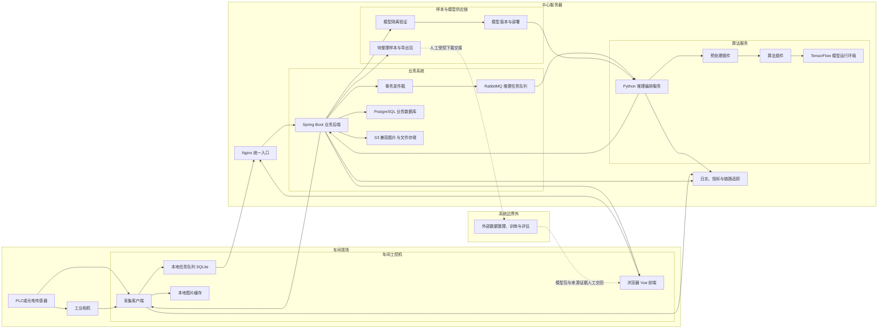

# 刀具缺陷检测系统方案文档

## 1. 文档目的

本目录给出从车间采集、浏览器手工批量检测、中心推理、人工复核、样本导出到外部模型包接入与发布的完整工程化方案。方案以当前仓库的真实能力为起点，并把目标架构中尚未实现的部分明确标为新建内容。在线系统不管理数据集版本，也不创建、调度或监控内部训练运行。

本文档集采用以下状态标记：

- **现有复用**：当前仓库已有代码、数据或可加载产物，可以封装后复用。
- **适配改造**：当前能力存在，但接口、部署方式、审计或安全性不满足生产要求。
- **新建建设**：当前仓库尚无对应实现。
- **上线前置**：不完成就不能进入生产检测。

## 2. 当前项目基线

### 2.1 已确认能力

| 范围 | 当前情况 | 方案定位 |
|---|---|---|
| 历史样本 | 180 张刀具图像，98 张合格、82 张不合格；有对应二值掩膜，82 份不合格样本有 Labelme 标注 | **现有复用**，只读登记为历史研究资产，不创建在线数据集版本 |
| 无泄漏研究清单 | 排除 2 个冲突样本并做精确去重后保留 172 个样本，历史训练、验证、测试为 110、28、34 | **现有复用**，仅作为边界外研究和回归证据 |
| 分类推理 | 支持 Keras JSON/H5 模型，输入尺寸从模型读取 | **适配改造**，当前未发现可配套使用的分类权重 |
| 分类与分割双任务 | 输出 `cla_out` 和 `seg_out`，支持分类概率、二值掩膜和可视化 | **现有复用**，封装为算法插件 |
| 环形预处理 | 支持椭圆定位、斜拍校正、边界跟踪、自适应环形区域和边界归一化展开 | **现有复用**，封装为预处理插件 |
| 极坐标异常检测 | 支持无标签标定、异常热图、区域和原图映射 | **适配改造**，当前模型文件版本为 1，而代码只接受版本 2，必须重新标定 |
| 历史训练与评估工具 | 支持普通训练、两阶段重训练、同测试集比较和配对自助法置信区间 | **边界外保留**，不得由业务后端调用或进入在线部署 |
| 历史训练产物 | `outputs/training` 下有 3 组可加载的双任务 `model.json` 与 `weights.h5` | **上线前置**，整理为外部来源模型包并经直接上传、隔离校验和固定样例验证后登记 |
| 旧界面 | `app/legacy` 是 PyQt 原型，可打开普通摄像头并本地加载模型 | 只作交互参考，不作为生产客户端 |
| 业务系统 | 尚无 Spring Boot 后端、Vue 前端、中心数据库、任务队列、对象存储或采集服务 | **新建建设** |

当前三个双任务训练目录均可在本项目环境中加载，输入为 `256 x 256 x 3`，输出为 `cla_out` 和 `seg_out`。目录名只能作为配置对应关系的线索，不能代替训练配置、数据版本、日志和评估报告。迁移时不得把 `artifacts/multitask/model.json` 与这些目录中的权重混配。

### 2.2 当前业务范围

首期系统只承诺：

1. R8 圆形机夹式刀具的合格与不合格二分类。
2. 二值缺陷区域分割或无标签异常区域提示。
3. 对不确定、算法失败或结果矛盾的样本进行人工复核。

“磨损、剥落、崩刃、塑性变形”等多缺陷类型在现有数据中没有完整的多类别训练与验证闭环。前端可以预留缺陷类型字典，但不能把它们表述为当前算法已能识别的类别。

## 3. 目标架构

数据库是在线业务状态的唯一事实源；对象存储是图片、掩膜、样本导出包和模型包的唯一文件事实源；模型元数据与部署记录共同构成模型技术版本事实。队列只传递任务引用，不保存业务事实或二进制内容。外部训练环境没有在线业务凭据、接口或可用性依赖。

## 4. 统一术语

| 术语 | 含义 |
|---|---|
| `capture_id` | 一次物理触发对应的采集事件标识，由采集端生成，全链路不变 |
| `batch_id` | 一次手工上传或一次产线单项采集所属检测批次的 UUID；第二版新增 |
| `batch_no` | 人类可读的检测批次编号，不替代 `batch_id` |
| `batch_item_id` | 检测批次中的独立图片项；第二版中一项只绑定一张刀片原图 |
| `image_id` | 一张原图或派生图片的标识 |
| `detection_task_id` | 一次指定算法流水线的检测任务标识 |
| `attempt_id` | 检测任务的一次具体执行尝试 |
| `review_task_id` | 一次人工复核工作项 |
| 算法结论 | `QUALIFIED`、`UNQUALIFIED` 或 `INCONCLUSIVE`，只代表算法输出 |
| 业务处置 | `PASS`、`FAIL` 或 `HOLD`，代表最终生产处置 |
| 流水线版本 | 预处理插件、算法插件、模型版本和配置哈希的不可变组合 |
| 原图 | 相机采集的原始文件，上传后不可覆盖 |
| 派生图 | 缩略图、掩膜、热图、叠加图、极坐标图或复核修订掩膜 |

算法结论和业务处置必须分开保存。人工结论不覆盖算法原始结果，模型升级也不回写历史结果。

## 5. 文档职责与唯一来源

| 文档 | 唯一负责内容 | 明确不负责 |
|---|---|---|
| [01-核心设计原则](01-核心设计原则.md) | 跨模块不可违反的原则和系统边界 | 字段、接口和页面细节 |
| [02-完整检测业务流程](02-完整检测业务流程.md) | 端到端流程、中央状态机和最终判定顺序 | 表结构和网络报文 |
| [03-算法与预处理通用接口设计](03-算法与预处理通用接口设计.md) | Python 进程内插件协议、模型包和标准算法结果 | 对外业务接口 |
| [04-人工复核系统](04-人工复核系统.md) | 复核触发、分派、操作、冲突和质量规则 | 数据表及接口路径 |
| [05-数据库设计](05-数据库设计.md) | 持久化模型、约束、索引、事务和归档 | 业务流程决策 |
| [06-接口设计](06-接口设计.md) | HTTP、事件、鉴权、幂等和错误报文 | 数据库内部实现 |
| [07-图片存储方案](07-图片存储方案.md) | 边缘缓存、中央对象键、校验、生命周期和备份 | 业务结果状态 |
| [08-增量训练闭环](08-增量训练闭环.md) | 样本回流与导出、外部训练边界、模型包接入、发布和回滚 | 在线检测编排和外部训练执行 |
| [09-前端功能规划](09-前端功能规划.md) | 页面、交互、权限可见性和实施优先级 | 后端业务规则 |
| [10-异常处理](10-异常处理.md) | 错误分类、重试、补偿、降级和死信处置 | 告警阈值和日志格式 |
| [11-日志与监控](11-日志与监控.md) | 日志字段、指标、追踪、看板和告警 | 业务重试策略 |
| [12-安全权限与角色](12-安全权限与角色.md) | 身份、角色、权限、网络、密钥和审计要求 | 页面布局 |
| [13-推荐项目代码结构](13-推荐项目代码结构.md) | 仓库布局、模块所有权、依赖方向和迁移顺序 | 技术产品选型理由 |
| [14-技术选型](14-技术选型.md) | 技术栈、版本基线、选型理由和替代方案 | 具体业务字段 |
| [15-系统分阶段构建与智能体任务计划](15-系统分阶段构建与智能体任务计划.md) | 原系统建设阶段、任务所有权和统一门禁 | 新增整改的产品语义 |
| [16-手工批量检测与管理简化需求规格](16-手工批量检测与管理简化需求规格.md) | 手工批量检测整改的产品目标、正式需求编号、明确兼容例外和验收场景 | 最终数据库字段、网络模式和实现代码 |
| [17-手工批量检测整改实施计划](17-手工批量检测整改实施计划.md) | `DOC-16` 的整改任务、依赖、阶段门禁、放量和回滚顺序 | 重新定义领域业务语义 |

当不同文档对同一内容表述不一致时，以本表指定的“唯一负责文档”为准，其他文档只作引用。

`DOC-16` 是已确认整改目标的增量来源。`1.1.0` 对以下变化具有优先级：新增手工批量模式、新写入采用一项一原图、人员业务角色收敛为两类、模型由管理员网页直接上传至隔离区，以及取消在线数据集版本管理、内部训练运行管理和相关页面、权限、第二版接口、事件与在线依赖。它不降低 `01` 的安全失败、事实不可变和服务隔离要求，也不允许消费者绕过 `contracts/` 手写网络字段。具体边界见 [ADR-0003](decisions/ADR-0003-取消内置数据集与训练管理.md)。

整改实施时按以下规则闭合冲突：

1. 先依据 `DOC-16` 修订受影响的 `02—14` 唯一来源文档。
2. 再修改 `contracts/`、兼容基线和三语言生成包。
3. 最后修改后端、推理、边缘端和前端消费者。
4. 对应领域文档和契约尚未同步时，该项整改属于“未闭合”，不得宣称实现完成。
5. [刀片缺陷识别系统功能文档](刀片缺陷识别系统功能文档.md)仅保留为原始需求来源，不再单独承担规范优先级。

## 6. 尚需现场确认的输入

以下信息不会阻塞代码骨架建设，但会影响配置和验收：

1. PLC 或传感器协议、工业相机型号、厂商软件开发包和触发时序。
2. 单刀检测节拍、允许延迟、网络中断最长时长和本地磁盘容量。
3. 自动放行阈值、漏检容忍度、抽检比例和复核时限。
4. 图片、审核记录、样本导出包和模型包的保留期限及合规要求。
5. 中心服务器的操作系统、CPU、GPU、磁盘、备份和高可用条件。
6. 公司现有统一身份、对象存储、消息队列和监控平台是否可复用。

这些参数必须配置化并通过验收记录固化，不能散落在代码中。
