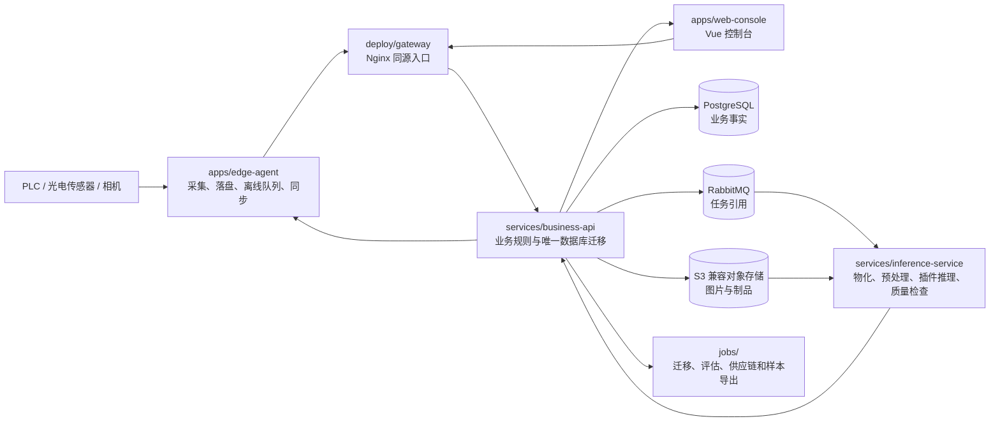

# 完整系统分支：项目结构与逐文件说明

## 1. 文档信息

| 项目 | 内容 |
|---|---|
| 任务编号 | `DOC-STRUCTURE-001` |
| 文档版本 | `v1.0.0` |
| 盘点日期 | 2026-08-07 |
| 盘点提交 | `4bfbceb` |
| 盘点口径 | 当前 Git 已跟踪的 1049 个原有文件，加本文档，共 1050 个文件；不含 `.git/`、`.venv/`、缓存和未跟踪运行产物 |
| 契约版本 | `v1` 与 `v2` 并存；唯一来源为 `contracts/`，三语言网络类型由 `tools/generate-contracts/` 生成 |
| 适用范围 | “完整系统分支”的代码、契约、配置、文档、冻结数据基线、测试和部署结构 |

> 文件存在不等于生产验收通过。真实设备、外部服务、Docker、Maven、Node.js 20.13.1 或模型权重缺失时，相应严格门禁仍应失败或保持 `HOLD`。

## 2. 项目定位

这是刀片缺陷识别完整系统的单仓库实现。仓库在保留早期 Python 算法资产的同时，建设了边缘采集端、Spring Boot 业务后端、Python 推理服务和 Vue Web 控制台。`contracts/` 是跨进程语义的唯一事实来源；PostgreSQL 保存在线业务事实；S3 兼容对象存储保存原图、派生图和受控制品；RabbitMQ 只传递任务引用；OpenTelemetry、Prometheus、Loki、Tempo 和 Grafana 提供可观测性。

在线系统不创建、调度或监控内部训练。训练、历史模型比较、模型包校验、制品迁移和样本导出位于算法核心或 `jobs/` 的受控边界内。

## 3. 运行时关系



关键依赖规则：

- Web 控制台只展示业务后端返回的最终处置，不实现最终 `PASS/FAIL/HOLD` 规则。
- 业务后端不导入 Python 算法；推理服务不访问业务数据库；插件不访问网络、数据库或队列。
- 跨进程变更先改 `contracts/`，再生成 Java/Python/TypeScript 包，最后修改消费者。
- 技术失败、未知状态、哈希冲突、契约不兼容或前置缺失不得产生 `PASS`。
- `src/tool_defect/` 在 P1 保持原位；`data/manifests/` 和 `data/masks/` 是迁移前冻结基线。

## 4. 顶层结构

```text
tool_defect_project/
├── .github/                  # CODEOWNERS 与 CI
├── app/legacy/               # 旧 PyQt 原型
├── apps/
│   ├── edge-agent/           # 现场采集、离线队列、设备适配与同步
│   └── web-console/          # Vue 3 管理/工位控制台
├── artifacts/                # 冻结模型结构与标定元数据
├── configs/                  # 算法及现场参数配置
├── contracts/                # OpenAPI、AsyncAPI、JSON Schema 与兼容基线
├── data/                     # 冻结清单与掩码基线
├── database/                 # 数据库边界说明与参考数据
├── deploy/                   # Compose、Nginx、安全、监控和预检
├── docs/                     # 设计、需求、ADR、报告、追溯与手册
├── jobs/                     # 离线迁移、评估、供应、恢复和导出
├── outputs/                  # 本地运行输出占位
├── packages/                 # 三语言生成契约包
├── requirements/             # 分运行域 Python 锁文件
├── services/
│   ├── business-api/         # Java/Spring Boot 模块化单体
│   └── inference-service/    # Python 推理消费者与插件编排
├── src/tool_defect/          # 原位算法核心
├── tests/                    # 仓库级测试
├── tools/                    # 生成、验证、安全和运维工具
├── Makefile                  # 全仓统一验证入口
└── README.md                 # 项目总入口
```

## 5. 主要模块职责

| 模块 | 主要内容 | 明确边界 |
|---|---|---|
| `apps/edge-agent` | 相机/传感器适配、原子落盘、SQLite WAL、离线重试、上传和心跳 | 不保存或推导最终业务处置；厂商 SDK 只进入 `adapters/` |
| `apps/web-console` | 登录、权限路由、工位、手工检测、复核、质量、模型、审计和样本库 | 不持久化会话秘密，不绕过后端鉴权，不实现最终处置 |
| `services/business-api` | 身份、检测、批次、复核、存储、样本、模型、部署、质量、审计和可靠消息 | 唯一拥有业务数据库迁移；领域层不依赖框架和基础设施 |
| `services/inference-service` | 任务消费、对象物化、模型预热、插件流水线、质量检查和结果回调 | 不直连业务数据库；后端接受结果后才确认消息 |
| `src/tool_defect` | 数据处理、环形几何、异常检测、模型、训练、推理、评估和插件协议 | 保持兼容导入；不承载在线 HTTP、数据库或权限 |
| `contracts` + `packages` | 两代 API/事件/错误语义及生成的三语言消费者类型 | 生成文件禁止手改 |
| `jobs` | 制品迁移、模型评估/供应、生产迁移/恢复和样本导出 | 缺证据或哈希冲突时失败/`HOLD` |
| `deploy` | 开发/生产编排、安全、网关、监控、现场配置和预检 | 示例不含密码、令牌或私钥 |
| `tools` + `tests` | 统一验证、契约生成、SBOM、安全扫描和阶段验收 | 缺工具链或外部前置时不得静默跳过 |

## 6. 文件数量概览

下面逐一列出全部 1050 个文件。掩码图片虽然用途一致，也保留每个路径，不做省略。

| 区域 | 文件数 | 内容 |
|---|---:|---|
| `.github` | 2 | 代码所有权和持续集成。 |
| `(root)` | 16 | 仓库入口、依赖、执行脚本、计划和审计记录。 |
| `app` | 8 | 旧版 PyQt 桌面原型，仅作迁移与交互参考。 |
| `apps` | 122 | 边缘采集端和 Vue Web 控制台。 |
| `artifacts` | 4 | 冻结的模型结构与标定元数据；不含模型权重。 |
| `configs` | 8 | 算法训练、重训练、环形预处理和现场参数配置。 |
| `contracts` | 38 | 跨进程字段、枚举、错误、事件及兼容基线的唯一来源。 |
| `data` | 183 | 迁移前冻结的数据清单和二值掩码。 |
| `database` | 2 | 数据库边界说明和跨模块参考权限数据。 |
| `deploy` | 32 | 开发/生产编排、网关、安全、监控和环境预检。 |
| `docs` | 73 | 设计、需求、决策、报告、追溯矩阵和运维手册。 |
| `jobs` | 33 | 迁移、评估、模型供应、恢复和样本导出等离线作业。 |
| `outputs` | 1 | 本地运行输出占位目录。 |
| `packages` | 25 | 三语言生成契约包及算法核心兼容层说明。 |
| `requirements` | 4 | 按运行域冻结的 Python 依赖。 |
| `services` | 328 | Spring Boot 业务 API 和 Python 推理服务。 |
| `src` | 50 | 原位保留的 Python 算法核心、训练、推理、评估和插件协议。 |
| `tests` | 68 | 仓库级单元、集成、安全、性能和阶段门禁测试。 |
| `tools` | 53 | 契约生成、环境、布局、安全、监控、运维和发布验证工具。 |

## 7. 逐文件索引

### `.github/`（2 个文件）

代码所有权和持续集成。

- `.github/CODEOWNERS` — 关键目录和文件的代码审查所有者。
- `.github/workflows/p1-contracts.yml` — 执行 P1 契约与源码门禁的 CI 工作流。

### 根目录（16 个文件）

仓库入口、依赖、执行脚本、计划和审计记录。

- `.gitignore` — Git 忽略规则，排除虚拟环境、密钥、权重、数据和运行产物。
- `AGENTS.md` — 智能体协作、仓库边界、安全失败、修改所有权和验证规则。
- `findings.md` — 项目审查发现、风险和证据工作记录。
- `Makefile` — 全仓统一验证入口，编排 P1～P7、服务、安全和发布门禁。
- `predict.bat` — Windows CMD 推理快捷脚本。
- `predict.ps1` — PowerShell 推理快捷脚本。
- `progress.md` — 分阶段实施进展、验证结果和交接记录。
- `pyproject.toml` — 根 Python 项目的构建元数据和包发现配置。
- `README.md` — 项目总览及算法训练、推理、评估和常用命令入口。
- `requirements-app.txt` — 旧版桌面应用附加依赖入口。
- `requirements.txt` — 算法核心运行与测试依赖入口。
- `run_ring_batch.py` — 批量执行环形刀片处理/检测的脚本。
- `setup.cfg` — Python src 布局和安装配置。
- `task_plan.md` — 系统建设任务、依赖和验收计划。
- `uv.lock` — 根 Python 环境的 uv 锁文件。
- `完整系统分支.md` — 本文档：完整系统结构和逐文件说明。

### `app/`（8 个文件）

旧版 PyQt 桌面原型，仅作迁移与交互参考。

- `app/legacy/A_app0.py` — 旧版 PyQt 界面、资源或本地推理原型。
- `app/legacy/A_app0.ui` — 旧版 PyQt 界面、资源或本地推理原型。
- `app/legacy/A_chedaoyuce0.py` — 旧版 PyQt 界面、资源或本地推理原型。
- `app/legacy/daojulogo.py` — 旧版 PyQt 界面、资源或本地推理原型。
- `app/legacy/daojulogo.qrc` — 旧版 PyQt 界面、资源或本地推理原型。
- `app/legacy/logo.tyut.png` — 旧版 PyQt 界面、资源或本地推理原型。
- `app/legacy/README.md` — 说明 `app/legacy` 的职责、边界、用法和验证方式。
- `app/legacy/tyut.jpg` — 旧版 PyQt 界面、资源或本地推理原型。

### `apps/`（122 个文件）

边缘采集端和 Vue Web 控制台。

- `apps/edge-agent/migrations/001_initial.sql` — 创建 SQLite 本地队列和状态投影初始表。
- `apps/edge-agent/pyproject.toml` — 边缘采集端独立 Python 构建和依赖配置。
- `apps/edge-agent/README.md` — 说明 `apps/edge-agent` 的职责、边界、用法和验证方式。
- `apps/edge-agent/scripts/hardware-acceptance-config.template.json` — 真实硬件验收脚本或参数模板。
- `apps/edge-agent/scripts/hardware_acceptance.py` — 真实硬件验收脚本或参数模板。
- `apps/edge-agent/src/edge_agent/__init__.py` — 初始化 Python 包 `apps.edge-agent.src.edge_agent` 并按需导出公共符号。
- `apps/edge-agent/src/edge_agent/adapters/__init__.py` — 初始化 Python 包 `apps.edge-agent.src.edge_agent.adapters` 并按需导出公共符号。
- `apps/edge-agent/src/edge_agent/adapters/ports.py` — 边缘采集端 adapters 模块：ports。
- `apps/edge-agent/src/edge_agent/adapters/simulated.py` — 边缘采集端 adapters 模块：simulated。
- `apps/edge-agent/src/edge_agent/adapters/vendor/__init__.py` — 初始化 Python 包 `apps.edge-agent.src.edge_agent.adapters.vendor` 并按需导出公共符号。
- `apps/edge-agent/src/edge_agent/adapters/vendor/gige_camera.py` — 边缘采集端 adapters 模块：gige camera。
- `apps/edge-agent/src/edge_agent/adapters/vendor/optical_sensor.py` — 边缘采集端 adapters 模块：optical sensor。
- `apps/edge-agent/src/edge_agent/adapters/vendor/plc_trigger.py` — 边缘采集端 adapters 模块：plc trigger。
- `apps/edge-agent/src/edge_agent/adapters/vendor/usb_camera.py` — 边缘采集端 adapters 模块：usb camera。
- `apps/edge-agent/src/edge_agent/capture/__init__.py` — 初始化 Python 包 `apps.edge-agent.src.edge_agent.capture` 并按需导出公共符号。
- `apps/edge-agent/src/edge_agent/capture/coordinator.py` — 边缘采集端 capture 模块：coordinator。
- `apps/edge-agent/src/edge_agent/capture/models.py` — 边缘采集端 capture 模块：models。
- `apps/edge-agent/src/edge_agent/capture/storage.py` — 边缘采集端 capture 模块：storage。
- `apps/edge-agent/src/edge_agent/health/__init__.py` — 初始化 Python 包 `apps.edge-agent.src.edge_agent.health` 并按需导出公共符号。
- `apps/edge-agent/src/edge_agent/health/disk_watermark.py` — 边缘采集端 health 模块：disk watermark。
- `apps/edge-agent/src/edge_agent/health/heartbeat.py` — 边缘采集端 health 模块：heartbeat。
- `apps/edge-agent/src/edge_agent/local_queue/__init__.py` — 初始化 Python 包 `apps.edge-agent.src.edge_agent.local_queue` 并按需导出公共符号。
- `apps/edge-agent/src/edge_agent/local_queue/database.py` — 边缘采集端 local_queue 模块：database。
- `apps/edge-agent/src/edge_agent/local_queue/models.py` — 边缘采集端 local_queue 模块：models。
- `apps/edge-agent/src/edge_agent/local_queue/recovery.py` — 边缘采集端 local_queue 模块：recovery。
- `apps/edge-agent/src/edge_agent/sync/__init__.py` — 初始化 Python 包 `apps.edge-agent.src.edge_agent.sync` 并按需导出公共符号。
- `apps/edge-agent/src/edge_agent/sync/backoff.py` — 边缘采集端 sync 模块：backoff。
- `apps/edge-agent/src/edge_agent/sync/client.py` — 边缘采集端 sync 模块：client。
- `apps/edge-agent/src/edge_agent/sync/generated_client.py` — 边缘采集端 sync 模块：generated client。
- `apps/edge-agent/src/edge_agent/sync/http_transport.py` — 边缘采集端 sync 模块：http transport。
- `apps/edge-agent/src/edge_agent/sync/production_v2.py` — 边缘采集端 sync 模块：production v2。
- `apps/edge-agent/src/edge_agent/telemetry.py` — 边缘采集端 telemetry.py 模块：telemetry。
- `apps/edge-agent/tests/device_fixtures.py` — 边缘采集端测试：验证 device fixtures。
- `apps/edge-agent/tests/test_adapters.py` — 边缘采集端测试：验证 adapters。
- `apps/edge-agent/tests/test_capture_storage.py` — 边缘采集端测试：验证 capture storage。
- `apps/edge-agent/tests/test_disk_watermark.py` — 边缘采集端测试：验证 disk watermark。
- `apps/edge-agent/tests/test_generated_client.py` — 边缘采集端测试：验证 generated client。
- `apps/edge-agent/tests/test_hardware_acceptance.py` — 边缘采集端测试：验证 hardware acceptance。
- `apps/edge-agent/tests/test_heartbeat.py` — 边缘采集端测试：验证 heartbeat。
- `apps/edge-agent/tests/test_http_transport.py` — 边缘采集端测试：验证 http transport。
- `apps/edge-agent/tests/test_local_queue.py` — 边缘采集端测试：验证 local queue。
- `apps/edge-agent/tests/test_queue_recovery.py` — 边缘采集端测试：验证 queue recovery。
- `apps/edge-agent/tests/test_r4_production_v2.py` — 边缘采集端测试：验证 r4 production v2。
- `apps/edge-agent/tests/test_sync.py` — 边缘采集端测试：验证 sync。
- `apps/edge-agent/tests/test_telemetry.py` — 边缘采集端测试：验证 telemetry。
- `apps/edge-agent/tests/test_vendor_adapters.py` — 边缘采集端测试：验证 vendor adapters。
- `apps/web-console/.node-version` — Web 控制台构建、依赖、TypeScript 或 Vite 配置。
- `apps/web-console/index.html` — Web 控制台构建、依赖、TypeScript 或 Vite 配置。
- `apps/web-console/package.json` — Web 控制台构建、依赖、TypeScript 或 Vite 配置。
- `apps/web-console/pnpm-lock.yaml` — Web 控制台构建、依赖、TypeScript 或 Vite 配置。
- `apps/web-console/README.md` — 说明 `apps/web-console` 的职责、边界、用法和验证方式。
- `apps/web-console/src/api/client.ts` — 统一 API 请求、错误、事件流或短时地址逻辑。
- `apps/web-console/src/api/ephemeral-urls.ts` — 统一 API 请求、错误、事件流或短时地址逻辑。
- `apps/web-console/src/api/errors.ts` — 统一 API 请求、错误、事件流或短时地址逻辑。
- `apps/web-console/src/api/event-stream.ts` — 统一 API 请求、错误、事件流或短时地址逻辑。
- `apps/web-console/src/api/generated.ts` — 统一 API 请求、错误、事件流或短时地址逻辑。
- `apps/web-console/src/api/runtime.ts` — 统一 API 请求、错误、事件流或短时地址逻辑。
- `apps/web-console/src/App.vue` — Web 控制台页面/组件：App。
- `apps/web-console/src/auth/local-auth.ts` — 同源本地会话认证和类型定义。
- `apps/web-console/src/auth/memory-session.ts` — 同源本地会话认证和类型定义。
- `apps/web-console/src/auth/types.ts` — 同源本地会话认证和类型定义。
- `apps/web-console/src/components/AppShell.vue` — Web 控制台页面/组件：AppShell。
- `apps/web-console/src/components/DispositionStatus.vue` — Web 控制台页面/组件：DispositionStatus。
- `apps/web-console/src/components/EvidenceImage.vue` — Web 控制台页面/组件：EvidenceImage。
- `apps/web-console/src/components/image-workbench/binary-png.ts` — Web 控制台入口或辅助模块：binary-png。
- `apps/web-console/src/components/image-workbench/mask-history.ts` — Web 控制台入口或辅助模块：mask-history。
- `apps/web-console/src/components/image-workbench/MaskWorkbench.vue` — Web 控制台页面/组件：MaskWorkbench。
- `apps/web-console/src/env.d.ts` — Web 控制台入口或辅助模块：env.d。
- `apps/web-console/src/features/audit/AuditTrailView.vue` — 审计轨迹页面/组件：AuditTrailView。
- `apps/web-console/src/features/audit/service.ts` — 审计轨迹的前端服务、状态或辅助逻辑。
- `apps/web-console/src/features/detections/image-tickets.ts` — 检测查询的前端服务、状态或辅助逻辑。
- `apps/web-console/src/features/detections/service.ts` — 检测查询的前端服务、状态或辅助逻辑。
- `apps/web-console/src/features/manual-detection/ManualDetectionDetailView.vue` — 手工批量检测页面/组件：ManualDetectionDetailView。
- `apps/web-console/src/features/manual-detection/ManualDetectionHistoryView.vue` — 手工批量检测页面/组件：ManualDetectionHistoryView。
- `apps/web-console/src/features/manual-detection/ManualDetectionUploadView.vue` — 手工批量检测页面/组件：ManualDetectionUploadView。
- `apps/web-console/src/features/manual-detection/QuickReviewButtons.vue` — 手工批量检测页面/组件：QuickReviewButtons。
- `apps/web-console/src/features/manual-detection/service.ts` — 手工批量检测的前端服务、状态或辅助逻辑。
- `apps/web-console/src/features/models/deployment-service.ts` — 模型与部署的前端服务、状态或辅助逻辑。
- `apps/web-console/src/features/models/ModelsView.vue` — 模型与部署页面/组件：ModelsView。
- `apps/web-console/src/features/models/service.ts` — 模型与部署的前端服务、状态或辅助逻辑。
- `apps/web-console/src/features/overview/service.ts` — 系统总览的前端服务、状态或辅助逻辑。
- `apps/web-console/src/features/overview/SystemOverviewView.vue` — 系统总览页面/组件：SystemOverviewView。
- `apps/web-console/src/features/quality/QualityDashboard.vue` — 质量看板页面/组件：QualityDashboard。
- `apps/web-console/src/features/quality/service.ts` — 质量看板的前端服务、状态或辅助逻辑。
- `apps/web-console/src/features/reviews/lease.ts` — 人工复核的前端服务、状态或辅助逻辑。
- `apps/web-console/src/features/reviews/service.ts` — 人工复核的前端服务、状态或辅助逻辑。
- `apps/web-console/src/features/sample-library/SampleLibraryView.vue` — 样本库页面/组件：SampleLibraryView。
- `apps/web-console/src/features/sample-library/service.ts` — 样本库的前端服务、状态或辅助逻辑。
- `apps/web-console/src/features/workstation/projection.ts` — 工位检测的前端服务、状态或辅助逻辑。
- `apps/web-console/src/features/workstation/service.ts` — 工位检测的前端服务、状态或辅助逻辑。
- `apps/web-console/src/main.ts` — Web 控制台入口或辅助模块：main。
- `apps/web-console/src/router-meta.d.ts` — Web 控制台入口或辅助模块：router-meta.d。
- `apps/web-console/src/router/access.ts` — 路由表、权限判断或导航守卫。
- `apps/web-console/src/router/guard.ts` — 路由表、权限判断或导航守卫。
- `apps/web-console/src/router/index.ts` — 路由表、权限判断或导航守卫。
- `apps/web-console/src/router/routes.ts` — 路由表、权限判断或导航守卫。
- `apps/web-console/src/stores/auth.ts` — Pinia 状态仓库。
- `apps/web-console/src/stores/index.ts` — Pinia 状态仓库。
- `apps/web-console/src/styles/base.css` — Web 控制台全局基础样式。
- `apps/web-console/src/views/ChangePasswordView.vue` — Web 控制台页面/组件：ChangePasswordView。
- `apps/web-console/src/views/DetectionDetailView.vue` — Web 控制台页面/组件：DetectionDetailView。
- `apps/web-console/src/views/DetectionListView.vue` — Web 控制台页面/组件：DetectionListView。
- `apps/web-console/src/views/LoginView.vue` — Web 控制台页面/组件：LoginView。
- `apps/web-console/src/views/PlaceholderView.vue` — Web 控制台页面/组件：PlaceholderView。
- `apps/web-console/src/views/ReviewQueueView.vue` — Web 控制台页面/组件：ReviewQueueView。
- `apps/web-console/src/views/ReviewWorkbenchView.vue` — Web 控制台页面/组件：ReviewWorkbenchView。
- `apps/web-console/src/views/UnauthorizedView.vue` — Web 控制台页面/组件：UnauthorizedView。
- `apps/web-console/src/views/UserManagementView.vue` — Web 控制台页面/组件：UserManagementView。
- `apps/web-console/src/views/WorkstationView.vue` — Web 控制台页面/组件：WorkstationView。
- `apps/web-console/tests/api-errors.test.ts` — Web 控制台测试：验证 api errors.test。
- `apps/web-console/tests/components.test.ts` — Web 控制台测试：验证 components.test。
- `apps/web-console/tests/local-auth.test.ts` — Web 控制台测试：验证 local auth.test。
- `apps/web-console/tests/p2-overview-audit.test.ts` — Web 控制台测试：验证 p2 overview audit.test。
- `apps/web-console/tests/p3-workstation-detections.test.ts` — Web 控制台测试：验证 p3 workstation detections.test。
- `apps/web-console/tests/p4-review-workbench.test.ts` — Web 控制台测试：验证 p4 review workbench.test。
- `apps/web-console/tests/p6-mlops-pages.test.ts` — Web 控制台测试：验证 p6 mlops pages.test。
- `apps/web-console/tests/r5-manual-detection.test.ts` — Web 控制台测试：验证 r5 manual detection.test。
- `apps/web-console/tests/security-source.test.ts` — Web 控制台测试：验证 security source.test。
- `apps/web-console/tsconfig.app.json` — Web 控制台构建、依赖、TypeScript 或 Vite 配置。
- `apps/web-console/tsconfig.json` — Web 控制台构建、依赖、TypeScript 或 Vite 配置。
- `apps/web-console/tsconfig.node.json` — Web 控制台构建、依赖、TypeScript 或 Vite 配置。
- `apps/web-console/vite.config.ts` — Web 控制台构建、依赖、TypeScript 或 Vite 配置。

### `artifacts/`（4 个文件）

冻结的模型结构与标定元数据；不含模型权重。

- `artifacts/classification/model.json` — 冻结的模型结构、异常检测标定参数或标定报告。
- `artifacts/multitask/model.json` — 冻结的模型结构、异常检测标定参数或标定报告。
- `artifacts/polar_anomaly/calibration_report.json` — 冻结的模型结构、异常检测标定参数或标定报告。
- `artifacts/polar_anomaly/polar_anomaly.json` — 冻结的模型结构、异常检测标定参数或标定报告。

### `configs/`（8 个文件）

算法训练、重训练、环形预处理和现场参数配置。

- `configs/default.json` — 现场参数 Schema、安全默认值或算法配置：default。
- `configs/multitask_adaptive_annular.json` — 现场参数 Schema、安全默认值或算法配置：multitask_adaptive_annular。
- `configs/multitask_boundary_normalized.json` — 现场参数 Schema、安全默认值或算法配置：multitask_boundary_normalized。
- `configs/retrain_multitask.json` — 现场参数 Schema、安全默认值或算法配置：retrain_multitask。
- `configs/retrain_multitask_resume_20260727.json` — 现场参数 Schema、安全默认值或算法配置：retrain_multitask_resume_20260727。
- `configs/schema/site-decisions.schema.json` — 现场参数 Schema、安全默认值或算法配置：site-decisions.schema。
- `configs/schema/site-parameters.safe-defaults.json` — 现场参数 Schema、安全默认值或算法配置：site-parameters.safe-defaults。
- `configs/schema/site-parameters.schema.json` — 现场参数 Schema、安全默认值或算法配置：site-parameters.schema。

### `contracts/`（38 个文件）

跨进程字段、枚举、错误、事件及兼容基线的唯一来源。

- `contracts/asyncapi/inference-events-v1.json` — 推理/业务事件的 AsyncAPI 契约。
- `contracts/asyncapi/inference-events-v2.json` — 推理/业务事件的 AsyncAPI 契约。
- `contracts/asyncapi/README.md` — 说明 `contracts/asyncapi` 的职责、边界、用法和验证方式。
- `contracts/compatibility/v1-baseline.json` — 契约兼容性冻结基线。
- `contracts/compatibility/v2-baseline.json` — 契约兼容性冻结基线。
- `contracts/consumers/v1-consumers.json` — 契约消费者和迁移状态登记。
- `contracts/consumers/v2-consumers.json` — 契约消费者和迁移状态登记。
- `contracts/examples/detection-result-v1.json` — 契约示例或说明：detection-result-v1。
- `contracts/examples/events/events-v2.json` — 契约示例或说明：events-v2。
- `contracts/examples/events/inference-task-v1.json` — 契约示例或说明：inference-task-v1。
- `contracts/examples/events/outbox-event-v1.json` — 契约示例或说明：outbox-event-v1。
- `contracts/examples/events/trace-headers-v1.json` — 契约示例或说明：trace-headers-v1。
- `contracts/examples/http/common-responses-v1.json` — 契约示例或说明：common-responses-v1。
- `contracts/examples/http/README.md` — 说明 `contracts/examples/http` 的职责、边界、用法和验证方式。
- `contracts/examples/http/write-examples-v1.json` — 契约示例或说明：write-examples-v1。
- `contracts/examples/http/write-examples-v2.json` — 契约示例或说明：write-examples-v2。
- `contracts/examples/invalid/cases-v1.json` — 应被契约校验拒绝的反例集合。
- `contracts/examples/README.md` — 说明 `contracts/examples` 的职责、边界、用法和验证方式。
- `contracts/examples/standard-error-v1.json` — 契约示例或说明：standard-error-v1。
- `contracts/examples/state-transitions-v1.json` — 契约示例或说明：state-transitions-v1。
- `contracts/examples/state-transitions-v2.json` — 契约示例或说明：state-transitions-v2。
- `contracts/json-schema/common-v1.schema.json` — 跨进程数据结构 JSON Schema：common-v1.schema。
- `contracts/json-schema/common-v2.schema.json` — 跨进程数据结构 JSON Schema：common-v2.schema。
- `contracts/json-schema/consumer-contract-v1.schema.json` — 跨进程数据结构 JSON Schema：consumer-contract-v1.schema。
- `contracts/json-schema/consumer-contract-v2.schema.json` — 跨进程数据结构 JSON Schema：consumer-contract-v2.schema。
- `contracts/json-schema/consumer-migration-r1.schema.json` — 跨进程数据结构 JSON Schema：consumer-migration-r1.schema。
- `contracts/json-schema/detection-result-v1.schema.json` — 跨进程数据结构 JSON Schema：detection-result-v1.schema。
- `contracts/json-schema/event-payloads-v2.schema.json` — 跨进程数据结构 JSON Schema：event-payloads-v2.schema。
- `contracts/json-schema/http-write-examples-v1.schema.json` — 跨进程数据结构 JSON Schema：http-write-examples-v1.schema。
- `contracts/json-schema/inference-task-v1.schema.json` — 跨进程数据结构 JSON Schema：inference-task-v1.schema。
- `contracts/json-schema/outbox-event-v1.schema.json` — 跨进程数据结构 JSON Schema：outbox-event-v1.schema。
- `contracts/json-schema/README.md` — 说明 `contracts/json-schema` 的职责、边界、用法和验证方式。
- `contracts/json-schema/standard-error-v1.schema.json` — 跨进程数据结构 JSON Schema：standard-error-v1.schema。
- `contracts/json-schema/state-transition-v1.schema.json` — 跨进程数据结构 JSON Schema：state-transition-v1.schema。
- `contracts/json-schema/trace-headers-v1.schema.json` — 跨进程数据结构 JSON Schema：trace-headers-v1.schema。
- `contracts/openapi/README.md` — 说明 `contracts/openapi` 的职责、边界、用法和验证方式。
- `contracts/openapi/tool-defect-api-v1.json` — HTTP API 的 OpenAPI 契约。
- `contracts/openapi/tool-defect-api-v2.json` — HTTP API 的 OpenAPI 契约。

### `data/`（183 个文件）

迁移前冻结的数据清单和二值掩码。

- `data/manifests/dataset.csv` — 原始 180 个样本的冻结训练/验证/测试划分清单。
- `data/manifests/retrain.csv` — 去冲突、去重后的 172 个重训练样本划分清单。
- `data/manifests/retrain_audit.json` — 重训练清单排除、去重和数据泄漏审计证据。
- `data/masks/qualified/100.png.png` — 冻结基线中的合格样本二值掩码（PNG）。
- `data/masks/qualified/101.png.png` — 冻结基线中的合格样本二值掩码（PNG）。
- `data/masks/qualified/102.png.png` — 冻结基线中的合格样本二值掩码（PNG）。
- `data/masks/qualified/103.png.png` — 冻结基线中的合格样本二值掩码（PNG）。
- `data/masks/qualified/104.png.png` — 冻结基线中的合格样本二值掩码（PNG）。
- `data/masks/qualified/105.png.png` — 冻结基线中的合格样本二值掩码（PNG）。
- `data/masks/qualified/106.png.png` — 冻结基线中的合格样本二值掩码（PNG）。
- `data/masks/qualified/107.png.png` — 冻结基线中的合格样本二值掩码（PNG）。
- `data/masks/qualified/108.png.png` — 冻结基线中的合格样本二值掩码（PNG）。
- `data/masks/qualified/109.png.png` — 冻结基线中的合格样本二值掩码（PNG）。
- `data/masks/qualified/110.png.png` — 冻结基线中的合格样本二值掩码（PNG）。
- `data/masks/qualified/111.png.png` — 冻结基线中的合格样本二值掩码（PNG）。
- `data/masks/qualified/112.png.png` — 冻结基线中的合格样本二值掩码（PNG）。
- `data/masks/qualified/113.png.png` — 冻结基线中的合格样本二值掩码（PNG）。
- `data/masks/qualified/114.png.png` — 冻结基线中的合格样本二值掩码（PNG）。
- `data/masks/qualified/133.jpg.png` — 冻结基线中的合格样本二值掩码（PNG）。
- `data/masks/qualified/134.jpg.png` — 冻结基线中的合格样本二值掩码（PNG）。
- `data/masks/qualified/201.png.png` — 冻结基线中的合格样本二值掩码（PNG）。
- `data/masks/qualified/202.png.png` — 冻结基线中的合格样本二值掩码（PNG）。
- `data/masks/qualified/204.png.png` — 冻结基线中的合格样本二值掩码（PNG）。
- `data/masks/qualified/205.png.png` — 冻结基线中的合格样本二值掩码（PNG）。
- `data/masks/qualified/206.png.png` — 冻结基线中的合格样本二值掩码（PNG）。
- `data/masks/qualified/207.png.png` — 冻结基线中的合格样本二值掩码（PNG）。
- `data/masks/qualified/208.png.png` — 冻结基线中的合格样本二值掩码（PNG）。
- `data/masks/qualified/209.png.png` — 冻结基线中的合格样本二值掩码（PNG）。
- `data/masks/qualified/21-1.png.png` — 冻结基线中的合格样本二值掩码（PNG）。
- `data/masks/qualified/21-2.png.png` — 冻结基线中的合格样本二值掩码（PNG）。
- `data/masks/qualified/21-3.png.png` — 冻结基线中的合格样本二值掩码（PNG）。
- `data/masks/qualified/21-4.png.png` — 冻结基线中的合格样本二值掩码（PNG）。
- `data/masks/qualified/21.png.png` — 冻结基线中的合格样本二值掩码（PNG）。
- `data/masks/qualified/210.png.png` — 冻结基线中的合格样本二值掩码（PNG）。
- `data/masks/qualified/212.png.png` — 冻结基线中的合格样本二值掩码（PNG）。
- `data/masks/qualified/213.png.png` — 冻结基线中的合格样本二值掩码（PNG）。
- `data/masks/qualified/214.png.png` — 冻结基线中的合格样本二值掩码（PNG）。
- `data/masks/qualified/215.png.png` — 冻结基线中的合格样本二值掩码（PNG）。
- `data/masks/qualified/216.png.png` — 冻结基线中的合格样本二值掩码（PNG）。
- `data/masks/qualified/217.png.png` — 冻结基线中的合格样本二值掩码（PNG）。
- `data/masks/qualified/218.png.png` — 冻结基线中的合格样本二值掩码（PNG）。
- `data/masks/qualified/219.png.png` — 冻结基线中的合格样本二值掩码（PNG）。
- `data/masks/qualified/22 - 4.png.png` — 冻结基线中的合格样本二值掩码（PNG）。
- `data/masks/qualified/22-1.png.png` — 冻结基线中的合格样本二值掩码（PNG）。
- `data/masks/qualified/22-2.png.png` — 冻结基线中的合格样本二值掩码（PNG）。
- `data/masks/qualified/22-3.png.png` — 冻结基线中的合格样本二值掩码（PNG）。
- `data/masks/qualified/22.png.png` — 冻结基线中的合格样本二值掩码（PNG）。
- `data/masks/qualified/220.png.png` — 冻结基线中的合格样本二值掩码（PNG）。
- `data/masks/qualified/221.png.png` — 冻结基线中的合格样本二值掩码（PNG）。
- `data/masks/qualified/222.png.png` — 冻结基线中的合格样本二值掩码（PNG）。
- `data/masks/qualified/223.jpg.png` — 冻结基线中的合格样本二值掩码（PNG）。
- `data/masks/qualified/224.png.png` — 冻结基线中的合格样本二值掩码（PNG）。
- `data/masks/qualified/225.png.png` — 冻结基线中的合格样本二值掩码（PNG）。
- `data/masks/qualified/226.png.png` — 冻结基线中的合格样本二值掩码（PNG）。
- `data/masks/qualified/227.png.png` — 冻结基线中的合格样本二值掩码（PNG）。
- `data/masks/qualified/229.png.png` — 冻结基线中的合格样本二值掩码（PNG）。
- `data/masks/qualified/230.png.png` — 冻结基线中的合格样本二值掩码（PNG）。
- `data/masks/qualified/231.png.png` — 冻结基线中的合格样本二值掩码（PNG）。
- `data/masks/qualified/232.png.png` — 冻结基线中的合格样本二值掩码（PNG）。
- `data/masks/qualified/234.png.png` — 冻结基线中的合格样本二值掩码（PNG）。
- `data/masks/qualified/235.png.png` — 冻结基线中的合格样本二值掩码（PNG）。
- `data/masks/qualified/236.png.png` — 冻结基线中的合格样本二值掩码（PNG）。
- `data/masks/qualified/237.png.png` — 冻结基线中的合格样本二值掩码（PNG）。
- `data/masks/qualified/35 -4.png.png` — 冻结基线中的合格样本二值掩码（PNG）。
- `data/masks/qualified/35-1.png.png` — 冻结基线中的合格样本二值掩码（PNG）。
- `data/masks/qualified/35-2.png.png` — 冻结基线中的合格样本二值掩码（PNG）。
- `data/masks/qualified/35-3.png.png` — 冻结基线中的合格样本二值掩码（PNG）。
- `data/masks/qualified/35.png.png` — 冻结基线中的合格样本二值掩码（PNG）。
- `data/masks/qualified/37 - 4.png.png` — 冻结基线中的合格样本二值掩码（PNG）。
- `data/masks/qualified/37-1.png.png` — 冻结基线中的合格样本二值掩码（PNG）。
- `data/masks/qualified/37-2.png.png` — 冻结基线中的合格样本二值掩码（PNG）。
- `data/masks/qualified/37-3.png.png` — 冻结基线中的合格样本二值掩码（PNG）。
- `data/masks/qualified/37.png.png` — 冻结基线中的合格样本二值掩码（PNG）。
- `data/masks/qualified/41.png.png` — 冻结基线中的合格样本二值掩码（PNG）。
- `data/masks/qualified/56.png.png` — 冻结基线中的合格样本二值掩码（PNG）。
- `data/masks/qualified/57.png.png` — 冻结基线中的合格样本二值掩码（PNG）。
- `data/masks/qualified/58.png.png` — 冻结基线中的合格样本二值掩码（PNG）。
- `data/masks/qualified/59.png.png` — 冻结基线中的合格样本二值掩码（PNG）。
- `data/masks/qualified/60.png.png` — 冻结基线中的合格样本二值掩码（PNG）。
- `data/masks/qualified/61.png.png` — 冻结基线中的合格样本二值掩码（PNG）。
- `data/masks/qualified/62.png.png` — 冻结基线中的合格样本二值掩码（PNG）。
- `data/masks/qualified/63.png.png` — 冻结基线中的合格样本二值掩码（PNG）。
- `data/masks/qualified/64.png.png` — 冻结基线中的合格样本二值掩码（PNG）。
- `data/masks/qualified/65.png.png` — 冻结基线中的合格样本二值掩码（PNG）。
- `data/masks/qualified/66.png.png` — 冻结基线中的合格样本二值掩码（PNG）。
- `data/masks/qualified/67.png.png` — 冻结基线中的合格样本二值掩码（PNG）。
- `data/masks/qualified/68.png.png` — 冻结基线中的合格样本二值掩码（PNG）。
- `data/masks/qualified/69.png.png` — 冻结基线中的合格样本二值掩码（PNG）。
- `data/masks/qualified/70.png.png` — 冻结基线中的合格样本二值掩码（PNG）。
- `data/masks/qualified/71.png.png` — 冻结基线中的合格样本二值掩码（PNG）。
- `data/masks/qualified/72.png.png` — 冻结基线中的合格样本二值掩码（PNG）。
- `data/masks/qualified/73.png.png` — 冻结基线中的合格样本二值掩码（PNG）。
- `data/masks/qualified/92 - 1.jpg.png` — 冻结基线中的合格样本二值掩码（PNG）。
- `data/masks/qualified/92.jpg.png` — 冻结基线中的合格样本二值掩码（PNG）。
- `data/masks/qualified/95 -1.jpg.png` — 冻结基线中的合格样本二值掩码（PNG）。
- `data/masks/qualified/95.jpg.png` — 冻结基线中的合格样本二值掩码（PNG）。
- `data/masks/qualified/95.png.png` — 冻结基线中的合格样本二值掩码（PNG）。
- `data/masks/qualified/96.png.png` — 冻结基线中的合格样本二值掩码（PNG）。
- `data/masks/qualified/97.png.png` — 冻结基线中的合格样本二值掩码（PNG）。
- `data/masks/qualified/98.png.png` — 冻结基线中的合格样本二值掩码（PNG）。
- `data/masks/qualified/99.png.png` — 冻结基线中的合格样本二值掩码（PNG）。
- `data/masks/unqualified/1.png` — 冻结基线中的不合格样本缺陷二值掩码（PNG）。
- `data/masks/unqualified/10.png` — 冻结基线中的不合格样本缺陷二值掩码（PNG）。
- `data/masks/unqualified/100.png` — 冻结基线中的不合格样本缺陷二值掩码（PNG）。
- `data/masks/unqualified/101.png` — 冻结基线中的不合格样本缺陷二值掩码（PNG）。
- `data/masks/unqualified/102.png` — 冻结基线中的不合格样本缺陷二值掩码（PNG）。
- `data/masks/unqualified/103.png` — 冻结基线中的不合格样本缺陷二值掩码（PNG）。
- `data/masks/unqualified/11.png` — 冻结基线中的不合格样本缺陷二值掩码（PNG）。
- `data/masks/unqualified/12.png` — 冻结基线中的不合格样本缺陷二值掩码（PNG）。
- `data/masks/unqualified/13.png` — 冻结基线中的不合格样本缺陷二值掩码（PNG）。
- `data/masks/unqualified/14.png` — 冻结基线中的不合格样本缺陷二值掩码（PNG）。
- `data/masks/unqualified/15.png` — 冻结基线中的不合格样本缺陷二值掩码（PNG）。
- `data/masks/unqualified/16.png` — 冻结基线中的不合格样本缺陷二值掩码（PNG）。
- `data/masks/unqualified/17.png` — 冻结基线中的不合格样本缺陷二值掩码（PNG）。
- `data/masks/unqualified/18.png` — 冻结基线中的不合格样本缺陷二值掩码（PNG）。
- `data/masks/unqualified/19.png` — 冻结基线中的不合格样本缺陷二值掩码（PNG）。
- `data/masks/unqualified/2.png` — 冻结基线中的不合格样本缺陷二值掩码（PNG）。
- `data/masks/unqualified/20.png` — 冻结基线中的不合格样本缺陷二值掩码（PNG）。
- `data/masks/unqualified/203.png` — 冻结基线中的不合格样本缺陷二值掩码（PNG）。
- `data/masks/unqualified/211.png` — 冻结基线中的不合格样本缺陷二值掩码（PNG）。
- `data/masks/unqualified/228.png` — 冻结基线中的不合格样本缺陷二值掩码（PNG）。
- `data/masks/unqualified/23.png` — 冻结基线中的不合格样本缺陷二值掩码（PNG）。
- `data/masks/unqualified/233.png` — 冻结基线中的不合格样本缺陷二值掩码（PNG）。
- `data/masks/unqualified/24.png` — 冻结基线中的不合格样本缺陷二值掩码（PNG）。
- `data/masks/unqualified/25.png` — 冻结基线中的不合格样本缺陷二值掩码（PNG）。
- `data/masks/unqualified/26.png` — 冻结基线中的不合格样本缺陷二值掩码（PNG）。
- `data/masks/unqualified/27.png` — 冻结基线中的不合格样本缺陷二值掩码（PNG）。
- `data/masks/unqualified/28.png` — 冻结基线中的不合格样本缺陷二值掩码（PNG）。
- `data/masks/unqualified/29.png` — 冻结基线中的不合格样本缺陷二值掩码（PNG）。
- `data/masks/unqualified/3.png` — 冻结基线中的不合格样本缺陷二值掩码（PNG）。
- `data/masks/unqualified/30.png` — 冻结基线中的不合格样本缺陷二值掩码（PNG）。
- `data/masks/unqualified/31.png` — 冻结基线中的不合格样本缺陷二值掩码（PNG）。
- `data/masks/unqualified/32.png` — 冻结基线中的不合格样本缺陷二值掩码（PNG）。
- `data/masks/unqualified/33.png` — 冻结基线中的不合格样本缺陷二值掩码（PNG）。
- `data/masks/unqualified/34.png` — 冻结基线中的不合格样本缺陷二值掩码（PNG）。
- `data/masks/unqualified/36.png` — 冻结基线中的不合格样本缺陷二值掩码（PNG）。
- `data/masks/unqualified/38.png` — 冻结基线中的不合格样本缺陷二值掩码（PNG）。
- `data/masks/unqualified/39.png` — 冻结基线中的不合格样本缺陷二值掩码（PNG）。
- `data/masks/unqualified/4.png` — 冻结基线中的不合格样本缺陷二值掩码（PNG）。
- `data/masks/unqualified/40.png` — 冻结基线中的不合格样本缺陷二值掩码（PNG）。
- `data/masks/unqualified/42.png` — 冻结基线中的不合格样本缺陷二值掩码（PNG）。
- `data/masks/unqualified/43.png` — 冻结基线中的不合格样本缺陷二值掩码（PNG）。
- `data/masks/unqualified/44.png` — 冻结基线中的不合格样本缺陷二值掩码（PNG）。
- `data/masks/unqualified/45.png` — 冻结基线中的不合格样本缺陷二值掩码（PNG）。
- `data/masks/unqualified/46.png` — 冻结基线中的不合格样本缺陷二值掩码（PNG）。
- `data/masks/unqualified/47.png` — 冻结基线中的不合格样本缺陷二值掩码（PNG）。
- `data/masks/unqualified/48.png` — 冻结基线中的不合格样本缺陷二值掩码（PNG）。
- `data/masks/unqualified/49.png` — 冻结基线中的不合格样本缺陷二值掩码（PNG）。
- `data/masks/unqualified/5.png` — 冻结基线中的不合格样本缺陷二值掩码（PNG）。
- `data/masks/unqualified/50.png` — 冻结基线中的不合格样本缺陷二值掩码（PNG）。
- `data/masks/unqualified/51.png` — 冻结基线中的不合格样本缺陷二值掩码（PNG）。
- `data/masks/unqualified/52.png` — 冻结基线中的不合格样本缺陷二值掩码（PNG）。
- `data/masks/unqualified/53.png` — 冻结基线中的不合格样本缺陷二值掩码（PNG）。
- `data/masks/unqualified/54.png` — 冻结基线中的不合格样本缺陷二值掩码（PNG）。
- `data/masks/unqualified/55.png` — 冻结基线中的不合格样本缺陷二值掩码（PNG）。
- `data/masks/unqualified/6.png` — 冻结基线中的不合格样本缺陷二值掩码（PNG）。
- `data/masks/unqualified/65.png` — 冻结基线中的不合格样本缺陷二值掩码（PNG）。
- `data/masks/unqualified/66.png` — 冻结基线中的不合格样本缺陷二值掩码（PNG）。
- `data/masks/unqualified/67.png` — 冻结基线中的不合格样本缺陷二值掩码（PNG）。
- `data/masks/unqualified/68.png` — 冻结基线中的不合格样本缺陷二值掩码（PNG）。
- `data/masks/unqualified/69.png` — 冻结基线中的不合格样本缺陷二值掩码（PNG）。
- `data/masks/unqualified/7.png` — 冻结基线中的不合格样本缺陷二值掩码（PNG）。
- `data/masks/unqualified/70.png` — 冻结基线中的不合格样本缺陷二值掩码（PNG）。
- `data/masks/unqualified/71.png` — 冻结基线中的不合格样本缺陷二值掩码（PNG）。
- `data/masks/unqualified/72.png` — 冻结基线中的不合格样本缺陷二值掩码（PNG）。
- `data/masks/unqualified/73.png` — 冻结基线中的不合格样本缺陷二值掩码（PNG）。
- `data/masks/unqualified/74.png` — 冻结基线中的不合格样本缺陷二值掩码（PNG）。
- `data/masks/unqualified/76.png` — 冻结基线中的不合格样本缺陷二值掩码（PNG）。
- `data/masks/unqualified/77.png` — 冻结基线中的不合格样本缺陷二值掩码（PNG）。
- `data/masks/unqualified/79.png` — 冻结基线中的不合格样本缺陷二值掩码（PNG）。
- `data/masks/unqualified/8.png` — 冻结基线中的不合格样本缺陷二值掩码（PNG）。
- `data/masks/unqualified/81.png` — 冻结基线中的不合格样本缺陷二值掩码（PNG）。
- `data/masks/unqualified/82.png` — 冻结基线中的不合格样本缺陷二值掩码（PNG）。
- `data/masks/unqualified/83.png` — 冻结基线中的不合格样本缺陷二值掩码（PNG）。
- `data/masks/unqualified/84.png` — 冻结基线中的不合格样本缺陷二值掩码（PNG）。
- `data/masks/unqualified/85.png` — 冻结基线中的不合格样本缺陷二值掩码（PNG）。
- `data/masks/unqualified/86.png` — 冻结基线中的不合格样本缺陷二值掩码（PNG）。
- `data/masks/unqualified/9.png` — 冻结基线中的不合格样本缺陷二值掩码（PNG）。
- `data/masks/unqualified/95.png` — 冻结基线中的不合格样本缺陷二值掩码（PNG）。
- `data/masks/unqualified/96.png` — 冻结基线中的不合格样本缺陷二值掩码（PNG）。
- `data/masks/unqualified/97.png` — 冻结基线中的不合格样本缺陷二值掩码（PNG）。
- `data/masks/unqualified/98.png` — 冻结基线中的不合格样本缺陷二值掩码（PNG）。
- `data/masks/unqualified/99.png` — 冻结基线中的不合格样本缺陷二值掩码（PNG）。

### `database/`（2 个文件）

数据库边界说明和跨模块参考权限数据。

- `database/README.md` — 说明 `database` 的职责、边界、用法和验证方式。
- `database/reference-data/roles-and-permissions-v1.sql` — 数据库边界说明或角色权限参考数据。

### `deploy/`（32 个文件）

开发/生产编排、网关、安全、监控和环境预检。

- `deploy/compose/development.start-all.override.yml` — Docker Compose 服务编排配置。
- `deploy/compose/development.yml` — Docker Compose 服务编排配置。
- `deploy/compose/production-security-baseline.yml` — Docker Compose 服务编排配置。
- `deploy/environments/development/.env.example` — 只列变量名的环境示例，不含默认秘密。
- `deploy/environments/development/README.md` — 说明 `deploy/environments/development` 的职责、边界、用法和验证方式。
- `deploy/environments/production/.env.example` — 只列变量名的环境示例，不含默认秘密。
- `deploy/environments/production/checklists/pre-flight.json` — 生产上线预检脚本或检查清单。
- `deploy/environments/production/checklists/smoke_test_model.py` — 生产上线预检脚本或检查清单。
- `deploy/environments/production/checklists/validate_config.py` — 生产上线预检脚本或检查清单。
- `deploy/environments/production/checklists/validate_env.py` — 生产上线预检脚本或检查清单。
- `deploy/environments/production/checklists/validate_model_hash.py` — 生产上线预检脚本或检查清单。
- `deploy/environments/production/checklists/validate_preflight.py` — 生产上线预检脚本或检查清单。
- `deploy/environments/production/docker-compose.production.yml` — Docker Compose 服务编排配置。
- `deploy/environments/production/evidence/README.md` — 说明 `deploy/environments/production/evidence` 的职责、边界、用法和验证方式。
- `deploy/environments/production/README.md` — 说明 `deploy/environments/production` 的职责、边界、用法和验证方式。
- `deploy/environments/production/site-config.yaml` — 生产现场的非秘密站点参数。
- `deploy/gateway/nginx.conf` — Nginx 同源网关、反向代理和安全响应配置。
- `deploy/monitoring/alerts.yml` — 日志、指标、链路或看板自动装载配置。
- `deploy/monitoring/grafana/dashboards/central-services.json` — Grafana 运行、质量或性能看板定义。
- `deploy/monitoring/grafana/dashboards/inference-performance.json` — Grafana 运行、质量或性能看板定义。
- `deploy/monitoring/grafana/dashboards/quality-review.json` — Grafana 运行、质量或性能看板定义。
- `deploy/monitoring/grafana/dashboards/site-operations.json` — Grafana 运行、质量或性能看板定义。
- `deploy/monitoring/grafana/provisioning/dashboards/dashboards.yml` — 日志、指标、链路或看板自动装载配置。
- `deploy/monitoring/grafana/provisioning/datasources/datasources.yml` — 日志、指标、链路或看板自动装载配置。
- `deploy/monitoring/loki.yml` — 日志、指标、链路或看板自动装载配置。
- `deploy/monitoring/monitoring-manifest.json` — 日志、指标、链路或看板自动装载配置。
- `deploy/monitoring/otel-collector.yml` — 日志、指标、链路或看板自动装载配置。
- `deploy/monitoring/prometheus.yml` — 日志、指标、链路或看板自动装载配置。
- `deploy/monitoring/tempo.yml` — 日志、指标、链路或看板自动装载配置。
- `deploy/README.md` — 说明 `deploy` 的职责、边界、用法和验证方式。
- `deploy/security/identity-and-network-policy.json` — 生产身份、网络或供应链安全策略。
- `deploy/security/supply-chain-policy.json` — 生产身份、网络或供应链安全策略。

### `docs/`（73 个文件）

设计、需求、决策、报告、追溯矩阵和运维手册。

- `docs/01-核心设计原则.md` — 系统设计或需求文档：01-核心设计原则。
- `docs/02-完整检测业务流程.md` — 系统设计或需求文档：02-完整检测业务流程。
- `docs/03-算法与预处理通用接口设计.md` — 系统设计或需求文档：03-算法与预处理通用接口设计。
- `docs/04-人工复核系统.md` — 系统设计或需求文档：04-人工复核系统。
- `docs/05-数据库设计.md` — 系统设计或需求文档：05-数据库设计。
- `docs/06-接口设计.md` — 系统设计或需求文档：06-接口设计。
- `docs/07-图片存储方案.md` — 系统设计或需求文档：07-图片存储方案。
- `docs/08-增量训练闭环.md` — 系统设计或需求文档：08-增量训练闭环。
- `docs/09-前端功能规划.md` — 系统设计或需求文档：09-前端功能规划。
- `docs/10-异常处理.md` — 系统设计或需求文档：10-异常处理。
- `docs/11-日志与监控.md` — 系统设计或需求文档：11-日志与监控。
- `docs/12-安全权限与角色.md` — 系统设计或需求文档：12-安全权限与角色。
- `docs/13-推荐项目代码结构.md` — 系统设计或需求文档：13-推荐项目代码结构。
- `docs/14-技术选型.md` — 系统设计或需求文档：14-技术选型。
- `docs/15-系统分阶段构建与智能体任务计划.md` — 系统设计或需求文档：15-系统分阶段构建与智能体任务计划。
- `docs/16-手工批量检测与管理简化需求规格.md` — 系统设计或需求文档：16-手工批量检测与管理简化需求规格。
- `docs/17-手工批量检测整改实施计划.md` — 系统设计或需求文档：17-手工批量检测整改实施计划。
- `docs/18-R7-样本导出格式与外部交接说明.md` — 系统设计或需求文档：18-R7-样本导出格式与外部交接说明。
- `docs/baseline/failure-register.json` — 决策、报告、运行手册、基线或追溯的结构化证据。
- `docs/baseline/P0-01-baseline-report.md` — 项目基线证据：P0-01-baseline-report。
- `docs/baseline/R0-cancellation-inventory.json` — 决策、报告、运行手册、基线或追溯的结构化证据。
- `docs/baseline/R0-v1-runtime-inventory.json` — 决策、报告、运行手册、基线或追溯的结构化证据。
- `docs/baseline/R4-边缘端第二版升级与用量基线.md` — 项目基线证据：R4-边缘端第二版升级与用量基线。
- `docs/baseline/README.md` — 说明 `docs/baseline` 的职责、边界、用法和验证方式。
- `docs/decisions/ADR-0001-前端构建使用-Node-20.md` — 架构决策或冲突闭合记录：ADR-0001-前端构建使用-Node-20。
- `docs/decisions/ADR-0002-P2采集端轻量传输与图片校验边界.md` — 架构决策或冲突闭合记录：ADR-0002-P2采集端轻量传输与图片校验边界。
- `docs/decisions/ADR-0003-取消内置数据集与训练管理.md` — 架构决策或冲突闭合记录：ADR-0003-取消内置数据集与训练管理。
- `docs/decisions/ADR-0004-统一批次事实模型.md` — 架构决策或冲突闭合记录：ADR-0004-统一批次事实模型。
- `docs/decisions/ADR-0005-第二版多视角运行语义退役.md` — 架构决策或冲突闭合记录：ADR-0005-第二版多视角运行语义退役。
- `docs/decisions/ADR-0006-两类人员角色映射.md` — 架构决策或冲突闭合记录：ADR-0006-两类人员角色映射。
- `docs/decisions/ADR-0007-模型直接上传安全边界.md` — 架构决策或冲突闭合记录：ADR-0007-模型直接上传安全边界。
- `docs/decisions/hardcoded-scan-report.json` — 决策、报告、运行手册、基线或追溯的结构化证据。
- `docs/decisions/production-decision-closure.json` — 决策、报告、运行手册、基线或追溯的结构化证据。
- `docs/decisions/R0-文档冲突闭合记录.md` — 架构决策或冲突闭合记录：R0-文档冲突闭合记录。
- `docs/decisions/R0-第一版未实际使用声明.md` — 架构决策或冲突闭合记录：R0-第一版未实际使用声明。
- `docs/decisions/README.md` — 说明 `docs/decisions` 的职责、边界、用法和验证方式。
- `docs/decisions/site-parameter-decisions.json` — 决策、报告、运行手册、基线或追溯的结构化证据。
- `docs/README.md` — 说明 `docs` 的职责、边界、用法和验证方式。
- `docs/reports/P5-G5-verification.md` — 阶段验收或运行报告：P5-G5-verification。
- `docs/reports/P5-joint-recovery-drill.md` — 阶段验收或运行报告：P5-joint-recovery-drill。
- `docs/reports/P5-performance-stability.md` — 阶段验收或运行报告：P5-performance-stability。
- `docs/reports/P7-gate-acceptance.json` — 决策、报告、运行手册、基线或追溯的结构化证据。
- `docs/reports/P7-go-live-checklist.json` — 决策、报告、运行手册、基线或追溯的结构化证据。
- `docs/reports/P7-non-functional-acceptance.template.md` — 阶段验收或运行报告：P7-non-functional-acceptance.template。
- `docs/reports/P7-quality-trial-report.template.md` — 阶段验收或运行报告：P7-quality-trial-report.template。
- `docs/reports/P7-release-decision-record.json` — 决策、报告、运行手册、基线或追溯的结构化证据。
- `docs/runbooks/01-disk-full.md` — 运维手册/故障处置：01-disk-full。
- `docs/runbooks/02-network-outage.md` — 运维手册/故障处置：02-network-outage。
- `docs/runbooks/03-dead-letter.md` — 运维手册/故障处置：03-dead-letter。
- `docs/runbooks/04-database-unwritable.md` — 运维手册/故障处置：04-database-unwritable。
- `docs/runbooks/05-object-storage.md` — 运维手册/故障处置：05-object-storage。
- `docs/runbooks/06-model-not-ready.md` — 运维手册/故障处置：06-model-not-ready。
- `docs/runbooks/07-hash-conflict.md` — 运维手册/故障处置：07-hash-conflict。
- `docs/runbooks/08-review-backlog.md` — 运维手册/故障处置：08-review-backlog。
- `docs/runbooks/09-backup-restore.md` — 运维手册/故障处置：09-backup-restore。
- `docs/runbooks/10-emergency-rollback.md` — 运维手册/故障处置：10-emergency-rollback。
- `docs/runbooks/administrator-manual.md` — 运维手册/故障处置：administrator-manual。
- `docs/runbooks/algorithm-manual.md` — 运维手册/故障处置：algorithm-manual。
- `docs/runbooks/auditor-manual.md` — 运维手册/故障处置：auditor-manual。
- `docs/runbooks/drill-record.json` — 决策、报告、运行手册、基线或追溯的结构化证据。
- `docs/runbooks/emergency-contacts.template.json` — 决策、报告、运行手册、基线或追溯的结构化证据。
- `docs/runbooks/emergency-drill-scenarios.json` — 决策、报告、运行手册、基线或追溯的结构化证据。
- `docs/runbooks/operator-manual.md` — 运维手册/故障处置：operator-manual。
- `docs/runbooks/ops-manual.md` — 运维手册/故障处置：ops-manual。
- `docs/runbooks/quality-lead-manual.md` — 运维手册/故障处置：quality-lead-manual。
- `docs/runbooks/README.md` — 说明 `docs/runbooks` 的职责、边界、用法和验证方式。
- `docs/runbooks/release-manual.md` — 运维手册/故障处置：release-manual。
- `docs/runbooks/reviewer-manual.md` — 运维手册/故障处置：reviewer-manual。
- `docs/runbooks/security-manual.md` — 运维手册/故障处置：security-manual。
- `docs/traceability/mapping.json` — 决策、报告、运行手册、基线或追溯的结构化证据。
- `docs/traceability/matrix-lock.json` — 决策、报告、运行手册、基线或追溯的结构化证据。
- `docs/traceability/README.md` — 说明 `docs/traceability` 的职责、边界、用法和验证方式。
- `docs/刀片缺陷识别系统功能文档.md` — 系统设计或需求文档：刀片缺陷识别系统功能文档。

### `jobs/`（33 个文件）

迁移、评估、模型供应、恢复和样本导出等离线作业。

- `jobs/artifact-migrator/migrate.py` — 离线迁移、评估、恢复或供应链作业：migrate。
- `jobs/artifact-migrator/pyproject.toml` — 离线作业的计划、参数或证据模板。
- `jobs/artifact-migrator/README.md` — 说明 `jobs/artifact-migrator` 的职责、边界、用法和验证方式。
- `jobs/artifact-migrator/register_objects.py` — 离线迁移、评估、恢复或供应链作业：register objects。
- `jobs/artifact-migrator/tests/test_migrate.py` — 离线作业测试：验证 migrate。
- `jobs/artifact-migrator/tests/test_p6_01_safety.py` — 离线作业测试：验证 p6 01 safety。
- `jobs/artifact-migrator/verify_p6_01.py` — 严格校验作业证据和前置条件：p6 01。
- `jobs/model-evaluator/evaluate_candidates.py` — 离线迁移、评估、恢复或供应链作业：evaluate candidates。
- `jobs/model-evaluator/README.md` — 说明 `jobs/model-evaluator` 的职责、边界、用法和验证方式。
- `jobs/model-evaluator/recalibrate_polar.py` — 离线迁移、评估、恢复或供应链作业：recalibrate polar。
- `jobs/model-evaluator/tests/test_verify_g6.py` — 离线作业测试：验证 verify g6。
- `jobs/model-evaluator/tests/test_verify_p6_04.py` — 离线作业测试：验证 verify p6 04。
- `jobs/model-evaluator/tests/test_verify_p6_05.py` — 离线作业测试：验证 verify p6 05。
- `jobs/model-evaluator/tests/test_verify_p6_06.py` — 离线作业测试：验证 verify p6 06。
- `jobs/model-evaluator/tests/test_verify_p6_08.py` — 离线作业测试：验证 verify p6 08。
- `jobs/model-evaluator/verify_g6.py` — 严格校验作业证据和前置条件：g6。
- `jobs/model-evaluator/verify_p6_04.py` — 严格校验作业证据和前置条件：p6 04。
- `jobs/model-evaluator/verify_p6_05.py` — 严格校验作业证据和前置条件：p6 05。
- `jobs/model-evaluator/verify_p6_06.py` — 严格校验作业证据和前置条件：p6 06。
- `jobs/model-evaluator/verify_p6_08.py` — 严格校验作业证据和前置条件：p6 08。
- `jobs/model-supply/README.md` — 说明 `jobs/model-supply` 的职责、边界、用法和验证方式。
- `jobs/model-supply/tests/test_archive.py` — 离线作业测试：验证 archive。
- `jobs/model-supply/verify_model_supply.py` — 严格校验作业证据和前置条件：model supply。
- `jobs/production-migration/migrate_data.py` — 离线迁移、评估、恢复或供应链作业：migrate data。
- `jobs/production-migration/migration-plan.json` — 离线作业的计划、参数或证据模板。
- `jobs/production-migration/tests/test_migration.py` — 离线作业测试：验证 migration。
- `jobs/production-migration/verify_migration.py` — 严格校验作业证据和前置条件：migration。
- `jobs/production-recovery/recovery-drill-record.template.json` — 离线作业的计划、参数或证据模板。
- `jobs/production-recovery/recovery_drill.py` — 离线迁移、评估、恢复或供应链作业：recovery drill。
- `jobs/sample-export-worker/README.md` — 说明 `jobs/sample-export-worker` 的职责、边界、用法和验证方式。
- `jobs/sample-export-worker/tests/test_worker.py` — 离线作业测试：验证 worker。
- `jobs/sample-export-worker/verify_sample_export.py` — 严格校验作业证据和前置条件：sample export。
- `jobs/sample-export-worker/worker.py` — 离线迁移、评估、恢复或供应链作业：worker。

### `outputs/`（1 个文件）

本地运行输出占位目录。

- `outputs/.gitkeep` — 保留空输出目录的占位文件；实际输出不入库。

### `packages/`（25 个文件）

三语言生成契约包及算法核心兼容层说明。

- `packages/java-contracts/pom.xml` — 契约生成包的构建、依赖锁或使用说明。
- `packages/java-contracts/README.md` — 说明 `packages/java-contracts` 的职责、边界、用法和验证方式。
- `packages/java-contracts/src/main/java/local/tooldefect/contracts/ApiClient.java` — 由契约生成器生成的网络类型/枚举/API 客户端，禁止手改。
- `packages/java-contracts/src/main/java/local/tooldefect/contracts/ContractEnums.java` — 由契约生成器生成的网络类型/枚举/API 客户端，禁止手改。
- `packages/java-contracts/src/main/java/local/tooldefect/contracts/ObjectReference.java` — 由契约生成器生成的网络类型/枚举/API 客户端，禁止手改。
- `packages/java-contracts/src/main/java/local/tooldefect/contracts/v2/ApiClientV2.java` — 由契约生成器生成的网络类型/枚举/API 客户端，禁止手改。
- `packages/java-contracts/src/main/java/local/tooldefect/contracts/v2/ContractEnumsV2.java` — 由契约生成器生成的网络类型/枚举/API 客户端，禁止手改。
- `packages/java-contracts/src/main/java/local/tooldefect/contracts/v2/ContractModelsV2.java` — 由契约生成器生成的网络类型/枚举/API 客户端，禁止手改。
- `packages/python-contracts/pyproject.toml` — 契约生成包的构建、依赖锁或使用说明。
- `packages/python-contracts/README.md` — 说明 `packages/python-contracts` 的职责、边界、用法和验证方式。
- `packages/python-contracts/src/tool_defect_contracts/__init__.py` — 初始化 Python 包 `packages.python-contracts.src.tool_defect_contracts` 并按需导出公共符号。
- `packages/python-contracts/src/tool_defect_contracts/client.py` — 由契约生成器生成的网络类型/枚举/API 客户端，禁止手改。
- `packages/python-contracts/src/tool_defect_contracts/models.py` — 由契约生成器生成的网络类型/枚举/API 客户端，禁止手改。
- `packages/python-contracts/src/tool_defect_contracts/v2/__init__.py` — 初始化 Python 包 `packages.python-contracts.src.tool_defect_contracts.v2` 并按需导出公共符号。
- `packages/python-contracts/src/tool_defect_contracts/v2/client.py` — 由契约生成器生成的网络类型/枚举/API 客户端，禁止手改。
- `packages/python-contracts/src/tool_defect_contracts/v2/models.py` — 由契约生成器生成的网络类型/枚举/API 客户端，禁止手改。
- `packages/tool-defect-core/README.md` — 说明 `packages/tool-defect-core` 的职责、边界、用法和验证方式。
- `packages/typescript-contracts/package.json` — 契约生成包的构建、依赖锁或使用说明。
- `packages/typescript-contracts/pnpm-lock.yaml` — 契约生成包的构建、依赖锁或使用说明。
- `packages/typescript-contracts/README.md` — 说明 `packages/typescript-contracts` 的职责、边界、用法和验证方式。
- `packages/typescript-contracts/src/client.ts` — 由契约生成器生成的网络类型/枚举/API 客户端，禁止手改。
- `packages/typescript-contracts/src/index.ts` — 由契约生成器生成的网络类型/枚举/API 客户端，禁止手改。
- `packages/typescript-contracts/src/v2/client.ts` — 由契约生成器生成的网络类型/枚举/API 客户端，禁止手改。
- `packages/typescript-contracts/src/v2/index.ts` — 由契约生成器生成的网络类型/枚举/API 客户端，禁止手改。
- `packages/typescript-contracts/tsconfig.json` — 契约生成包的构建、依赖锁或使用说明。

### `requirements/`（4 个文件）

按运行域冻结的 Python 依赖。

- `requirements/contract-tools.lock` — 分运行域依赖锁文件或锁定策略说明。
- `requirements/edge.lock` — 分运行域依赖锁文件或锁定策略说明。
- `requirements/inference.lock` — 分运行域依赖锁文件或锁定策略说明。
- `requirements/README.md` — 说明 `requirements` 的职责、边界、用法和验证方式。

### `services/`（328 个文件）

Spring Boot 业务 API 和 Python 推理服务。

- `services/business-api/.mvn/wrapper/maven-wrapper.properties` — 固定 Maven Wrapper 版本的启动器或配置。
- `services/business-api/.mvn/wrapper/maven-wrapper.ps1` — 固定 Maven Wrapper 版本的启动器或配置。
- `services/business-api/mvnw` — 固定 Maven Wrapper 版本的启动器或配置。
- `services/business-api/mvnw.cmd` — 固定 Maven Wrapper 版本的启动器或配置。
- `services/business-api/pom.xml` — 业务后端 Maven 构建、Spring Boot 依赖和测试插件配置。
- `services/business-api/README.md` — 说明 `services/business-api` 的职责、边界、用法和验证方式。
- `services/business-api/src/main/java/com/tooldefect/business/audit/api/AuditController.java` — 审计模块API 层的HTTP 控制器（`AuditController`）。
- `services/business-api/src/main/java/com/tooldefect/business/audit/api/package-info.java` — 审计模块API 层的包边界和职责说明（`package-info`）。
- `services/business-api/src/main/java/com/tooldefect/business/audit/application/AuditQueryRepository.java` — 审计模块应用编排层的仓储端口（`AuditQueryRepository`）。
- `services/business-api/src/main/java/com/tooldefect/business/audit/application/AuditQueryService.java` — 审计模块应用编排层的业务流程服务（`AuditQueryService`）。
- `services/business-api/src/main/java/com/tooldefect/business/audit/application/AuditTrail.java` — 审计模块应用编排层的领域逻辑或基础组件（`AuditTrail`）。
- `services/business-api/src/main/java/com/tooldefect/business/audit/application/package-info.java` — 审计模块应用编排层的包边界和职责说明（`package-info`）。
- `services/business-api/src/main/java/com/tooldefect/business/audit/domain/AuditRecord.java` — 审计模块领域层的领域或传输数据模型（`AuditRecord`）。
- `services/business-api/src/main/java/com/tooldefect/business/audit/infrastructure/AuditApiExceptionHandler.java` — 审计模块基础设施适配层的标准错误响应映射器（`AuditApiExceptionHandler`）。
- `services/business-api/src/main/java/com/tooldefect/business/audit/infrastructure/JdbcAuditQueryRepository.java` — 审计模块基础设施适配层的数据库仓储实现（`JdbcAuditQueryRepository`）。
- `services/business-api/src/main/java/com/tooldefect/business/audit/infrastructure/JdbcAuditTrail.java` — 审计模块基础设施适配层的领域逻辑或基础组件（`JdbcAuditTrail`）。
- `services/business-api/src/main/java/com/tooldefect/business/audit/infrastructure/package-info.java` — 审计模块基础设施适配层的包边界和职责说明（`package-info`）。
- `services/business-api/src/main/java/com/tooldefect/business/audit/package-info.java` — 审计模块的包边界和职责说明（`package-info`）。
- `services/business-api/src/main/java/com/tooldefect/business/deployment/api/DeploymentController.java` — 模型部署模块API 层的HTTP 控制器（`DeploymentController`）。
- `services/business-api/src/main/java/com/tooldefect/business/deployment/application/DeploymentQueryRepository.java` — 模型部署模块应用编排层的仓储端口（`DeploymentQueryRepository`）。
- `services/business-api/src/main/java/com/tooldefect/business/deployment/application/DeploymentRepository.java` — 模型部署模块应用编排层的仓储端口（`DeploymentRepository`）。
- `services/business-api/src/main/java/com/tooldefect/business/deployment/application/DeploymentRuntimeEvidence.java` — 模型部署模块应用编排层的领域或传输数据模型（`DeploymentRuntimeEvidence`）。
- `services/business-api/src/main/java/com/tooldefect/business/deployment/application/DeploymentWorkflowService.java` — 模型部署模块应用编排层的业务流程服务（`DeploymentWorkflowService`）。
- `services/business-api/src/main/java/com/tooldefect/business/deployment/application/RollbackRuntimeEvidence.java` — 模型部署模块应用编排层的领域或传输数据模型（`RollbackRuntimeEvidence`）。
- `services/business-api/src/main/java/com/tooldefect/business/deployment/domain/DeploymentApprovalRole.java` — 模型部署模块领域层的状态/策略枚举或值对象（`DeploymentApprovalRole`）。
- `services/business-api/src/main/java/com/tooldefect/business/deployment/domain/DeploymentEnvironment.java` — 模型部署模块领域层的状态/策略枚举或值对象（`DeploymentEnvironment`）。
- `services/business-api/src/main/java/com/tooldefect/business/deployment/domain/DeploymentNotFound.java` — 模型部署模块领域层的领域错误（`DeploymentNotFound`）。
- `services/business-api/src/main/java/com/tooldefect/business/deployment/domain/DeploymentStatus.java` — 模型部署模块领域层的状态/策略枚举或值对象（`DeploymentStatus`）。
- `services/business-api/src/main/java/com/tooldefect/business/deployment/domain/DeploymentStrategy.java` — 模型部署模块领域层的状态/策略枚举或值对象（`DeploymentStrategy`）。
- `services/business-api/src/main/java/com/tooldefect/business/deployment/domain/ModelDeployment.java` — 模型部署模块领域层的领域或传输数据模型（`ModelDeployment`）。
- `services/business-api/src/main/java/com/tooldefect/business/deployment/infrastructure/DeploymentApiExceptionHandler.java` — 模型部署模块基础设施适配层的标准错误响应映射器（`DeploymentApiExceptionHandler`）。
- `services/business-api/src/main/java/com/tooldefect/business/deployment/infrastructure/JdbcDeploymentRepository.java` — 模型部署模块基础设施适配层的数据库仓储实现（`JdbcDeploymentRepository`）。
- `services/business-api/src/main/java/com/tooldefect/business/detection/api/DetectionCallbackController.java` — 检测结果模块API 层的HTTP 控制器（`DetectionCallbackController`）。
- `services/business-api/src/main/java/com/tooldefect/business/detection/api/DetectionQueryController.java` — 检测结果模块API 层的HTTP 控制器（`DetectionQueryController`）。
- `services/business-api/src/main/java/com/tooldefect/business/detection/api/package-info.java` — 检测结果模块API 层的包边界和职责说明（`package-info`）。
- `services/business-api/src/main/java/com/tooldefect/business/detection/application/DetectionFailureSubmission.java` — 检测结果模块应用编排层的领域或传输数据模型（`DetectionFailureSubmission`）。
- `services/business-api/src/main/java/com/tooldefect/business/detection/application/DetectionQueryRepository.java` — 检测结果模块应用编排层的仓储端口（`DetectionQueryRepository`）。
- `services/business-api/src/main/java/com/tooldefect/business/detection/application/DetectionQueryService.java` — 检测结果模块应用编排层的业务流程服务（`DetectionQueryService`）。
- `services/business-api/src/main/java/com/tooldefect/business/detection/application/DetectionRepository.java` — 检测结果模块应用编排层的仓储端口（`DetectionRepository`）。
- `services/business-api/src/main/java/com/tooldefect/business/detection/application/DetectionResultSubmission.java` — 检测结果模块应用编排层的领域或传输数据模型（`DetectionResultSubmission`）。
- `services/business-api/src/main/java/com/tooldefect/business/detection/application/DetectionWorkflowService.java` — 检测结果模块应用编排层的业务流程服务（`DetectionWorkflowService`）。
- `services/business-api/src/main/java/com/tooldefect/business/detection/application/package-info.java` — 检测结果模块应用编排层的包边界和职责说明（`package-info`）。
- `services/business-api/src/main/java/com/tooldefect/business/detection/domain/AlgorithmOutcome.java` — 检测结果模块领域层的领域逻辑或基础组件（`AlgorithmOutcome`）。
- `services/business-api/src/main/java/com/tooldefect/business/detection/domain/BusinessDisposition.java` — 检测结果模块领域层的领域逻辑或基础组件（`BusinessDisposition`）。
- `services/business-api/src/main/java/com/tooldefect/business/detection/domain/DetectionNotFound.java` — 检测结果模块领域层的领域错误（`DetectionNotFound`）。
- `services/business-api/src/main/java/com/tooldefect/business/detection/domain/DetectionResult.java` — 检测结果模块领域层的领域或传输数据模型（`DetectionResult`）。
- `services/business-api/src/main/java/com/tooldefect/business/detection/domain/DispositionDecision.java` — 检测结果模块领域层的领域或传输数据模型（`DispositionDecision`）。
- `services/business-api/src/main/java/com/tooldefect/business/detection/domain/DispositionPolicy.java` — 检测结果模块领域层的领域逻辑或基础组件（`DispositionPolicy`）。
- `services/business-api/src/main/java/com/tooldefect/business/detection/domain/DispositionPolicyConfig.java` — 检测结果模块领域层的领域逻辑或基础组件（`DispositionPolicyConfig`）。
- `services/business-api/src/main/java/com/tooldefect/business/detection/domain/DispositionPolicyInput.java` — 检测结果模块领域层的领域逻辑或基础组件（`DispositionPolicyInput`）。
- `services/business-api/src/main/java/com/tooldefect/business/detection/domain/ExecutionStatus.java` — 检测结果模块领域层的状态/策略枚举或值对象（`ExecutionStatus`）。
- `services/business-api/src/main/java/com/tooldefect/business/detection/domain/PreprocessQuality.java` — 检测结果模块领域层的领域逻辑或基础组件（`PreprocessQuality`）。
- `services/business-api/src/main/java/com/tooldefect/business/detection/infrastructure/DetectionApiExceptionHandler.java` — 检测结果模块基础设施适配层的标准错误响应映射器（`DetectionApiExceptionHandler`）。
- `services/business-api/src/main/java/com/tooldefect/business/detection/infrastructure/DetectionConfiguration.java` — 检测结果模块基础设施适配层的依赖和运行组件配置（`DetectionConfiguration`）。
- `services/business-api/src/main/java/com/tooldefect/business/detection/infrastructure/JdbcDetectionQueryRepository.java` — 检测结果模块基础设施适配层的数据库仓储实现（`JdbcDetectionQueryRepository`）。
- `services/business-api/src/main/java/com/tooldefect/business/detection/infrastructure/JdbcDetectionRepository.java` — 检测结果模块基础设施适配层的数据库仓储实现（`JdbcDetectionRepository`）。
- `services/business-api/src/main/java/com/tooldefect/business/detection/infrastructure/package-info.java` — 检测结果模块基础设施适配层的包边界和职责说明（`package-info`）。
- `services/business-api/src/main/java/com/tooldefect/business/detection/package-info.java` — 检测结果模块的包边界和职责说明（`package-info`）。
- `services/business-api/src/main/java/com/tooldefect/business/detectionbatch/api/ManualDetectionController.java` — 检测批次模块API 层的HTTP 控制器（`ManualDetectionController`）。
- `services/business-api/src/main/java/com/tooldefect/business/detectionbatch/api/ProductionDetectionController.java` — 检测批次模块API 层的HTTP 控制器（`ProductionDetectionController`）。
- `services/business-api/src/main/java/com/tooldefect/business/detectionbatch/application/ManualDetectionBatchService.java` — 检测批次模块应用编排层的业务流程服务（`ManualDetectionBatchService`）。
- `services/business-api/src/main/java/com/tooldefect/business/detectionbatch/application/ManualDetectionRepository.java` — 检测批次模块应用编排层的仓储端口（`ManualDetectionRepository`）。
- `services/business-api/src/main/java/com/tooldefect/business/detectionbatch/application/ManualDetectionSettings.java` — 检测批次模块应用编排层的领域或传输数据模型（`ManualDetectionSettings`）。
- `services/business-api/src/main/java/com/tooldefect/business/detectionbatch/application/ManualDetectionViolation.java` — 检测批次模块应用编排层的领域错误（`ManualDetectionViolation`）。
- `services/business-api/src/main/java/com/tooldefect/business/detectionbatch/application/ProductionDetectionRepository.java` — 检测批次模块应用编排层的仓储端口（`ProductionDetectionRepository`）。
- `services/business-api/src/main/java/com/tooldefect/business/detectionbatch/application/ProductionDetectionService.java` — 检测批次模块应用编排层的业务流程服务（`ProductionDetectionService`）。
- `services/business-api/src/main/java/com/tooldefect/business/detectionbatch/application/R2DataMigrationService.java` — 检测批次模块应用编排层的业务流程服务（`R2DataMigrationService`）。
- `services/business-api/src/main/java/com/tooldefect/business/detectionbatch/application/R2DataRepository.java` — 检测批次模块应用编排层的仓储端口（`R2DataRepository`）。
- `services/business-api/src/main/java/com/tooldefect/business/detectionbatch/domain/BatchAggregate.java` — 检测批次模块领域层的领域或传输数据模型（`BatchAggregate`）。
- `services/business-api/src/main/java/com/tooldefect/business/detectionbatch/domain/BatchItemSnapshot.java` — 检测批次模块领域层的领域或传输数据模型（`BatchItemSnapshot`）。
- `services/business-api/src/main/java/com/tooldefect/business/detectionbatch/infrastructure/JdbcManualDetectionRepository.java` — 检测批次模块基础设施适配层的数据库仓储实现（`JdbcManualDetectionRepository`）。
- `services/business-api/src/main/java/com/tooldefect/business/detectionbatch/infrastructure/JdbcProductionDetectionRepository.java` — 检测批次模块基础设施适配层的数据库仓储实现（`JdbcProductionDetectionRepository`）。
- `services/business-api/src/main/java/com/tooldefect/business/detectionbatch/infrastructure/JdbcR2DataRepository.java` — 检测批次模块基础设施适配层的数据库仓储实现（`JdbcR2DataRepository`）。
- `services/business-api/src/main/java/com/tooldefect/business/detectionbatch/infrastructure/ManualDetectionApiExceptionHandler.java` — 检测批次模块基础设施适配层的标准错误响应映射器（`ManualDetectionApiExceptionHandler`）。
- `services/business-api/src/main/java/com/tooldefect/business/detectionbatch/infrastructure/ManualDetectionConfiguration.java` — 检测批次模块基础设施适配层的依赖和运行组件配置（`ManualDetectionConfiguration`）。
- `services/business-api/src/main/java/com/tooldefect/business/detectionbatch/infrastructure/ManualDetectionProperties.java` — 检测批次模块基础设施适配层的外部化配置属性（`ManualDetectionProperties`）。
- `services/business-api/src/main/java/com/tooldefect/business/detectionbatch/infrastructure/R4InferenceResultHandler.java` — 检测批次模块基础设施适配层的事件或消息处理器（`R4InferenceResultHandler`）。
- `services/business-api/src/main/java/com/tooldefect/business/detectionbatch/package-info.java` — 检测批次模块的包边界和职责说明（`package-info`）。
- `services/business-api/src/main/java/com/tooldefect/business/device/api/package-info.java` — 设备模块API 层的包边界和职责说明（`package-info`）。
- `services/business-api/src/main/java/com/tooldefect/business/device/application/package-info.java` — 设备模块应用编排层的包边界和职责说明（`package-info`）。
- `services/business-api/src/main/java/com/tooldefect/business/device/domain/DeviceStatus.java` — 设备模块领域层的状态/策略枚举或值对象（`DeviceStatus`）。
- `services/business-api/src/main/java/com/tooldefect/business/device/infrastructure/package-info.java` — 设备模块基础设施适配层的包边界和职责说明（`package-info`）。
- `services/business-api/src/main/java/com/tooldefect/business/device/package-info.java` — 设备模块的包边界和职责说明（`package-info`）。
- `services/business-api/src/main/java/com/tooldefect/business/identity/api/LocalAuthController.java` — 身份权限模块API 层的HTTP 控制器（`LocalAuthController`）。
- `services/business-api/src/main/java/com/tooldefect/business/identity/api/package-info.java` — 身份权限模块API 层的包边界和职责说明（`package-info`）。
- `services/business-api/src/main/java/com/tooldefect/business/identity/api/UserAdministrationController.java` — 身份权限模块API 层的HTTP 控制器（`UserAdministrationController`）。
- `services/business-api/src/main/java/com/tooldefect/business/identity/application/LocalIdentity.java` — 身份权限模块应用编排层的领域或传输数据模型（`LocalIdentity`）。
- `services/business-api/src/main/java/com/tooldefect/business/identity/application/LocalIdentityService.java` — 身份权限模块应用编排层的业务流程服务（`LocalIdentityService`）。
- `services/business-api/src/main/java/com/tooldefect/business/identity/application/package-info.java` — 身份权限模块应用编排层的包边界和职责说明（`package-info`）。
- `services/business-api/src/main/java/com/tooldefect/business/identity/domain/RolePermissionMatrix.java` — 身份权限模块领域层的领域逻辑或基础组件（`RolePermissionMatrix`）。
- `services/business-api/src/main/java/com/tooldefect/business/identity/domain/SystemRole.java` — 身份权限模块领域层的状态/策略枚举或值对象（`SystemRole`）。
- `services/business-api/src/main/java/com/tooldefect/business/identity/infrastructure/IdentityExceptionHandler.java` — 身份权限模块基础设施适配层的标准错误响应映射器（`IdentityExceptionHandler`）。
- `services/business-api/src/main/java/com/tooldefect/business/identity/infrastructure/LocalCsrfFilter.java` — 身份权限模块基础设施适配层的HTTP 安全/遥测过滤器（`LocalCsrfFilter`）。
- `services/business-api/src/main/java/com/tooldefect/business/identity/infrastructure/LocalSessionAuthenticationFilter.java` — 身份权限模块基础设施适配层的HTTP 安全/遥测过滤器（`LocalSessionAuthenticationFilter`）。
- `services/business-api/src/main/java/com/tooldefect/business/identity/infrastructure/package-info.java` — 身份权限模块基础设施适配层的包边界和职责说明（`package-info`）。
- `services/business-api/src/main/java/com/tooldefect/business/identity/infrastructure/PasswordChangeRequiredFilter.java` — 身份权限模块基础设施适配层的HTTP 安全/遥测过滤器（`PasswordChangeRequiredFilter`）。
- `services/business-api/src/main/java/com/tooldefect/business/identity/infrastructure/SecurityConfiguration.java` — 身份权限模块基础设施适配层的依赖和运行组件配置（`SecurityConfiguration`）。
- `services/business-api/src/main/java/com/tooldefect/business/identity/package-info.java` — 身份权限模块的包边界和职责说明（`package-info`）。
- `services/business-api/src/main/java/com/tooldefect/business/model/api/ModelController.java` — 模型版本模块API 层的HTTP 控制器（`ModelController`）。
- `services/business-api/src/main/java/com/tooldefect/business/model/api/package-info.java` — 模型版本模块API 层的包边界和职责说明（`package-info`）。
- `services/business-api/src/main/java/com/tooldefect/business/model/application/ModelQueryRepository.java` — 模型版本模块应用编排层的仓储端口（`ModelQueryRepository`）。
- `services/business-api/src/main/java/com/tooldefect/business/model/application/ModelRepository.java` — 模型版本模块应用编排层的仓储端口（`ModelRepository`）。
- `services/business-api/src/main/java/com/tooldefect/business/model/application/ModelWorkflowService.java` — 模型版本模块应用编排层的业务流程服务（`ModelWorkflowService`）。
- `services/business-api/src/main/java/com/tooldefect/business/model/application/package-info.java` — 模型版本模块应用编排层的包边界和职责说明（`package-info`）。
- `services/business-api/src/main/java/com/tooldefect/business/model/domain/ModelApprovalState.java` — 模型版本模块领域层的状态/策略枚举或值对象（`ModelApprovalState`）。
- `services/business-api/src/main/java/com/tooldefect/business/model/domain/ModelNotFound.java` — 模型版本模块领域层的领域错误（`ModelNotFound`）。
- `services/business-api/src/main/java/com/tooldefect/business/model/domain/ModelVersion.java` — 模型版本模块领域层的领域或传输数据模型（`ModelVersion`）。
- `services/business-api/src/main/java/com/tooldefect/business/model/infrastructure/JdbcModelRepository.java` — 模型版本模块基础设施适配层的数据库仓储实现（`JdbcModelRepository`）。
- `services/business-api/src/main/java/com/tooldefect/business/model/infrastructure/ModelApiExceptionHandler.java` — 模型版本模块基础设施适配层的标准错误响应映射器（`ModelApiExceptionHandler`）。
- `services/business-api/src/main/java/com/tooldefect/business/model/infrastructure/package-info.java` — 模型版本模块基础设施适配层的包边界和职责说明（`package-info`）。
- `services/business-api/src/main/java/com/tooldefect/business/model/package-info.java` — 模型版本模块的包边界和职责说明（`package-info`）。
- `services/business-api/src/main/java/com/tooldefect/business/overview/api/SystemOverviewController.java` — 系统总览模块API 层的HTTP 控制器（`SystemOverviewController`）。
- `services/business-api/src/main/java/com/tooldefect/business/overview/application/OverviewQueryRepository.java` — 系统总览模块应用编排层的仓储端口（`OverviewQueryRepository`）。
- `services/business-api/src/main/java/com/tooldefect/business/overview/application/OverviewQueryService.java` — 系统总览模块应用编排层的业务流程服务（`OverviewQueryService`）。
- `services/business-api/src/main/java/com/tooldefect/business/overview/infrastructure/JdbcOverviewQueryRepository.java` — 系统总览模块基础设施适配层的数据库仓储实现（`JdbcOverviewQueryRepository`）。
- `services/business-api/src/main/java/com/tooldefect/business/quality/api/package-info.java` — 质量指标模块API 层的包边界和职责说明（`package-info`）。
- `services/business-api/src/main/java/com/tooldefect/business/quality/api/QualityController.java` — 质量指标模块API 层的HTTP 控制器（`QualityController`）。
- `services/business-api/src/main/java/com/tooldefect/business/quality/application/package-info.java` — 质量指标模块应用编排层的包边界和职责说明（`package-info`）。
- `services/business-api/src/main/java/com/tooldefect/business/quality/application/QualityMetricsRepository.java` — 质量指标模块应用编排层的仓储端口（`QualityMetricsRepository`）。
- `services/business-api/src/main/java/com/tooldefect/business/quality/application/QualityQueryService.java` — 质量指标模块应用编排层的业务流程服务（`QualityQueryService`）。
- `services/business-api/src/main/java/com/tooldefect/business/quality/domain/package-info.java` — 质量指标模块领域层的包边界和职责说明（`package-info`）。
- `services/business-api/src/main/java/com/tooldefect/business/quality/domain/QualityMetrics.java` — 质量指标模块领域层的领域或传输数据模型（`QualityMetrics`）。
- `services/business-api/src/main/java/com/tooldefect/business/quality/infrastructure/JdbcQualityMetricsRepository.java` — 质量指标模块基础设施适配层的数据库仓储实现（`JdbcQualityMetricsRepository`）。
- `services/business-api/src/main/java/com/tooldefect/business/quality/infrastructure/package-info.java` — 质量指标模块基础设施适配层的包边界和职责说明（`package-info`）。
- `services/business-api/src/main/java/com/tooldefect/business/quality/infrastructure/QualityApiExceptionHandler.java` — 质量指标模块基础设施适配层的标准错误响应映射器（`QualityApiExceptionHandler`）。
- `services/business-api/src/main/java/com/tooldefect/business/review/api/package-info.java` — 人工复核模块API 层的包边界和职责说明（`package-info`）。
- `services/business-api/src/main/java/com/tooldefect/business/review/api/ReviewController.java` — 人工复核模块API 层的HTTP 控制器（`ReviewController`）。
- `services/business-api/src/main/java/com/tooldefect/business/review/application/package-info.java` — 人工复核模块应用编排层的包边界和职责说明（`package-info`）。
- `services/business-api/src/main/java/com/tooldefect/business/review/application/ReviewRepository.java` — 人工复核模块应用编排层的仓储端口（`ReviewRepository`）。
- `services/business-api/src/main/java/com/tooldefect/business/review/application/ReviewRequestContext.java` — 人工复核模块应用编排层的领域逻辑或基础组件（`ReviewRequestContext`）。
- `services/business-api/src/main/java/com/tooldefect/business/review/application/ReviewSubmission.java` — 人工复核模块应用编排层的领域或传输数据模型（`ReviewSubmission`）。
- `services/business-api/src/main/java/com/tooldefect/business/review/application/ReviewTaskState.java` — 人工复核模块应用编排层的状态/策略枚举或值对象（`ReviewTaskState`）。
- `services/business-api/src/main/java/com/tooldefect/business/review/application/ReviewWorkflowService.java` — 人工复核模块应用编排层的业务流程服务（`ReviewWorkflowService`）。
- `services/business-api/src/main/java/com/tooldefect/business/review/application/ReviewWorkspaceService.java` — 人工复核模块应用编排层的业务流程服务（`ReviewWorkspaceService`）。
- `services/business-api/src/main/java/com/tooldefect/business/review/domain/ReviewAccessDenied.java` — 人工复核模块领域层的领域错误（`ReviewAccessDenied`）。
- `services/business-api/src/main/java/com/tooldefect/business/review/domain/ReviewConflict.java` — 人工复核模块领域层的领域错误（`ReviewConflict`）。
- `services/business-api/src/main/java/com/tooldefect/business/review/domain/ReviewNotFound.java` — 人工复核模块领域层的领域错误（`ReviewNotFound`）。
- `services/business-api/src/main/java/com/tooldefect/business/review/domain/ReviewStatus.java` — 人工复核模块领域层的状态/策略枚举或值对象（`ReviewStatus`）。
- `services/business-api/src/main/java/com/tooldefect/business/review/infrastructure/JdbcReviewRepository.java` — 人工复核模块基础设施适配层的数据库仓储实现（`JdbcReviewRepository`）。
- `services/business-api/src/main/java/com/tooldefect/business/review/infrastructure/package-info.java` — 人工复核模块基础设施适配层的包边界和职责说明（`package-info`）。
- `services/business-api/src/main/java/com/tooldefect/business/review/infrastructure/ReviewApiExceptionHandler.java` — 人工复核模块基础设施适配层的标准错误响应映射器（`ReviewApiExceptionHandler`）。
- `services/business-api/src/main/java/com/tooldefect/business/review/package-info.java` — 人工复核模块的包边界和职责说明（`package-info`）。
- `services/business-api/src/main/java/com/tooldefect/business/sample/api/SampleLibraryController.java` — 样本库/导出模块API 层的HTTP 控制器（`SampleLibraryController`）。
- `services/business-api/src/main/java/com/tooldefect/business/sample/application/SampleCursor.java` — 样本库/导出模块应用编排层的领域或传输数据模型（`SampleCursor`）。
- `services/business-api/src/main/java/com/tooldefect/business/sample/application/SampleLibraryRepository.java` — 样本库/导出模块应用编排层的仓储端口（`SampleLibraryRepository`）。
- `services/business-api/src/main/java/com/tooldefect/business/sample/application/SampleLibraryService.java` — 样本库/导出模块应用编排层的业务流程服务（`SampleLibraryService`）。
- `services/business-api/src/main/java/com/tooldefect/business/sample/application/SampleLibrarySettings.java` — 样本库/导出模块应用编排层的领域或传输数据模型（`SampleLibrarySettings`）。
- `services/business-api/src/main/java/com/tooldefect/business/sample/application/SampleViolation.java` — 样本库/导出模块应用编排层的领域错误（`SampleViolation`）。
- `services/business-api/src/main/java/com/tooldefect/business/sample/infrastructure/JdbcSampleLibraryRepository.java` — 样本库/导出模块基础设施适配层的数据库仓储实现（`JdbcSampleLibraryRepository`）。
- `services/business-api/src/main/java/com/tooldefect/business/sample/infrastructure/SampleApiExceptionHandler.java` — 样本库/导出模块基础设施适配层的标准错误响应映射器（`SampleApiExceptionHandler`）。
- `services/business-api/src/main/java/com/tooldefect/business/sample/infrastructure/SampleConfiguration.java` — 样本库/导出模块基础设施适配层的依赖和运行组件配置（`SampleConfiguration`）。
- `services/business-api/src/main/java/com/tooldefect/business/sample/infrastructure/SampleExportCompletedConsumer.java` — 样本库/导出模块基础设施适配层的消息消费者（`SampleExportCompletedConsumer`）。
- `services/business-api/src/main/java/com/tooldefect/business/sample/infrastructure/SampleExportCompletedHandler.java` — 样本库/导出模块基础设施适配层的事件或消息处理器（`SampleExportCompletedHandler`）。
- `services/business-api/src/main/java/com/tooldefect/business/sample/infrastructure/SampleProperties.java` — 样本库/导出模块基础设施适配层的外部化配置属性（`SampleProperties`）。
- `services/business-api/src/main/java/com/tooldefect/business/sample/package-info.java` — 样本库/导出模块的包边界和职责说明（`package-info`）。
- `services/business-api/src/main/java/com/tooldefect/business/shared/api/BuildInfoController.java` — 共享基础设施模块API 层的HTTP 控制器（`BuildInfoController`）。
- `services/business-api/src/main/java/com/tooldefect/business/shared/api/ContractValues.java` — 共享基础设施模块API 层的领域逻辑或基础组件（`ContractValues`）。
- `services/business-api/src/main/java/com/tooldefect/business/shared/api/StandardErrorFactory.java` — 共享基础设施模块API 层的领域逻辑或基础组件（`StandardErrorFactory`）。
- `services/business-api/src/main/java/com/tooldefect/business/shared/application/BusinessMessageHandler.java` — 共享基础设施模块应用编排层的事件或消息处理器（`BusinessMessageHandler`）。
- `services/business-api/src/main/java/com/tooldefect/business/shared/application/CanonicalJson.java` — 共享基础设施模块应用编排层的领域逻辑或基础组件（`CanonicalJson`）。
- `services/business-api/src/main/java/com/tooldefect/business/shared/application/IdempotencyRepository.java` — 共享基础设施模块应用编排层的仓储端口（`IdempotencyRepository`）。
- `services/business-api/src/main/java/com/tooldefect/business/shared/application/IdempotencyService.java` — 共享基础设施模块应用编排层的业务流程服务（`IdempotencyService`）。
- `services/business-api/src/main/java/com/tooldefect/business/shared/application/InboxProcessingService.java` — 共享基础设施模块应用编排层的业务流程服务（`InboxProcessingService`）。
- `services/business-api/src/main/java/com/tooldefect/business/shared/application/InboxRepository.java` — 共享基础设施模块应用编排层的仓储端口（`InboxRepository`）。
- `services/business-api/src/main/java/com/tooldefect/business/shared/application/MessagePublisher.java` — 共享基础设施模块应用编排层的领域逻辑或基础组件（`MessagePublisher`）。
- `services/business-api/src/main/java/com/tooldefect/business/shared/application/NonRetryableMessageException.java` — 共享基础设施模块应用编排层的领域错误（`NonRetryableMessageException`）。
- `services/business-api/src/main/java/com/tooldefect/business/shared/application/OutboxRepository.java` — 共享基础设施模块应用编排层的仓储端口（`OutboxRepository`）。
- `services/business-api/src/main/java/com/tooldefect/business/shared/application/ReliabilityOperationsRepository.java` — 共享基础设施模块应用编排层的仓储端口（`ReliabilityOperationsRepository`）。
- `services/business-api/src/main/java/com/tooldefect/business/shared/application/ReliabilityOperationsService.java` — 共享基础设施模块应用编排层的业务流程服务（`ReliabilityOperationsService`）。
- `services/business-api/src/main/java/com/tooldefect/business/shared/application/ReliableMessagingService.java` — 共享基础设施模块应用编排层的业务流程服务（`ReliableMessagingService`）。
- `services/business-api/src/main/java/com/tooldefect/business/shared/application/Uuid7Generator.java` — 共享基础设施模块应用编排层的领域逻辑或基础组件（`Uuid7Generator`）。
- `services/business-api/src/main/java/com/tooldefect/business/shared/domain/DomainViolation.java` — 共享基础设施模块领域层的领域错误（`DomainViolation`）。
- `services/business-api/src/main/java/com/tooldefect/business/shared/domain/IdempotencyConflict.java` — 共享基础设施模块领域层的领域错误（`IdempotencyConflict`）。
- `services/business-api/src/main/java/com/tooldefect/business/shared/infrastructure/JdbcIdempotencyRepository.java` — 共享基础设施模块基础设施适配层的数据库仓储实现（`JdbcIdempotencyRepository`）。
- `services/business-api/src/main/java/com/tooldefect/business/shared/infrastructure/JdbcInboxRepository.java` — 共享基础设施模块基础设施适配层的数据库仓储实现（`JdbcInboxRepository`）。
- `services/business-api/src/main/java/com/tooldefect/business/shared/infrastructure/JdbcOutboxRepository.java` — 共享基础设施模块基础设施适配层的数据库仓储实现（`JdbcOutboxRepository`）。
- `services/business-api/src/main/java/com/tooldefect/business/shared/infrastructure/JdbcReliabilityOperationsRepository.java` — 共享基础设施模块基础设施适配层的数据库仓储实现（`JdbcReliabilityOperationsRepository`）。
- `services/business-api/src/main/java/com/tooldefect/business/shared/infrastructure/LegacyRetiredWriteFilter.java` — 共享基础设施模块基础设施适配层的HTTP 安全/遥测过滤器（`LegacyRetiredWriteFilter`）。
- `services/business-api/src/main/java/com/tooldefect/business/shared/infrastructure/ManualAckInboxConsumer.java` — 共享基础设施模块基础设施适配层的消息消费者（`ManualAckInboxConsumer`）。
- `services/business-api/src/main/java/com/tooldefect/business/shared/infrastructure/MessagingConfiguration.java` — 共享基础设施模块基础设施适配层的依赖和运行组件配置（`MessagingConfiguration`）。
- `services/business-api/src/main/java/com/tooldefect/business/shared/infrastructure/MessagingProperties.java` — 共享基础设施模块基础设施适配层的外部化配置属性（`MessagingProperties`）。
- `services/business-api/src/main/java/com/tooldefect/business/shared/infrastructure/OperationalMetrics.java` — 共享基础设施模块基础设施适配层的领域或传输数据模型（`OperationalMetrics`）。
- `services/business-api/src/main/java/com/tooldefect/business/shared/infrastructure/P3SharedConfiguration.java` — 共享基础设施模块基础设施适配层的依赖和运行组件配置（`P3SharedConfiguration`）。
- `services/business-api/src/main/java/com/tooldefect/business/shared/infrastructure/RabbitMessagePublisher.java` — 共享基础设施模块基础设施适配层的领域逻辑或基础组件（`RabbitMessagePublisher`）。
- `services/business-api/src/main/java/com/tooldefect/business/shared/infrastructure/RabbitTopology.java` — 共享基础设施模块基础设施适配层的领域逻辑或基础组件（`RabbitTopology`）。
- `services/business-api/src/main/java/com/tooldefect/business/shared/infrastructure/ReliabilityOperationsConfiguration.java` — 共享基础设施模块基础设施适配层的依赖和运行组件配置（`ReliabilityOperationsConfiguration`）。
- `services/business-api/src/main/java/com/tooldefect/business/shared/infrastructure/TelemetryRequestFilter.java` — 共享基础设施模块基础设施适配层的HTTP 安全/遥测过滤器（`TelemetryRequestFilter`）。
- `services/business-api/src/main/java/com/tooldefect/business/shared/infrastructure/TimeConfiguration.java` — 共享基础设施模块基础设施适配层的依赖和运行组件配置（`TimeConfiguration`）。
- `services/business-api/src/main/java/com/tooldefect/business/shared/messaging/InboxReceipt.java` — 共享基础设施模块messaging的领域或传输数据模型（`InboxReceipt`）。
- `services/business-api/src/main/java/com/tooldefect/business/shared/messaging/InboxStatus.java` — 共享基础设施模块messaging的状态/策略枚举或值对象（`InboxStatus`）。
- `services/business-api/src/main/java/com/tooldefect/business/shared/messaging/OutboxEvent.java` — 共享基础设施模块messaging的领域或传输数据模型（`OutboxEvent`）。
- `services/business-api/src/main/java/com/tooldefect/business/shared/messaging/OutboxStatus.java` — 共享基础设施模块messaging的状态/策略枚举或值对象（`OutboxStatus`）。
- `services/business-api/src/main/java/com/tooldefect/business/storage/api/ImageAccessController.java` — 对象存储模块API 层的HTTP 控制器（`ImageAccessController`）。
- `services/business-api/src/main/java/com/tooldefect/business/storage/api/package-info.java` — 对象存储模块API 层的包边界和职责说明（`package-info`）。
- `services/business-api/src/main/java/com/tooldefect/business/storage/application/DerivedObjectAcceptance.java` — 对象存储模块应用编排层的领域逻辑或基础组件（`DerivedObjectAcceptance`）。
- `services/business-api/src/main/java/com/tooldefect/business/storage/application/ImageAccessService.java` — 对象存储模块应用编排层的业务流程服务（`ImageAccessService`）。
- `services/business-api/src/main/java/com/tooldefect/business/storage/application/ObjectKeyPolicy.java` — 对象存储模块应用编排层的领域逻辑或基础组件（`ObjectKeyPolicy`）。
- `services/business-api/src/main/java/com/tooldefect/business/storage/application/ObjectStoragePort.java` — 对象存储模块应用编排层的领域逻辑或基础组件（`ObjectStoragePort`）。
- `services/business-api/src/main/java/com/tooldefect/business/storage/application/ReviewAnnotationStorage.java` — 对象存储模块应用编排层的领域逻辑或基础组件（`ReviewAnnotationStorage`）。
- `services/business-api/src/main/java/com/tooldefect/business/storage/application/StationScopeAuthorizer.java` — 对象存储模块应用编排层的领域逻辑或基础组件（`StationScopeAuthorizer`）。
- `services/business-api/src/main/java/com/tooldefect/business/storage/application/StorageApplicationService.java` — 对象存储模块应用编排层的业务流程服务（`StorageApplicationService`）。
- `services/business-api/src/main/java/com/tooldefect/business/storage/application/StoredObjectRepository.java` — 对象存储模块应用编排层的仓储端口（`StoredObjectRepository`）。
- `services/business-api/src/main/java/com/tooldefect/business/storage/application/UploadSessionRepository.java` — 对象存储模块应用编排层的仓储端口（`UploadSessionRepository`）。
- `services/business-api/src/main/java/com/tooldefect/business/storage/domain/ObjectState.java` — 对象存储模块领域层的状态/策略枚举或值对象（`ObjectState`）。
- `services/business-api/src/main/java/com/tooldefect/business/storage/domain/StorageAccessDenied.java` — 对象存储模块领域层的领域错误（`StorageAccessDenied`）。
- `services/business-api/src/main/java/com/tooldefect/business/storage/domain/StorageIntegrityViolation.java` — 对象存储模块领域层的领域错误（`StorageIntegrityViolation`）。
- `services/business-api/src/main/java/com/tooldefect/business/storage/domain/StorageTicketExpired.java` — 对象存储模块领域层的领域错误（`StorageTicketExpired`）。
- `services/business-api/src/main/java/com/tooldefect/business/storage/domain/StoredObject.java` — 对象存储模块领域层的领域或传输数据模型（`StoredObject`）。
- `services/business-api/src/main/java/com/tooldefect/business/storage/domain/UploadSession.java` — 对象存储模块领域层的领域或传输数据模型（`UploadSession`）。
- `services/business-api/src/main/java/com/tooldefect/business/storage/domain/UploadSessionStatus.java` — 对象存储模块领域层的状态/策略枚举或值对象（`UploadSessionStatus`）。
- `services/business-api/src/main/java/com/tooldefect/business/storage/infrastructure/AwsS3ClientFacade.java` — 对象存储模块基础设施适配层的领域逻辑或基础组件（`AwsS3ClientFacade`）。
- `services/business-api/src/main/java/com/tooldefect/business/storage/infrastructure/JdbcStationScopeAuthorizer.java` — 对象存储模块基础设施适配层的领域逻辑或基础组件（`JdbcStationScopeAuthorizer`）。
- `services/business-api/src/main/java/com/tooldefect/business/storage/infrastructure/JdbcStoredObjectRepository.java` — 对象存储模块基础设施适配层的数据库仓储实现（`JdbcStoredObjectRepository`）。
- `services/business-api/src/main/java/com/tooldefect/business/storage/infrastructure/JdbcUploadSessionRepository.java` — 对象存储模块基础设施适配层的数据库仓储实现（`JdbcUploadSessionRepository`）。
- `services/business-api/src/main/java/com/tooldefect/business/storage/infrastructure/S3ClientFacade.java` — 对象存储模块基础设施适配层的领域逻辑或基础组件（`S3ClientFacade`）。
- `services/business-api/src/main/java/com/tooldefect/business/storage/infrastructure/S3CompatibleStorageAdapter.java` — 对象存储模块基础设施适配层的领域逻辑或基础组件（`S3CompatibleStorageAdapter`）。
- `services/business-api/src/main/java/com/tooldefect/business/storage/infrastructure/SafeImageInspector.java` — 对象存储模块基础设施适配层的领域逻辑或基础组件（`SafeImageInspector`）。
- `services/business-api/src/main/java/com/tooldefect/business/storage/infrastructure/StorageApiExceptionHandler.java` — 对象存储模块基础设施适配层的标准错误响应映射器（`StorageApiExceptionHandler`）。
- `services/business-api/src/main/java/com/tooldefect/business/storage/infrastructure/StorageConfiguration.java` — 对象存储模块基础设施适配层的依赖和运行组件配置（`StorageConfiguration`）。
- `services/business-api/src/main/java/com/tooldefect/business/storage/infrastructure/StorageProperties.java` — 对象存储模块基础设施适配层的外部化配置属性（`StorageProperties`）。
- `services/business-api/src/main/java/com/tooldefect/business/storage/infrastructure/UnavailableReviewAnnotationStorage.java` — 对象存储模块基础设施适配层的领域逻辑或基础组件（`UnavailableReviewAnnotationStorage`）。
- `services/business-api/src/main/java/com/tooldefect/business/storage/package-info.java` — 对象存储模块的包边界和职责说明（`package-info`）。
- `services/business-api/src/main/java/com/tooldefect/business/ToolDefectApplication.java` — ToolDefectApplication.java模块的领域逻辑或基础组件（`ToolDefectApplication`）。
- `services/business-api/src/main/resources/application.yaml` — Spring Boot 默认配置骨架；生产连接和秘密由外部注入。
- `services/business-api/src/main/resources/db/migration/V10__training_status_callback_guards.sql` — Flyway 数据库迁移：training status callback guards。
- `services/business-api/src/main/resources/db/migration/V11__deployment_rollback_runtime_evidence.sql` — Flyway 数据库迁移：deployment rollback runtime evidence。
- `services/business-api/src/main/resources/db/migration/V12__read_permissions_for_management_pages.sql` — Flyway 数据库迁移：read permissions for management pages。
- `services/business-api/src/main/resources/db/migration/V13__system_operator_full_permissions.sql` — Flyway 数据库迁移：system operator full permissions。
- `services/business-api/src/main/resources/db/migration/V14__dataset_version_approval_evidence.sql` — Flyway 数据库迁移：dataset version approval evidence。
- `services/business-api/src/main/resources/db/migration/V15__dataset_build_worker_lease.sql` — Flyway 数据库迁移：dataset build worker lease。
- `services/business-api/src/main/resources/db/migration/V16__r2_unified_detection_core.sql` — Flyway 数据库迁移：r2 unified detection core。
- `services/business-api/src/main/resources/db/migration/V17__r3_manual_detection_batches.sql` — Flyway 数据库迁移：r3 manual detection batches。
- `services/business-api/src/main/resources/db/migration/V18__r4_single_item_inference.sql` — Flyway 数据库迁移：r4 single item inference。
- `services/business-api/src/main/resources/db/migration/V19__r6_two_person_roles.sql` — Flyway 数据库迁移：r6 two person roles。
- `services/business-api/src/main/resources/db/migration/V1__initial_business_schema.sql` — Flyway 数据库迁移：initial business schema。
- `services/business-api/src/main/resources/db/migration/V20__r7_sample_library_and_exports.sql` — Flyway 数据库迁移：r7 sample library and exports。
- `services/business-api/src/main/resources/db/migration/V21__r9_remove_retired_v1_sources.sql` — Flyway 数据库迁移：r9 remove retired v1 sources。
- `services/business-api/src/main/resources/db/migration/V2__append_only_and_message_claims.sql` — Flyway 数据库迁移：append only and message claims。
- `services/business-api/src/main/resources/db/migration/V3__integrity_storage_and_reliable_claims.sql` — Flyway 数据库迁移：integrity storage and reliable claims。
- `services/business-api/src/main/resources/db/migration/V4__automatic_detection_vertical_slice.sql` — Flyway 数据库迁移：automatic detection vertical slice。
- `services/business-api/src/main/resources/db/migration/V5__auditable_human_review_loop.sql` — Flyway 数据库迁移：auditable human review loop。
- `services/business-api/src/main/resources/db/migration/V6__reliability_observability_and_recovery.sql` — Flyway 数据库迁移：reliability observability and recovery。
- `services/business-api/src/main/resources/db/migration/V7__local_password_authentication.sql` — Flyway 数据库迁移：local password authentication。
- `services/business-api/src/main/resources/db/migration/V8__model_supply_chain_and_deployment_guards.sql` — Flyway 数据库迁移：model supply chain and deployment guards。
- `services/business-api/src/main/resources/db/migration/V9__dataset_candidate_manifest_contract_guard.sql` — Flyway 数据库迁移：dataset candidate manifest contract guard。
- `services/business-api/src/test/java/com/tooldefect/business/ApplicationHealthIT.java` — 业务后端测试/测试资源：验证 `ApplicationHealthIT` 覆盖的行为。
- `services/business-api/src/test/java/com/tooldefect/business/ArchitectureBoundaryTest.java` — 业务后端测试/测试资源：验证 `ArchitectureBoundaryTest` 覆盖的行为。
- `services/business-api/src/test/java/com/tooldefect/business/audit/application/AuditQueryServiceTest.java` — 业务后端测试/测试资源：验证 `AuditQueryServiceTest` 覆盖的行为。
- `services/business-api/src/test/java/com/tooldefect/business/CatalogCreateIT.java` — 业务后端测试/测试资源：验证 `CatalogCreateIT` 覆盖的行为。
- `services/business-api/src/test/java/com/tooldefect/business/DatabaseMigrationIT.java` — 业务后端测试/测试资源：验证 `DatabaseMigrationIT` 覆盖的行为。
- `services/business-api/src/test/java/com/tooldefect/business/deployment/domain/ModelDeploymentTest.java` — 业务后端测试/测试资源：验证 `ModelDeploymentTest` 覆盖的行为。
- `services/business-api/src/test/java/com/tooldefect/business/detection/domain/DispositionPolicyTest.java` — 业务后端测试/测试资源：验证 `DispositionPolicyTest` 覆盖的行为。
- `services/business-api/src/test/java/com/tooldefect/business/detectionbatch/api/ManualDetectionControllerTest.java` — 业务后端测试/测试资源：验证 `ManualDetectionControllerTest` 覆盖的行为。
- `services/business-api/src/test/java/com/tooldefect/business/detectionbatch/application/ManualDetectionBatchServiceTest.java` — 业务后端测试/测试资源：验证 `ManualDetectionBatchServiceTest` 覆盖的行为。
- `services/business-api/src/test/java/com/tooldefect/business/detectionbatch/application/ManualDetectionBatchUploadRenewalTest.java` — 业务后端测试/测试资源：验证 `ManualDetectionBatchUploadRenewalTest` 覆盖的行为。
- `services/business-api/src/test/java/com/tooldefect/business/detectionbatch/domain/BatchAggregateTest.java` — 业务后端测试/测试资源：验证 `BatchAggregateTest` 覆盖的行为。
- `services/business-api/src/test/java/com/tooldefect/business/identity/api/UserAdministrationControllerTest.java` — 业务后端测试/测试资源：验证 `UserAdministrationControllerTest` 覆盖的行为。
- `services/business-api/src/test/java/com/tooldefect/business/identity/application/LocalIdentityServiceTest.java` — 业务后端测试/测试资源：验证 `LocalIdentityServiceTest` 覆盖的行为。
- `services/business-api/src/test/java/com/tooldefect/business/identity/domain/RolePermissionMatrixTest.java` — 业务后端测试/测试资源：验证 `RolePermissionMatrixTest` 覆盖的行为。
- `services/business-api/src/test/java/com/tooldefect/business/model/domain/ModelVersionTest.java` — 业务后端测试/测试资源：验证 `ModelVersionTest` 覆盖的行为。
- `services/business-api/src/test/java/com/tooldefect/business/NoDefaultCredentialsTest.java` — 业务后端测试/测试资源：验证 `NoDefaultCredentialsTest` 覆盖的行为。
- `services/business-api/src/test/java/com/tooldefect/business/OfflineDomainTest.java` — 业务后端测试/测试资源：验证 `OfflineDomainTest` 覆盖的行为。
- `services/business-api/src/test/java/com/tooldefect/business/overview/application/OverviewQueryServiceTest.java` — 业务后端测试/测试资源：验证 `OverviewQueryServiceTest` 覆盖的行为。
- `services/business-api/src/test/java/com/tooldefect/business/OverviewAuditQueryIT.java` — 业务后端测试/测试资源：验证 `OverviewAuditQueryIT` 覆盖的行为。
- `services/business-api/src/test/java/com/tooldefect/business/quality/application/QualityQueryServiceTest.java` — 业务后端测试/测试资源：验证 `QualityQueryServiceTest` 覆盖的行为。
- `services/business-api/src/test/java/com/tooldefect/business/ReliableMessagingIT.java` — 业务后端测试/测试资源：验证 `ReliableMessagingIT` 覆盖的行为。
- `services/business-api/src/test/java/com/tooldefect/business/review/application/ReviewWorkflowServiceTest.java` — 业务后端测试/测试资源：验证 `ReviewWorkflowServiceTest` 覆盖的行为。
- `services/business-api/src/test/java/com/tooldefect/business/review/application/ReviewWorkspaceServiceTest.java` — 业务后端测试/测试资源：验证 `ReviewWorkspaceServiceTest` 覆盖的行为。
- `services/business-api/src/test/java/com/tooldefect/business/S3StorageIT.java` — 业务后端测试/测试资源：验证 `S3StorageIT` 覆盖的行为。
- `services/business-api/src/test/java/com/tooldefect/business/shared/api/ContractValuesTest.java` — 业务后端测试/测试资源：验证 `ContractValuesTest` 覆盖的行为。
- `services/business-api/src/test/java/com/tooldefect/business/shared/application/CanonicalJsonTest.java` — 业务后端测试/测试资源：验证 `CanonicalJsonTest` 覆盖的行为。
- `services/business-api/src/test/java/com/tooldefect/business/shared/application/ReliabilityOperationsServiceTest.java` — 业务后端测试/测试资源：验证 `ReliabilityOperationsServiceTest` 覆盖的行为。
- `services/business-api/src/test/java/com/tooldefect/business/shared/infrastructure/LegacyRetiredWriteFilterTest.java` — 业务后端测试/测试资源：验证 `LegacyRetiredWriteFilterTest` 覆盖的行为。
- `services/business-api/src/test/java/com/tooldefect/business/shared/infrastructure/ManualAckInboxConsumerTest.java` — 业务后端测试/测试资源：验证 `ManualAckInboxConsumerTest` 覆盖的行为。
- `services/business-api/src/test/java/com/tooldefect/business/shared/infrastructure/OperationalMetricsTest.java` — 业务后端测试/测试资源：验证 `OperationalMetricsTest` 覆盖的行为。
- `services/business-api/src/test/java/com/tooldefect/business/shared/infrastructure/RabbitMessagePublisherTest.java` — 业务后端测试/测试资源：验证 `RabbitMessagePublisherTest` 覆盖的行为。
- `services/business-api/src/test/java/com/tooldefect/business/shared/infrastructure/TelemetryRequestFilterTest.java` — 业务后端测试/测试资源：验证 `TelemetryRequestFilterTest` 覆盖的行为。
- `services/business-api/src/test/java/com/tooldefect/business/storage/application/StorageApplicationServiceTest.java` — 业务后端测试/测试资源：验证 `StorageApplicationServiceTest` 覆盖的行为。
- `services/business-api/src/test/java/com/tooldefect/business/storage/infrastructure/AwsS3ClientFacadeTest.java` — 业务后端测试/测试资源：验证 `AwsS3ClientFacadeTest` 覆盖的行为。
- `services/business-api/src/test/java/com/tooldefect/business/storage/infrastructure/S3CompatibleStorageAdapterTest.java` — 业务后端测试/测试资源：验证 `S3CompatibleStorageAdapterTest` 覆盖的行为。
- `services/business-api/src/test/java/com/tooldefect/business/storage/infrastructure/SafeImageInspectorTest.java` — 业务后端测试/测试资源：验证 `SafeImageInspectorTest` 覆盖的行为。
- `services/business-api/src/test/resources/mockito-extensions/org.mockito.plugins.MockMaker` — 业务后端测试/测试资源：验证 `org.mockito.plugins` 覆盖的行为。
- `services/business-api/tests/run_offline_tests.py` — 在统一门禁中启动业务后端离线测试。
- `services/inference-service/pyproject.toml` — 推理服务独立 Python 构建和依赖配置。
- `services/inference-service/README.md` — 说明 `services/inference-service` 的职责、边界、用法和验证方式。
- `services/inference-service/src/inference_service/__init__.py` — 初始化 Python 包 `services.inference-service.src.inference_service` 并按需导出公共符号。
- `services/inference-service/src/inference_service/api/__init__.py` — 初始化 Python 包 `services.inference-service.src.inference_service.api` 并按需导出公共符号。
- `services/inference-service/src/inference_service/api/health.py` — 推理服务 api 模块：health。
- `services/inference-service/src/inference_service/clients/__init__.py` — 初始化 Python 包 `services.inference-service.src.inference_service.clients` 并按需导出公共符号。
- `services/inference-service/src/inference_service/clients/business_api.py` — 推理服务 clients 模块：business api。
- `services/inference-service/src/inference_service/clients/canonical_json.py` — 推理服务 clients 模块：canonical json。
- `services/inference-service/src/inference_service/consumer/__init__.py` — 初始化 Python 包 `services.inference-service.src.inference_service.consumer` 并按需导出公共符号。
- `services/inference-service/src/inference_service/consumer/handler.py` — 推理服务 consumer 模块：handler。
- `services/inference-service/src/inference_service/model_runtime/__init__.py` — 初始化 Python 包 `services.inference-service.src.inference_service.model_runtime` 并按需导出公共符号。
- `services/inference-service/src/inference_service/model_runtime/slot.py` — 推理服务 model_runtime 模块：slot。
- `services/inference-service/src/inference_service/model_runtime/supervisor.py` — 推理服务 model_runtime 模块：supervisor。
- `services/inference-service/src/inference_service/model_runtime/verifier.py` — 推理服务 model_runtime 模块：verifier。
- `services/inference-service/src/inference_service/model_runtime/worker.py` — 推理服务 model_runtime 模块：worker。
- `services/inference-service/src/inference_service/orchestration/__init__.py` — 初始化 Python 包 `services.inference-service.src.inference_service.orchestration` 并按需导出公共符号。
- `services/inference-service/src/inference_service/orchestration/decoder.py` — 推理服务 orchestration 模块：decoder。
- `services/inference-service/src/inference_service/orchestration/pipeline.py` — 推理服务 orchestration 模块：pipeline。
- `services/inference-service/src/inference_service/orchestration/result_journal.py` — 推理服务 orchestration 模块：result journal。
- `services/inference-service/src/inference_service/orchestration/single_item.py` — 推理服务 orchestration 模块：single item。
- `services/inference-service/src/inference_service/plugins/__init__.py` — 初始化 Python 包 `services.inference-service.src.inference_service.plugins` 并按需导出公共符号。
- `services/inference-service/src/inference_service/plugins/algorithms/__init__.py` — 初始化 Python 包 `services.inference-service.src.inference_service.plugins.algorithms` 并按需导出公共符号。
- `services/inference-service/src/inference_service/plugins/algorithms/keras_classification.py` — 推理算法插件：keras classification。
- `services/inference-service/src/inference_service/plugins/algorithms/keras_common.py` — 推理算法插件：keras common。
- `services/inference-service/src/inference_service/plugins/algorithms/keras_multitask.py` — 推理算法插件：keras multitask。
- `services/inference-service/src/inference_service/plugins/algorithms/polar_anomaly.py` — 推理算法插件：polar anomaly。
- `services/inference-service/src/inference_service/plugins/cache.py` — 推理服务 plugins 模块：cache。
- `services/inference-service/src/inference_service/plugins/lifecycle.py` — 推理服务 plugins 模块：lifecycle。
- `services/inference-service/src/inference_service/plugins/preprocessors/__init__.py` — 初始化 Python 包 `services.inference-service.src.inference_service.plugins.preprocessors` 并按需导出公共符号。
- `services/inference-service/src/inference_service/plugins/preprocessors/adaptive_annular.py` — 推理预处理插件：adaptive annular。
- `services/inference-service/src/inference_service/plugins/preprocessors/basic_gray_resize.py` — 推理预处理插件：basic gray resize。
- `services/inference-service/src/inference_service/plugins/preprocessors/boundary_normalized.py` — 推理预处理插件：boundary normalized。
- `services/inference-service/src/inference_service/plugins/preprocessors/common.py` — 推理预处理插件：common。
- `services/inference-service/src/inference_service/plugins/preprocessors/polar_denoise.py` — 推理预处理插件：polar denoise。
- `services/inference-service/src/inference_service/plugins/registry.py` — 推理服务 plugins 模块：registry。
- `services/inference-service/src/inference_service/quality/__init__.py` — 初始化 Python 包 `services.inference-service.src.inference_service.quality` 并按需导出公共符号。
- `services/inference-service/src/inference_service/quality/checker.py` — 推理服务 quality 模块：checker。
- `services/inference-service/src/inference_service/storage/__init__.py` — 初始化 Python 包 `services.inference-service.src.inference_service.storage` 并按需导出公共符号。
- `services/inference-service/src/inference_service/storage/materializer.py` — 推理服务 storage 模块：materializer。
- `services/inference-service/src/inference_service/telemetry.py` — 推理服务 telemetry.py 模块：telemetry。
- `services/inference-service/tests/test_orchestration.py` — 推理服务测试：验证 orchestration。
- `services/inference-service/tests/test_r4_single_item.py` — 推理服务测试：验证 r4 single item。
- `services/inference-service/tests/test_runtime.py` — 推理服务测试：验证 runtime。
- `services/inference-service/tests/test_storage.py` — 推理服务测试：验证 storage。
- `services/inference-service/tests/test_telemetry.py` — 推理服务测试：验证 telemetry。

### `src/`（50 个文件）

原位保留的 Python 算法核心、训练、推理、评估和插件协议。

- `src/tool_defect/__init__.py` — 初始化 Python 包 `src.tool_defect` 并按需导出公共符号。
- `src/tool_defect/cli.py` — 算法命令行入口，分派训练、推理、评估和环形处理命令。
- `src/tool_defect/config.py` — 读取、校验并规范化算法配置。
- `src/tool_defect/data/__init__.py` — 初始化 Python 包 `src.tool_defect.data` 并按需导出公共符号。
- `src/tool_defect/data/datasets.py` — 分类/分割数据集读取和批处理。
- `src/tool_defect/data/manifest.py` — 数据清单读取和校验。
- `src/tool_defect/data/mask_conversion.py` — 缺陷二值掩码转换和校验。
- `src/tool_defect/data/preprocess.py` — 通用图像预处理。
- `src/tool_defect/data/retrain_manifest.py` — 去重、无泄漏重训练清单构建。
- `src/tool_defect/data/ring_dataset.py` — 自适应环形/边界归一化数据集生成。
- `src/tool_defect/data/ring_geometry.py` — 椭圆与内外边界定位及环形几何映射。
- `src/tool_defect/detection/__init__.py` — 初始化 Python 包 `src.tool_defect.detection` 并按需导出公共符号。
- `src/tool_defect/detection/polar_anomaly.py` — 极坐标无标签异常标定与检测。
- `src/tool_defect/detection/polar_cache.py` — 极坐标预处理缓存构建和校验。
- `src/tool_defect/detection/polar_preprocess.py` — 极坐标展开和保边降噪。
- `src/tool_defect/evaluation/__init__.py` — 初始化 Python 包 `src.tool_defect.evaluation` 并按需导出公共符号。
- `src/tool_defect/evaluation/compare_multitask.py` — 固定样本集上的多任务模型比较。
- `src/tool_defect/evaluation/evaluate.py` — 模型评估、指标和明细输出。
- `src/tool_defect/evaluation/metrics.py` — 分类与分割评估指标。
- `src/tool_defect/inference/__init__.py` — 初始化 Python 包 `src.tool_defect.inference` 并按需导出公共符号。
- `src/tool_defect/inference/predict.py` — 单图或批量预测流程。
- `src/tool_defect/inference/prediction_core.py` — 模型输入、输出和预测核心逻辑。
- `src/tool_defect/inference/result_normalization.py` — 算法原始输出到标准结果的规范化。
- `src/tool_defect/inference/visualize.py` — 掩码叠加和检测结果可视化。
- `src/tool_defect/models/__init__.py` — 初始化 Python 包 `src.tool_defect.models` 并按需导出公共符号。
- `src/tool_defect/models/archive.py` — 模型归档包结构与完整性处理。
- `src/tool_defect/models/attention_gate.py` — Attention Gate 网络层。
- `src/tool_defect/models/cbam.py` — CBAM 注意力模块。
- `src/tool_defect/models/classifier.py` — 刀片分类模型构建。
- `src/tool_defect/models/generator.py` — 训练数据生成器。
- `src/tool_defect/models/loader.py` — Keras 模型结构和权重加载。
- `src/tool_defect/models/multitask.py` — 分类—分割双任务模型构建。
- `src/tool_defect/models/multitask_agsfpn_reference.py` — AGSFPN 多任务参考实现。
- `src/tool_defect/models/package.py` — 模型包元数据和校验逻辑。
- `src/tool_defect/models/trusted_loader.py` — 可信、已校验模型包加载。
- `src/tool_defect/models/xception.py` — Xception 骨干网络实现/封装。
- `src/tool_defect/plugin_api/__init__.py` — 初始化 Python 包 `src.tool_defect.plugin_api` 并按需导出公共符号。
- `src/tool_defect/plugin_api/context.py` — 插件执行上下文。
- `src/tool_defect/plugin_api/descriptor.py` — 插件描述符和版本元数据。
- `src/tool_defect/plugin_api/enums.py` — 插件协议枚举。
- `src/tool_defect/plugin_api/errors.py` — 插件协议错误。
- `src/tool_defect/plugin_api/memory.py` — 插件内存与资源约束辅助。
- `src/tool_defect/plugin_api/protocols.py` — 预处理器和算法插件协议。
- `src/tool_defect/plugin_api/transforms.py` — 插件输入输出变换。
- `src/tool_defect/plugin_api/validation.py` — 插件描述、输入和输出校验。
- `src/tool_defect/training/__init__.py` — 初始化 Python 包 `src.tool_defect.training` 并按需导出公共符号。
- `src/tool_defect/training/objectives.py` — 训练损失函数和组合目标。
- `src/tool_defect/training/retrain_multitask.py` — 双阶段多任务重训练和断点恢复。
- `src/tool_defect/training/sequence.py` — 均衡采样和同步增强训练序列。
- `src/tool_defect/training/train.py` — 分类或多任务模型训练入口。

### `tests/`（68 个文件）

仓库级单元、集成、安全、性能和阶段门禁测试。

- `tests/__init__.py` — 初始化 Python 包 `tests` 并按需导出公共符号。
- `tests/end-to-end/__init__.py` — 初始化 Python 包 `tests.end-to-end` 并按需导出公共符号。
- `tests/end-to-end/mlops/__init__.py` — 初始化 Python 包 `tests.end-to-end.mlops` 并按需导出公共符号。
- `tests/end-to-end/mlops/conftest.py` — 算法/仓库测试或测试夹具：conftest。
- `tests/end-to-end/mlops/test_model_lifecycle.py` — 算法/仓库测试或测试夹具：model lifecycle。
- `tests/end-to-end/review/__init__.py` — 初始化 Python 包 `tests.end-to-end.review` 并按需导出公共符号。
- `tests/end-to-end/review/test_human_review_e2e.py` — 算法/仓库测试或测试夹具：human review e2e。
- `tests/end-to-end/test_automatic_detection_e2e.py` — 算法/仓库测试或测试夹具：automatic detection e2e。
- `tests/end-to-end/test_r4_batch_aggregation_e2e.py` — 算法/仓库测试或测试夹具：r4 batch aggregation e2e。
- `tests/end-to-end/test_r5_manual_detection_e2e.py` — 算法/仓库测试或测试夹具：r5 manual detection e2e。
- `tests/end-to-end/test_r7_sample_export_e2e.py` — 算法/仓库测试或测试夹具：r7 sample export e2e。
- `tests/faults/test_p5_fault_recovery.py` — 算法/仓库测试或测试夹具：p5 fault recovery。
- `tests/faults/test_p7_production_faults.py` — 算法/仓库测试或测试夹具：p7 production faults。
- `tests/faults/test_r3_manual_detection_faults.py` — 算法/仓库测试或测试夹具：r3 manual detection faults。
- `tests/faults/test_r4_single_item_faults.py` — 算法/仓库测试或测试夹具：r4 single item faults。
- `tests/faults/test_r7_sample_faults.py` — 算法/仓库测试或测试夹具：r7 sample faults。
- `tests/fixtures/baseline/baseline-lock.json` — 算法/仓库测试或测试夹具：baseline lock。
- `tests/fixtures/baseline/README.md` — 说明 `tests/fixtures/baseline` 的职责、边界、用法和验证方式。
- `tests/fixtures/baseline/test-baseline.json` — 算法/仓库测试或测试夹具：test baseline。
- `tests/integration/test_p3_contract_integration.py` — 算法/仓库测试或测试夹具：p3 contract integration。
- `tests/integration/test_p5_trace_integration.py` — 算法/仓库测试或测试夹具：p5 trace integration。
- `tests/integration/test_r3_manual_detection_integration.py` — 算法/仓库测试或测试夹具：r3 manual detection integration。
- `tests/integration/test_r4_single_item_integration.py` — 算法/仓库测试或测试夹具：r4 single item integration。
- `tests/jobs/test_recalibrate_polar.py` — 算法/仓库测试或测试夹具：recalibrate polar。
- `tests/performance/conftest.py` — 性能测试或测试夹具：conftest。
- `tests/performance/test_p5_capacity_stability.py` — 性能测试或测试夹具：p5 capacity stability。
- `tests/performance/test_p7_model_threshold_validation.py` — 性能测试或测试夹具：p7 model threshold validation。
- `tests/performance/test_p7_production_performance.py` — 性能测试或测试夹具：p7 production performance。
- `tests/security/test_p4_authorization.py` — 安全测试或测试夹具：p4 authorization。
- `tests/security/test_p5_security.py` — 安全测试或测试夹具：p5 security。
- `tests/security/test_p7_production_security.py` — 安全测试或测试夹具：p7 production security。
- `tests/security/test_r3_manual_detection_security.py` — 安全测试或测试夹具：r3 manual detection security。
- `tests/security/test_r7_sample_security.py` — 安全测试或测试夹具：r7 sample security。
- `tests/test_algorithm_adapters.py` — 算法/仓库测试或测试夹具：algorithm adapters。
- `tests/test_baseline_inventory.py` — 算法/仓库测试或测试夹具：baseline inventory。
- `tests/test_cli.py` — 算法/仓库测试或测试夹具：cli。
- `tests/test_compare_multitask.py` — 算法/仓库测试或测试夹具：compare multitask。
- `tests/test_config.py` — 算法/仓库测试或测试夹具：config。
- `tests/test_datasets.py` — 算法/仓库测试或测试夹具：datasets。
- `tests/test_inference.py` — 算法/仓库测试或测试夹具：inference。
- `tests/test_manifest.py` — 算法/仓库测试或测试夹具：manifest。
- `tests/test_mask_conversion.py` — 算法/仓库测试或测试夹具：mask conversion。
- `tests/test_metrics.py` — 算法/仓库测试或测试夹具：metrics。
- `tests/test_model_builders.py` — 算法/仓库测试或测试夹具：model builders。
- `tests/test_model_loading.py` — 算法/仓库测试或测试夹具：model loading。
- `tests/test_p7_migration_validation.py` — 算法/仓库测试或测试夹具：p7 migration validation。
- `tests/test_p7_nonfunctional_validation.py` — 算法/仓库测试或测试夹具：p7 nonfunctional validation。
- `tests/test_p7_operations_validation.py` — 算法/仓库测试或测试夹具：p7 operations validation。
- `tests/test_p7_preflight_validation.py` — 算法/仓库测试或测试夹具：p7 preflight validation。
- `tests/test_p7_quality_validation.py` — 算法/仓库测试或测试夹具：p7 quality validation。
- `tests/test_p7_release_checks.py` — 算法/仓库测试或测试夹具：p7 release checks。
- `tests/test_p7_release_validation.py` — 算法/仓库测试或测试夹具：p7 release validation。
- `tests/test_plugin_api.py` — 算法/仓库测试或测试夹具：plugin api。
- `tests/test_plugin_model_evaluator.py` — 算法/仓库测试或测试夹具：plugin model evaluator。
- `tests/test_polar_anomaly.py` — 算法/仓库测试或测试夹具：polar anomaly。
- `tests/test_preprocess.py` — 算法/仓库测试或测试夹具：preprocess。
- `tests/test_r2_data_verification.py` — 算法/仓库测试或测试夹具：r2 data verification。
- `tests/test_retrain_manifest.py` — 算法/仓库测试或测试夹具：retrain manifest。
- `tests/test_retrain_multitask.py` — 算法/仓库测试或测试夹具：retrain multitask。
- `tests/test_ring_dataset.py` — 算法/仓库测试或测试夹具：ring dataset。
- `tests/test_ring_geometry.py` — 算法/仓库测试或测试夹具：ring geometry。
- `tests/test_strict_unittest_runner.py` — 算法/仓库测试或测试夹具：strict unittest runner。
- `tests/test_traceability.py` — 算法/仓库测试或测试夹具：traceability。
- `tests/test_training_objectives.py` — 算法/仓库测试或测试夹具：training objectives。
- `tests/test_training_sequence.py` — 算法/仓库测试或测试夹具：training sequence。
- `tests/test_trusted_model_package.py` — 算法/仓库测试或测试夹具：trusted model package。
- `tests/test_visualize.py` — 算法/仓库测试或测试夹具：visualize。
- `tests/test_workflows.py` — 算法/仓库测试或测试夹具：workflows。

### `tools/`（53 个文件）

契约生成、环境、布局、安全、监控、运维和发布验证工具。

- `tools/baseline/__init__.py` — 初始化 Python 包 `tools.baseline` 并按需导出公共符号。
- `tools/baseline/decision_checks.py` — 仓库生成/检查/运维工具：decision checks。
- `tools/baseline/hardcoded_scan.py` — 仓库生成/检查/运维工具：hardcoded scan。
- `tools/baseline/inventory.py` — 仓库生成/检查/运维工具：inventory。
- `tools/dev/config/otel-collector.yml` — 工具使用说明或配套配置。
- `tools/dev/config/tempo.yml` — 工具使用说明或配套配置。
- `tools/dev/INSTALL-UBUNTU22.md` — 工具使用说明或配套配置。
- `tools/dev/install-ubuntu22.sh` — Linux 开发环境安装或一键启动脚本。
- `tools/dev/README.md` — 说明 `tools/dev` 的职责、边界、用法和验证方式。
- `tools/dev/start-all.sh` — Linux 开发环境安装或一键启动脚本。
- `tools/generate-contracts/generate.py` — 仓库生成/检查/运维工具：generate。
- `tools/generate-contracts/README.md` — 说明 `tools/generate-contracts` 的职责、边界、用法和验证方式。
- `tools/generate-contracts/verify_packages.py` — 严格验证 packages，失败时返回非零。
- `tools/operations/__init__.py` — 初始化 Python 包 `tools.operations` 并按需导出公共符号。
- `tools/operations/alert_drill.py` — 仓库生成/检查/运维工具：alert drill。
- `tools/operations/lifecycle_recovery.py` — 仓库生成/检查/运维工具：lifecycle recovery。
- `tools/operations/resilience.py` — 仓库生成/检查/运维工具：resilience。
- `tools/operations/runbook_drill.py` — 仓库生成/检查/运维工具：runbook drill。
- `tools/operations/verify_runbooks.py` — 严格验证 runbooks，失败时返回非零。
- `tools/p7/__init__.py` — 初始化 Python 包 `tools.p7` 并按需导出公共符号。
- `tools/p7/common.py` — 仓库生成/检查/运维工具：common。
- `tools/p7/hardware.py` — 仓库生成/检查/运维工具：hardware。
- `tools/p7/migration.py` — 仓库生成/检查/运维工具：migration。
- `tools/p7/nonfunctional.py` — 仓库生成/检查/运维工具：nonfunctional。
- `tools/p7/operations.py` — 仓库生成/检查/运维工具：operations。
- `tools/p7/preflight.py` — 仓库生成/检查/运维工具：preflight。
- `tools/p7/quality.py` — 仓库生成/检查/运维工具：quality。
- `tools/p7/release.py` — 仓库生成/检查/运维工具：release。
- `tools/p7/verify.py` — 严格验证 verify，失败时返回非零。
- `tools/sbom/generate_sbom.py` — 仓库生成/检查/运维工具：generate sbom。
- `tools/sbom/README.md` — 说明 `tools/sbom` 的职责、边界、用法和验证方式。
- `tools/security/README.md` — 说明 `tools/security` 的职责、边界、用法和验证方式。
- `tools/security/scan_secrets.py` — 仓库生成/检查/运维工具：scan secrets。
- `tools/security/verify_deployment_security.py` — 严格验证 deployment security，失败时返回非零。
- `tools/traceability/__init__.py` — 初始化 Python 包 `tools.traceability` 并按需导出公共符号。
- `tools/traceability/build_matrix.py` — 仓库生成/检查/运维工具：build matrix。
- `tools/verify-artifacts/verify_artifacts.py` — 严格验证 artifacts，失败时返回非零。
- `tools/verify-artifacts/verify_model_package.py` — 严格验证 model package，失败时返回非零。
- `tools/verify-contracts/compatibility.py` — 严格验证 compatibility，失败时返回非零。
- `tools/verify-contracts/README.md` — 说明 `tools/verify-contracts` 的职责、边界、用法和验证方式。
- `tools/verify-contracts/schema_engine.py` — 仓库生成/检查/运维工具：schema engine。
- `tools/verify-contracts/verify_contracts.py` — 严格验证 contracts，失败时返回非零。
- `tools/verify-contracts/verify_v2_scope.py` — 严格验证 v2 scope，失败时返回非零。
- `tools/verify-data/verify_data.py` — 严格验证 data，失败时返回非零。
- `tools/verify-layout/check_environment.py` — 严格验证 check environment，失败时返回非零。
- `tools/verify-layout/README.md` — 说明 `tools/verify-layout` 的职责、边界、用法和验证方式。
- `tools/verify-layout/run_target.py` — 仓库生成/检查/运维工具：run target。
- `tools/verify-layout/strict_unittest.py` — 仓库生成/检查/运维工具：strict unittest。
- `tools/verify-layout/verify_compose.py` — 严格验证 compose，失败时返回非零。
- `tools/verify-layout/verify_layout.py` — 严格验证 layout，失败时返回非零。
- `tools/verify-monitoring/verify_monitoring.py` — 严格验证 monitoring，失败时返回非零。
- `tools/verify_model_supply.py` — 严格验证 model supply，失败时返回非零。
- `tools/verify_online_without_training.py` — 严格验证 online without training，失败时返回非零。

## 8. 阅读与验证建议

建议按 `AGENTS.md` → `README.md` → `docs/README.md` → `contracts/` → 各运行模块 `README.md` → `Makefile` 的顺序阅读。理解在线主链路时，重点查看 `apps/edge-agent/`、`services/business-api/`、`services/inference-service/` 和 `apps/web-console/`；研究算法时，再进入 `src/tool_defect/`、`configs/` 和 `tests/`。

文档覆盖核对：

```powershell
$expected = @(git -c core.quotePath=false ls-files) + '完整系统分支.md'
$documented = Select-String -Path '.\完整系统分支.md' -Pattern '^- `([^`]+)` — ' |
  ForEach-Object { $_.Matches[0].Groups[1].Value }
Compare-Object $expected $documented
git diff --check -- '完整系统分支.md'
```

全仓门禁以根 `Makefile` 为准：

```powershell
make verify-p1-offline
make verify-p1-strict
make verify-all
```
